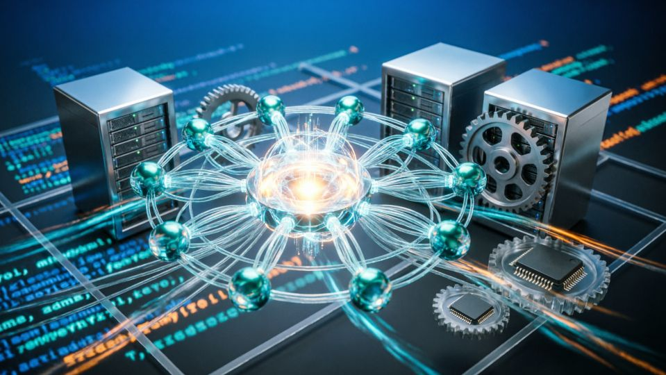

*30, agosto, 2026*

La **Ingeniería Informática** (*Computing*) se define como la disciplina y el proceso estructurado que utiliza la tecnología computacional para proveer soluciones organizacionales y técnicas. Su propósito central es diseñar, desarrollar, integrar y gestionar sistemas de software, hardware y redes para capturar, almacenar, procesar, asegurar y distribuir información de manera eficiente.

Bajo la óptica de la disciplina, el campo de la informática se divide en dos grandes áreas que deben estar completamente alineadas para lograr el éxito:

**Tecnología de la Información (TI):** Representa el soporte físico y lógico del sistema. Incluye todos los componentes tangibles —como servidores, computadoras, enrutadores y cables de red— e intangibles —como sistemas operativos, bases de datos, software de seguridad y herramientas de desarrollo— que facilitan el procesamiento técnico y el flujo de datos.

**Sistemas de Información (SI):** Representa el componente funcional e integrador que vincula a las personas, la tecnología y los procesos de negocio. Se enfoca en cómo la organización recopila, gestiona, distribuye y utiliza la información para dar soporte a la toma de decisiones, optimizar las operaciones de valor y cumplir con su estrategia de negocio.

### Temas y competencias clave:
*   **Enfoque Sociotécnico:** La ingeniería informática reconoce que un sistema de información es mucho más que la simple adquisición de ordenadores o la instalación de software. Exige entender la interacción entre la tecnología, las tareas y el comportamiento humano para que las soluciones computacionales aporten valor real a la organización.

*   **Análisis y Arquitectura de Sistemas:** Consiste en tomar problemas organizacionales complejos y descomponerlos de manera jerárquica en componentes lógicos y físicos más sencillos de software y hardware. Su objetivo es diseñar arquitecturas estables, gestionar rigurosamente sus interfaces de conexión y mitigar los riesgos de integración.

*   **Gestión de Ciclo de Vida y Calidad:** Abarca todas las etapas desde el análisis de requisitos de los clientes hasta la programación de código, pasando por exhaustivas pruebas de verificación, estrategias de conversión en producción y el posterior mantenimiento continuo ante fallos o solicitudes de cambio.

*   **Perfil Multidisciplinario y Liderazgo:** El ingeniero informático actual supera la clásica etiqueta del "nerd tecnológico". La complejidad de los desafíos contemporáneos requiere un profesional que combine una profunda excelencia técnica con habilidades de comunicación, liderazgo, comprensión de la economía (gestión de costos y compromisos arquitectónicos) y adaptabilidad al cambio.
