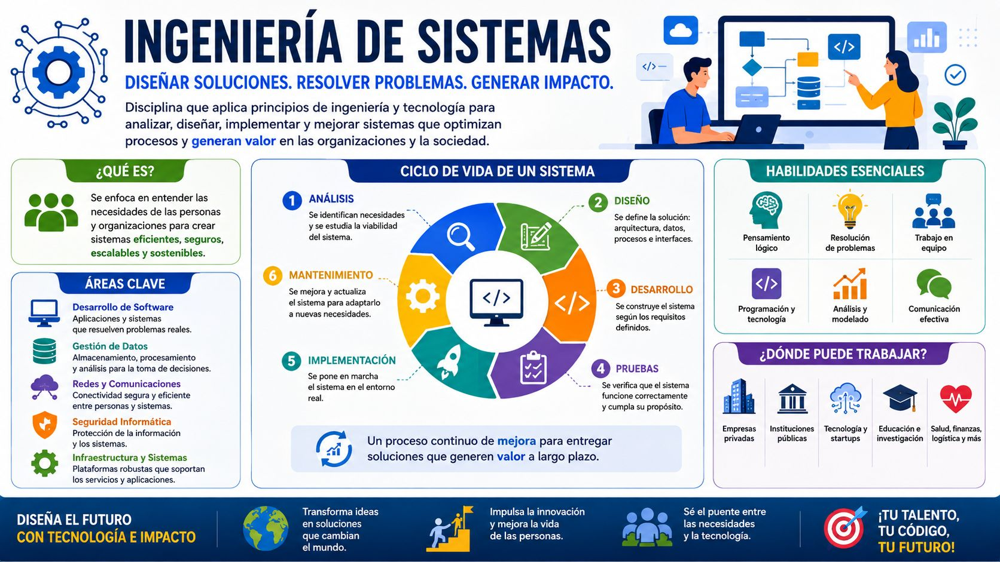
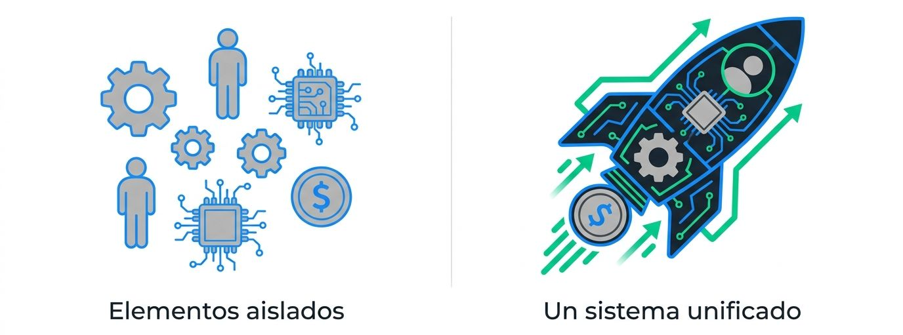
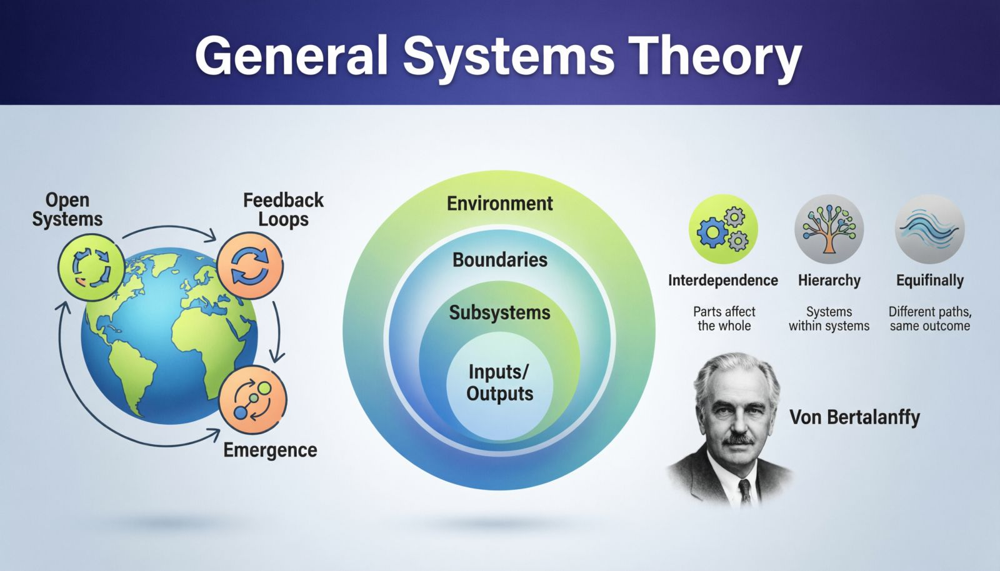
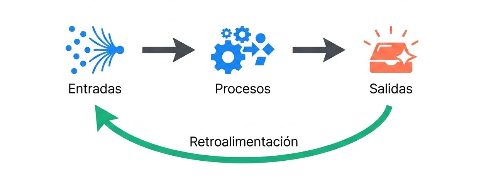
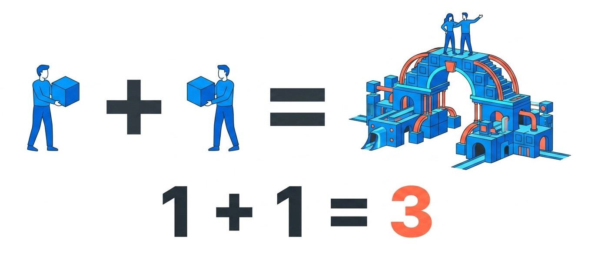
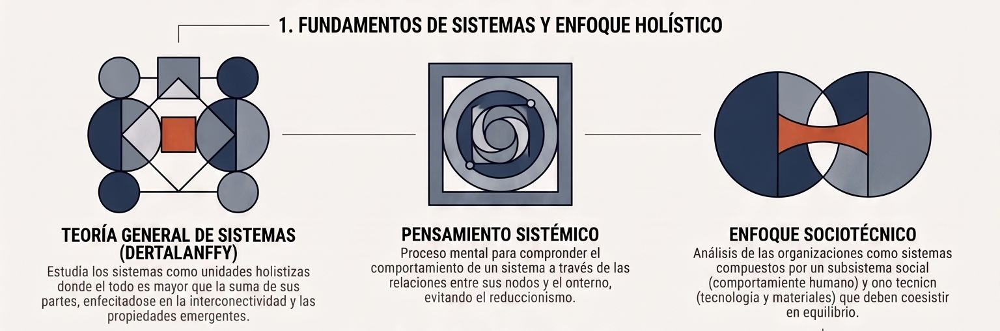
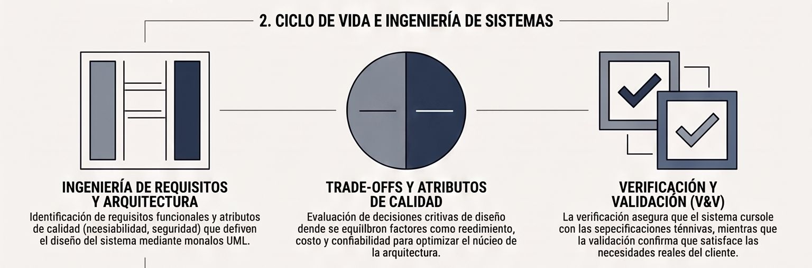
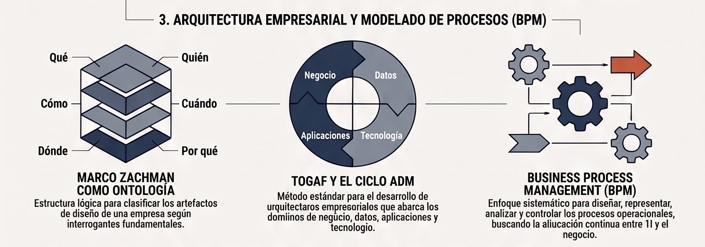
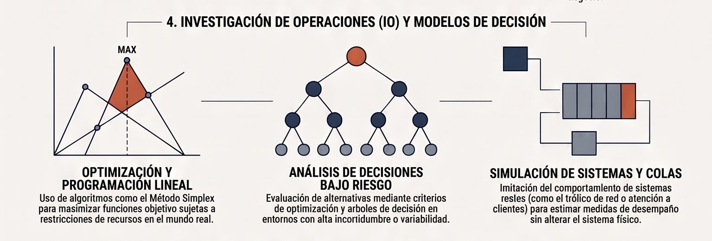
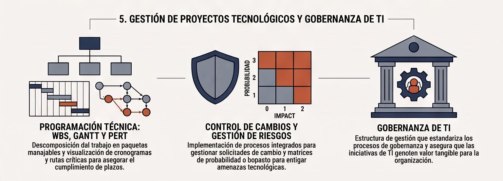

La **Ingeniería de Sistemas** (o *systems engineering*) se describe como una disciplina integral y estructurada que aborda el desarrollo de tecnologías y procesos desde una perspectiva global. 

Sus bases y definiciones principales abarcan los siguientes aspectos:

### Definición y Propósito Fundamental
* **Proceso Interdisciplinario:** Se define formalmente como la creación y ejecución de un **proceso interdisciplinario** diseñado para asegurar que los requisitos de los clientes y demás interesados se alcancen de manera eficiente.

* **Mejora del Rendimiento Organizacional:** Su propósito clave es apoyar a las organizaciones que buscan mejorar su desempeño. Esto se logra mediante la definición, desarrollo y despliegue de productos tecnológicos, servicios o procesos que respaldan los objetivos funcionales y satisfacen necesidades específicas de la organización.

<figure>

<figcaption>**Un todo organizado**. Un grupo de elementos (humanos o no) que actúan de forma conjunta para alcanzar una meta común.</figcaption>
</figure>

### Características del Proceso de Ingeniería de Sistemas
La ingeniería de sistemas se concibe como un proceso de gestión técnica, integral e iterativo que demanda un enfoque concurrente tanto para el desarrollo del producto como de los procesos a lo largo de todo su ciclo de vida. Sus actividades principales incluyen:
* **Traducción de Requisitos:** Traducir los requisitos operativos en sistemas operativos configurados.

* **Integración y Gestión de Interfaces:** Integrar las contribuciones técnicas de todo el equipo de diseño y administrar las interfaces complejas (las conexiones y límites entre componentes).

* **Gestión de Riesgos:** Caracterizar y gestionar los riesgos técnicos, integrándolos activamente dentro de la administración del proyecto.

* **Transición y Verificación:** Guiar la transición de la tecnología desde su base técnica hacia esfuerzos específicos del programa, y verificar que los diseños finales cumplan con las necesidades operativas reales del usuario.

### La Perspectiva de Sistemas (*Systems Thinking*)
La ingeniería de sistemas es una aplicación práctica de la **teoría general de sistemas** y el **pensamiento sistémico**:
* **El Todo es Mayor que las Partes:** Un sistema es una colección de partes (o subsistemas) interrelacionadas e interdependientes que trabajan de manera conjunta con un propósito común. En un sistema, los componentes se ven influenciados por pertenecer al mismo, y la salida final no es simplemente la suma de sus partes individuales, sino un resultado sinérgico de mayor valor.

* **Resolución de Problemas:** El enfoque de sistemas actúa como un proceso lógico y disciplinado para resolver problemas. Este método reúne y acopla las partes de un sistema en un todo unificado con el fin de buscar una solución o estrategia óptima, analizando el panorama completo en lugar de optimizar de forma aislada los componentes individuales.

Esta disciplina se vuelve indispensable para gestionar la **creciente complejidad** de los sistemas contemporáneos, los cuales involucran múltiples especialidades científicas, tecnologías interconectadas, interfaces complejas e interacciones continuas entre hardware, software, procesos y personas.

## **Teoría General de Sistemas**

La **Teoría General de Sistemas (TGS)**, es una propuesta formulada originalmente por el biólogo austríaco **Ludwig von Bertalanffy en 1951**, es un enfoque de gestión y científico que busca integrar y unificar la información a través de múltiples campos del conocimiento. Su premisa fundamental es **resolver problemas complejos analizando el panorama completo o "la imagen total" (*the total picture*), en lugar de estudiar sus componentes individuales de manera aislada**.

A continuación se detallan los principios, orígenes y aportes principales de esta teoría:

### El Origen Biológico y la Analogía del Cuerpo Humano
Como biólogo, Bertalanffy introdujo este pensamiento utilizando la nomenclatura de la anatomía humana. Explicó que los músculos, el esqueleto y el sistema circulatorio son **subsistemas** individuales, pero todos ellos se interrelacionan para conformar un sistema total y unificado (el ser humano). 

El gran aporte de Bertalanffy fue identificar cómo los especialistas de cada subsistema (por ejemplo, médicos de distintas disciplinas) podían integrarse para comprender mejor las interrelaciones y el funcionamiento general de la estructura. Esta noción sentó las bases para el nacimiento de la **administración de sistemas** y la **dirección de proyectos moderna**.

* **La integración multidisciplinaria:** Su gran aporte fue demostrar cómo la colaboración e integración de especialistas de distintos subsistemas permitía comprender mejor las relaciones internas del sistema completo. Esto sentó las bases para la gestión de proyectos moderna (considerada hoy "gestión de sistemas aplicada").

* **Reacción al reduccionismo:** El pensamiento sistémico surge como una respuesta crítica frente al fracaso del método científico reduccionista tradicional al intentar abordar problemas complejos en sistemas sociales y organizacionales. En su lugar, promueve el **holismo** para estudiar las relaciones y propiedades emergentes que nacen de la interconexión de las partes.

### Conceptos Fundamentales de la TGS

<figure>

<figcaption>**El ciclo de vida del sistema**. Ningún sistema existe en el vacío. Todos viven a través de 4 fases.</figcaption>
</figure>

A continuación, se detallan sus conceptos fundamentales:

#### Isomorfismos entre sistemas
El **isomorfismo** (del griego *iso*, igual, y *morphe*, forma) se refiere a la existencia de estructuras, principios, leyes o patrones lógicos similares en sistemas pertenecientes a disciplinas completamente diferentes (biología, física, computación, economía o sociología).

* **Leyes universales comunes:** En la TGS, el isomorfismo demuestra que las interacciones dinámicas de sistemas complejos se rigen por principios matemáticos o lógicos equivalentes. Por ejemplo, el modelo matemático de la *conservación de la información* o la *bistabilidad* puede modelar de igual forma el comportamiento de osciladores físicos, decisiones del mercado financiero o conflictos de roles en organizaciones humanas.

* **Modelos y correspondencias formales:** En la informática y el diseño de software, el isomorfismo se formaliza mediante representaciones abstractas comunes (como las teorías matemáticas en UML o los diagramas de comportamiento), donde se demuestra que sistemas físicos o lógicos distintos comparten la misma semántica estructural y de transición. Esto permite aplicar la resolución de problemas de un dominio a otro.

**Ejemplos de Isomofirmos**

**3 ejemplos cotidianos de isomorfismo** que ilustran cómo diferentes realidades comparten exactamente la misma estructura y dinámica de funcionamiento:

**Ejemplo 1: El flujo de agua en cañerías vs. El tráfico vehicular en una ciudad (Isomorfismo de Redes de Flujo)**

Aunque un sistema transporta materia líquida y el otro transporta automóviles de metal, ambos son **sistemas de distribución espacial** que se rigen exactamente por las mismas leyes matemáticas de flujo y presión:

*   **La analogía estructural:** Las cañerías equivalen a las calles o avenidas; las uniones o llaves de paso equivalen a las intersecciones o semáforos; y el caudal de agua equivale al volumen de autos.

*   **El comportamiento isomorfo (Cuellos de botella):** Si reduces el diámetro de una tubería principal, la presión aumenta y el flujo de agua se frena. De la misma manera, si reduces una avenida de tres pistas a una sola por trabajos en la vía, se produce una congestión vehicular ("taco"). Las fórmulas matemáticas que un ingeniero hidráulico utiliza para calcular la pérdida de carga por fricción en un tubo son isomorfas a las fórmulas de teoría de colas que un ingeniero de transporte (o un informático en redes de telecomunicaciones) utiliza para calcular la demora de los paquetes de datos o vehículos en hora punta.

**Ejemplo 2: El termostato de un hogar vs. El control de stock en un supermercado (Isomorfismo de Retroalimentación Homeostática)**

Ambos sistemas son físicamente distintos (uno es un aparato electrónico en una pared y el otro es un proceso logístico/administrativo), pero son **isomorfos en su lógica de control y autorregulación (homeostasis)** para mantener un equilibrio dinámico:
*   **La analogía estructural:**
    *   **Estado deseado (Meta):** Mantener la casa a 20°C // Mantener siempre 50 cajas de leche en góndola.
    *   **Sensor (Medición):** El termómetro mide la temperatura real // El cajero escanea el código de barras registrando la venta real.
    *   **Actuador (Acción correctiva):** El calefactor se enciende si baja la temperatura // El sistema genera un pedido automático de reposición al proveedor si el stock baja del límite de seguridad.
*   **El comportamiento isomorfo (Lazo de retroalimentación negativa):** Ambos operan bajo un ciclo de **retroalimentación negativa** (*negative feedback loop*). Su propósito es medir la desviación respecto a la meta y ejecutar una fuerza opuesta para corregir el error. Si el termostato fallara (quedara encendido), la casa se sobrecalentaría; si el sistema de inventario fallara (comprara sin parar), la bodega colapsaría de mercadería. La lógica de control es matemáticamente idéntica.

**Ejemplo 3: Una colmena de abejas vs. Una aplicación móvil de navegación como Waze (Isomorfismo de Inteligencia Emergente o Sistemas Descentralizados)**
s
Este isomorfismo ocurre entre un sistema biológico natural y un sistema de software distribuido. Ambos demuestran cómo la coordinación de agentes individuales autónomos genera un comportamiento inteligente colectivo sin un control centralizado:
*   **La analogía estructural:** Cada abeja individual equivale a un conductor con la aplicación Waze abierta en su teléfono.
*   **El comportamiento isomorfo (Sinergia y emergencia):** Ninguna abeja sabe qué está pasando en todo el bosque, pero mediante reglas locales simples (si una encuentra flores, regresa al panal y realiza una "danza" indicando la dirección y distancia), la colmena entera optimiza la recolección de comida de forma masiva. En Waze, ningún conductor tiene una vista satelital completa del tráfico en tiempo real, pero el simple hecho de que cada teléfono envíe su velocidad y ubicación de forma pasiva permite que el servidor central calcule rutas óptimas y alerte de accidentes a toda la comunidad de manera instantánea. El orden y la inteligencia del mapa *emergen* desde abajo hacia arriba (*bottom-up*).

#### Organización y jerarquía
Un principio clave de la TGS es que los sistemas no son planos, sino que están estructurados en **jerarquías funcionales y estructurales**.

* **Sistemas de sistemas:** Las redes delimitadas de relaciones entre partes forman unidades holísticas que interactúan con otros sistemas para conformar sistemas aún más grandes. Las organizaciones se componen de subsistemas interrelacionados (como departamentos o áreas funcionales).

* **Control y estructura de decisiones:** Las jerarquías en las empresas limitan las interacciones ineficientes y definen con claridad la estructura de poder y decisiones. Esta jerarquía de autoridad se despliega en niveles horizontales de administración (control operacional, planeación y control administrativo de nivel medio, y administración estratégica).

* **Diferenciación de estructuras:** Tradicionalmente, Henry Ford e investigadores posteriores impusieron estructuras jerárquicas rígidas y centralizadas para optimizar la eficiencia de producción masiva (lo que suele sesgar los proyectos hacia silos funcionales aislados), las cuales hoy coexisten con redes modulares, organizaciones matriciales u orientadas a procesos que buscan flexibilizar y coordinar la comunicación.

#### Homeostasis
La **homeostasis** es la capacidad de un sistema para autorregularse, mantener la estabilidad y conservar un equilibrio dinámico interno frente a las fluctuaciones y cambios en su entorno.

* **Límites y adaptación:** Los sistemas organizacionales y biológicos son **sistemas abiertos** delimitados por fronteras más o menos permeables. Para sobrevivir, deben importar del entorno recursos, personas e información (entradas), procesarlos y devolver productos o servicios (salidas).

* **El ciclo de retroalimentación (*Feedback*):** La homeostasis opera gracias a la retroalimentación, un subsistema de regulación donde las salidas del sistema se miden frente a los objetivos originales para ajustar y corregir dinámicamente las entradas o procesos. 

* **Ejemplo práctico en TI:** Los sistemas empresariales modernos autorregulados de cadena de suministro (ERP) que analizan las ventas en tiempo real e indican automáticamente qué fabricar para mantener niveles óptimos de inventario sin intervención humana son una manifestación de homeostasis tecnológica.

**Ejemplos**

e presentan **3 ejemplos concretos** de cómo se aplica la homeostasis en el ámbito de la teoría de sistemas y las organizaciones:

**Ejemplo 1: El sistema de inventario y tinción bajo demanda (Homeostasis Organizacional de Cadena de Suministro)**

En el diseño de sistemas de información empresarial, se busca que las operaciones diarias de una compañía se autorregulen automáticamente ante las fluctuaciones del mercado, reduciendo la necesidad de decisiones manuales ante eventos comunes.
* **El lazo de retroalimentación:** Un fabricante italiano de ropa tejida produce la mayor parte de sus prendas en color blanco neutro. La empresa utiliza su sistema de información de inventarios computarizado para registrar cuáles colores de prendas se están vendiendo más rápido en los puntos de venta reales. De manera automatizada, esta información se envía como retroalimentación a la planta de fabricación, la cual tiñe los suéteres blancos en los tonos de alta demanda justo antes de realizar el envío.
* **El equilibrio dinámico:** Al utilizar la retroalimentación de las ventas (salidas) para ajustar de forma automatizada los procesos de acabado en la planta (entradas y procesos), el sistema de suministro mantiene el stock equilibrado y alineado con la demanda fluctuante del entorno, evitando tanto la escasez de producto como las pérdidas por exceso de inventario obsoleto.

**Ejemplo 2: Ajuste de planeación en manufactura basado en datos de ventas (Homeostasis por Control de Desviación)**

Cuando los sistemas de una organización no están 100% automatizados, la homeostasis se ejecuta mediante el control administrativo guiado por la medición sistemática de los resultados.
* **El lazo de retroalimentación:** Una empresa de manufactura de conjuntos de pesas deportivos (disponibles en diversos colores) utiliza la información de ventas como un canal de retroalimentación para evaluar el cumplimiento de sus metas anuales. Al descubrir mediante estos reportes que un año después de las olimpiadas se vendieron muy pocos conjuntos con la combinación rojo, blanco y azul, los gerentes de producción utilizan de inmediato esa información para regular el sistema.
* **El equilibrio dinámico:** La salida del sistema de ventas sirve como retroalimentación para comparar el rendimiento real con el esperado. Esto permite a los gerentes formular objetivos de producción mucho más específicos y ajustar las entradas de materia prima en las siguientes tiradas, impidiendo que el desequilibrio en el mercado desestabilice financieramente a la organización.

**Ejemplo 3: El ciclo de inspección y adaptación en equipos de trabajo (Homeostasis en Sistemas Socio-Técnicos)**

Los equipos de desarrollo de proyectos operan como sistemas socio-técnicos complejos que deben equilibrar de manera continua su productividad, su capacidad de entrega y la calidad de sus procesos frente al cambio constante del entorno.
* **El lazo de retroalimentación:** Durante el desarrollo iterativo de software (como en Scrum o metodologías ágiles), los equipos generan de forma constante incrementos de producto funcional. Al final de cada ciclo, estos incrementos se demuestran formalmente a los usuarios para capturar retroalimentación sobre su funcionamiento. Adicionalmente, el equipo realiza una reunión de **retrospectiva** donde analiza datos cuantitativos (métricas de avance) y cualitativos (sentimientos de las personas).
* **El equilibrio dinámico:** Si las métricas muestran una desviación o si se identifican impedimentos en el flujo de trabajo, el equipo utiliza esta retroalimentación acumulada para diseñar respuestas y planes de acción específicos para la siguiente iteración. Este proceso de inspección y adaptación continua actúa como un regulador interno que estabiliza el ritmo operativo del equipo, resolviendo los cuellos de botella y manteniendo la estabilidad y salud del proceso de desarrollo ante los cambios imprevistos del entorno.

---

#### Entropía y entropía negativa (Negentropy)
Estos conceptos describen la tendencia de los sistemas hacia el desorden o el orden:
* **Entropía:** Es la ley de la naturaleza que dicta que los sistemas tienden naturalmente al desgaste, la desorganización, el desorden y, eventualmente, a la desintegración o el caos. Los sistemas cerrados o aislados son especialmente vulnerables a la entropía, ya que no intercambian recursos ni energía con su entorno.

* **Negentropía (Entropía negativa):** Es la fuerza mediante la cual los sistemas abiertos combaten la entropía. Al importar continuamente energía, información, conocimiento y recursos del entorno a través de sus límites permeables, los sistemas logran reestructurarse, mantener el orden y sobrevivir.

* **La necesidad del diseño inteligente:** Para contrarrestar la entropía en empresas de rápido crecimiento, se requiere de un esfuerzo constante de **diseño inteligente** (como el modelado de arquitecturas de procesos de negocio, gobierno de TI o arquitecturas de sistemas complejos), lo que permite que el sistema opere de forma estable cerca del "borde del caos" sin desintegrarse.

#### Equifinalidad
La **equifinalidad** es el principio que establece que un sistema abierto puede alcanzar el **mismo estado final** (u objetivo) partiendo de condiciones iniciales diferentes y utilizando distintos caminos, métodos o trayectorias.

* **Diferentes rutas para la optimización:** En la investigación de operaciones y el modelado matemático, la equifinalidad se observa cuando un algoritmo encuentra diferentes alternativas de nivelación de recursos ("Equilibrio 1" y "Equilibrio 2") que consiguen exactamente el mismo plazo de entrega del proyecto pero con distribuciones de personal distintas.

* **Múltiples metodologías, mismo valor:** En el desarrollo de software, la equifinalidad implica que dos equipos de desarrollo que se enfrentan al mismo problema de negocio pueden elegir caminos metodológicos diferentes (uno aplicando prácticas predictivas y el otro ágiles como Scrum o Kanban) y lograr de forma exitosa el mismo fin: un producto de software de calidad que aporta valor al negocio.

#### Sinergia
La **sinergia** es el fenómeno por el cual el resultado del funcionamiento conjunto de los componentes de un sistema es superior a la simple suma de los resultados individuales de cada componente (*"el todo es mayor que la suma de sus partes"*).

<figure>

<figcaption>**La sinergia**. el todo es mayor que la suma de sus partes. Aportan más valor juntos que trabajando de forma aislada.</figcaption>
</figure>

* **Interdependencia del valor:** Los elementos que pertenecen a un sistema se ven afectados y transformados positivamente por el hecho de formar parte de él; su salida de valor individual se multiplica gracias a la interrelación con el resto. En un sistema, los atributos individuales de las partes son secundarios frente a la riqueza de sus relaciones internas.

* **Sinergia en procesos de negocio:** Se genera sinergia cuando las salidas de un departamento (como producción) sirven directamente como entradas para otro (como marketing), eliminando tiempos de espera, optimizando costos compartidos y elevando la rentabilidad global de la organización.

* **Ejemplo práctico en Ingeniería Informática:** En el ámbito del desarrollo de proyectos, se observa sinergia cuando un equipo de 5 especialistas, cada uno experto en una parte del diseño de los planos del sistema, divide el trabajo y completa la actividad en solo 10 horas cada uno (50 horas en total), mientras que un solo ingeniero generalista trabajando de forma aislada tardaría 100 horas en finalizar el mismo plano.

La teoría define y clasifica los sistemas bajo varios principios clave:

* **¿Qué es un Sistema?:** Se define como un grupo o colección de elementos (humanos o no humanos) organizados de tal manera que actúan de forma conjunta como un todo para alcanzar una meta u objetivo común.
* **Interdependencia e Interrelación:** Todos los subsistemas dentro de un sistema están interconectados. Por tanto, cualquier cambio o eliminación de un elemento afecta inevitablemente al resto de los componentes y al comportamiento general.
* **Sinergia:** En la teoría de sistemas, la salida o resultado final es sinérgico; esto significa que el todo es mayor que la suma de sus partes individuales. Los componentes se ven influenciados por el simple hecho de pertenecer al sistema y aportan más valor juntos que trabajando de forma aislada.
* **Entradas, Procesos, Salidas y Retroalimentación:** Todos los sistemas toman entradas de su entorno, realizan procesos que las transforman o cambian, y generan salidas. La retroalimentación (*feedback*) sirve como un mecanismo de control que compara el rendimiento de las salidas con los objetivos originales para regular y corregir el sistema.

### Clasificación de los Sistemas (Abiertos vs. Cerrados)
La TGS clasifica los sistemas según el nivel de interacción que tienen con el entorno que los rodea:
* **Sistemas Abiertos:** Son aquellos que interactúan activamente con su medio ambiente, importando y exportando libremente energía, materia, personas o información a través de límites permeables. Todos los sistemas sociales y las organizaciones se clasifican como sistemas abiertos.
* **Sistemas Cerrados:** Son sistemas aislados que no reciben información, personas ni materias primas del exterior (aunque pueden transferir energía, pero no materia con el entorno).
* **El Continuo de Apertura:** En la realidad, los sistemas nunca son completamente abiertos o completamente cerrados; en su lugar, existen a lo largo de un continuo que va desde el más cerrado hasta el más abierto.

### La Evolución y la Integración Multidisciplinaria
A partir de la formulación de Bertalanffy, otros teóricos expandieron la TGS para resolver problemas prácticos en la integración de múltiples disciplinas. Por ejemplo, en 1956, el profesor **Kenneth Boulding** identificó que los especialistas de distintos subsistemas (como físicos, economistas, químicos o sociólogos) solían hablar sus propios lenguajes técnicos, lo que dificultaba la comunicación. Boulding abogó por la necesidad de utilizar un lenguaje común, como las matemáticas, para lograr una integración de sistemas verdaderamente exitosa. 

Hoy en día, la TGS se aplica de forma práctica en la ingeniería de sistemas, la arquitectura de procesos y el diseño de la arquitectura empresarial, permitiendo descomponer organizaciones complejas en partes manejables sin perder de vista la sinergia general del negocio.

## **TGS y la Ingeniería de Sistemas**

La teoría abstracta de sistemas se traduce progresivamente en metodologías de diseño empresarial, modelos matemáticos de optimización y herramientas de control de proyectos.

La narrativa visual se articula en torno a la conexión de **cinco unidades fundamentales**:

#### El Núcleo Teórico: Fundamentos de Sistemas y Enfoque Holístico

*   **Contenido Visual:** Es la base de la pirámide del mapa. Conecta la **Teoría General de Sistemas de Bertalanffy** y el **pensamiento sistémico** con el **enfoque sociotécnico**.
*   **Mensaje Clave:** Establece que un sistema informático no se limita a servidores y código, sino que integra de forma indivisible la tecnología, las tareas organizacionales y el comportamiento de las personas.

#### La Dimensión Técnica: Ciclo de Vida e Ingeniería de Sistemas

*   **Contenido Visual:** Muestra la transición desde la abstracción teórica hacia la disciplina de ingeniería. Se ramifica en la **Ingeniería de Requisitos**, el **diseño de arquitecturas jerárquicas**, la **gestión de interfaces** de conexión, y la **Verificación y Validación (V&V)**.
*   **Mensaje Clave:** Enfatiza la necesidad de balancear los **atributos de calidad** (como rendimiento y seguridad) mediante análisis de compromisos (*trade-offs*).

#### La Dimensión Organizacional: Arquitectura Empresarial (AE) y Procesos

*   **Contenido Visual:** Eleva el enfoque técnico hacia el plano corporativo. Clasifica los cuatro dominios de la AE (Negocio, Datos, Aplicaciones y Tecnología) y contrasta de manera sinérgica la taxonomía del **Marco Zachman** con el ciclo dinámico ADM de **TOGAF**, integrando el modelado de procesos con **BPM**.
*   **Mensaje Clave:** Demuestra cómo alinear la infraestructura tecnológica con la estrategia y metas de la organización.

#### La Base Científica: Investigación de Operaciones y Modelos de Decisión

*   **Contenido Visual:** Representa la rigurosidad analítica que distingue a la ingeniería "Civil" en Chile. Agrupa la **modelación matemática**, algoritmos de **optimización**, análisis de decisiones y **simulación por computadora**.
*   **Mensaje Clave:** Enseña al estudiante a tomar decisiones de diseño óptimas basadas en datos y predicciones científicas bajo escenarios de incertidumbre.

#### La Dimensión de Liderazgo: Gestión de Proyectos y Gobernanza de TI

*   **Contenido Visual:** Es la cúspide de la gestión. Conecta la programación técnica tradicional (como el desglose de trabajo mediante **WBS**, diagramación de **Gantt y PERT** para la ruta crítica) con herramientas de gobernanza (control de cambios, mitigación de riesgos y resiliencia de sistemas).
*   **Mensaje Clave:** Provee las competencias de control para que el futuro ingeniero pueda dirigir con éxito el despliegue de soluciones tecnológicas complejas a tiempo y dentro del presupuesto.

