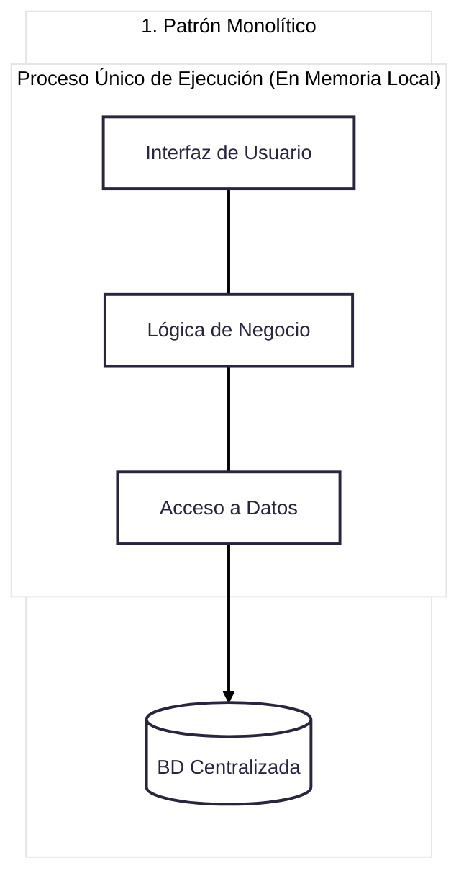

```mermaid
---
config:
  theme: redux-color
  usecase:
    colorScheme: rotate
---
flowchart LR
    %% ========================================================
    %% PATRÓN 1: MONOLÍTICO
    %% ========================================================
    subgraph P_MONO ["1. Patrón Monolítico"]
        subgraph MonoProcess ["Proceso Único de Ejecución (En Memoria Local)"]
            M_UI["Interfaz de Usuario"]
            M_BL["Lógica de Negocio"]
            M_DA["Acceso a Datos"]
            M_UI --- M_BL --- M_DA
        end
        M_DB[("BD Centralizada")]
        M_DA --> M_DB
    end
```