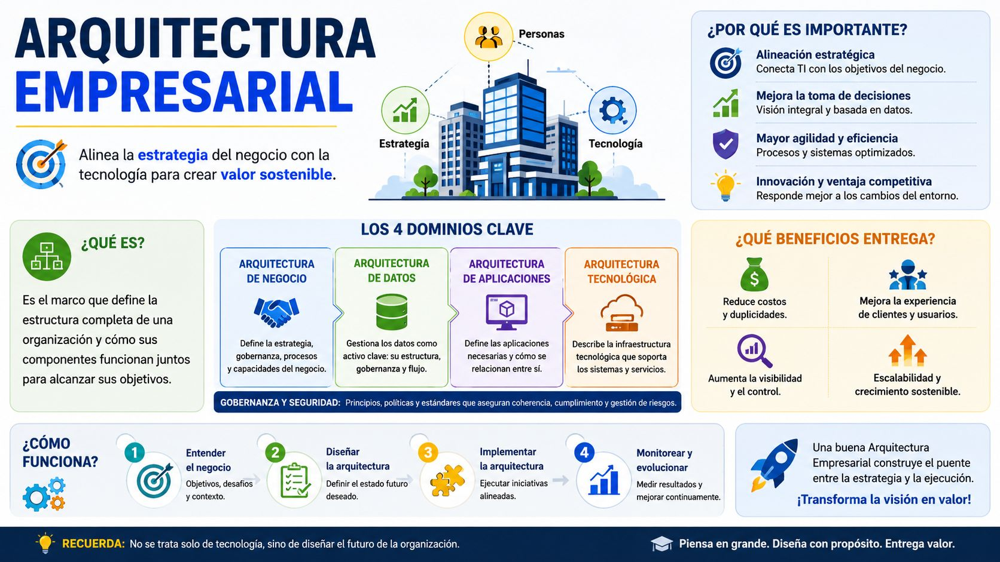
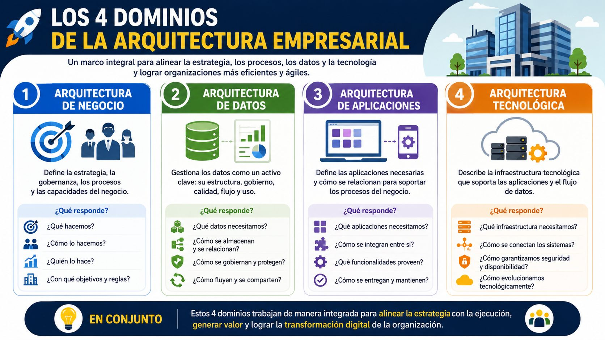
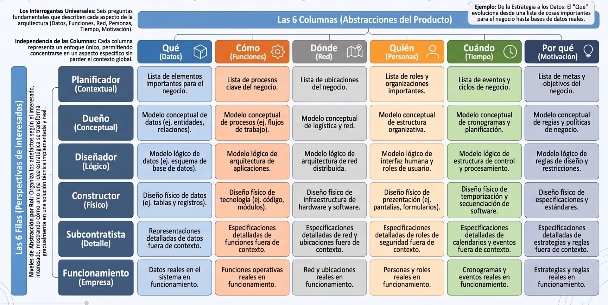
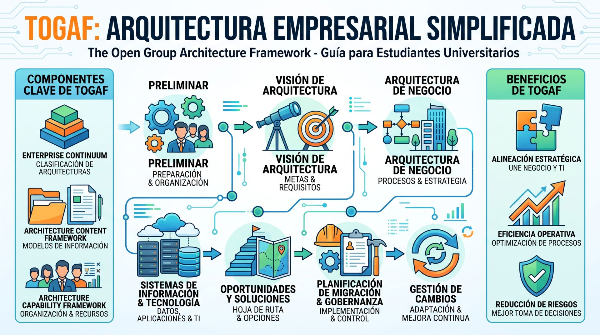
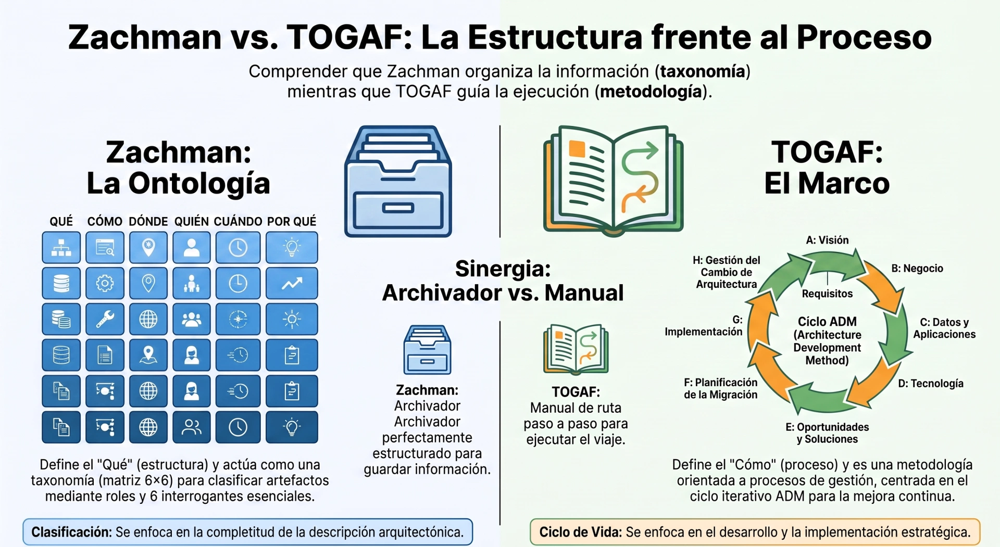

## **AE**

La **Arquitectura Empresarial (AE)** (o *Enterprise Architecture*, EA) es un enfoque holístico que define la lógica organizativa de los procesos de negocio y la infraestructura de TI de una organización. Su objetivo principal es traducir la visión y la estrategia empresarial en planos estructurados de capacidades tecnológicas, permitiendo que la tecnología y el negocio avancen alineados hacia sus metas.

<center>

</center>

La Arquitectura Empresarial actúa como un puente entre la **planificación estratégica** y los **esfuerzos de implementación** técnica. En lugar de ver a la tecnología y al negocio como silos separados, la AE proporciona un "mapa general" o *big picture* que unifica procesos, personas, información y sistemas. 

En la práctica, sirve para diseñar tanto el **estado actual ("As-Is")** de la organización como el **estado futuro deseado ("To-Be")**, trazando una ruta de migración clara que minimice riesgos y redundancias. Esto ayuda a superar el problema histórico de los "silos de aplicaciones" —sistemas aislados que funcionan bien por sí mismos pero que juntos impiden la coordinación organizacional— y a construir una base unificada para la ejecución.

### Los 4 Dominios de la AE
Tradicionalmente, la AE divide la complejidad de una organización en **cuatro dominios interconectados e interdependientes**:

<center>

</center>

* **Arquitectura de Negocio (*Enterprise Business Architecture* - EBA):** Se basa en la estrategia de la organización para definir los procesos, flujos de valor, estructuras de servicio y actividades operativas diarias. Es la base sobre la cual se definen los demás dominios.

* **Arquitectura de Información o Datos (*Enterprise Information Architecture* - EIA):** Organiza el flujo de datos y describe la estructura de los activos de información lógicos y físicos de la empresa. Define qué información se necesita, cómo fluye y cómo se gestiona y comparte de forma segura.

* **Arquitectura de Aplicaciones (*Enterprise Application Architecture* - EAA):** Define el conjunto de sistemas de software y aplicaciones que activan los procesos de negocio. Describe cómo interactúan las aplicaciones entre sí, cómo se integran y de qué manera se distribuyen a lo largo de la organización.

* **Arquitectura Técnica o Tecnológica (*Enterprise Technical Architecture* - ETA):** Define las plataformas tecnológicas, el hardware, los servidores, las redes, el middleware y los sistemas operativos que sirven de soporte a las aplicaciones y garantizan su interoperabilidad.

### Arquitectura de Negocio

La **Arquitectura de Negocio** (*Business Architecture* - BA o EBA) es la disciplina y el dominio de la Arquitectura Empresarial que define la estructura holística de una organización, vinculando directamente su visión estratégica con la ejecución operativa y tecnológica.

#### Definición y Alcance
* **Plano Maestro de la Empresa:** Según la definición del *Object Management Group* (OMG), la Arquitectura de Negocio es la estructura formal de una empresa expresada en términos de su gobernanza, procesos de negocio e información. Considera a los clientes, las finanzas y los mercados cambiantes para alinear los objetivos estratégicos con las decisiones sobre productos, servicios, socios, organización y capacidades.

* **Enlace Formal entre Estrategia y Resultados:** Actúa como el puente o eslabón formal que traduce la estrategia del negocio en proyectos concretos y capacidades operativas, asegurando que las inversiones tecnológicas tengan un propósito orientado al valor.

* **Independencia de la Estructura Orgánica:** Modela **qué hace** la empresa y **cómo** ejecuta sus funciones de manera independiente de la estructura jerárquica temporal o de las aplicaciones informáticas específicas.


#### Componentes y Dimensiones Clave
1. **Capacidades de Negocio (*Business Capabilities*):** Representan la combinación de habilidades, herramientas, procesos y recursos que una organización posee o requiere para ejecutar sus funciones principales. Sirven para evaluar el desempeño actual, detectar brechas e ineficiencias, y determinar dónde se requieren inversiones técnicas.

2. **Cadenas y Flujos de Valor (*Value Streams & Value Chains*):** Secuencia completa de actividades transversales que entregan un resultado de valor directo a los clientes (*outside-in*) o partes interesadas.

3. **Procesos de Negocio (*Business Processes*):** Definen el comportamiento dinámico de la empresa. Se estructuran formalmente en procesos de gestión o estratégicos, procesos clave o principales (*core/primary*), y procesos de soporte.

4. **Estructura Organizacional, Roles y Actores:** Mapeo de las unidades operativas, los roles de negocio (*business roles*), las partes interesadas (*stakeholders*) y las responsabilidades en los flujos de trabajo.

5. **Información y Objetos de Negocio (*Business Objects*):** Conceptos e información fundamental que se procesan a lo largo de las cadenas de valor para sustentar la toma de decisiones.


#### Posicionamiento en los Marcos de Referencia
* **TOGAF (Fase B del ciclo ADM):** La Arquitectura de Negocio es el primer dominio arquitectónico que se define en la Fase B del *Architecture Development Method* (ADM). Al establecer la estrategia, gobernanza y procesos, dirigen la construcción de los dominios subsecuentes (Datos, Aplicaciones y Tecnología).

* **Marco Zachman:** Ocupa las filas superiores de la matriz (perspectivas del *Planner* / Contextual y del *Owner* / Conceptual), respondiendo a las preguntas de *Qué* (entidades de negocio), *Cómo* (procesos), *Dónde* (ubicaciones), *Quién* (organizaciones/roles), *Cuándo* (eventos) y *Por qué* (estrategia/motivaciones).

* **Modelo EA³ Cube (Bernard):** Se ubica en el segundo nivel de la pirámide (*Products & Services*), impulsado por el nivel superior de "Metas e Iniciativas" estratégicas y guiando los niveles inferiores de flujos de información, sistemas e infraestructura.


#### Artefactos y Entregables Típicos
* **Mapa/Paisaje de Procesos (*Process Landscape*):** Representación jerárquica de las cadenas de valor y procesos organizacionales.
* **Matriz de Capacidades de Negocio (*Business Capability Matrix*):** Catálogo estructurado de las capacidades evaluadas según su rendimiento y prioridad estratégica.
* **Diagramas de Procesos y Nadaderos (*Swimlane Diagrams / BPMN*):** Modelos de flujo de trabajo que asignan actividades a roles específicos.
* **Casos de Uso y Escenarios de Negocio (*Business Scenarios / Use Cases*):** Narrativas y esquemas que identifican problemas de negocio, actores y resultados esperados.
* **Redes de Valor de la Empresa (*Enterprise Value Networks - EVN*):** Diagramas que mapean las interacciones y el intercambio de valor entre la empresa, sus clientes y sus aliados comerciales.
* **Caso de Negocio de Inversión (*Investment Business Case*):** Documentación que justifica el valor, riesgo y retorno de inversión de las iniciativas de transformación.


#### Arquitectura de Negocio vs. Análisis de Negocio
Aunque suelen confundirse, operan en distintos niveles de abstracción:
* **Arquitectura de Negocio (*Business Architecture*):** Es de alcance holístico y estratégico para **toda la empresa**. El *Business Architect* opera en el diseño del estado futuro (*To-Be*), asegura la alineación con la visión ejecutiva y garantiza la continuidad del negocio.
* **Análisis de Negocio (*Business Analysis*):** Es de alcance táctico y se enfoca en **proyectos o soluciones específicas**. El *Business Analyst* trabaja capturando y traduciendo los requerimientos detallados de los usuarios para guiar la construcción de software.


#### Valor en la Transformación Digital y la Agilidad
La Arquitectura de Negocio permite transicionar la organización de un modelo interno (*inside-out*) a un modelo centrado en la experiencia del cliente (*outside-in*). Al modularizar las capacidades empresariales en servicios reconfigurables ("plug-and-play"), facilita fusiones, reingeniería de procesos y la integración de arquitecturas orientadas a servicios (SOA) y tecnologías en la nube con un alto grado de agilidad.

### Arquitectura de Información o Datos

La **Arquitectura de Datos e Información** (*Data and Information Architecture*) es el dominio fundamental de la Arquitectura Empresarial encargado de estructurar, organizar, gobernar y gestionar los activos de datos e información de una organización. 

Mientras que la Arquitectura de Negocio establece *qué hace* la empresa y sus objetivos estratégicos, la Arquitectura de Datos e Información define la materia prima y el conocimiento necesario para alimentar los procesos de negocio, respaldar la toma de decisiones y orientar los sistemas de software.

A continuación se detalla este dominio:


#### La Distinción Clave: Arquitectura de Datos vs. Arquitectura de Información

En la práctica organizativa e industrial existe una confusión habitual donde los términos "datos" e "información" se utilizan de forma indistinta. Sin embargo, la literatura especializada establece una separación clara basada en su propósito y nivel de abstracción:

```
+-------------------------------------------------------------------------+
|                  ARQUITECTURA DE INFORMACIÓN (EIA)                      |
|  "Significado, contexto, accesibilidad, usabilidad y flujo de valor"    |
|   - Flujos de información entre procesos y actores.                     |
|   - Redes de valor (*Information Value Networks*) y mapas de información.|
+-------------------------------------------------------------------------+
                                    ▲
                         Transformación / Contexto
                                    │
+-------------------------------------------------------------------------+
|                    ARQUITECTURA DE DATOS (DA)                           |
|  "Estructura técnica, almacenamiento, modelos lógicos/físicos y gestión"|
|   - Esquemas SQL / NoSQL, Big Data, modelos Entidad-Relación.           |
|   - Tablas, archivos, bases de datos y repositorios técnicos.           |
+-------------------------------------------------------------------------+
```

* **Arquitectura de Datos (*Data Architecture*):**
  * **Enfoque:** Se centra en los aspectos técnicos y estructurales de los datos crudos (*raw data*).
  * **Alcance:** Trata sobre cómo se recolectan, almacenan, organizan e integran los datos físicamente en bases de datos relacionales (SQL), no relacionales (NoSQL), almacenes de datos (*Data Warehouses*) y entornos de Big Data.
  * **Requisitos:** Capacidad de almacenamiento, velocidad de lectura/escritura, rendimiento, integridad referencial, encriptación y soporte para altos volúmenes y variedades de datos.
* **Arquitectura de Información (*Information Architecture*):**
  * **Enfoque:** Se enfoca en otorgar significado, utilidad, valor y contexto a los datos para convertirlos en información comprensible por los seres humanos y los procesos de negocio.
  * **Alcance:** Modela la **cadena de suministro e intercambio de información** (*information supply chain / information flows*) entre procesos, departamentos y socios externos.
  * **Dimensiones de Valor de la Información:** Evalúa la **velocidad** (*velocity* - rapidez de transmisión), el **alcance** (*reach* - difusión y acceso) y la **densidad** (*density* - volumen de valor útil por espacio).


#### Componentes y Niveles de Abstracción

Para estructurar los datos e información de una empresa, este dominio se organiza en tres niveles clásicos de modelado y gobernanza:

1. **Nivel Conceptual (Modelo Semántico / Mapa de Información):**
   * Mapea los conceptos de información clave del negocio (ej. *Cliente*, *Pedido*, *Factura*, *Producto*) y sus relaciones generales de forma independiente de la tecnología.
   * Se alinea directamente con los procesos y capacidades de negocio.

2. **Nivel Lógico (Modelo Lógico de Datos):**
   * Define formalmente las entidades, sus atributos detallados, claves primarias y foráneas, y reglas de negocio mediante Diagramas Entidad-Relación (ERD) o modelos orientados a objetos.
   * Aplica reglas de **normalización** (1NF, 2NF, 3NF) para eliminar redundancias y garantizar la consistencia lógica de los datos.

3. **Nivel Físico (Modelo Físico y Almacenamiento):**
   * Especifica la implementación técnica en los gestores de bases de datos (DBMS), incluyendo tablas, tipos de datos físicos, índices, particionamiento y estrategias de desnormalización cuando se requiere rendimiento acelerado (como en almacenes corporativos de datos/OLAP).


#### Posicionamiento en los Marcos de Referencia de AE

* **TOGAF (*The Open Group Architecture Framework*):**
  * Se aborda dentro de la **Fase C: Arquitecturas de Sistemas de Información** (*Information Systems Architectures*), la cual se divide formalmente en dos partes: **Arquitectura de Datos** y **Arquitectura de Aplicaciones**.
  * Desarrolla los modelos de datos del negocio, modelos lógicos de datos, modelos de gestión de datos y matrices de Entidad de Datos vs. Función de Negocio.
* **Marco Zachman:**
  * Corresponde a la columna del **"Qué" (*Data / What*)**.
  * Organiza las representaciones abstractas en filas: desde la lista de cosas importantes para el negocio (*Scope/Planner*), pasando por el modelo semántico conceptual (*Owner*), el modelo lógico de datos (*Designer*), el modelo físico (*Builder*), las definiciones detalladas fuera de contexto (*Subcontractor*) hasta la base de datos funcionando (*Functioning Enterprise*).
* **Modelo EA^3 Cube (Bernard):**
  * Se ubica en el **Nivel 3 ("Data & Information")**, posicionado estratégicamente entre las capas superiores de Servicios de Negocio/Flujos de Información e inferiores de Sistemas, Aplicaciones e Infraestructura de Redes.
  * Promueve el uso de diccionarios de datos, modelos ERD, DFDs y matrices de intercambio de información para asegurar la alineación vertical.


#### Entregables y Artefactos Típicos

1. **Diccionario de Datos y Catálogo de Metadatos (*Data Dictionary / Repository*):** Registros centralizados que definen la taxonomía, formato, estándar, restricciones y significado de cada elemento de datos utilizado en el sistema (*datos sobre los datos*).

2. **Matriz CRUD / Actividad-Entidad:** Tabla que mapea qué aplicaciones o procesos de negocio **C**rean, **L**een (Read), **A**ctualizan (Update) y **E**liminan (Delete) cada entidad de datos en la organización.

3. **Matriz de Intercambio de Información (*Information Exchange Matrix*):** Documenta los atributos de transferencia de información entre sistemas (tamaño, formato, periodicidad, nivel de seguridad).

4. **Arquitectura de Almacén de Datos y Analítica (*Data Warehouse / Big Data Architecture*):** Diseños para organizar datos estructurados y no estructurados, utilizando procesos ETL (*Extract, Transform, Load*), minería de datos (*KDD*) y modelos de procesamiento analítico en línea (OLAP) para soportar la inteligencia de negocios (BI) e IA.


#### Gobernanza y Desafíos Modernos

En el contexto de la transformación digital, la Arquitectura de Datos e Información asume la responsabilidad de:
* **Gobernanza de Datos, Privacidad y Seguridad:** Establecer políticas corporativas para el control de acceso, cumplimiento normativo (ej. GDPR), trazabilidad y protección de datos sensibles.
* **Gestión de Big Data e Integración:** Manejar las "3V" o "5V" del Big Data (Volumen, Variedad, Velocidad, Veracidad, Valor), integrando fuentes heterogéneas internas y externas (sensores IoT, redes sociales, servicios en la nube).


### Arquitectura de Aplicaciones

La **Arquitectura de Aplicaciones** (*Enterprise Application Architecture* - EAA) es el dominio de la Arquitectura Empresarial enfocado en definir la estructura, el inventario, la interacción y las pautas de gobierno de los sistemas de software y aplicaciones que automatizan y soportan las funciones y procesos del negocio.

A diferencia del desarrollo de software individual, la Arquitectura de Aplicaciones adopta una **perspectiva de portafolio a escala corporativa**, coordinando cómo coexisten, se integran y evolucionan los distintos sistemas (desarrollos propios, paquetes comerciales COTS, servicios en la nube y sistemas legados).


#### Propósitos y Objetivos Principales

1. **Habilitación de las Capacidades de Negocio:** Traduce los requerimientos definidos en la Arquitectura de Negocio y los flujos de información de la Arquitectura de Datos en soluciones de software concretas.
2. **Integración e Interoperabilidad:** Define estándares de interfaz y patrones de comunicación (como APIs, middleware o ESB) para asegurar que las aplicaciones compartan datos sin interrupciones ni acoplamientos rígidos.
3. **Racionalización del Portafolio:** Permite mapear el catálogo de aplicaciones existentes para eliminar redundancias funcionales, reducir costos de mantenimiento y retirar tecnologías obsoletas.
4. **Gobierno del Ciclo de Vida:** Guía las decisiones estratégicas sobre cuándo **construir a medida** (*build*), **comprar licencias/SaaS** (*buy*) o **reutilizar servicios existentes** (*reuse*).


#### Posicionamiento en los Marcos de Referencia

* **TOGAF (Fase C - *Information Systems Architectures*):** La Fase C de TOGAF comprende de forma conjunta la Arquitectura de Datos y la **Arquitectura de Aplicaciones**. Su objetivo es desarrollar la *Target Application Architecture*, la cual describe los planos de las aplicaciones individuales a desplegar, sus interacciones y su alineación con la visión del negocio.
* **Modelo \\(EA^3\\) Cube (Bernard):** Corresponde al **Nivel 4 ("*Systems & Applications*")**, ubicado estratégicamente por debajo de la capa de Datos e Información y por encima del nivel de Redes e Infraestructura.
* **Marco Zachman:** Representa el aspecto del **"Cómo" (*Function / How*)** en el sistema, conectando la visión de procesos del propietario (*Owner*) con las especificaciones lógicas del diseñador (*Designer*) y físicas del constructor (*Builder*).


#### Matriz de Evaluación del Portafolio de Aplicaciones

Para gestionar el estado actual (*As-Is*) y definir la transición al estado futuro (*To-Be*), la Arquitectura de Aplicaciones utiliza modelos de evaluación que cruzan dos dimensiones fundamentales: **Valor de Negocio (*Business Value*)** y **Condición Técnica (*Technical Condition*)**:

```
+------------------------------------------------------------------------+
|                          CONDICIÓN TÉCNICA                             |
|                                                                        |
| Excelente  |  Reevaluar / Reubicar     |   Mantener / Evolucionar      |
|            |  (Bajo Valor, Buena Téc.)  |   (Alto Valor, Buena Téc.)    |
|            |---------------------------+-------------------------------|
| Deficiente |  Descontinuar / Reemplazar |   Desarrollar Infraestructura |
|            |  (Bajo Valor, Mala Téc.)  |   (Alto Valor, Mala Téc.)     |
+------------------------------------------------------------------------+
             |         Bajo              |             Alto              |
             +-----------------------------------------------------------+
                                VALOR DE NEGOCIO
```

1. **Mantener / Evolucionar (*Maintain / Evolve* - Alto Valor / Excelente Condición):** Sistemas estratégicos bien diseñados que deben conservarse y actualizarse periódicamente según las necesidades del negocio.
2. **Desarrollar Infraestructura (*Develop Application Infrastructure* - Alto Valor / Condición Deficiente):** Aplicaciones críticas para la operación que sufren de deuda técnica, fragilidad o problemas de integración. Requieren refactorización o migración de arquitectura.
3. **Reevaluar / Reubicar (*Re-evaluate / Reposition* - Bajo Valor / Excelente Condición):** Software técnicamente estable pero con bajo impacto en la estrategia actual; se analiza si se puede simplificar o consolidar en otra área.
4. **Descontinuar / Reemplazar (*Phase Out / Replace* - Bajo Valor / Condición Deficiente):** Aplicaciones obsoletas con alto costo de mantenimiento y poco retorno de inversión, marcadas para su retiro inmediato.


#### Estrategias de Decisión: *Build, Buy, Reuse*

Toda iniciativa en la Arquitectura de Aplicaciones se rige por tres rutas de implementación guiadas por la gobernanza arquitectónica:

* **Construir (*Build*):** Se reserva para capacidades centrales (*core*) que otorgan una ventaja competitiva única a la empresa y no existen como soluciones estándar en el mercado.
* **Comprar (*Buy*):** Se aplica a procesos estandarizados de la industria (como ERP, CRM o nómina) mediante la adquisición de software COTS (*Commercial Off-The-Shelf*) o servicios SaaS.
* **Reutilizar (*Reuse*):** Aprovecha servicios de software e interfaces existentes (mediante arquitecturas orientadas a servicios - SOA o microservicios) para acelerar la entrega y evitar la duplicación de código.


### Arquitectura Técnica o Tecnológica

La **Arquitectura Tecnológica** (*Technology Architecture* o *Enterprise Technical Architecture - ETA*) es el cuarto dominio fundamental de la Arquitectura Empresarial que define la estructura, los estándares, los servicios de infraestructura y la plataforma de software de sistema y hardware necesarios para alojar y soportar las aplicaciones, los datos y los procesos de negocio de la organización.

Mientras que las capas superiores definen el *qué* (Negocio), el *significado/contenido* (Datos/Información) y las *herramientas de software* (Aplicaciones), la Arquitectura Tecnológica provee la **plataforma física y lógica de ejecución** sobre la cual opera todo el ecosistema digital.


#### Posicionamiento en los Marcos de Referencia de AE

* **TOGAF (Fase D - *Technology Architecture*):** En el ciclo ADM, la Fase D se enfoca en desarrollar la *Arquitectura Tecnológica Objetivo*, definiendo los componentes tecnológicos (hardware, software de sistema, redes, servicios en la nube) y servicios que permiten desplegar los bloques de construcción de aplicaciones y datos.
* **Modelo \\(EA^3\\) Cube (Bernard):** Corresponde al **Nivel 5 ("*Networks & Infrastructure*")**, el nivel base de la matriz jerárquica que organiza las redes de datos, voz y video, la infraestructura física de centros de cómputo y las soluciones de conectividad y nube.
* **Marco Zachman:** Corresponde a la intersección del **"Dónde" (*Location / Network*)** y la perspectiva del **Constructor (*Builder / Technology Model*)**, especificando la configuración física, los componentes de red y los estándares de hardware/software de soporte.


#### Clases y Componentes Principales

Para gestionar la complejidad de la infraestructura corporativa, la Arquitectura Tecnológica se categoriza en clases lógicas:

1. **Plataformas de Cómputo (*Platform Architecture*):**
   * Define los componentes de hardware (servidores físicos, máquinas virtuales, estaciones de trabajo), sistemas operativos (ej. Windows Server, Linux) y entornos de motores de bases de datos (DBMS).
2. **Redes y Telecomunicaciones (*Network Architecture*):**
   * Especifica la infraestructura de comunicación de datos, voz y video, abarcando redes de área local (LAN), redes extendidas (WAN), topologías físicas/lógicas, enrutadores, conmutadores, enlaces móviles y protocolos de red (como TCP/IP).
3. **Middleware e Integración (*Middleware Architecture*):**
   * Define las tecnologías que crean un entorno integrado entre aplicaciones heterogéneas, sistemas legados y servidores (ej. Enterprise Service Bus - ESB, brokers de mensajería MOM, llamadas a procedimientos remotos RPC y gateways de base de datos).
4. **Infraestructura de Nube y Servicios (*Cloud Services & Infrastructure*):**
   * Incorpora modelos de servicio de infraestructura (IaaS) y plataforma (PaaS), contenedores, plataformas de orquestación y entornos híbridos o multicloud para brindar flexibilidad, escalabilidad y agilidad operativa.
5. **Arquitectura de Distribución y Almacenamiento (*Distributed & Storage Architecture*):**
   * Define la gestión de almacenamiento masivo (redes SAN/NAS), clusters de servidores, tolerancia a fallos, soluciones para Big Data (como nodos Hadoop/NoSQL) y monitoreo de rendimiento.


#### Entregables y Artefactos Típicos

* **Catálogo de Portafolio de Tecnología (*Technology Portfolio Catalog*):** Registro estructurado e inventario de todos los componentes tecnológicos en uso (dispositivos, versiones de SO, proveedores, nivel de soporte y servidor asociado).
* **Perfil de Estándares Tecnológicos (*Technology Standards Profile - ST-1*):** Catálogo formal de tecnologías y productos aprobados por la organización bajo criterios de estandarización (*Buy, Build, Reuse*) para evitar la proliferación descontrolada de herramientas.
* **Pronóstico Tecnológico (*Technology Forecast - ST-2*):** Evaluación prospectiva de la evolución tecnológica, tendencias del mercado y nivel de fragilidad o riesgo de obsolescencia de las plataformas actuales.
* **Diagrama de Conectividad y Redes (*Network Connectivity Diagram / Topology*):** Mapa visual que ilustra la topología lógica y física de la red, nodos de comunicación, ubicaciones geográficas y enlaces de interconexión.
* **Matriz de Tecnología vs. Funciones de Aplicación (*Technology/Application Function Map*):** Matriz cruzada que relaciona los componentes tecnológicos y sus servicios de infraestructura con los módulos y componentes de aplicación que alojan.


#### Gobernanza y Evaluación de Salud Tecnológica

Un aspecto central de la Arquitectura Tecnológica es el control del ciclo de vida y la **evaluación del estado de los componentes** (*Architectural Status*):
* 🟢 **Estratégico (*Strategic*):** Tecnologías y estándares definidos para el desarrollo e inversión a largo plazo.
* 🟡 **Mantener (*Maintain*):** Tecnologías operativas que no deben expandirse a nuevos proyectos pero se conservan por estabilidad.
* 🔴 **Obsoleto / No Soportado (*Outdated / Phase Out*):** Componentes marcados para retiro o reemplazo inmediato debido al fin de soporte del proveedor o altos riesgos de seguridad.
* 🔵 **En Evaluación (*Evaluating*):** Tecnologías emergentes en fase de prueba de concepto (PoC) antes de ser adoptadas masivamente.

Además, la Arquitectura Tecnológica coordina los **Planes de Recuperación ante Desastres (*Disaster Recovery Plan - SP-5*)** y las políticas de ciberseguridad perimetral para garantizar la continuidad del negocio y la resiliencia operativa de la empresa ante fallos de infraestructura.


### Cuadro Resumen 
**Los 4 Dominios de la Arquitectura Empresarial**

| Dominio | Pregunta Clave | Enfoque / Alcance Principal | Artefactos Clave |
| :--- | :--- | :--- | :--- |
| **Arquitectura de Negocio** (*Business Architecture*) | **¿Qué hace la empresa y por qué?** | Estrategia, capacidades de negocio, cadenas de valor, procesos, modelo operativo y estructura organizacional. | Mapa de Capacidades (*Capability Map*), Mapa de Procesos (BPMN), Cadenas de Valor. |
| **Arquitectura de Datos e Información** (*Data/Info Architecture*) | **¿Qué información se necesita y qué significa?** | Estructura conceptual, lógica y física de datos, flujos de información, metadatos y gobernanza de datos. | Modelo Semántico, Diagrama Entidad-Relación (ERD), Matriz CRUD, Diccionario de Datos. |
| **Arquitectura de Aplicaciones** (*Application Architecture*) | **¿Qué software procesa esa información?** | Portafolio de aplicaciones, servicios de software, patrones de integración y comunicación entre sistemas. | Catálogo de Aplicaciones, Diagramas de Integración (APIs/ESB), Matriz de Evaluación (*Build/Buy*). |
| **Arquitectura Tecnológica** (*Technology Architecture*) | **¿En qué infraestructura se ejecuta el software?** | Hardware, servidores, redes, sistemas operativos, middleware, almacenamiento y plataformas cloud. | Topología de Red, Perfil de Estándares Tecnológicos, Diagramas de Despliegue, DRP. |


#### Ejemplo Práctico: Flujo "Procesamiento de Pago Electrónico"

Para comprender la alineación vertical de extremo a extremo (*End-to-End*), analicemos cómo se despliega un mismo escenario en los cuatro dominios:

```
[ CAPA DE NEGOCIO ]         Capacidad: "Gestión de Pagos" ──> Proceso: "Autorizar Cobro"
                                                                      │
[ CAPA DE DATOS ]           Objeto de Negocio: "Transacción" ──> Modelo ERD: [Tabla: Pago]
                                                                      │
[ CAPA DE APLICACIONES ]    Componente: "ServicioPagoAPI" ──> Interfaz: REST / Pasarela Externa
                                                                      │
[ CAPA TECNOLÓGICA ]        Infraestructura: "AWS ECS (Docker)" ──> BD: "PostgreSQL Cluster"
```

#### 1. Nivel de Negocio (*Business Layer*)
* **Meta Estratégica:** Reducir la tasa de abandono de compras facilitando cobros digitales automáticos y seguros.
* **Capacidad de Negocio:** *Procesamiento de Pagos y Cobranzas*.
* **Proceso de Negocio:** El proceso *Procesar Pago Electrónico* dentro del flujo de valor de ventas, ejecutado por el rol *Cliente / Cajero*.

#### 2. Nivel de Datos e Información (*Data Architecture*)
* **Objeto de Negocio (Concepto):** *Comprobante de Pago* y *Orden de Venta*.
* **Modelo Lógico de Datos:** Entidad `Pago` con atributos (`id_pago`, `monto`, `fecha`, `estado_transaccion`, `codigo_autorizacion`).
* **Regla de Información:** La confirmación de cobro debe transmitirse encriptada y sincronizarse en tiempo real con la contabilidad general.

#### 3. Nivel de Aplicaciones (*Application Architecture*)
* **Componente de Software:** Microservicio `ServicioPagoAPI` integrado con la aplicación del Punto de Venta (POS / E-Commerce).
* **Integración:** Invoca mediante HTTPS/REST la API de la pasarela financiera externa y notifica al bus de eventos mediante patrones de integración asincrónicos.

#### 4. Nivel Tecnológico (*Technology Architecture*)
* **Plataforma de Ejecución:** Contenedor Docker desplegado sobre un clúster AWS ECS / Kubernetes con sistema operativo Linux.
* **Persistencia e Infraestructura:** Motor de base de datos relacional PostgreSQL con replicación multizona y canal de comunicaciones cifrado (TLS 1.3) sobre una red privada (VPC).


### Trazabilidad y Sinergia entre Dominios (Alineación Vertical)

1. **Impacto de Negocio a Tecnología (*Top-Down*):** Si la alta dirección decide adoptar pagos móviles o criptomonedas (Negocio), esto exige actualizar el modelo lógico de datos (Datos), crear o modificar un microservicio de integración (Aplicaciones) y desplegar nodos con nuevas reglas de seguridad y certificados (Tecnología).
2. **Impacto de Tecnología a Negocio (*Bottom-Up*):** Si el servidor de base de datos sufre latencia o fallas de conectividad en la red (Tecnología), el microservicio de cobros se bloquea (Aplicaciones), impidiendo registrar la venta (Datos) y generando pérdida de ingresos e interrupción del servicio (Negocio).

Garantizar esta **trazabilidad completa** entre las cuatro capas es el propósito central de la Arquitectura Empresarial.


### Marcos de Referencia Comunes
Desarrollar una Arquitectura Empresarial desde cero es una tarea monumental. Por ello, las organizaciones adoptan marcos de trabajo que actúan como metodologías y plantillas de diseño:

* **El Marco Zachman:** John Zachman, considerado el pionero que acuñó el término AE, propuso una matriz de clasificación descriptiva que cruza **seis interrogantes** (qué, cómo, dónde, quién, cuándo, por qué) con **seis perspectivas de partes interesadas** (desde el planificador ejecutivo hasta la empresa en funcionamiento) para asegurar que se capturen todas las dimensiones de la organización.

* **TOGAF (*The Open Group Architecture Framework*):** Uno de los estándares más populares, que prescribe un método de desarrollo estructurado por fases llamado **ADM (Architecture Development Method)**, centrándose principalmente en la gestión y planificación de la arquitectura a través de sus cuatro dominios clave (negocio, datos, aplicaciones y tecnología).

* **FEAF (*Federal Enterprise Architecture Framework*):** Desarrollado inicialmente para el gobierno federal de los Estados Unidos, utiliza modelos de referencia de AE que pueden ser aplicados en otras industrias para facilitar la comunicación y la efectividad de la TI.

La Arquitectura Empresarial es, por lo tanto, una **práctica iterativa y continua** —no un proyecto de una sola vez— que fomenta el aprendizaje organizacional, la optimización de procesos y la flexibilidad ante los cambios dinámicos del mercado.


---

## **Marco Zachman**

El **Marco Zachman** (o *Zachman Framework*) es uno de los pilares fundamentales e históricos de la Arquitectura Empresarial. Fue introducido originalmente por **John A. Zachman en 1987** y revisado y extendido una década después, en 1996. 

<center>
<figure>

<figcaption>Guía del marco Zachman: La ontología de la Arquitectura Empresarial.</figcaption>
</figure>
</center>

Zachman, quien trabajaba para la empresa IBM en el área de metodologías de planificación de sistemas de información, propuso este modelo aplicando por analogía los conceptos de la **arquitectura de construcción clásica** al diseño y desarrollo de empresas y sus sistemas de computación. Al hacerlo, acuñó el término "Arquitectura Empresarial" (*Enterprise Architecture*).

Bajo la óptica de este marco, la arquitectura se define como un conjunto de artefactos de diseño o representaciones descriptivas que son relevantes para detallar un objeto complejo, de tal forma que pueda ser producido de acuerdo con requisitos de calidad específicos y mantenerse (cambiar) eficazmente a lo largo de su vida útil.

Su funcionamiento y estructura se organizan de la siguiente manera:


#### La Matriz de 6x6 (36 Celdas)
El marco toma la forma de una matriz de doble entrada que intersecta **seis interrogantes básicas (las columnas)** con **seis perspectivas de los interesados (las filas)**, dando lugar a un esquema de clasificación descriptivo de 36 celdas en total:

**Las Columnas: Las Interrogantes (Abstracciones del Producto)**

Cada columna aborda un aspecto específico y diferenciado de la organización:
* **¿Qué? (Descripción de Datos - *What*):** Se enfoca en los elementos e información importantes para el negocio y sus relaciones estructurales. *(Ejemplo: clases de entidades de negocio, modelos semánticos)*.
* **¿Cómo? (Descripción de Funciones - *How*):** Describe cómo funcionan las partes del sistema tanto de forma independiente como conjunta. *(Ejemplo: procesos de negocio, funciones de computadora)*.
* **¿Dónde? (Descripción de Red - *Where*):** Muestra los aspectos de distribución física y de red, la ubicación de los elementos y sus dependencias. *(Ejemplo: nodos de hardware, protocolos de red)*.
* **¿Quién? (Descripción de Personas - *Who*):** Identifica a los agentes, roles y unidades organizacionales involucradas. *(Ejemplo: organigramas, modelos de flujo de trabajo)*.
* **¿Cuándo? (Descripción de Tiempo - *When*):** Describe los aspectos temporales y de programación significativos. *(Ejemplo: calendarios maestros, ciclos de negocio, eventos del sistema)*.
* **¿Por qué? (Descripción de Motivación - *Why*):** Proporciona los requerimientos lógicos y de justificación detrás de las decisiones. *(Ejemplo: metas de negocio, planes estratégicos, reglas de negocio)*.

**Las Filas: Las Perspectivas (Roles de los Interesados)**

Cada fila representa el punto de vista de un actor o rol clave en la cadena de diseño y construcción:
1. **Planificador (Contextual - *Planner's View*):** El resumen ejecutivo que define el alcance (*scope*), tamaño global, costos y relación de la empresa con su entorno.
2. **Propietario (Conceptual - *Owner's View*):** Representa el punto de vista de quien posee y opera el negocio; muestra modelos conceptuales de alto nivel de las entidades e interacciones.
3. **Diseñador (Lógico - *Designer's View / System Model*):** Muestra el modelo del sistema desde una perspectiva lógica e independiente de las herramientas físicas específicas.
4. **Constructor (Físico - *Builder's View / Technology Model*):** Representa el diseño técnico físico, adaptando los modelos lógicos a tecnologías específicas (hardware, lenguajes de programación, etc.).
5. **Subcontratista (Fuera de Contexto - *Subcontractor's View*):** Proporciona las especificaciones detalladas e independientes para el ensamble de componentes modulares y configuraciones de bajo nivel.
6. **Empresa en Funcionamiento (*Functioning Enterprise*):** El sistema real operando en producción, es decir, la organización física funcionando.


#### Características y Reglas Clave del Marco

Para aplicar correctamente el marco, John Zachman propuso un conjunto de siete reglas básicas que restringen y guían la generación de los planos arquitectónicos:

* **No hay orden en las columnas:** La regla número 1 indica que las columnas no poseen un orden jerárquico ni temporal implícito. El hecho de que la motivación se liste al final no significa que se defina al último o que tenga menor prioridad.

* **El número de perspectivas y columnas es fijo:** Debe haber estrictamente seis filas y seis columnas, número que no puede reducirse ni ampliarse.

* **No es una metodología, es una clasificación:** A diferencia de marcos como **TOGAF** (que define un ciclo paso a paso como el ADM), el Marco Zachman **no prescribe un proceso, secuencia ni método de desarrollo**. Es un esquema de clasificación taxonómico puro y descriptivo. Su propósito es asegurar que todos los puntos de vista de la empresa sean mapeados de forma integral y estructurada sin importar el orden en que se creen.

* **Independencia de herramientas:** Es abstracto y completamente neutral respecto al uso de tecnologías, notaciones o metodologías específicas.

#### Fortalezas y Desafíos en la Práctica
* **Fortalezas:** Proporciona un vocabulario común, es fácil de entender a nivel de concepto y ayuda a gestionar la complejidad empresarial al estructurar el diseño holístico. Es ampliamente considerado el estándar de referencia más longevo y popular dentro del ámbito académico y corporativo.

* **Desafíos:** Al no ofrecer un manual de procesos "paso a paso", muchas organizaciones encuentran complejo llevarlo a la práctica y recurren a consultorías externas ante la falta de conocimiento operativo (*know-how*). Además, la profundidad requerida para completar los modelos de cada una de las 36 celdas puede llegar a ser abrumadora para los equipos de arquitectura si se intenta modelar todo a la vez.

---
## **Marco TOGAF**
**The Open Group Architecture Framework**

<center>

</center>

El **Marco TOGAF** (*The Open Group Architecture Framework*) es un enfoque y una metodología altamente popular diseñada para el diseño, planificación, implementación y gobernanza de la Arquitectura Empresarial (AE) de una organización. 

Aunque convencionalmente se le denomina "marco de referencia", en realidad, **TOGAF no es un marco arquitectónico estático**, sino un manual detallado de fases y procesos metodológicos que guían a los arquitectos en la creación y evolución de su propia arquitectura de TI.

Su estructura y funcionamiento se basan en los siguientes componentes fundamentales:


#### Las Dos Columnas de TOGAF
Como meta-arquitectura, TOGAF está constituido por dos partes esenciales que trabajan de manera conjunta:

*   **ADM (*Architecture Development Method*):** Es el corazón y motor operativo de TOGAF. Proporciona directrices paso a paso, iterativas y en un ciclo continuo, para guiar la creación y el desarrollo de la arquitectura empresarial en sus diferentes fases.

*   **El Continuo Empresarial (*Enterprise Continuum*):** Es un modelo que describe de manera lógica cómo una organización puede transicionar y moverse de manera ordenada desde su estado actual ("dónde está") hacia el estado futuro deseado ("dónde quiere estar"), clasificando los activos arquitectónicos desde los más genéricos (comunes de la industria) hasta los más específicos de la propia empresa.


#### Los 4 Dominios o Capas de la AE en TOGAF
TOGAF prescribe que la Arquitectura Empresarial debe subdividirse en cuatro capas o dominios interdependientes para poder ser gestionada de manera efectiva:

1.  **Arquitectura de Negocio (*Business*):** Define la estrategia del negocio, la gobernanza, la organización y los procesos de negocio clave.
2.  **Arquitectura de Datos/Información (*Data*):** Describe la estructura de los activos físicos y lógicos de datos de la empresa, así como sus recursos de gestión de datos.
3.  **Arquitectura de Aplicaciones (*Applications*):** Define las especificaciones de las aplicaciones individuales y de software que se implementan para dar soporte y activar los procesos de negocio.
4.  **Arquitectura de Tecnología (*Technology*):** Detalla las capacidades lógicas y físicas de hardware y software (servidores, redes, middleware) que sustentan la infraestructura para ejecutar las aplicaciones.


#### Las Fases del Ciclo ADM
El método ADM se representa de forma circular y cuenta con un conjunto de fases que guían el ciclo de vida del desarrollo arquitectónico:

*   **Fase Preliminar:** Se ejecuta al inicio para definir el contexto, obtener el respaldo (*buy-in*) de los patrocinadores del proyecto, establecer los principios arquitectónicos generales y definir los roles y responsabilidades del equipo.
*   **Fase A (Visión de la Arquitectura):** Define el alcance inicial del esfuerzo, la visión del proyecto y los criterios de validación de éxito.
*   **Fase B (Arquitectura de Negocio):** Diseña y modela el dominio de la arquitectura de negocio para alinearla con la visión.
*   **Fase C (Arquitectura de Sistemas de Información):** Desarrolla los planos específicos de las aplicaciones y de los activos de datos que interactúan con el negocio.
*   **Fase D (Arquitectura de Tecnología):** Mapea la infraestructura de hardware y software necesaria para habilitar la arquitectura de sistemas de información.
*   **Fase E (Oportunidades y Soluciones):** Evalúa los paquetes de trabajo y las opciones de implementación (p. ej., definir si conviene construir software a la medida o comprar soluciones comerciales ya hechas).
*   **Fase F (Planificación de la Migración):** Prioriza los proyectos o paquetes de trabajo, analiza sus dependencias y genera un plan detallado de migración.
*   **Fase G (Gobernanza de la Implementación):** Supervisa y coordina la ejecución de los proyectos para garantizar que la construcción real cumpla de forma conforme con los planos de la arquitectura.
*   **Fase H (Gestión de Cambios de la Arquitectura):** Implementa un proceso de control y gobernanza para evaluar y gestionar de manera ordenada cualquier alteración futura que sufra la arquitectura en producción.
*   **Gestión de Requisitos (*Requirements Management*):** Se ubica en el centro exacto del ciclo ADM. Es un proceso dinámico que interactúa de manera bidireccional y continua con cada una de las fases, asegurando que todos los requisitos del cliente estén alineados en todo momento.


#### Flexibilidad y Complemento con Zachman
Un aspecto clave es que **TOGAF no prescribe ni define el aspecto o la apariencia visual que deben tener sus entregables**. Estos pueden materializarse como documentos de texto en un Wiki corporativo o como diagramas UML de alta complejidad en una herramienta especializada. 

Por esta razón, la organización que promueve TOGAF (*The Open Group*) proporciona un lenguaje de modelado visual estándar llamado **ArchiMate** para dar soporte gráfico al diseño de las vistas de AE. Asimismo, dada la flexibilidad de TOGAF, es una práctica común de la industria **unirlo de forma sinérgica con el Marco Zachman**; se utiliza el proceso dinámico ADM de TOGAF para guiar el orden de construcción de los planos del proyecto, y se utiliza la matriz estática de Zachman como el "archivador o repositorio taxonómico" ideal para clasificar y organizar esos planos una vez generados.

---
## **TOGAF vs Zachman**

Las diferencias fundamentales entre el **Marco Zachman** y **TOGAF** (*The Open Group Architecture Framework*) radican en su naturaleza, su propósito metodológico y la forma en que estructuran la Arquitectura Empresarial (AE). Mientras que uno es un esquema de clasificación taxonómica (una ontología), el otro es una metodología basada en procesos de gestión y planificación.

<center>

</center>

A continuación se detallan las diferencias clave:

#### Naturaleza y Enfoque (¿Qué es cada uno?)
* **El Marco Zachman es un esquema de clasificación o taxonomía:** No prescribe ningún proceso, secuencia o ciclo de vida para el desarrollo de la arquitectura. Su enfoque consiste en asegurar que todos los planos y descripciones relevantes de una empresa estén mapeados y clasificados de forma integral.

* **TOGAF es un enfoque y metodología orientados a procesos:** No es en sí mismo un marco arquitectónico rígido, sino un manual de fases organizadas en torno a un método llamado **ADM** (*Architecture Development Method*). Se enfoca principalmente en la gestión, planificación y gobernanza de la creación de la AE, más que en predefinir el aspecto final de las vistas.

#### Estructura y Componentes Principales
* **Zachman utiliza una Matriz Estática (6x6):** La clasificación cruza **seis interrogantes básicas** (las columnas: *Qué, Cómo, Dónde, Quién, Cuándo, Por qué*) con **seis perspectivas de los interesados** (las filas: *Planificador, Propietario, Diseñador, Constructor, Subcontratista y Empresa en funcionamiento*). Cuenta con reglas estrictas de completitud (el formato es fijo y las columnas no tienen un orden jerárquico o temporal).

* **TOGAF utiliza el Ciclo ADM:** Es una estructura circular e iterativa de **fases consecutivas** (desde la Fase Preliminar y Visión de la Arquitectura, pasando por Negocio, Sistemas de Información y Tecnología, hasta la Planificación de la Migración, Gobernanza y Gestión de Cambios). También introduce el *Enterprise Continuum* para guiar el tránsito de la empresa desde su estado actual al deseado.

#### Dominios y Capas de la Arquitectura
* **TOGAF prescribe cuatro capas específicas de arquitectura:** Negocio (*Business*), Datos/Información (*Data/Information*), Aplicaciones (*Applications*) y Tecnología (*Technology*).

* **Zachman descompone la organización en seis bloques de modelado (las columnas):** Datos, Procesos, Redes, Personas, Tiempo y Motivación.

#### Entregables y Lenguajes de Modelado
* **Zachman define vistas preestructuradas:** Trata de predefinir qué representaciones lógicas y físicas requiere cada rol (por ejemplo, el modelo semántico para el Propietario o la arquitectura de red para el Diseñador). Sin embargo, carece de un instrumento o herramienta de modelado propio, por lo que frecuentemente se utiliza con la notación UML.

* **TOGAF es flexible en el formato de sus entregables:** Las salidas del proceso ADM no tienen una forma gráfica o look definido por defecto; pueden ser textos planos en un Wiki, documentos tradicionales o modelos lógicos en herramientas de software. The Open Group proporciona un lenguaje estandarizado llamado **ArchiMate** para dar soporte visual al modelado de AE bajo las fases de TOGAF.

#### Sinergia (¿Cómo se aplican juntos en la práctica?)
En el diseño real de Arquitectura Empresarial, **ambos marcos no son excluyentes, sino altamente complementarios y a menudo se combinan**. Las organizaciones suelen adoptar el **ADM de TOGAF** para tener un mapa de ruta metodológico claro (el "cómo" y en qué orden avanzar), y utilizan la **Matriz de Zachman** como el repositorio o "archivador" estructurado para clasificar, gobernar y asegurar la completitud de todos los artefactos de diseño que se producen a lo largo de esas fases.

---

## **Pensamiento sistémico**

El **pensamiento sistémico** se aplica en la **Arquitectura Empresarial (AE)** al concebir a la organización como un sistema complejo, dinámico e integrado, en lugar de una colección de departamentos o funciones aislados. Bajo este enfoque, un sistema es un conjunto de elementos interrelacionados e interdependientes que operan de manera conjunta para alcanzar objetivos predeterminados, y el pensamiento sistémico es el proceso metodológico que busca entender el comportamiento de este conjunto como un todo unificado.

En la práctica de la Arquitectura Empresarial, este concepto se despliega a través de los siguientes pilares clave:

#### La Organización como un Todo Holístico
Las empresas suelen desarrollarse de manera fragmentada, lo que da lugar a "silos" de aplicaciones y de información que operan bien individualmente pero impiden la coordinación organizacional global. La AE aborda este problema aplicando una visión estrictamente holística. Reúne a las personas, los procesos, los datos y la tecnología bajo reglas y relaciones comunes, analizando cómo interactúan los distintos subsistemas de la organización y facilitando la toma de decisiones coordinadas en todos los niveles administrativos.

#### Interdependencia y el Efecto Dominó del Cambio
En la teoría de sistemas, cualquier cambio en una de las partes afecta inevitablemente a los demás componentes del sistema. La AE mapea y documenta estas dependencias a través de sus distintos dominios (Negocio, Información, Aplicaciones y Tecnología). De este modo, los arquitectos pueden modelar de forma precisa el impacto de cualquier cambio —como sustituir un servidor o alterar un proceso de negocio— sobre las aplicaciones instaladas, el flujo de datos y los procesos de valor de la empresa, previniendo disrupciones inesperadas.

#### Alineación Estratégica y Sinergia
El pensamiento sistémico reconoce que la salida del sistema es mayor y más valiosa gracias a la interacción coordinada de sus componentes. En la AE, esta sinergia se busca mediante la alineación estratégica entre el negocio y la tecnología. La infraestructura y las soluciones tecnológicas no se diseñan ni se adquieren de forma aislada; se configuran de manera iterativa para dar soporte directo a las necesidades del negocio, la estrategia corporativa y los flujos de información requeridos para crear valor.

#### Gestión de la Complejidad a través de la Descomposición
Cuando un sistema empresarial crece en tamaño y complejidad, se vuelve inmanejable como un bloque único. La AE resuelve esto subdividiendo la complejidad organizacional en dominios arquitectónicos (arquitecturas de negocio, datos, aplicaciones y técnica). Al modelar estos dominios y separar conceptualmente el diseño del sistema (la arquitectura en diseño o el estado futuro "to-be") del día a día del negocio (la arquitectura en operación o el estado actual "as-is"), los arquitectos pueden deconstruir los problemas y encontrar soluciones óptimas e integradas.

#### Adaptabilidad en un Entorno Abierto (Ciclos de Retroalimentación)
Las organizaciones son sistemas abiertos que interactúan dinámicamente con su entorno, el cual incluye competidores, leyes, clientes y tendencias tecnológicas cambiantes. La AE actúa como un mecanismo de retroalimentación continua que ayuda a la empresa a aprender y adaptarse. A través de un proceso iterativo y evolutivo de planificación, implementación y análisis de brechas (*gap analysis*), la arquitectura se actualiza de manera constante para responder a los cambios dinámicos del mercado.

---
## **Herramientas**

La implementación del **Marco Zachman** se ve facilitada por diversas herramientas tecnológicas y lenguajes de modelado, aunque hay unos principios fundamentales de diseño sobre este marco:

#### 1. Independencia de Herramientas y Metodologías
John Zachman concibió su modelo para ser **completamente independiente de cualquier herramienta, tecnología o metodología específica**. Al ser un esquema de clasificación taxonómico puro (una matriz descriptiva y no un proceso paso a paso), no está ligado a un software en particular.

#### 2. Ausencia de un Instrumento de Modelado Propio
Debido a su naturaleza abstracta y de clasificación, en el Marco Zachman **existe una falta de un instrumento o herramienta de modelado específica** que venga integrado por defecto en la matriz.

#### 3. El Lenguaje Unificado de Modelado (UML) y RUP
Para resolver la falta de una herramienta nativa, los arquitectos y diseñadores recurren de manera muy extendida al [**UML (Unified Modeling Language)**](/docs/modelamiento/diagramas/uml) para crear las representaciones diagramáticas y los modelos requeridos en las diversas celdas y perspectivas de la matriz. 
* En la práctica, se suele combinar el uso de la **notación UML** con el **Proceso Unificado Racional (RUP - *Rational Unified Process*)** para el modelado de la Arquitectura de Negocio (BA) y la creación de la vista general (*big picture*) de la organización.

#### 4. Herramientas de Arquitectura Empresarial (EA Tools) y Repositorios
La adopción formal de la Arquitectura Empresarial requiere de inversiones organizacionales en **herramientas de EA y repositorios**. Estas herramientas tecnológicas facilitan la implementación de marcos como Zachman al:
* Proveer los medios tecnológicos para **crear y vincular los elementos de navegación** a lo largo de las distintas dimensiones de la organización.
* Brindar características de **extensibilidad** esenciales para soportar capacidades ágiles dentro de la Arquitectura Empresarial.
* Servir de soporte para el modelado visual empírico utilizando lenguajes estándar de la disciplina como **ArchiMate**.

#### 5. Herramientas CASE y de Diagramación General
Para poblar las celdas lógicas, físicas y conceptuales descritas por las columnas de Zachman (datos, procesos, redes, personas, tiempo y motivación), se emplean herramientas comunes de análisis y diseño de sistemas:
* **Herramientas CASE (Computer-Aided Software Engineering):** Aplicaciones como **Visible Analyst (VA)** facilitan a los analistas realizar la planificación, análisis y diseño gráfico de bases de datos y aplicaciones complejas cliente/servidor.
* **Software de Diagramación:** Herramientas populares como **Microsoft Visio** (a menudo combinada con Visible Analyst) u **OmniGraffle** (que cuenta con librerías específicas para símbolos de UML y diagramas Entidad-Relación) ayudan a los analistas a dibujar, modificar y visualizar de manera ágil los límites de un proyecto y cómo encajan sus partes dentro de la organización.

En resumen, dado que el Marco Zachman es una matriz clasificatoria, no requiere de una herramienta única; se implementa combinando **repositorios de EA**, **lenguajes estandarizados como UML y ArchiMate**, y **herramientas CASE o de diagramación** para dar vida y conectar de forma coherente cada una de sus 36 celdas.

