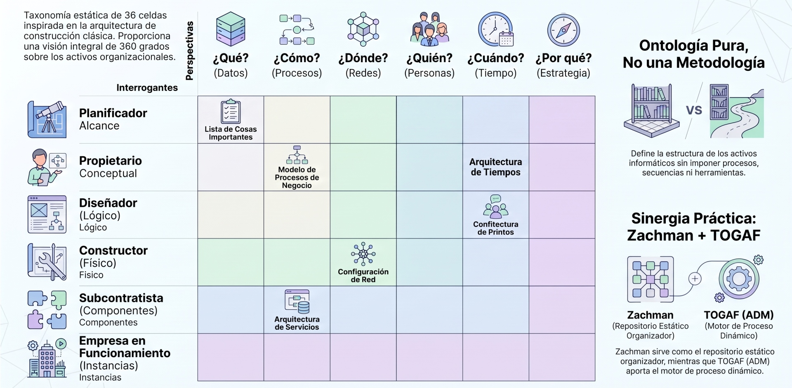
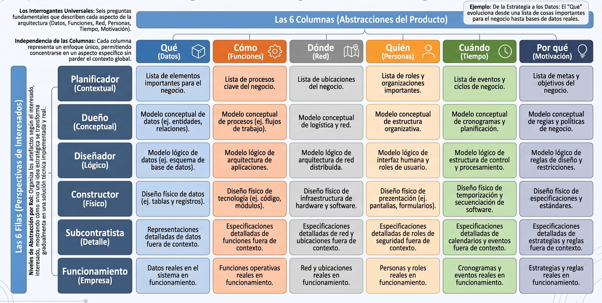
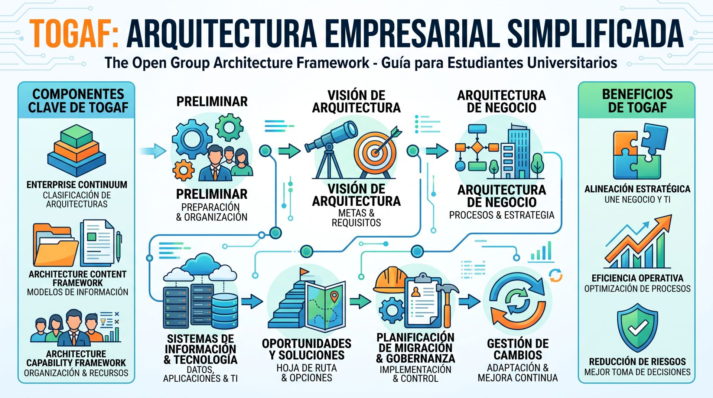
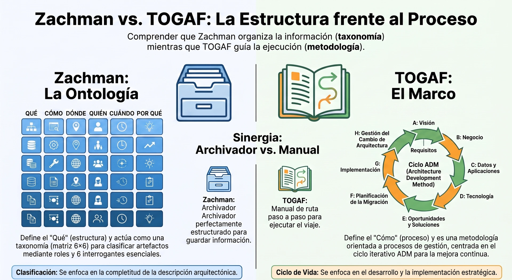
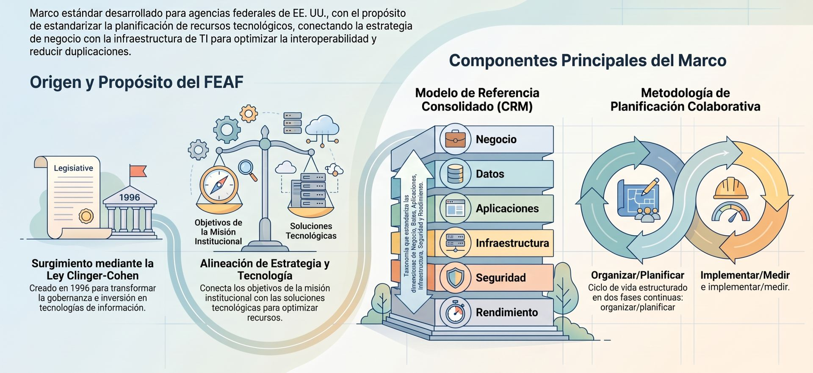

## **Marco Zachman**

El **Marco Zachman** (o *Zachman Framework*) es uno de los pilares fundamentales e históricos de la Arquitectura Empresarial. Fue introducido originalmente por **John A. Zachman en 1987** y revisado y extendido una década después, en 1996. 

Zachman, quien trabajaba para la empresa IBM en el área de metodologías de planificación de sistemas de información, propuso este modelo aplicando por analogía los conceptos de la **arquitectura de construcción clásica** al diseño y desarrollo de empresas y sus sistemas de computación. Al hacerlo, acuñó el término "Arquitectura Empresarial" (*Enterprise Architecture*).

Bajo la óptica de este marco, la arquitectura se define como un conjunto de artefactos de diseño o representaciones descriptivas que son relevantes para detallar un objeto complejo, de tal forma que pueda ser producido de acuerdo con requisitos de calidad específicos y mantenerse (cambiar) eficazmente a lo largo de su vida útil.

El Marco de Zachman constituye la *ontología* fundamental de la empresa. No es una metodología de pasos, sino una taxonomía estática que proporciona una vista de 360 grados de los activos organizacionales. Funciona como un "Check de Calidad Total"; si una celda de la matriz está vacía, existe una brecha de gobernanza o un punto ciego informativo que pone en riesgo la integridad estructural.

:::info
**Ontología:** Es una rama de la filosofía que estudia la naturaleza del ser y su existencia. En el ámbito de este marco la ontología es una estructura lógica y atemporal que define la existencia de los componentes esenciales de una empresa. 

La Ontología define qué hay: El marco es una estructura fija que establece las reglas de clasificación para los artefactos de la empresa (documentos, modelos, datos). No te dice cómo construir la arquitectura ni en qué orden hacerlo.
:::

La matriz de 36 celdas se rige por la regla de la Perspectiva Única: cada celda representa un aspecto independiente y necesario para la completitud del modelo. Su estructura cruza las filas (Interesados) con las columnas (Interrogantes).

:::success[Nota]
**Define qué hay que documentar sobre la arquitectura empresarial, no cómo organizar el trabajo para lograrlo.**
:::

### La Matriz de 6x6

El marco toma la forma de una matriz de doble entrada que se rige por la regla de la Perspectiva Única: cada celda representa un aspecto independiente y necesario para la completitud del modelo. Intersecta **seis interrogantes básicas (las columnas)** con **seis perspectivas de los interesados (las filas)**, dando lugar a un esquema de clasificación descriptivo de 36 celdas en total:

<figure>

<figcaption>Guía del marco Zachman: La ontología de la Arquitectura Empresarial.</figcaption>
</figure>

#### Las Columnas: 
**Las Interrogantes (Abstracciones del Producto)**

Cada columna aborda un aspecto específico y diferenciado de la organización:
1. **¿Qué datos existen en la organización? (Descripción de Datos - *What*):** Se enfoca en los elementos/objetos de negocio y activos de información importantes para el negocio y sus relaciones estructurales. *(Ejemplo: clases de entidades de negocio, modelos semánticos)*.

2. **¿Cómo funcionan los procesos? (Descripción de Funciones - *How*):** Las funciones y transformaciones del sistema. Describe cómo funcionan las partes del sistema tanto de forma independiente como conjunta. *(Ejemplo: procesos de negocio, funciones de computadora)*. Esta columna no trata sobre qué sistema se ejecuta, sino sobre lo que ocurre dentro de él. Describe los flujos de trabajo y las funciones tal y como los realiza la organización.

3. **¿Dónde tiene lugar el trabajo? (Descripción de Red - *Where*):** La distribución geográfica y logística de nodos. Muestra los aspectos de distribución física y de red, la ubicación de los elementos y sus dependencias. *(Ejemplo: nodos de hardware, protocolos de red)*. Esta columna abarca las ubicaciones, las redes y la distribución geográfica. También muestra cómo se conectan esas ubicaciones entre sí.

4. **¿Quién es responsable de qué? (Descripción de Personas - *Who*):** La asignación de responsabilidades y roles (Silos vs. T-Shaped). Identifica a los agentes, roles y unidades organizacionales involucradas. *(Ejemplo: organigramas, modelos de flujo de trabajo)*. No es un lugar para un organigrama. Es una visión de quién toma qué decisiones y quién es el responsable de qué procesos. Ayuda a mostrar dónde se cruzan los roles, las responsabilidades y el riesgo humano dentro de la arquitectura empresarial.

5. **¿Cuándo se producen los procesos y qué los desencadena? (Descripción de Tiempo - *When*):** Los ciclos operativos, eventos y cronogramas. Describe los aspectos temporales y de programación significativos. *(Ejemplo: calendarios maestros, ciclos de negocio, eventos del sistema)*.

6. **¿Por qué? (Descripción de Motivación - *Why*):** La estrategia, metas y reglas de negocio. Proporciona los requerimientos lógicos y de justificación detrás de las decisiones. *(Ejemplo: metas de negocio, planes estratégicos, reglas de negocio)*. Objetivos, estrategias y la base de las decisiones. Esta columna pregunta por qué la organización actúa como lo hace en los seis niveles. 

#### Las Filas: 
**Las Perspectivas (Roles de los Interesados)**

Cada fila representa el punto de vista de un actor o rol clave en la cadena de diseño y construcción:
1. **Planificador (Contextual - *Planner's View*):** **¿cuál es el contexto general?** El resumen ejecutivo que define el alcance (*scope*), tamaño global, costos y relación de la empresa con su entorno.

2. **Propietario (Conceptual - *Owner's View*):** **¿cómo se ve a sí misma la organización?** Representa el punto de vista de quien posee y opera el negocio; muestra modelos conceptuales de alto nivel de las entidades e interacciones.

3. **Diseñador (Lógico - *Designer's View / System Model*):** **¿cómo puede representarse técnicamente el modelo de negocio?** Muestra el modelo del sistema desde una perspectiva lógica e independiente de las herramientas físicas específicas. A este nivel, los arquitectos de sistemas traducen los requisitos del negocio en un modelo conceptual.

4. **Constructor (Físico - *Builder's View / Technology Model*):** **¿qué se está construyendo realmente?** Representa el diseño técnico físico, adaptando los modelos lógicos a tecnologías específicas (hardware, lenguajes de programación, etc.). Los desarrolladores describen cómo se traduce el modelo de sistema en tecnologías concretas. Las plataformas, las interfaces y la infraestructura se vuelven tangibles a este nivel.

5. **Subcontratista (Fuera de Contexto - *Subcontractor's View*):** **¿cuáles son las especificaciones técnicas?** Proporciona las especificaciones detalladas e independientes para el ensamble de componentes modulares y configuraciones de bajo nivel. Necesitan instrucciones precisas.

6. **Empresa en Funcionamiento (*Functioning Enterprise*):** **¿qué es lo que realmente funciona en el mundo real?** El sistema real operando en producción, es decir, la organización física funcionando. Esta perspectiva muestra cómo funciona la organización en el día a día, incluidos los puntos en los que la realidad difiere del diseño original.

:::info[Plantilla]
[Descarga la plantilla Zachman acá](/files/zachman_framework_sosafe.pdf)
:::

### Características y Reglas

Para aplicar correctamente el marco, John Zachman propuso un conjunto de siete reglas básicas que restringen y guían la generación de los planos arquitectónicos:

* **No hay orden en las columnas:** La regla número 1 indica que las columnas no poseen un orden jerárquico ni temporal implícito. El hecho de que la motivación se liste al final no significa que se defina al último o que tenga menor prioridad.

* **El número de perspectivas y columnas es fijo:** Debe haber estrictamente seis filas y seis columnas, número que no puede reducirse ni ampliarse.

* **No es una metodología, es una clasificación:** A diferencia de marcos como **TOGAF** (que define un ciclo paso a paso como el ADM), el Marco Zachman **no prescribe un proceso, secuencia ni método de desarrollo**. Es un esquema de clasificación taxonómico puro y descriptivo. Su propósito es asegurar que todos los puntos de vista de la empresa sean mapeados de forma integral y estructurada sin importar el orden en que se creen.

* **Independencia de herramientas:** Es abstracto y completamente neutral respecto al uso de tecnologías, notaciones o metodologías específicas.

### Fortalezas y Desafíos
* **Fortalezas:** Proporciona un vocabulario común, es fácil de entender a nivel de concepto y ayuda a gestionar la complejidad empresarial al estructurar el diseño holístico. Es ampliamente considerado el estándar de referencia más longevo y popular dentro del ámbito académico y corporativo.

* **Desafíos:** Al no ofrecer un manual de procesos "paso a paso", muchas organizaciones encuentran complejo llevarlo a la práctica y recurren a consultorías externas ante la falta de conocimiento operativo (*know-how*). Además, la profundidad requerida para completar los modelos de cada una de las 36 celdas puede llegar a ser abrumadora para los equipos de arquitectura si se intenta modelar todo a la vez.

Impacto Estratégico ("So What?"): Zachman mitiga el Riesgo Estructural y de Alcance (Appendix X2). Al mapear la realidad organizacional en esta matriz, el estratega puede identificar redundancias costosas y activos huérfanos. Si Zachman define "qué es" la empresa (el estándar), necesitamos un motor dinámico para gestionar "cómo transformarla": el ciclo ADM de TOGAF.

#### Estructura vs. Proceso (Ontología vs. Metodología)

• **La Ontología define qué hay:** El marco es una estructura fija que establece las reglas de clasificación para los artefactos de la empresa (documentos, modelos, datos). No te dice cómo construir la arquitectura ni en qué orden hacerlo.

• **La Metodología transforma:** Otros marcos como TOGAF son metodologías porque describen un proceso o ciclo de vida paso a paso para crear la arquitectura. Zachman provee el "mapa conceptual" o el inventario donde se organiza todo lo que la metodología genera.

---
## **Marco TOGAF**
**The Open Group Architecture Framework**

El **Marco TOGAF** (*The Open Group Architecture Framework*) es un enfoque y una metodología altamente popular diseñada para el diseño, planificación, implementación y gobernanza de la Arquitectura Empresarial (AE) de una organización. 

Aunque convencionalmente se le denomina "marco de referencia", en realidad, **TOGAF no es un marco arquitectónico estático**, sino un manual detallado de fases y procesos metodológicos que guían a los arquitectos en la creación y evolución de su propia arquitectura de TI.

TOGAF se posiciona como el marco metodológico dinámico esencial para la transformación continua. A través de su **Método de Desarrollo de Arquitectura (ADM)**, TOGAF proporciona el proceso iterativo para mover la organización desde su estado actual hacia el estado objetivo, alineándose con las características de los ciclos de vida incrementales.

El ciclo ADM gestiona el cambio mediante fases que van desde la "Visión de Arquitectura" hasta la "Gestión de Cambios de Arquitectura". Esta última fase es el punto de conexión crítica con la Gestión de Cambios en la Organización (OCM). Un despliegue acelerado de arquitectura pondrá a prueba la capacidad de adaptación de la empresa, lo que exige un patrocinio ejecutivo activo y visible para superar la resistencia al cambio y garantizar que la entrega de valor sea sostenible.

Impacto Estratégico ("So What?"): TOGAF es la estrategia de mitigación definitiva para la Deuda Técnica y la "Calidad Degradada". Mediante sus iteraciones constantes, el ADM permite refactorizar procesos y sistemas antes de que la complejidad del producto detenga la innovación. Mientras Zachman clasifica, TOGAF ejecuta el cambio, creando una sinergia entre lo estático y lo dinámico.

Su estructura y funcionamiento se basan en los siguientes componentes fundamentales:

### Las Dos Columnas
Como meta-arquitectura, TOGAF está constituido por dos partes esenciales que trabajan de manera conjunta:

*   **ADM (*Architecture Development Method*):** Es el corazón y motor operativo de TOGAF. Proporciona directrices paso a paso, iterativas y en un ciclo continuo, para guiar la creación y el desarrollo de la arquitectura empresarial en sus diferentes fases.

*   **El Continuo Empresarial (*Enterprise Continuum*):** Es un modelo que describe de manera lógica cómo una organización puede transicionar y moverse de manera ordenada desde su estado actual ("dónde está") hacia el estado futuro deseado ("dónde quiere estar"), clasificando los activos arquitectónicos desde los más genéricos (comunes de la industria) hasta los más específicos de la propia empresa.

### Los 4 Dominios o Capas
TOGAF prescribe que la Arquitectura Empresarial debe subdividirse en cuatro capas o dominios interdependientes para poder ser gestionada de manera efectiva:

1.  **Arquitectura de Negocio (*Business*):** Define la estrategia del negocio, la gobernanza, la organización y los procesos de negocio clave.
2.  **Arquitectura de Datos/Información (*Data*):** Describe la estructura de los activos físicos y lógicos de datos de la empresa, así como sus recursos de gestión de datos.
3.  **Arquitectura de Aplicaciones (*Applications*):** Define las especificaciones de las aplicaciones individuales y de software que se implementan para dar soporte y activar los procesos de negocio.
4.  **Arquitectura de Tecnología (*Technology*):** Detalla las capacidades lógicas y físicas de hardware y software (servidores, redes, middleware) que sustentan la infraestructura para ejecutar las aplicaciones.

### Las Fases del Ciclo ADM
El método ADM se representa de forma circular y cuenta con un conjunto de fases que guían el ciclo de vida del desarrollo arquitectónico:

*   **Fase Preliminar:** Se ejecuta al inicio para definir el contexto, obtener el respaldo (*buy-in*) de los patrocinadores del proyecto, establecer los principios arquitectónicos generales y definir los roles y responsabilidades del equipo.
*   **Fase A (Visión de la Arquitectura):** Define el alcance inicial del esfuerzo, la visión del proyecto y los criterios de validación de éxito.
*   **Fase B (Arquitectura de Negocio):** Diseña y modela el dominio de la arquitectura de negocio para alinearla con la visión.
*   **Fase C (Arquitectura de Sistemas de Información):** Desarrolla los planos específicos de las aplicaciones y de los activos de datos que interactúan con el negocio.
*   **Fase D (Arquitectura de Tecnología):** Mapea la infraestructura de hardware y software necesaria para habilitar la arquitectura de sistemas de información.
*   **Fase E (Oportunidades y Soluciones):** Evalúa los paquetes de trabajo y las opciones de implementación (p. ej., definir si conviene construir software a la medida o comprar soluciones comerciales ya hechas).
*   **Fase F (Planificación de la Migración):** Prioriza los proyectos o paquetes de trabajo, analiza sus dependencias y genera un plan detallado de migración.
*   **Fase G (Gobernanza de la Implementación):** Supervisa y coordina la ejecución de los proyectos para garantizar que la construcción real cumpla de forma conforme con los planos de la arquitectura.
*   **Fase H (Gestión de Cambios de la Arquitectura):** Implementa un proceso de control y gobernanza para evaluar y gestionar de manera ordenada cualquier alteración futura que sufra la arquitectura en producción.
*   **Gestión de Requisitos (*Requirements Management*):** Se ubica en el centro exacto del ciclo ADM. Es un proceso dinámico que interactúa de manera bidireccional y continua con cada una de las fases, asegurando que todos los requisitos del cliente estén alineados en todo momento.

#### Flexibilidad
Un aspecto clave es que **TOGAF no prescribe ni define el aspecto o la apariencia visual que deben tener sus entregables**. Estos pueden materializarse como documentos de texto en un Wiki corporativo o como diagramas UML de alta complejidad en una herramienta especializada. 

Por esta razón, la organización que promueve TOGAF (*The Open Group*) proporciona un lenguaje de modelado visual estándar llamado **ArchiMate** para dar soporte gráfico al diseño de las vistas de AE. Asimismo, dada la flexibilidad de TOGAF, es una práctica común de la industria **unirlo de forma sinérgica con el Marco Zachman**; se utiliza el proceso dinámico ADM de TOGAF para guiar el orden de construcción de los planos del proyecto, y se utiliza la matriz estática de Zachman como el "archivador o repositorio taxonómico" ideal para clasificar y organizar esos planos una vez generados.

---
## **TOGAF vs Zachman**

Las diferencias fundamentales entre el **Marco Zachman** y **TOGAF** (*The Open Group Architecture Framework*) radican en su naturaleza, su propósito metodológico y la forma en que estructuran la Arquitectura Empresarial (AE). Mientras que uno es un esquema de clasificación taxonómica (una ontología), el otro es una metodología basada en procesos de gestión y planificación.

A continuación se detallan las diferencias clave:

### Naturaleza y Enfoque
* **El Marco Zachman es un esquema de clasificación o taxonomía:** No prescribe ningún proceso, secuencia o ciclo de vida para el desarrollo de la arquitectura. Su enfoque consiste en asegurar que todos los planos y descripciones relevantes de una empresa estén mapeados y clasificados de forma integral.

* **TOGAF es un enfoque y metodología orientados a procesos:** No es en sí mismo un marco arquitectónico rígido, sino un manual de fases organizadas en torno a un método llamado **ADM** (*Architecture Development Method*). Se enfoca principalmente en la gestión, planificación y gobernanza de la creación de la AE, más que en predefinir el aspecto final de las vistas.

### Estructura y Componentes
* **Zachman utiliza una Matriz Estática (6x6):** La clasificación cruza **seis interrogantes básicas** (las columnas: *Qué, Cómo, Dónde, Quién, Cuándo, Por qué*) con **seis perspectivas de los interesados** (las filas: *Planificador, Propietario, Diseñador, Constructor, Subcontratista y Empresa en funcionamiento*). Cuenta con reglas estrictas de completitud (el formato es fijo y las columnas no tienen un orden jerárquico o temporal).

* **TOGAF utiliza el Ciclo ADM:** Es una estructura circular e iterativa de **fases consecutivas** (desde la Fase Preliminar y Visión de la Arquitectura, pasando por Negocio, Sistemas de Información y Tecnología, hasta la Planificación de la Migración, Gobernanza y Gestión de Cambios). También introduce el *Enterprise Continuum* para guiar el tránsito de la empresa desde su estado actual al deseado.

### Dominios y Capas
* **TOGAF prescribe cuatro capas específicas de arquitectura:** Negocio (*Business*), Datos/Información (*Data/Information*), Aplicaciones (*Applications*) y Tecnología (*Technology*).

* **Zachman descompone la organización en seis bloques de modelado (las columnas):** Datos, Procesos, Redes, Personas, Tiempo y Motivación.

### Entregables
* **Zachman define vistas preestructuradas:** Trata de predefinir qué representaciones lógicas y físicas requiere cada rol (por ejemplo, el modelo semántico para el Propietario o la arquitectura de red para el Diseñador). Sin embargo, carece de un instrumento o herramienta de modelado propio, por lo que frecuentemente se utiliza con la notación UML.

* **TOGAF es flexible en el formato de sus entregables:** Las salidas del proceso ADM no tienen una forma gráfica o look definido por defecto; pueden ser textos planos en un Wiki, documentos tradicionales o modelos lógicos en herramientas de software. The Open Group proporciona un lenguaje estandarizado llamado **ArchiMate** para dar soporte visual al modelado de AE bajo las fases de TOGAF.

### Sinergia
En el diseño real de Arquitectura Empresarial, **ambos marcos no son excluyentes, sino altamente complementarios y a menudo se combinan**. Las organizaciones suelen adoptar el **ADM de TOGAF** para tener un mapa de ruta metodológico claro (el "cómo" y en qué orden avanzar), y utilizan la **Matriz de Zachman** como el repositorio o "archivador" estructurado para clasificar, gobernar y asegurar la completitud de todos los artefactos de diseño que se producen a lo largo de esas fases.

### Análisis Comparativo
**Zachman (Estático) vs. TOGAF (Dinámico)**

La madurez arquitectónica de una organización se mide por su capacidad para integrar ambos marcos. No son excluyentes: Zachman define el Estándar y TOGAF define la Transformación.

| Atributo | Marco Zachman (Estático) | TOGAF / ADM (Dinámico) |
| ----- | ----- | ----- |
| Naturaleza | Ontología / Taxonomía | Metodología / Proceso |
| Enfoque | Definición de la existencia (Ser) | Guía de acción y transformación (Hacer) |
| Estructura | Matriz fija (36 celdas) | Ciclo iterativo (ADM) |
| Riesgo que Maneja | Riesgo Estructural y de Alcance | Riesgo de Ejecución y Proceso |
| Propósito | Clasificación de artefactos y diagnóstico | Ejecución de cambios y entrega de valor |

Impacto Estratégico ("So What?"): Esta dualidad permite gestionar la variabilidad. Zachman asegura que no olvidemos componentes críticos (integridad), mientras que TOGAF asegura que el proceso de cambio sea gobernado y adaptativo (agilidad). Juntos, proporcionan una base empírica para la toma de decisiones estratégicas.

### Sinergia Práctica y Adaptabilidad
**Implementación en la Empresa Ágil**

Para el estratega moderno, la integración de estos marcos no es opcional. Bajo una mentalidad ágil, el marco de Zachman funciona como el Backlog de la Arquitectura (la estructura de lo que debe ser), mientras que TOGAF opera como el Sprint (el flujo de mejora continua).

La elección del ciclo de vida debe basarse en el Continuo de los Ciclos de Vida: la AE debe decidir el enfoque (predictivo, híbrido o adaptativo) basándose en el grado de cambio y la frecuencia de entrega requerida. Para medir el éxito de esta implementación, debemos abandonar las métricas de utilización y adoptar Métricas Empíricas (Sección 5.4):

1. Lead Time y Cycle Time: Medir la velocidad de entrega de valor sobre la simple ocupación de recursos.  
2. "Done" Empírico (DoD): Sustituir el "porcentaje de avance" por criterios de aceptación terminados y probados.  
3. Satisfacción del Cliente: Priorizar la entrega de productos funcionales sobre la complacencia de contratos estáticos.

Impacto Estratégico ("So What?"): El éxito final de esta sinergia reside en la creación de una PMO Ágil. Esta unidad debe ser multidisciplinaria y orientada a la invitación (no impositiva), actuando como un Centro de Excelencia. Una PMO que impone EA fallará; una PMO que actúa como consultora de Zachman y TOGAF optimizará la entrega de valor, garantizando que la arquitectura sea un motor de agilidad y no un lastre burocrático.

---
## **FEAF** 

El **Federal Enterprise Architecture Framework (FEAF)** es el marco de arquitectura empresarial del Gobierno federal de Estados Unidos. Fue establecido en **1999** por el Consejo Federal de CIO (*Federal CIO Council*) como respuesta a la **Ley Clinger-Cohen de 1996**, que obligaba a cada agencia federal a desarrollar y mantener una arquitectura de TI integrada para gobernar la gestión y adquisición de tecnología y vincularla con los objetivos estratégicos de la agencia.

El propósito declarado del FEAF es **facilitar el desarrollo compartido de procesos e información comunes entre las agencias federales y otras entidades gubernamentales**, proporcionando un lenguaje y una estructura comunes para describir, analizar y gestionar las inversiones de TI en todo el Gobierno.

El desarrollo y uso de la arquitectura empresarial federal se apoya en un conjunto de leyes y circulares, entre ellas:

| Norma | Año | Relevancia |
|---|---|---|
| GPRA (Government Performance and Results Act) | 1993 | Gestión basada en resultados |
| PRA (Paperwork Reduction Act) | 1995 | Gestión de recursos de información |
| CCA (Clinger-Cohen Act) | 1996 | Obliga a cada agencia a mantener una arquitectura de TI integrada; asigna la responsabilidad al CIO |
| GPEA (Government Paperwork Elimination Act) | 1998 | Trámites electrónicos |
| FISMA | 2002 | Seguridad de la información |
| E-Government Act | 2002 | Asigna a la Oficina de E-Gobierno y TI de la OMB la supervisión de las arquitecturas empresariales de las agencias |
| Circulares OMB A-11 y A-130 | — | Presupuesto y gestión de recursos de información |

La gestión del programa FEA (Federal Enterprise Architecture) corresponde a la **OMB (Office of Management and Budget)**, dentro de su Oficina de E-Gobierno y Tecnología de la Información, que publica la guía oficial, los modelos de referencia y las herramientas de evaluación.

### Evolución histórica

- **Septiembre de 1999**: el Federal CIO Council publica el FEAF versión 1.1. Se apoya en prácticas previas como el modelo de arquitectura empresarial del **NIST**, e incorpora elementos del marco de Zachman y de la metodología *Enterprise Architecture Planning* de Spewak.
- **2001–2002**: con la *President's Management Agenda*, el grupo de trabajo de E-Gobierno (proyecto *Quicksilver*) detecta solapamiento masivo y redundancia de sistemas entre agencias y recomienda crear el **Proyecto FEA** y la **Oficina FEA en la OMB**. La OMB publica los primeros modelos de referencia tras la aprobación del E-Government Act de 2002.
- **2 de mayo de 2012**: la OMB publica el documento **"Common Approach to Federal Enterprise Architecture"**, que presenta un enfoque general para desarrollar y usar la arquitectura empresarial en el Gobierno federal, promoviendo servicios compartidos, la eliminación de duplicidades y la colaboración entre gobierno, industria y ciudadanía.
- **29 de enero de 2013**: se publica la **versión 2 (FEAF-II)**, que cumple los criterios del *Common Approach* y reorganiza los cinco modelos de referencia originales en **seis**, integrados en el *Consolidated Reference Model* (CRM).
- También se desarrollaron metodologías complementarias: la **Federal Segment Architecture Methodology (FSAM)** y su sucesora, la **Collaborative Planning Methodology (CPM)**, pensada para ser más flexible y aplicable a distintos niveles de planificación (internacional, nacional, federal, sectorial, agencia, segmento, sistema y aplicación).

### Características clave

#### Partición de la arquitectura

El FEAF divide una arquitectura empresarial en cuatro capas:

1. **Arquitectura de negocio**: qué se hace, quién lo hace, cómo, cuándo y por qué.
2. **Arquitectura de datos**: la información que la agencia utiliza para operar.
3. **Arquitectura de aplicaciones**: el software que procesa los datos según las reglas de negocio.
4. **Arquitectura tecnológica**: el hardware y las comunicaciones que soportan las tres capas anteriores.

#### Los seis modelos de referencia (FEAF-II)

En la versión 2, el **Consolidated Reference Model (CRM)** vincula seis modelos de referencia, cada uno asociado a un dominio de sub-arquitectura. Su objetivo es facilitar el análisis entre agencias y la identificación de inversiones duplicadas, vacíos y oportunidades de colaboración.

| Dominio | Modelo de referencia | Propósito |
|---|---|---|
| Estrategia | **PRM** (Performance Reference Model) | Vincula estrategia, componentes internos de negocio e inversiones, y mide el impacto de las inversiones en los resultados estratégicos |
| Negocio | **BRM** (Business Reference Model) | Describe las funciones de negocio comunes (misión y servicios de soporte) con independencia de la estructura orgánica, fomentando la cooperación entre agencias |
| Datos | **DRM** (Data Reference Model) | Ayuda a identificar los activos de datos, comprender su significado, su acceso y su aprovechamiento para los resultados |
| Aplicaciones | **ARM** (Application Reference Model) | Clasifica estándares y tecnologías de sistemas y aplicaciones que soportan las capacidades de servicio, permitiendo compartir y reutilizar soluciones comunes |
| Infraestructura | **IRM** (Infrastructure Reference Model) | Clasifica estándares y tecnologías de red/nube para servicios de voz, datos, vídeo y móvil |
| Seguridad | **SRM** (Security Reference Model) | Proporciona un lenguaje común para discutir los requisitos de seguridad y privacidad en el contexto de negocio |

En la versión 1, los cinco modelos eran PRM, BRM, SRM (*Service Component Reference Model*), TRM (*Technical Reference Model*) y DRM; el FEAF-II los reagrupó y expandió a los seis anteriores.

#### Principios del *Common Approach* (2012)

- La arquitectura se orienta a resultados: las metas estratégicas impulsan los servicios de negocio, que a su vez definen los requisitos de las tecnologías habilitadoras.
- Estandarización del desarrollo y uso de arquitecturas dentro y entre agencias.
- Uso de la arquitectura empresarial para **eliminar despilfarro y duplicación, aumentar los servicios compartidos, cerrar brechas de desempeño** y promover la participación de gobierno, industria y ciudadanía.
- La **Collaborative Planning Methodology (CPM)** como ciclo completo de planificación e implementación, aplicable a todos los niveles de alcance (internacional, nacional, federal, sectorial, agencia, segmento, sistema y aplicación).

#### Vinculación con el ciclo presupuestario

El FEAF se integró en los procesos federales de gestión de cartera e inversión: las agencias debían alinear sus inversiones de TI con los modelos de referencia (por ejemplo, en la justificación de inversiones del *Exhibit 300* del proceso presupuestario de la OMB), de modo que la OMB pudiera analizar la cartera de TI de todo el Gobierno con una taxonomía común y detectar solapamientos.

### Casos de uso

#### Análisis de inversiones de TI a escala gubernamental (OMB)

Las agencias usan los modelos de referencia del FEA para mostrar la alineación de sus inversiones de TI con áreas de misión, funciones de negocio comunes o servicios empresariales; el uso de una taxonomía común permite a la OMB realizar análisis gubernamentales de las inversiones y de los recursos de información. La OMB llegó a desarrollar herramientas como el **FEAMS (Federal Enterprise Architecture Management System)** para que las agencias pudieran identificar socios de colaboración y compartir componentes tecnológicos durante el proceso presupuestario, así como un **EA Assessment Framework** para evaluar anualmente la capacidad de los programas de arquitectura de las agencias.

#### Iniciativas "Lines of Business" (líneas de negocio)

A partir de 2004, la OMB identificó, usando los datos recopilados para el FEA y el presupuesto, grandes iniciativas colaborativas para transformar el Gobierno y generar ahorros: **Gestión Financiera, Gestión de Recursos Humanos, Gestión de Subvenciones (*Grants Management*), Gestión de Casos (*Case Management*), Arquitectura Federal de Salud y Seguridad de Sistemas de Información**, a las que en 2006 se añadieron **Optimización de Infraestructura de TI, Sistemas Geoespaciales y Formulación y Ejecución Presupuestaria**. El objetivo a largo plazo era trasladar funciones comunes, replicadas en cada agencia, hacia **centros de servicios compartidos** (*shared service centers*) seleccionados por concurso.

Ejemplo documentado de aplicación de los principios de interoperabilidad: **DisasterAssistance.gov** (lanzado el 31 de diciembre de 2008), que integró sistemas de FEMA con los de la Administración de Pequeñas Empresas (SBA), la Administración de la Seguridad Social, el Departamento de Trabajo y el Departamento de Educación, usando arquitectura orientada a servicios (SOA) y el modelo de intercambio de datos NIEM.

#### CMS (Centers for Medicare & Medicaid Services)

Los CMS mantienen su arquitectura empresarial alineada con el marco del Departamento de Salud y Servicios Humanos (DHHS), que a su vez se alinea con el FEAF de la OMB. Este enfoque federado busca maximizar la utilidad y la interoperabilidad en todo el Gobierno federal; la arquitectura de CMS se modela y mantiene en una herramienta de arquitectura interactiva.

#### Resultados medidos en agencias (seguimiento GAO-12-791)

La GAO (oficina de auditoría del Congreso) evaluó en 2012 hasta qué punto las agencias medían y reportaban los beneficios de sus arquitecturas empresariales, y dio seguimiento a sus recomendaciones. Casos verificables documentados por la GAO:

- **Departamento del Interior**: reportó **8,7 millones de dólares de ahorro en el año fiscal 2013** como resultado de sus esfuerzos de arquitectura empresarial, e identificó inversiones heredadas para retirar.
- **Departamento del Tesoro**: reportó una reducción del gasto en infraestructura como porcentaje de su presupuesto de TI, del **45,9 % en el año fiscal 2010 al 37,6 % en 2013**, gracias a la consolidación de centros de datos guiada por su arquitectura.
- **Ejército de EE. UU.**: reportó el **retiro de 59 sistemas en 2013** mediante el uso de la arquitectura empresarial en su área de misión de negocio.
- **Administración de la Seguridad Social**: reportó resultados asociados a la **consolidación de requisitos de hardware y compras agrupadas**, con ahorros de costos comunicados a la OMB.
- **Departamento de Justicia**: demostró en 2019 que medía y reportaba **ahorros y costos evitados en centros de datos** mediante su arquitectura empresarial.
- **Departamento de Estado**: identificó **275 casos de duplicación potencial** mediante el uso de su arquitectura empresarial (2020).
- **Fundación Nacional de Ciencias (NSF)**: midió costos evitados en los años fiscales 2012–2015 asociados a la consolidación de centros de datos y a la migración de su correo electrónico a la nube.

#### Uso como herramienta contra la duplicación (contexto GAO)

La necesidad del FEA se justificó con evidencias de duplicación: en 2002 la OMB identificó 10 sistemas potencialmente redundantes relacionados con la elaboración de normas; la GAO reportó que el Departamento de Defensa contaba con **más de 200 sistemas de inventario no integrados**; y en 2011 la GAO identificó 81 áreas de duplicación, solapamiento o fragmentación potencial en programas gubernamentales. La arquitectura empresarial fue señalada por la GAO como el mecanismo para reducir dicha duplicación en las inversiones.

#### Adopción e influencia internacional

El FEAF se usa también fuera del Gobierno federal estadounidense como marco de referencia: es uno de los marcos más adoptados junto a TOGAF y DoDAF en el sector público de EE. UU., y se ha aplicado como modelo guía en análisis de transformación digital de otros gobiernos (por ejemplo, un estudio aplicado a *ACT Health* en Australia, que utiliza los seis modelos de referencia para mejorar interoperabilidad, agilidad, integración y reutilización). También se considera alineado con iniciativas internacionales como el *Global E-Gov Forum*.

#### Valoración crítica

- **Madurez desigual**: las evaluaciones de la GAO de 2001 y 2003 mostraron que la mayoría de las agencias se encontraban en los estadios iniciales de madurez (alrededor del 79 % en el estadio 1 de un marco de cinco), y que solo la Oficina Ejecutiva del Presidente alcanzaba el estadio máximo.

- **Medición de resultados**: el informe GAO-12-791 concluyó que las agencias debían medir y reportar periódicamente los resultados de sus arquitecturas para demostrar su valor, recomendación que dio lugar a los casos de ahorro documentados en la sección 5.4.

- **Valor práctico**: cuando se aplica con compromiso directivo, el FEAF ha demostrado ahorros cuantificables (consolidación de centros de datos, retiro de sistemas, eliminación de aplicaciones duplicadas) y mejoras de interoperabilidad entre agencias.

#### Referencias

1. The White House (archivo), *Federal Enterprise Architecture (FEA)* — guía oficial, modelos de referencia y herramientas de la OMB. https://obamawhitehouse.archives.gov/omb/e-gov/fea
2. Centers for Medicare & Medicaid Services (CMS), *Federal Enterprise Architecture Framework*. https://www.cms.gov/data-research/cms-information-technology/enterprise-architecture/federal-enterprise-architecture-framework
3. OMB, *The Common Approach to Federal Enterprise Architecture* (2 de mayo de 2012) y *Federal Enterprise Architecture Framework version 2* (29 de enero de 2013). Disponibles en la referencia 1.
4. U.S. GAO, *Organizational Transformation: Enterprise Architecture Value Needs to Be Measured and Reported* (GAO-12-791). https://www.gao.gov/products/gao-12-791
5. Congressional Research Service, *Federal Enterprise Architecture and E-Government: Issues for Information Technology Management* (RL33417). https://www.everycrsreport.com/reports/RL33417.html
6. Congresso de EE. UU., audiencia *Federal Enterprise Architecture* (House of Representatives, 108.º Congreso). https://www.govinfo.gov/content/pkg/CHRG-108hhrg96944/html/CHRG-108hhrg96944.htm
7. ScienceDirect, *Federal Enterprise Architecture – an overview*. https://www.sciencedirect.com/topics/computer-science/federal-enterprise-architecture
8. Wikipedia, *Federal enterprise architecture* (historia y legislación). https://en.wikipedia.org/wiki/Federal_enterprise_architecture
9. Project Open Data, *FEMA Case Study (DisasterAssistance.gov)*. https://github.com/project-open-data/project-open-data.github.io/blob/master/fema-case-study.md
10. FEA Consolidated Reference Model Document, versión 2.3 (octubre de 2007). https://www.reginfo.gov/public/jsp/Utilities/FEA_CRM_v23_Final_Oct_2007_Revised.pdf
11. EAPJ, *How the Federal EA Framework Supports Government Digital Transformation* (caso ACT Health). https://eapj.org/wp-content/uploads/2020/09/How-the-Federal-EA-Framework-Supports-Government-Digital-Transformation.pdf
12. Nextgov, *The federal enterprise architecture: Where it fits* (2008). https://www.nextgov.com/modernization/2008/06/the-federal-enterprise-architecture-where-it-fits/198667/
13. https://sosafe-awareness.com/es/glosario/zachman-framework/

:::info
**Nota:** este contenido se basa exclusivamente en las fuentes citadas, priorizando organismos oficiales (OMB, GAO, CMS, Congreso). Las cifras de ahorro corresponden a lo reportado por las propias agencias y verificado por la GAO.
:::

### FEAF vs. TOGAF vs. Zachman

| Criterio / Atributo | **FEAF** | **TOGAF** | **Marco Zachman** |
| :--- | :--- | :--- | :--- |
| **Naturaleza y Enfoque** | Marco estandarizado de arquitectura para el sector público (gubernamental), adaptable a empresas privadas. | Metodología y proceso dinámico orientado a la planificación, gestión, transformación y gobernanza de la AE. | Ontología y taxonomía estática descriptiva; no prescribe un método, proceso o ciclo de vida. |
| **Origen e Historia** | Desarrollado en EE. UU. (1996/1999) impulsado por la *Clinger-Cohen Act* y el *Federal CIO Council*. | Desarrollado por *The Open Group* (1995), originalmente basado en el proyecto TAFIM del DoD. | Creado por John A. Zachman en IBM (1987, revisado en 1996) basándose en la arquitectura clásica. |
| **Estructura Principal** | Modelos de Referencia Consolidados (*BRM, DRM, ARM, IRM, SRM, PRM*) y Metodología *CPM*. | Ciclo iterativo **ADM** (*Architecture Development Method*) y el **Continuo Empresarial** (*Enterprise Continuum*). | **Matriz Estática de 36 celdas** (6 interrogantes × 6 perspectivas de partes interesadas). |
| **Propósito Fundamental** | Promover la interoperabilidad interinstitucional, reducir la duplicación de recursos y estandarizar la TI pública. | Guiar paso a paso la evolución de la empresa desde el estado actual (*As-Is*) hacia el estado objetivo (*To-Be*). | Ofrecer una clasificación de 360° para mapear, estructurar y verificar la integridad de los activos organizacionales. |
| **Dominios / Capas** | Negocio, Datos, Aplicaciones, Infraestructura/Tecnología, Seguridad y Rendimiento. | **4 dominios clave:** Negocio (*Business*), Datos (*Data*), Aplicaciones (*Applications*) y Tecnología (*Technology*). | **6 bloques de modelado (columnas):** Datos (Qué), Procesos (Cómo), Redes (Dónde), Personas (Quién), Tiempo (Cuándo) y Motivación (Por qué). |
| **Entregables y Lenguaje** | Modelos de referencia estandarizados e indicadores de rendimiento gubernamentales. | Entregables de formato flexible, representados formalmente con el lenguaje visual estándar **ArchiMate**. | Vistas preestructuradas por rol; neutral respecto a herramientas, utilizado comúnmente con notación **UML**. |
| **Manejo del Riesgo** | Riesgo de inversión pública, incompatibilidad e ineficiencia en servicios compartidos. | **Riesgo de ejecución, proceso y deuda técnica:** Gestiona el cambio iterativo sin degradar la calidad. | **Riesgo estructural y de alcance:** Evita puntos ciegos informativos o componentes huérfanos en el diseño. |

---
| Marco | Enfoque Principal | Estructura Core |
|---|---|---|
| Zachman | Ontología teórica / Clasificación | Matriz estática (6x6) de interrogantes. |
| TOGAF | Sector privado / Transformación Ágil | Metodología circular (ADM) orientada a procesos.|
| FEAF | Sector público (Gobierno) / Estandarización a gran escala | Modelos de referencia (CRM) + Planificación (CPM).|

### Resumen de la Sinergia

En la práctica real de las organizaciones, estos tres enfoques no compiten entre sí, sino que se integran funcionalmente:

1. **El Marco Zachman funciona como la Ontología / Archivador:** Define *qué debe existir* para tener un modelo completo y libre de vacíos de gobernanza.

2. **TOGAF funciona como el Motor Metodológico (ADM):** Proporciona la guía procesal del *cómo y cuándo* transformar la empresa a través de fases iterativas de desarrollo.

3. **FEAF actúa como el Estándar de Referencia Dominial / Gubernamental:** Aporta taxonomías, catálogos e indicadores de rendimiento (*KPIs*) para evaluar la efectividad de los servicios interinstitucionales e inversiones.

### Ejemplos de aplicación

#### Ejemplo 1: Implementación de la Estrategia "Cloud-First" en Agencias Gubernamentales

* **Contexto del Problema:** Diversas agencias y departamentos operaban sistemas fragmentados y centros de datos dispares, dificultando la colaboración interinstitucional y aumentando los costos operativos de TI.
* **Aplicación Práctica de FEAF/FSAM:** 
  * Se utilizó la metodología de arquitectura por segmentos de FEAF (**FSAM**) junto con el marco general de FEA para realizar una **evaluación de la nube** en cuatro fases (evaluación, despliegue, habilitación y transición).
  * Se utilizaron los modelos de referencia de aplicaciones (ARM) e infraestructura (IRM) de FEAF para catalogar las aplicaciones críticas y definir cuáles podían migrarse hacia modelos SaaS, PaaS e IaaS.
* **Resultados Obtenidos:** Permitieron crear *blueprints* de transformación en la nube alineados con la política pública *"Cloud-First"*, asegurando que la consolidación de servidores y la analítica de Big Data respetaran los estándares de interoperabilidad y seguridad federales.

#### Ejemplo 2: Integración de Sistemas de Salud e Intercambio de Información Médica (NIH / *Caso "Health-Is-US"*)

* **Contexto del Problema:** Una organización de salud del sector público (que brinda servicios a agencias federales como los *National Institutes of Health - NIH*) enfrentaba procesos aislados, aplicaciones personalizadas no reutilizables y dificultades para compartir datos de manera eficiente y segura.

* **Aplicación Práctica de FEAF/FSAM:**
  * La organización adoptó la metodología **FSAM** de FEAF combinada con marcos como TOGAF y Zachman para diseñar e institucionalizar su **Práctica de Arquitectura de Negocio (BAP)**.
  * Se aplicó el modelo de datos de FEAF (DRM) y el modelo de aplicaciones (ARM) para descomponer sistemas monolíticos y acoplados en **servicios orientados a arquitectura (SOA)** reconfigurables e integrados sobre un bus de servicios empresariales (*Enterprise Service Bus - ESB*).

* **Resultados Obtenidos:** Se facilitó la interoperabilidad del Registro Médico Electrónico (*EHR*) y la plataforma de Intercambio de Información de Salud (*HIE*), garantizando el cumplimiento estricto de las regulaciones gubernamentales de privacidad de datos médicos (*Affordable Care Act*) y reduciendo los costos de mantenimiento de software.

### FEAF vs TOGAF ADM

En un proyecto real de **Arquitectura Empresarial (AE)**, la integración entre **FEAF** y **TOGAF ADM** permite combinar la **estructura estandarizada y taxonómica de los Modelos de Referencia Consolidados de FEAF** (junto a su Metodología de Planificación Colaborativa - CPM) con el **motor de proceso iterativo y dinámico por fases de TOGAF**.

A continuación se presenta el **cuadro comparativo y de mapeo** de los componentes de un proyecto real entre ambos marcos:

#### Mapeo de Componentes de un Proyecto: FEAF vs. TOGAF ADM

| Fase del Proyecto Real | Componentes y Modelos de FEAF (CPM / CRM) | Fase Correspondiente de TOGAF ADM | Entregables / Acciones Integradas en el Proyecto |
| :--- | :--- | :--- | :--- |
| **1. Iniciación y Contexto del Proyecto** | **CPM - Fase 1: Organizar y Planificar** Definición del alcance del segmento, patrocinio e indicadores del **PRM** (*Performance Reference Model*). | **Fase Preliminar** & **Fase A: Visión de la Arquitectura** | • Carta del Proyecto (*Project Charter*). • Definición de Principios y Gobierno de AE. • Identificación de *Stakeholders* y visión de negocio. |
| **2. Definición Estratégica y de Negocio** | **BRM** (*Business Reference Model*) Estandarización de servicios de negocio, capacidades y funciones interinstitucionales. | **Fase B: Arquitectura de Negocio** | • Mapa de Capacidades de Negocio (*Capability Map*). • Modelado de Procesos (*As-Is / To-Be*) y Cadenas de Valor. • Identificación de metas e indicadores clave de rendimiento (KPIs del PRM). |
| **3. Arquitectura de Información y Datos** | **DRM** (*Data Reference Model*) Estandarización de datos centrados en el negocio e intercambio de información entre sistemas. | **Fase C: Arquitectura de Sistemas de Información (Datos)** | • Modelo Lógico y Físico de Datos. • Matriz de Intercambio de Información (*Information Exchange Matrix*). • Diccionario de Datos y Catálogo de Metadatos. |
| **4. Arquitectura de Software y Sistemas** | **ARM** (*Application Reference Model*) Mapeo de componentes de software, aplicaciones y servicios en bus empresarial (*ESB*). | **Fase C: Arquitectura de Sistemas de Información (Aplicaciones)** | • Inventario y Catálogo de Aplicaciones. • Diagrama de Interfaces e Integración (APIs / SOA). • Evaluación de alternativas *Build vs. Buy*. |
| **5. Infraestructura y Plataformas** | **IRM** (*Infrastructure Reference Model*) Especificación de hardware, centros de datos, redes, virtualización y nube. | **Fase D: Arquitectura de Tecnología** | • Topología física y lógica de Redes. • Plataformas de Servidores y Almacenamiento. • Perfil de Estándares Tecnológicos. |
| **6. Seguridad y Gestión de Riesgos** | **SRM** (*Security Reference Model*) Diseño de controles de seguridad ajustados al riesgo y cumplimiento normativo. | **Transversal:** Presente en la Fase Preliminar, Fases A–D y Fase G | • Matriz de Riesgos y Controles de Seguridad. • Políticas de Autenticación, Cifrado y Acceso. |
| **7. Análisis de Brechas y Soluciones** | **CPM / FSAM - Fase de Análisis de Brechas** Identificación de redundancias, vacíos e ineficiencias de recursos. | **Fase E: Oportunidades y Soluciones** | • Matriz de Análisis de Brechas (*Gap Analysis*). • Agrupación de cambios en Paquetes de Trabajo (*Work Packages*). • Identificación de Arquitecturas de Transición. |
| **8. Hoja de Ruta y Migración** | **CPM - Plan de Transición** Cronograma de consolidación y optimización de recursos tecnológicos. | **Fase F: Planificación de la Migración** | • Plan Detallado de Implementación y Migración. • Hoja de Ruta de la Arquitectura (*Architecture Roadmap*). • Análisis Costo-Beneficio y Priorización de Proyectos. |
| **9. Gobernanza de la Ejecución** | **CPM - Fase 2: Implementar y Medir** Supervisión del despliegue y medición del impacto en los servicios. | **Fase G: Gobernanza de la Implementación** | • Contratos de Arquitectura (*Architecture Contracts*). • Evaluaciones de Conformidad y Supervisión de proyectos. |
| **10. Gestión Continua del Cambio** | **PRM (Evaluación Continua)** Medición periódica del valor generado y retroalimentación operacional. | **Fase H: Gestión de Cambios de la Arquitectura** | • Procedimientos de control de cambios arquitectónicos. • Actualización periódica del Repositorio de Arquitectura. |
| **Gestión de Requisitos (Sustento Continuo)** | **Requisitos de Negocio y Gobierno** Recopilación y trazabilidad continua de requisitos legales e interinstitucionales. | **Gestión de Requisitos (Requirements Management)** | • Proceso central bidireccional que asegura la alineación constante de requisitos con todas las fases. |

#### Sinergia Práctica entre FEAF y TOGAF ADM en el Proyecto

1. **Modelos de Referencia de FEAF como Taxonomía (El "Qué"):** Los seis modelos del CRM de FEAF (*PRM, BRM, DRM, ARM, IRM, SRM*) actúan como la guía estandarizada y el catálogo de clasificación para poblar el Repositorio de Arquitectura de la organización.

2. **Ciclo ADM de TOGAF como Motor Operativo (El "Cómo"):** El ciclo ADM dicta el orden procesal e iterativo para ejecutar el proyecto desde la visión inicial hasta la gobernanza de la solución desplegada.

3. **Alineación de Resultados:** Esta combinación asegura que las iniciativas tecnológicas no solo sigan un proceso riguroso de diseño y migración, sino que también cumplan con los estándares de interoperabilidad, eficiencia y medición de valor.

---
## 📝 **Test:** Marcos de trabajo

Antes de continuar, comprueba tus conocimientos.

import QuizComponent from '@site/src/components/Quiz';
import quiz from '@site/src/components/Quiz/data/ae-marcos.json';

<QuizComponent quiz={quiz} showInstantFeedback />