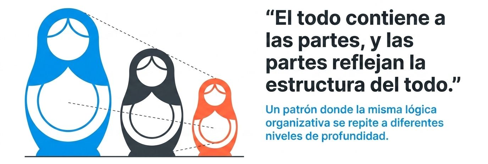
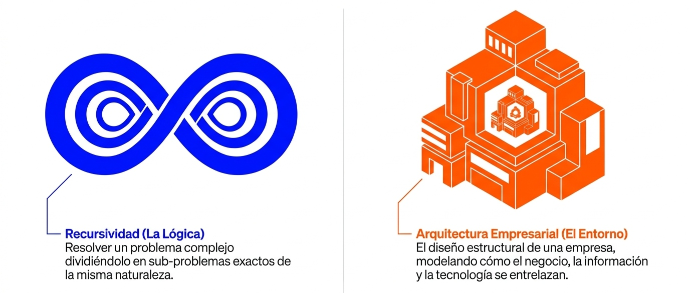
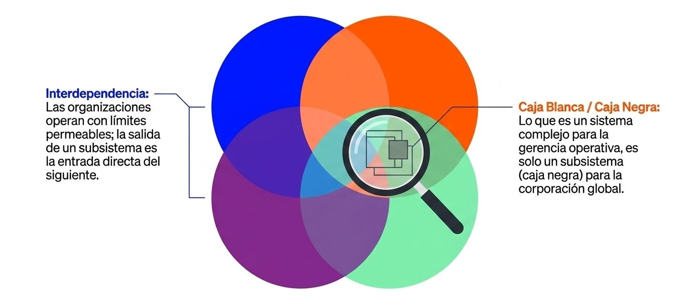
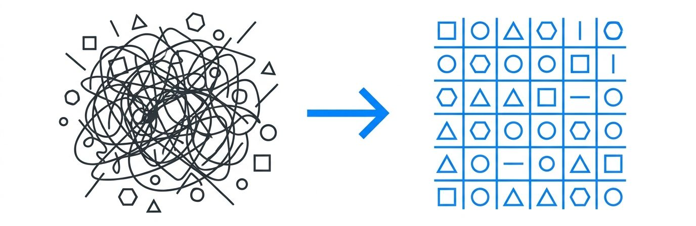
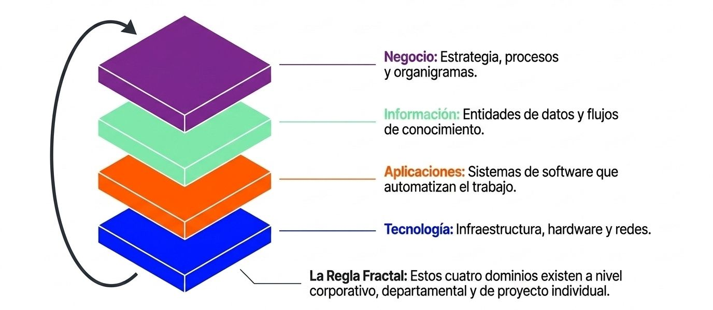
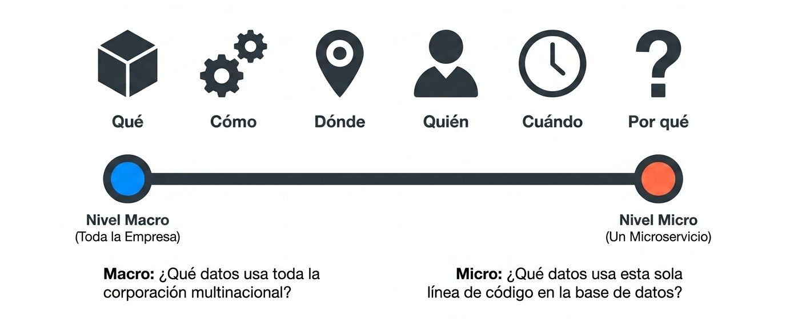
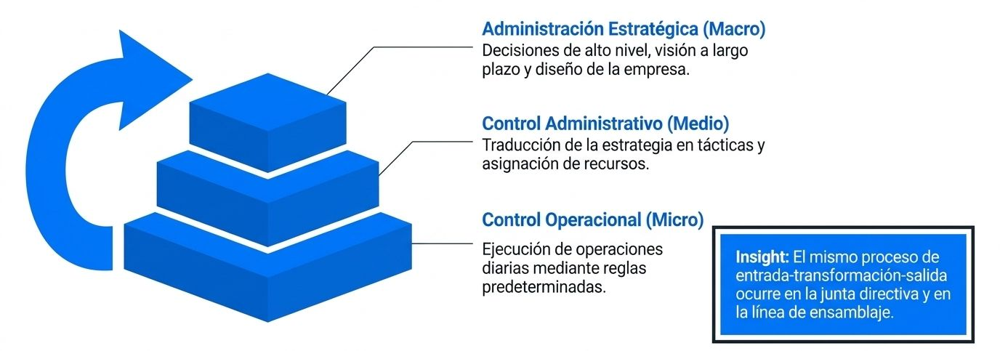

<figure>

</figure>

La **recursividad** en la Teoría General de Sistemas (TGS) establece que los sistemas están estructurados jerárquicamente en forma de "sistemas de sistemas", donde los subsistemas no solo están interconectados, sino que contienen y replican las mismas propiedades, comportamientos o reglas de organización del sistema mayor al que pertenecen. 

<figure>

<figcaption>La recursividad y la arquitectura corporativa comparten una misma lógica de descomposición.</figcaption>
</figure>

En la **Arquitectura Empresarial (AE)**, este principio de recursividad es la herramienta analítica fundamental para dominar la complejidad organizacional y técnica. Permite estructurar la empresa en múltiples capas y niveles de abstracción donde se aplican de forma repetitiva los mismos marcos de gobernanza, modelos de procesos y taxonomías lógicas.

La recursividad se aplica de manera cruzada en las distintas dimensiones de la Arquitectura Empresarial bajo los siguientes pilares de diseño:

<figure>

<figcaption>Un empresa no es monolito rígido, sino un ecosistema de sistemas interrelacionados.</figcaption>
</figure>

### La Recursividad como Regla de Oro 
**los Marcos de Referencia (El Caso Zachman)**

En AE y sistemas en general, se caracterizan por ser en si, sistemas complejos con miles de procesos, datos y tecnologías desconectadas. En general existe una falta de alineación entre el negocio y las tecnologías de información ya que hablan idiomas diferentes. Por tanto, la solución es establecer un vocabulario para clasificar el diseño de la empresa desde el punto de vista de TI.

<figure>

<figcaption>El caos empresarial. Falta de alineación entre el negocio y TI.</figcaption>
</figure>

El **Marco Zachman** es uno de los pilares de la Arquitectura Empresarial que mejor ejemplifica la recursividad como un axioma de diseño.

*   **Regla #7 de Zachman:** De acuerdo con las reglas metodológicas de Zachman, **la lógica del marco es estrictamente recursiva**. La estructura lógica de la matriz de 6x6 (que cruza los roles de interesados con las interrogantes *qué, cómo, dónde, quién, cuándo y por qué*) se aplica idénticamente a cualquier nivel de detalle o instancia que se esté modelando. 

*   **Aplicación Escalar:** Esto significa que el analista puede emplear la misma matriz taxonómica para modelar el funcionamiento de una corporación global completa (nivel de negocio), la arquitectura de un solo departamento o, incluso, los componentes lógicos de una sola aplicación de software. El modelo mantiene su consistencia analítica sin importar el tamaño de la escala.

### Recursividad en la Estructura de Procesos de Negocio (BPM)
Dentro de la **Arquitectura de Procesos**, las operaciones de la empresa no se representan como una lista plana de tareas, sino como una estructura jerárquica y modular anidada.

*   **Descomposición Funcional:** La representación de procesos sigue un enfoque descendente (*top-down*) que descompone de forma recursiva la operación. A nivel de abstracción del negocio, un **Proceso Global** (que no posee estructura interna visible inicialmente) se abre y se subdivide en **Procesos Detallados**, estos a su vez en **Subprocesos**, luego en **Actividades**, y finalmente en **Acciones** atómicas individuales. 

*   **Manejo de Errores Parent-Child:** Bajo las mejores prácticas de modelado en BPMN, un subproceso opera de forma encapsulada. Si ocurre un error, este puede propagarse de manera recursiva hacia el proceso "padre". El proceso padre decide bajo qué lógica de negocio resolver o mitigar la falla sin que el subproceso de menor nivel necesite conocer la complejidad externa. Esto permite construir mapas de procesos (*process landscapes*) sumamente flexibles y modulares.

### Recursividad en los Dominios Organizacionales 
**(Ontología TOVE y Dominios de Conversación)**

Los modelos de ontología empresarial (como TOVE) conceptualizan a las organizaciones como sistemas socio-técnicos recursivos.
*   **Definición Recursiva de Divisiones:** Una empresa se compone de una jerarquía estricta de divisiones y subdivisiones que se definen de forma recursiva. 

*   **Independencia de Escala (Sistemas de Soporte de Decisión - CODSS):** En los sistemas de soporte de decisión grupal, los componentes lógicos deben poseer "independencia de escala". Un dominio organizacional (un grupo de personas con procesos de decisión definidos) puede conectarse de forma recursiva. Esto permite que el software que soporta las decisiones (Unit Decision Processes y Compound Decision Processes) crezca fluidamente desde el nivel de un pequeño departamento o proyecto integrado, hasta abarcar la gobernanza de la corporación entera.

### Recursividad en la Gobernanza y Toma de Decisiones de TI
La gestión estratégica de TI dentro de la Arquitectura Empresarial se organiza mediante estructuras de gobernanza que replican su lógica en diferentes niveles de responsabilidad de forma recursiva.

*   **La Jerarquía de Gobernanza de AE:** Las decisiones de TI no se centralizan de forma ciega; se distribuyen de forma recursiva en cuatro niveles (Level 0 al Level 3):
    *   **Nivel 0 (Sprint-level Scrum):** Toma de decisiones inmediatas sobre diseño técnico dentro de los equipos de desarrollo.
    *   **Nivel 1 (Architecture Review Boards):** Comités técnicos encargados de evaluar la consistencia arquitectónica de los proyectos.
    *   **Nivel 2 (EA Governance Board):** Cuerpo directivo que vela por la alineación de las soluciones con la estrategia de la empresa.
    *   **Nivel 3 (Corporate IT Governance Board):** Alta dirección (CIO y liderazgo ejecutivo) que resuelve excepciones estratégicas complejas.

*   Cada nivel superior es más estratégico, mientras que los niveles inferiores son tácticos u operacionales, pero todos operan bajo la misma estructura integrada de flujos de información y alineamiento socio-técnico.

<figure>

<figcaption>El ADN arquitectónico se repite idénticamente en cada nivel de la organización.</figcaption>
</figure>

**La Conclusión del Enfoque Sistémico:**
La recursividad asegura que no se pierda la consistencia ni la alineación estratégica a medida que una empresa crece en tamaño y complejidad. Al aplicar el "blueprinting" arquitectónico de forma recursiva, se evita la creación de silos independientes, garantizando que cada pieza de código, cada base de datos y cada proceso de negocio apunten de forma armoniosa al cumplimiento de las metas y la visión global de la organización.

---
## Recursividad en el modelo Zachman

La **recursividad** se encuentra codificado formalmente como la **Regla #7** de este marco de referencia: **"La lógica es recursiva"**.

Esta regla establece que la estructura lógica del marco y sus modelos se aplica de manera idéntica a cualquier instancia de la entidad que se esté modelando. En términos sencillos, el Marco de Zachman funciona de manera **fractal**: la misma matriz de 6 filas y 6 columnas puede utilizarse para clasificar y organizar la información en múltiples escalas de tamaño y detalle dentro de una organización.

A continuación, se explica cómo opera esta recursividad y qué implicaciones tiene para el diseño de sistemas de información y la arquitectura empresarial:

### Aplicación en Múltiples Niveles de Abstracción
El Marco de Zachman es una taxonomía estática que clasifica los artefactos descriptivos de un objeto complejo. Gracias a la recursividad, este marco no está limitado a modelar únicamente la corporación global en su conjunto, sino que puede aplicarse de manera flexible a diferentes escalas:
*   **Nivel Macro (La Empresa Completa):** Se modela toda la corporación, sus metas globales (*Why*), sus procesos principales (*How*), y la infraestructura de datos a nivel corporativo (*What*).

*   **Nivel Medio (Una División o Departamento):** El arquitecto puede "hacer doble clic" en una división específica (por ejemplo, el departamento de Logística) y construir un Marco de Zachman completo y exclusivo para esa área de negocio.

*   **Nivel Micro (Un Sistema o Componente Específico):** Se puede aplicar la matriz completa de 6x6 para diseñar y detallar un único software o sistema de información (por ejemplo, el portal de e-commerce o el sistema de facturación), cubriendo desde los objetivos del negocio hasta los detalles de codificación del programador.

### El Mismo "Set" de Perspectivas e Interrogantes
Sin importar la escala a la que se aplique la recursividad, el analista siempre utiliza las mismas coordenadas lógicas de la matriz:
*   **Las Columnas (Las 6 Interrogantes):** Siguen respondiendo de forma estricta a *Qué (Datos)*, *Cómo (Procesos)*, *Dónde (Redes)*, *Quién (Personas)*, *Cuándo (Tiempo)* y *Por qué (Motivación)*.

*   **Las Filas (Las 6 Perspectivas):** Siguen representando los roles de los distintos interesados: desde el planificador/contextual hasta el constructor, el subcontratista y la propia empresa en funcionamiento.

<figure>

<figcaption>**La misma lógica, diferente escala**. Las seis preguntas estructuran el diseño, sin importan el tamaño del objeto.</figcaption>
</figure>

Por ejemplo, si aplicamos el marco de forma recursiva a un **sistema de base de datos específico**, la perspectiva del *Diseñador (Fila 3)* para la columna del *Qué (Datos)* representará el modelo lógico de datos (como un diagrama de clases o entidad-relación), mientras que para ese mismo sistema específico, la perspectiva del *Builder (Fila 4)* representará el esquema físico (tablas e índices mapeados en SQL).

### Evitar la Pérdida de Contexto (Enfoque Holístico)
Uno de los mayores desafíos de los arquitectos de sistemas es perderse en el mar de detalles técnicos y descuidar el panorama de negocio. La recursividad de Zachman resuelve esto permitiendo una **concentración enfocada en detalles específicos sin perder la perspectiva contextual o el ángulo holístico** de la empresa. Como cada modelo de menor nivel hereda la estructura y las relaciones lógicas de la matriz padre, se mantiene un **vocabulario común** y una alineación semántica estricta de arriba hacia abajo.

### Consistencia en la Gestión del Cambio
Dado que el Marco de Zachman sostiene que la única forma de gestionar el cambio en objetos complejos es mediante la manipulación de sus modelos representativos, la recursividad garantiza que cuando un elemento cambia en una escala micro (por ejemplo, una base de datos específica), el analista pueda rastrear fácilmente su impacto hacia arriba a través de las celdas recursivas correspondientes. De este modo, se identifica de inmediato cómo una modificación técnica afecta a los procesos del departamento y a las metas globales de la empresa.

En resumen, la recursividad en Zachman permite que el marco sea una herramienta taxonómica escalable e infinitamente aplicable, aportando rigor y consistencia metodológica ya sea que estés diseñando la infraestructura de TI de una multinacional o la arquitectura de código de una sola API.

---
## Recursividad en el modelo ADM

A diferencia del Marco de Zachman, que aplica la recursividad de manera taxonómica y estructural como un archivador fractal (Regla #7), el **modelo ADM (Architecture Development Method) de TOGAF** aplica la recursividad de forma **dinámica, iterativa y operacional**. 

El ADM no está diseñado para ejecutarse de manera lineal o en un enfoque tradicional de "gran explosión" (*big bang*). En su lugar, es un **proceso cíclico y adaptable** donde la recursividad se manifiesta en tres grandes dimensiones para dominar la complejidad técnica y organizativa:

### Recursividad Jerárquica o Vertical 
**(Niveles de Detalle)**

<figure>

<figcaption>El control administrativo opera bajo un patrón de tres niveles anidados.</figcaption>
</figure>

En organizaciones complejas, es imposible diseñar una arquitectura corporativa detallada de una sola vez. Por ello, el ciclo ADM se aplica de forma recursiva en **múltiples niveles de alcance, tiempo y granularidad** dentro de la empresa:
*   **Arquitectura Estratégica (Nivel Corporativo):** Se ejecuta un ciclo ADM completo (Fases A a la H) para definir la visión global, las metas a largo plazo, la gobernanza de TI y la estructura de alto nivel de toda la organización.

*   **Arquitectura de Segmento (Nivel de División):** Se ejecuta recursivamente el mismo ciclo ADM para áreas o programas específicos del negocio (por ejemplo, la cadena de suministro o logística). Las directrices, estándares y metas definidos en el ADM de nivel estratégico actúan como los parámetros y restricciones obligatorios de este nivel.

*   **Arquitectura de Capacidad (Nivel de Solución/Proyecto):** El ADM se ejecuta una vez más en una escala micro para guiar el desarrollo o la adquisición de un proyecto técnico o capacidad de software específica.

Al anidar ciclos ADM dentro de otros ciclos ADM, se garantiza que cada proyecto técnico (escala micro) herede de forma natural las reglas lógicas y la dirección estratégica de la corporación (escala macro).

### Recursividad en los Ciclos de Iteración Internos 
**(Loops del ADM)**

El famoso círculo de fases del ADM no se recorre una sola vez. Dentro de un mismo proyecto arquitectónico, la recursividad opera a través de **ciclos de retroalimentación estructurados** (*feedback loops*) que conectan fases adyacentes o dominios completos:

*   **El Loop de Diseño de Arquitectura (Fases B, C y D):** Existe una interacción recursiva y constante entre el modelado de la Arquitectura de Negocio (Fase B), la Arquitectura de Sistemas de Información (Fase C, que unifica aplicaciones y datos) y la Arquitectura Tecnológica (Fase D). El diseño de cada dominio se refina iterativamente en función de los hallazgos y restricciones de las demás capas para asegurar que la tecnología y los datos habiliten correctamente los procesos de negocio.

*   **El Loop de Transición (Fases E y F):** La planificación de soluciones (Fase E) y la planificación de migración (Fase F) interactúan de forma recursiva. El equipo evalúa diferentes alternativas tecnológicas y las prioriza en paquetes de trabajo de manera gradual basándose en dependencias técnicas, recursos y riesgos.

*   **El Loop de Gobernanza de Cambio (Fase H a Fase Preliminar o Fase A):** La Fase H (Gestión de Cambios de la Arquitectura) evalúa de forma continua el impacto de las nuevas tecnologías o variaciones de negocio. Si un cambio es lo suficientemente drástico, el ADM inicia recursivamente un ciclo completamente nuevo, regresando a la Fase de Visión (Fase A) o a la Fase Preliminar para redefinir el plano maestro.

Durante todo este proceso, la **Gestión de Requisitos** reside de manera recursiva en el centro del ADM, comunicándose, evaluando e influyendo de forma continua en cada una de las fases del ciclo.

### Gobernanza Recursiva y Alineación con Scrum (Gobernanza Ágil)
En los entornos de transformación digital, la recursividad del ADM facilita la integración de la arquitectura con el desarrollo de software bajo metodologías ágiles en la fase de implementación (Fase G):

*   El desarrollo físico del software se ejecuta en ciclos de Sprints ágiles de corta duración (**Level 0** - Sprint-level Scrum).

*   Si durante el transcurso de un Sprint se detecta una desviación inviable respecto al diseño de referencia, este problema escala recursivamente hacia las mesas de revisión de arquitectura (**Level 1** - ARB) o al comité de gobernanza de AE (**Level 2** - EA Governance Board).

*   A través de esta escala de gobernanza, se diseñan planes de acción correctiva que vuelven a alimentar de inmediato la pila de desarrollo (*Product Backlog*), garantizando un ciclo de mejora continua basado en la retroalimentación real del entorno.

<figure>

<figcaption>El pensamiento sistémico conecta todas las escalas, desde la estrategia corporativa hasta el microservicio.</figcaption>
</figure>

Lo que cambia no es la lógica del diseño, sino el nivel de abstracción. Un arquitecto empresarial opera asumiendo que los patrones de eficiencia, acoplamiento y cohesión son leyes universales aplicables en cada estrato.

**La Conclusión del Modelo:**
En TOGAF ADM, la recursividad es la clave para entender que **la Arquitectura Empresarial es un proceso vivo y en constante evolución, no un entregable o documento estático** (*"an IT architecture is a process, not a document"*). Al estructurar el diseño, la planificación y la gobernanza en ciclos repetitivos y anidados, el ADM dota a la organización de la resiliencia y flexibilidad necesarias para asimilar los cambios tecnológicos rápidos sin perder la estabilidad del sistema completo.

