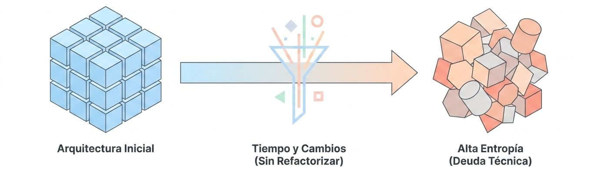
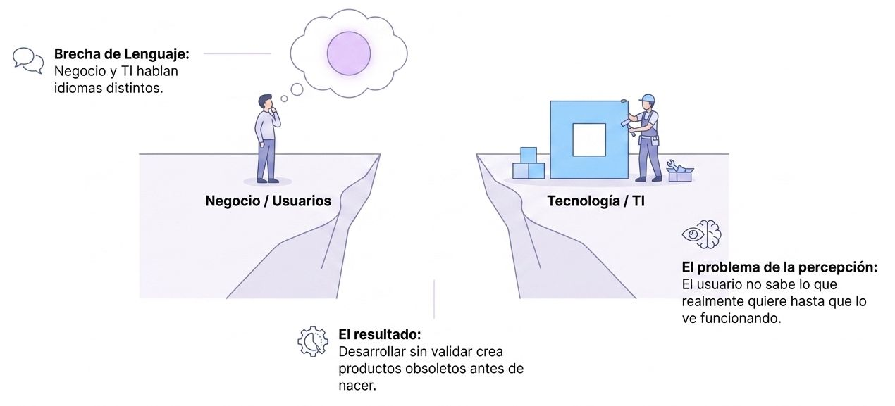
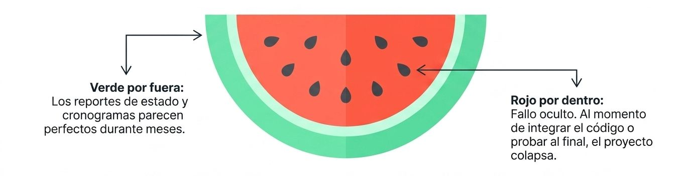
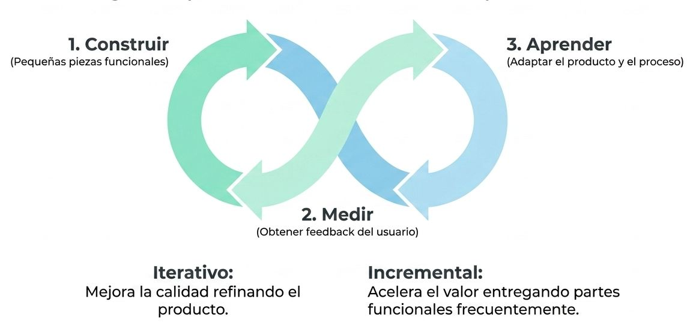

El fracaso de los proyectos de software no es un fenómeno fortuito ni puramente técnico; responde a dinámicas sistémicas predecibles que actúan sobre el software y los equipos de trabajo. Al analizarlo bajo la Teoría General de Sistemas, el colapso de un desarrollo informático se explica principalmente mediante dos grandes fuerzas: **la entropía** (la tendencia natural hacia la desorganización y la deuda técnica) y la **falta de retroalimentación** (la incapacidad de autorregulación del sistema ante un entorno cambiante).

<figure>

<figcaption>**La realidad de la industria**. 1 de cada 3 proyectos de software fracasa.</figcaption>
</figure>

A continuación se detalla la fundamentación de estas fallas basándose en la evidencia:

### I. La Dimensión de la Entropía
**Degradación y Deuda Técnica**

<figure>

<figcaption>**Entropía**. El caos natural del código.</figcaption>
</figure>

La **entropía** en el software describe cómo los sistemas cerrados o deficientemente gestionados tienden inevitablemente al desorden, la ineficiencia y la acumulación de errores. Si no se inyecta energía organizadora externa (**negentropía**) mediante refactorización, pruebas tempranas y diseño consistente, la estructura conceptual del software se colapsa.

<figure>

</figure>

*   **La Deuda Técnica como Manifestación Entrópica:** Cuando un equipo de desarrollo compromete la "Definición de Terminado" (*Definition of Done*) para cumplir con plazos de entrega arbitrarios, arrastra defectos y código mal estructurado. Esto acumula deuda técnica, haciendo que con cada iteración sea más difícil y costoso agregar nuevas características funcionales. De hecho, el mantenimiento de sistemas heredados devora entre el **50% y el 60%** de los presupuestos totales de procesamiento de datos de las organizaciones.

*   **La Tasa del 70% de Errores de Diseño:** La entropía se origina mucho antes de escribir la primera línea de código. Aproximadamente el **70% de los errores de software se deben a un diseño de software inapropiado**. Si no se mitigan estos errores lógicos en las etapas tempranas, la entropía se dispara exponencialmente hacia la etapa de pruebas.

*   **La Ineficiencia de la Multitarea:** El intento de la gerencia de combatir los retrasos asignando programadores de forma parcial a múltiples proyectos acelera la entropía organizativa. La **multitarea provoca pérdidas de productividad de entre el 20% y el 40%** debido al costo cognitivo del cambio de contexto. Este cambio constante de tareas consume memoria de trabajo, incrementa los errores lógicos de programación y destruye la cohesión del equipo.

### II. La Falta de Retroalimentación
**Homeostasis Fallida**

<figure>

<figcaption>**Falta de retroalimentación**. Construir en la oscuridad.</figcaption>
</figure>

Un sistema de información robusto debe actuar como un sistema abierto en **homeostasis** (equilibrio dinámico), ajustándose a las perturbaciones del entorno de negocio mediante lazos de retroalimentación constantes y cortos. El enfoque de desarrollo secuencial tradicional (en cascada) anula este mecanismo básico de control al retrasar la validación hasta el final del proyecto.

*   **El Principio de Incertidumbre de Humphrey:** Este principio dicta que **los requisitos para un nuevo sistema de software no se conocerán por completo sino hasta que los usuarios finales lo operen de forma real**. Intentar "congelar" especificaciones de requisitos por adelantado en papel es un mito ineficaz, ya que los requisitos cambian a tasas que oscilan entre el **25% en proyectos medianos y el 50% en proyectos grandes**.

*   **El Proceso de "Sí... Pero" y el Rechazo del Cliente:** Al no existir prototipos tempranos ni entregas incrementales para fines de retroalimentación, los usuarios no participan de forma continua. Al final del ciclo de vida en cascada, el cliente evalúa el producto terminado y exclama *"Sí, esto es lo que pedí en el contrato, pero ahora que lo uso, lo que realmente necesito es algo diferente"*. Este desfase semántico y operativo entre el diseño y la forma en que los usuarios conciben sus procesos de trabajo culmina en el rechazo total del sistema (*expectation failure*).

*   **El Lema de Wegner y la Imposibilidad del Test Completo:** El matemático Peter Wegner demostró que **es físicamente imposible especificar o probar de forma completa e de manera inequívoca un sistema interactivo diseñado para responder a entradas del entorno**. El desarrollo iterativo y las pruebas continuas son la única respuesta realista ante esta restricción matemática.

*   **La Curva Exponencial del Costo de Corrección de Defectos:** Retrasar la retroalimentación debido a un enfoque de pruebas tardío (al final del proyecto) incrementa dramáticamente el costo de remover errores de forma no lineal:
    *   Fase de Requisitos: **1x**
    *   Fase de Diseño: **3.5x**
    *   Fase de Codificación: **10x**
    *   Fase de Pruebas: **50x**
    *   **Después del Despliegue (Producción): ¡170x!**
    Descubrir fallas arquitectónicas graves en producción a menudo se vuelve insostenible financieramente, forzando la cancelación del sistema.

### III. Leyes Sistémicas y Patrones de Colapso Comunes
Cuando un proyecto de software entra en un estado crítico de entropía y retrasos, la dirección de proyectos tradicional suele aplicar decisiones reactivas que, por leyes de sistemas, aceleran el fracaso:

1.  **La Ley de Brooks y el Colapso por Compresión:** *"Agregar mano de obra a un proyecto de software retrasado lo retrasa aún más"*. La llegada de nuevos programadores resta tiempo productivo a los programadores senior (quienes deben capacitarlos) y aumenta de forma geométrica los canales de comunicación y la fricción, empeorando el retraso en lugar de resolverlo.

2.  **El "Proyecto Sandía" (Watermelon Project):** Debido a que la planificación predictiva rígida se basa en líneas de base teóricas y no en software funcional empírico, los reportes de progreso ocultan los problemas de integración física hasta las fases finales de pruebas. El proyecto se muestra con luz **"Verde" (saludable) por fuera en los informes de la gerencia, pero internamente está "Rojo" (crítico/colapsado) a pocas semanas de su supuesta liberación**.

<figure>

<figcaption>**El efecto sandía**. El 96% de los directivos "vuelan a ciegas" sin ver el estado real del proyecto en sus fases intermedias.</figcaption>
</figure>

3.  **La Ley de Parkinson y el Síndrome del Estudiante:** El trabajo se expande para llenar el tiempo disponible para completarlo. En entornos con plazos distantes o sin iteraciones con cajas de tiempo (*timeboxing*), el equipo pospone el esfuerzo de integración y resolución de problemas difíciles hasta el último minuto (Síndrome del estudiante), acumulando un enorme trabajo sin terminar (*WIP excesivo*) que detiene el flujo de entrega de valor.

Como demuestra la consultora *Standish Group*, aproximadamente el **31% de los proyectos de software tradicionales son cancelados antes de completarse**, y de los que se entregan, solo una fracción cumple con el presupuesto y alcance prometidos. La agilidad y la ingeniería de software moderna no se reducen a un conjunto de herramientas de programación; constituyen un mecanismo científico riguroso diseñado para estabilizar la entropía organizativa inyectando lazos de retroalimentación empíricos de forma continua y frecuente.

## **Efecto de la Multitarea**

Cómo influye la multitarea (multitasking) en el retraso de los proyectos de software:

### La Pérdida de Productividad 
**Pérdida exponencial (Costo de Cambio)**

Cuando los miembros de un equipo de desarrollo no están asignados al 100% de su capacidad a un solo proyecto, se ven obligados a saltar constantemente de un contexto a otro. Este fenómeno genera un coste oculto denominado **costo de cambio de contexto** (*task-switching cost*):

*   **La regla del 20% al 40%:** Las investigaciones documentadas demuestran que las personas experimentan una **pérdida directa de productividad de entre el 20% y el 40%** cada vez que cambian de tarea. 

*   **La ilusión del 50/50:** Cuando un especialista se asigna teóricamente en un 50% a un Proyecto A y en un 50% a un Proyecto B, en la práctica **no aporta un 50% de esfuerzo a ninguno**. Debido al desgaste cognitivo de cambiar de enfoque, su dedicación real efectiva en cada iniciativa cae a un rango de **entre el 20% y el 40%**. El resto del porcentaje se disipa por completo en fricción mental y logística de reorganización.

*   **Pérdidas acumuladas en la organización:** Si analizamos el impacto financiero, un recurso al que se le gestiona bajo el esquema tradicional de asignación compartida puede perder fácilmente la mitad de su salario anual en horas de nulo valor añadido.

### Incremento en la Tasa de Errores y Defectos

El cerebro humano no procesa múltiples flujos lógicos complejos de forma paralela y eficiente. Forzar al personal técnico a la multitarea incrementa directamente el riesgo técnico del proyecto:

*   **Agotamiento de la memoria de trabajo:** El intercambio constante de tareas consume rápidamente la memoria de trabajo de los desarrolladores. Esto provoca que las personas tengan serias dificultades para recordar el contexto técnico de la porción de código que estaban construyendo, aumentando drásticamente la probabilidad de introducir bugs e inconsistencias lógicas en el software.

*   **El círculo vicioso del retrabajo:** Al cometer más errores bajo presión de tiempo, se dispara la necesidad de realizar correcciones y pruebas adicionales tardías (*rework*). El retrabajo de mala calidad consume el tiempo restante de la iteración, retrasando aún más el cronograma y forzando al equipo a tomar más atajos de diseño (entropía).

### Destrucción del Flujo de Trabajo y Cuellos de Botella
Desde la perspectiva de la teoría de flujos (Lean y Kanban), la multitarea incrementa el **Trabajo en Progreso (WIP)**, lo que satura los canales y destruye la predictibilidad del equipo:

*   **Retrasos por dependencias y esperas:** Cuando los ingenieros saltan entre proyectos, los tiempos de ciclo de entrega se alargan porque los miembros del equipo deben esperar constantemente a que sus compañeros terminen "otros asuntos" para poder integrar o probar el código. El tiempo desperdiciado esperando por traspasos (*handoffs*) llega a devorar entre el **15% y el 25%** del tiempo productivo de un especialista.

*   **Pérdida de predictibilidad:** Al tener demasiadas tareas "comenzadas" pero pocas "terminadas", el equipo pierde la estabilidad en su velocidad de desarrollo, lo que anula cualquier capacidad de estimar o pronosticar fechas de entrega de forma consistente.

En conclusión, la multitarea es un mecanismo de optimización local ineficiente. Para contrarrestarla, la ingeniería de software moderna insiste en **limitar estrictamente el trabajo en progreso (WIP)**, mantener **miembros 100% dedicados** a un único equipo multidisciplinar y fomentar la colaboración estrecha (como la programación en pareja o el *swarming*) para forzar la finalización de tareas antes de iniciar nuevas actividades.

En lugar de predecir el futuro, nos adaptamos a él.

<figure>

<figcaption>**Antídoto a fallas**. Ciclos empíricos y ágiles.</figcaption>
</figure>

