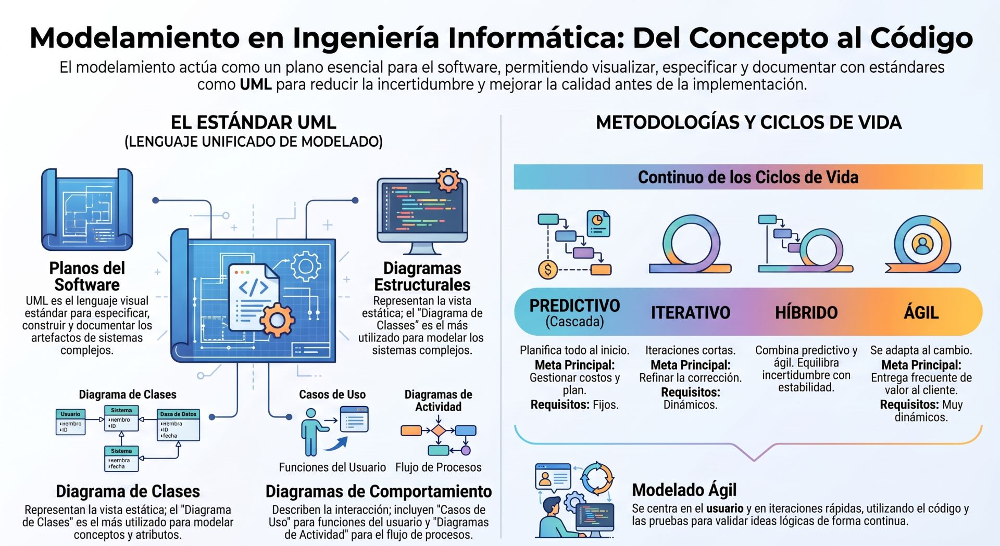

El **modelamiento (o modelado)** es una disciplina fundamental que actúa como puente entre los problemas del mundo real y las soluciones computacionales de software, hardware y procesos. Al mencionar "problemas del mundo real" asumiremos el conocimiento del concepto de sistema que describe la industria objeto del análisis.

:::info[Herramientas]
**UML:** para diagramar usaremos Umbrello: https://apps.kde.org/es/umbrello/

**BMPN:** para crear procesos de negocio usaremos Camunda: 
* version online: https://bpmn.io/
* version escritorio: 
:::

:::info[nota]
Abordaremos el concepto de "**Industria**" para toda institución pública o privada, independiente de su tamaño, y que puede ser objeto para desarrollar alguna solución basada en tecnologías de información. Esto abarca desde el negocio del barrio hasta la industria minera del norte de Chile.
:::




Para modelar, se necesita conocer 

El modelamiento se define, clasifica y justifica bajo los siguientes pilares detallados:


### Definiciones
*   **El Modelo:** Se define técnicamente no como una réplica exacta del sistema, sino como una **construcción selectiva e intencionada** diseñada para representar otro objeto o sistema real.
    > Un modelo es una **simplificación de la realidad**; destaca ciertos aspectos importantes e ignora otros detalles innecesarios (ruido) en función de un propósito específico. 
    
Por ello, un modelo no es intrínsecamente "correcto" o "incorrecto", sino más o menos útil para el punto de vista del observador.

*   **El Modelamiento:** Es el proceso de identificar los conceptos adecuados y seleccionar las abstracciones correctas para formalizar un sistema.
  > Combina ciencia, arte y creatividad para realizar una transición fluida desde las ideas abstractas hacia representaciones tangibles.


### Dimensiones y Clasificación del Modelamiento

El modelamiento se aborda desde distintas perspectivas según el objetivo del proyecto informático:

#### A. Según el Propósito Temporal: Descriptivo vs. Prescriptivo
*   **Modelos Descriptivos (Modelos "As-Is"):** Representan el sistema o negocio tal como funciona en la actualidad. Son de vital utilidad para realizar ingeniería inversa, documentar el estado de los procesos existentes y analizar dónde radican las ineficiencias o problemas de calidad antes de proponer cambios.

*   **Modelos Prescriptivos (Modelos "To-Be"):** Definen cómo *debe ser* un sistema que aún no ha sido construido. Es el enfoque clásico de la ingeniería hacia adelante (*forward engineering*), donde el modelo actúa como el plano maestro (*blueprint*) para la implementación física del software o sistema de información.

#### B. Según el Enfoque Metodológico de Diseño
*   **Modelado Orientado a Datos:** Visualiza el sistema como una colección de datos estructurados por atributos y clases. Su propósito es organizar los datos más que la funcionalidad del software (ej. el **Diagrama de Entidad-Relación** o los diagramas de clases UML enfocados en bases de datos).

*   **Modelado Orientado a Procesos:** Se centra en modelar el flujo de ejecución, las acciones y las transformaciones que sufren los datos conforme se mueven por el sistema (ej. el **Diagrama de Flujo de Datos (DFD)**, diagramas de actividad UML o notaciones como **BPMN**).

*   **Modelado Orientado a Objetos:** Satisface una perspectiva donde los procesos y los datos se combinan en unidades lógicas llamadas objetos (pertenecientes a clases), facilitando la reutilización y el mantenimiento continuo (ej. los **Diagramas de Clases de Diseño** en UML).

#### C. Según el Nivel de Abstracción en UML y el Proceso Unificado
Cuando se utiliza el Lenguaje Unificado de Modelado (UML), un mismo diagrama puede interpretarse bajo tres niveles de abstracción o perspectivas:
1.  **Perspectiva Esencial o Conceptual:** Describe las cosas y conceptos significativos del mundo real (el dominio del problema), completamente libre de decisiones tecnológicas (ej. el **Modelo del Dominio**).

2.  **Perspectiva de Especificación:** Describe componentes de software y abstracciones funcionales con sus interfaces, pero sin comprometerse con un lenguaje de programación específico.

3.  **Perspectiva de Implementación:** El diagrama detalla la construcción real del software bajo una tecnología y sintaxis específica (ej. un diagrama de clases de Java).


### Modelar (El Valor en la Ingeniería)

El modelamiento proporciona ventajas prácticas insustituibles en el ciclo de vida de los proyectos tecnológicos:

*   **Reducción del "Salto de la Representación" (Gap Semántico):** Una de las mayores virtudes de la tecnología de objetos es que permite al programador nombrar las clases de software inspirándose directamente en las clases conceptuales del mundo real. Si en el negocio existe el concepto de "Venta", el software tendrá una clase llamada `Venta`. Al mantener este salto semántico bajo, el código se vuelve mucho más predecible, rápido de comprender y natural de extender.

*   **Abstracción Visual para el Cerebro Humano:** Una porción muy importante del cerebro humano está dedicada al procesamiento visual. El uso de diagramas estandarizados (como los de UML o BPMN) permite razonar y diagnosticar el comportamiento de arquitecturas de software complejas a gran escala de forma mucho más eficiente que leyendo miles de líneas de texto o código.

*   **La Alineación Negocio-TI (Lenguaje Común):** Modelar mediante lenguajes estandarizados (como BPMN 2.0) rompe las barreras de comunicación tradicionales. Permite que un analista de negocio defina los flujos operativos con alta precisión conceptual y que, de forma simultánea, el desarrollador use el mismo plano para construir e integrar la solución técnica, logrando una responsabilidad compartida.

*   **Modelos Ejecutables y Desarrollo Dirigido por Modelos (MDD):** En la informática moderna, los modelos ya no son solo dibujos estáticos en un papel que luego se traducen manualmente a código con el riesgo de añadir errores. Bajo el enfoque del MDD o las plataformas BPMS modernas, **el modelo es lo que se ejecuta** (*WYMIWYR: What You Model Is What You Run*). El diagrama visual es interpretado y ejecutado directamente por un motor de procesos o de software.

*   **Simulación de Escenarios de Bajo Costo:** Construir y programar un sistema complejo es costoso y lento. Modelar permite simular digitalmente el comportamiento del sistema (como análisis "qué pasaría si...") para medir tiempos de ciclo, predecir cuellos de botella y optimizar la distribución de recursos antes de escribir una sola línea de código definitivo.

## **Caso de Estudio**

Ejemplo **caso de estudio práctico de modelamiento** para el flujo de compras de una plataforma de comercio electrónico (*e-commerce*). 

Este ilustra cómo se aplican los principios de análisis y diseño orientado a objetos (siguiendo la metodología de Craig Larman en *UML y Patrones*), conectando el mundo del negocio con el diseño de software para reducir el "salto de representación".


**Caso de Estudio: Flujo de Compras en "compras.com"**

El objetivo es modelar el proceso donde un usuario busca un producto, lo añade a su carro de compras y realiza el pago de manera segura.

### Parte 1: El Caso de Uso (Perspectiva de Negocio)
Un caso de uso es una descripción textual que detalla la secuencia de interacciones entre un actor y el sistema para lograr una meta específica.

#### Caso de Uso: UC1 - Procesar Compra
*   **Actor Primario:** Cliente Web.
*   **Precondiciones:** El catálogo de productos está en línea; el cliente ha iniciado sesión en el portal.
*   **Garantías de Éxito (Postcondiciones):** Se registra la venta en el sistema, se procesa el pago de forma segura, se descuenta el stock en bodega, se genera la orden de despacho y se envía un correo de confirmación al cliente.

**Escenario Principal de Éxito (Flujo Básico):**
1.  El **Cliente** examina el catálogo y selecciona un producto.
2.  El **Cliente** añade el producto a su carro de compras.
3.  El **Sistema** registra el artículo en el carro, actualiza el subtotal y se lo muestra al Cliente.
4.  El **Cliente** decide finalizar la compra e inicia el proceso de pago (*Checkout*).
5.  El **Sistema** calcula el total de la venta (incluyendo impuestos y costo de despacho) y solicita los datos de pago.
6.  El **Cliente** ingresa los datos de su tarjeta de crédito y confirma la transacción.
7.  El **Sistema** interactúa con la **Pasarela de Pago externa** para autorizar el cobro.
8.  El **Sistema** aprueba la venta, reduce el stock físico de los productos comprados, crea la orden de envío y muestra un mensaje de éxito en pantalla.

**Flujos Alternativos (Extensiones):**
*   **2a. El artículo seleccionado no tiene stock disponible:**
    1. El Sistema notifica al Cliente que no hay existencias.
    2. El Sistema sugiere productos alternativos o permite registrar una alerta de reposición.
*   **7a. La Pasarela de Pago rechaza la transacción (fondos insuficientes, tarjeta expirada, etc.):**
    1. El Sistema informa el motivo del rechazo.
    2. El Sistema devuelve al Cliente al paso de selección de método de pago para que lo intente nuevamente.


### Parte 2: El Diagrama de Secuencia de Diseño
Una vez que entendemos el flujo textual, pasamos al **modelamiento técnico**. Un diagrama de secuencia UML muestra la interacción de los objetos del software a lo largo del tiempo para cumplir con un flujo del caso de uso.

Aquí aplicamos los patrones de asignación de responsabilidades (como el **Patrón Controlador** e **Information Expert** de GRASP):

```text
  [Cliente (Actor)]             [:ControladorCompra]              [:CarroCompras]                [:Venta]              [:PasarelaPago]
          |                              |                              |                            |                        |
          |--- 1. agregarProducto() ---->|                              |                            |                        |
          |                              |--- 2. agregarItem(prod, cant)|                            |                        |
          |                              |----------------------------->|                            |                        |
          |                              |                              |-- 3. calcularSubtotal() -->|                        |
          |                              |<-- 4. subtotal actualizado---|                            |                        |
          |<-- 5. muestra subtotal ------|                              |                            |                        |
          |                              |                              |                            |                        |
          |--- 6. iniciarCheckout() ---->|                              |                            |                        |
          |                              |---------------------------------- 7. crearVenta(carro) -->|                        |
          |                              |                              |                            |                        |
          |                              |--------------------------------------------------------------- 8. autorizarPago() ->|
          |                              |                                                               | (tarjeta, total)       |
          |                              |                                                               |                        |
          |                              |<-------------------------------------------------------------- 9. pago exitoso --------|
          |                              |                              |                            |                        |
          |                              |---------------------------------- 10. confirmarVenta() -->|                        |
          |                              |                                                              |-- 11. rebajarStock()   |
          |<-- 12. compra exitosa -------|                              |                            |                        |
```

#### Explicación del diseño e interacciones:
1.  **El Controlador (`:ControladorCompra`):** Es el primer objeto dentro de la capa de software que recibe la operación del sistema desde la interfaz de usuario. No procesa la lógica de negocio por sí mismo; actúa como intermediario coordinando las peticiones.
2.  **Experto en Información (`:CarroCompras` y `:Venta`):** ¿Por qué el controlador le pide al Carro o a la Venta que calculen los montos? Porque, según el principio de diseño *Information Expert*, la responsabilidad de realizar un cálculo debe recaer sobre el objeto que posee la información necesaria para hacerlo. `Venta` conoce todos los productos y cantidades seleccionadas, por lo que es el objeto experto para calcular el total e impuestos.
3.  **Bajo Acoplamiento con Sistemas Externos (`:PasarelaPago`):** El sistema no se conecta directamente al banco. Utiliza un objeto adaptador local (`:PasarelaPago`) para comunicarse con la API de pago externa. Si el e-commerce decide cambiar de proveedor de pago en el futuro, solo se modificará el adaptador, protegiendo al resto de la arquitectura de software de sufrir modificaciones.


### Parte 3: El Modelo de Dominio
Para que el código sea fácil de mantener, las clases del software deben parecerse a los conceptos de la vida real. Esto es lo que Craig Larman define como "reducir el gap semántico". El modelo de dominio para este e-commerce se vería así:

*   Un **Cliente** posee un **Carro de Compras**.
*   Un **Carro de Compras** contiene una o más **Líneas de Detalle**.
*   Cada **Línea de Detalle** está asociada a un **Producto** específico y almacena la cantidad seleccionada.
*   Cuando se procesa el cobro, se genera una **Venta** (que hereda los elementos del carro) y se emite un **Comprobante de Pago** con los datos de la transacción.

Al diseñar el software usando exactamente estos mismos nombres de clases (`Cliente`, `CarroCompras`, `LineaDetalle`, `Producto`, `Venta`), cualquier desarrollador que lea el código por primera vez entenderá el sistema de inmediato, ya que el software habla el mismo lenguaje que el negocio.
