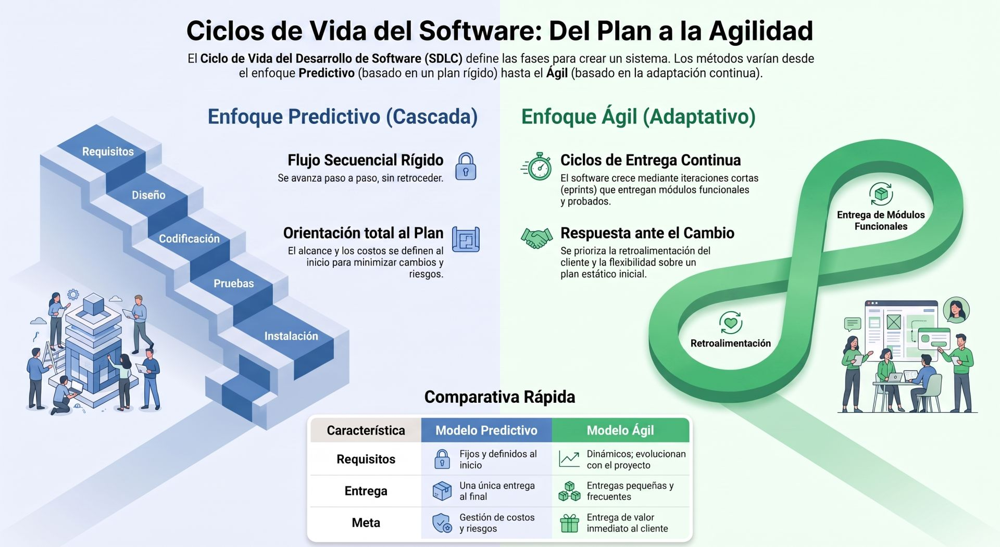
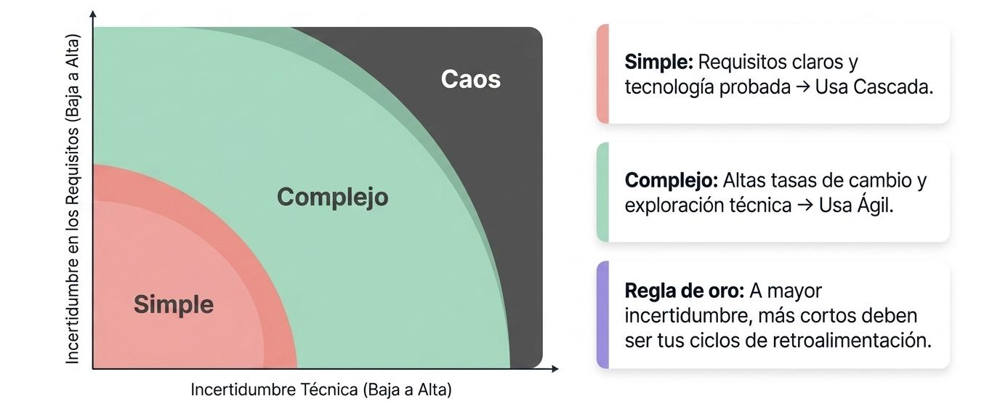
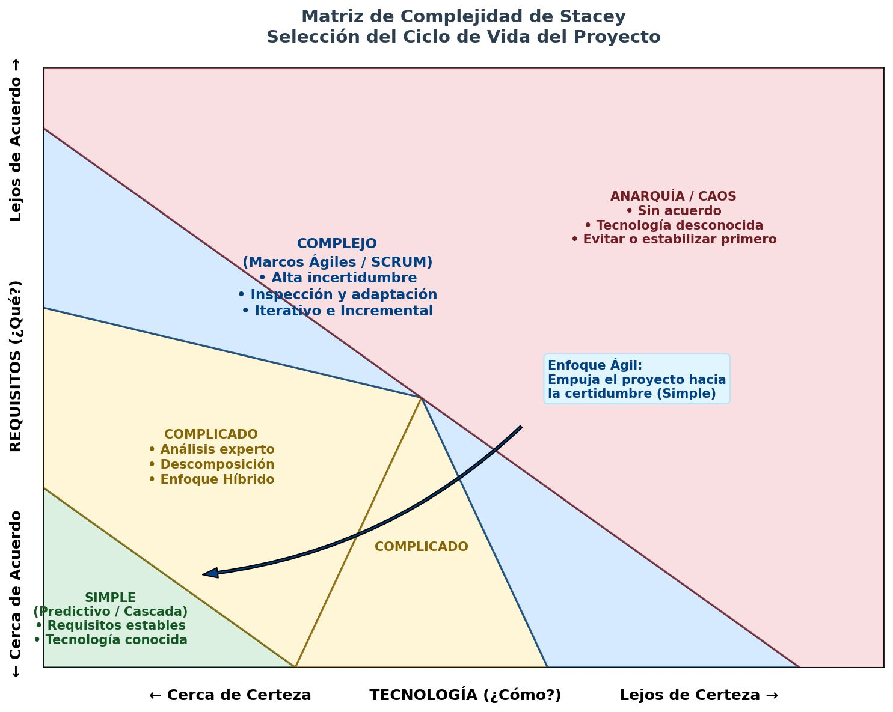

El **Ciclo de Vida del Desarrollo de Software (SDLC, por sus siglas en inglés)** o **Ciclo de Vida del Desarrollo de Sistemas** es un proceso metodológico estructurado que guía a una organización en la concepción, creación, despliegue y soporte continuo de un sistema de información. Su objetivo primordial es coordinar a las personas, los recursos técnicos y los procesos para entregar una solución de software que cumpla con los requisitos del cliente dentro del costo y tiempo planificados.

A lo largo del tiempo, la ingeniería informática ha estructurado este ciclo bajo dos grandes filosofías: el **enfoque predictivo tradicional (en cascada)** y el **enfoque adaptable (ágil)**. A continuación, se detalla cómo opera cada uno desde la idea inicial hasta el mantenimiento.

## El Ciclo de Vida Predictivo Tradicional (SDLC)
En este modelo, las fases se ejecutan de manera secuencial y estructurada, donde cada fase debe completarse y validarse formalmente antes de comenzar la siguiente. Este enfoque se divide comúnmente en **siete fases interrelacionadas**:

#### Identificación de Problemas, Oportunidades y Objetivos
Todo proyecto de software comienza con una necesidad o un problema de negocio. En esta fase inicial, el analista de sistemas trabaja con los patrocinadores y usuarios para delimitar el alcance del proyecto, proponer alternativas y evaluar la viabilidad técnica, económica y operativa de la solución. El resultado principal es un **informe de viabilidad** que define si el proyecto debe continuar o cancelarse para evitar inversiones arriesgadas por adelantado.

#### Determinación de los Requisitos de Información del Factor Humano
Consiste en recopilar minuciosamente las necesidades reales de los usuarios finales que interactuarán con la tecnología. Para esto, el analista utiliza técnicas de investigación social e informática, como entrevistas, cuestionarios, muestreo de datos y observación directa de las operaciones de la empresa. Un fallo en la captura temprana de requisitos es una de las causas más comunes de fracaso en los sistemas.

#### Análisis de las Necesidades del Sistema
Una vez recopilada la información, se procede a su modelamiento lógico para estructurar los datos y los flujos operativos. El analista emplea diagramas visuales para representar el sistema, tales como:
*   **Diagramas de Flujo de Datos (DFD):** Para modelar el movimiento físico y lógico de los datos a través del sistema.
*   **Casos de Uso y Escenarios:** Para describir formalmente las transacciones y el valor que el sistema entregará a los usuarios.
*   **Modelos de Entidad-Relación:** Para organizar la estructura de las bases de datos de la empresa.

#### Diseño del Sistema Recomendado
En esta fase se traduce el "qué hace" el sistema (análisis) en el "cómo lo hará" a nivel de software y hardware. El analista diseña las pantallas de la interfaz de usuario (páginas web, formularios), las entradas y salidas de datos (pantallas de captura, informes), las especificaciones de la base de datos y los controles lógicos y de seguridad (contraseñas, planes de catástrofes) que protegerán la integridad de la información.

#### Desarrollo y Documentación del Software
Las especificaciones del diseño se entregan al equipo de programación, quienes se encargan de codificar y depurar el software original a medida. En paralelo, el analista colabora con los desarrolladores y usuarios para redactar una **documentación técnica y de usuario robusta** (manuales de procedimientos, ayudas en línea, preguntas frecuentes), asegurando que el conocimiento del sistema no se pierda.

#### Prueba del Sistema (Verificación y Validación)
Antes de poner el software en producción, este debe someterse a pruebas rigurosas para detectar fallos. El plan de pruebas abarca tres niveles obligatorios:
*   **Pruebas Unitarias:** Realizadas por los programadores para verificar que cada bloque de código funcione correctamente de manera aislada.
*   **Pruebas de Sistema:** Conducidas por analistas y probadores para confirmar que todos los módulos integrados operen en armonía con datos de muestra y datos reales.
*   **Pruebas de Aceptación de Usuario (UAT):** Donde los clientes reales prueban el sistema en un entorno controlado para dar la aprobación final.

#### Implementación, Evaluación y Mantenimiento
Es el proceso de transición o conversión del sistema antiguo al nuevo. El equipo técnico capacita a los usuarios, migra las bases de datos y ejecuta una estrategia de conversión (como la conversión en paralelo o el corte directo). Una vez instalado, el sistema entra en la etapa de producción, donde es evaluado de forma continua para realizar auditorías posteriores y dar paso al mantenimiento.

## El Ciclo de Vida Adaptable (Desarrollo Ágil)

En entornos altamente dinámicos y de rápida evolución comercial, predefinir y congelar los requisitos al inicio del proyecto suele resultar inviable e ineficaz. El ciclo de vida ágil reemplaza las fases secuenciales de la cascada por un enfoque **iterativo e incremental**, donde las fases tradicionales de análisis, diseño, codificación y pruebas se realizan de forma simultánea dentro de pequeños bloques de tiempo fijos de 1 a 4 semanas (Sprints).

El ciclo de desarrollo ágil se divide en **cinco etapas dinámicas**:

1.  **Exploración:** El equipo explora el problema de negocio, selecciona la tecnología candidata, evalúa las habilidades del equipo y colabora con el cliente para escribir las primeras **historias de usuario**.

2.  **Planeación:** El equipo prioriza los requisitos en una lista de trabajo pendiente (*Product Backlog*) y genera un plan de entrega realista basado en estimaciones iniciales de esfuerzo.

3.  **Iteraciones para la Liberación:** Se ejecutan múltiples ciclos cortos de desarrollo. En cada iteración se toma una porción de las historias de usuario de mayor prioridad y se diseña, programa y prueba hasta entregar un incremento funcional potencialmente entregable al final del ciclo.

4.  **Puesta en Producción:** El incremento de software estable se libera para los usuarios. Las pruebas se agilizan para entregar valor continuamente.

5.  **Mantenimiento:** A medida que los usuarios reales operan con el software, envían sugerencias e identifican fallos. En lugar de tratar el mantenimiento como un proceso ajeno, en ágil este flujo se alimenta continuamente de vuelta a la etapa de planeación, creando un ciclo permanente de evolución y mejora continua.

---

## El Impacto Crítico del Mantenimiento y los Defectos
Un principio de sistemas fundamental del SDLC es que **el día de la instalación es solo el inicio de la vida operativa del software**.

*   **La Carga de Mantenimiento:** Los estudios estiman que el mantenimiento de sistemas existentes llega a consumir **hasta el 60% del tiempo total** de los recursos y presupuestos de un departamento de TI. Solo una pequeña fracción de este esfuerzo se dedica a corregir bugs de emergencia (20%); la gran mayoría (60%) se enfoca en añadir nuevas mejoras de usuario, adaptar el software a nuevas tecnologías y optimizar la eficiencia del código.

*   **La Regla de Oro del Costo de los Defectos:** Descubrir y corregir un error o mala comprensión de requisitos se vuelve no linealmente más caro a medida que avanza el ciclo de vida. De acuerdo con las investigaciones de Barry Boehm, si corregir un defecto en la fase de definición de requisitos cuesta **1x**, el costo aumenta a:
    *   **3.5x** en la etapa de diseño.
    *   **10x** durante la codificación.
    *   **50x** durante las fases de prueba.
    *   **¡170x!** una vez que el sistema se encuentra desplegado en producción.

Esta alarmante disparidad económica es la razón por la cual los analistas disciplinados dedican un esfuerzo considerable al modelado robusto y a la verificación continua de calidad desde las fases tempranas del ciclo, evitando que los errores de concepción inicial se transformen en desastres financieros al final del camino.

## Ciclo de Vida en Proyectos

La elección de un ciclo de vida para un proyecto no es una decisión de "talla única" ni responde a un estándar rígido. Seleccionar el enfoque adecuado (ya sea predictivo, iterativo, incremental, ágil o híbrido) es un paso crítico que depende de un balance riguroso entre la incertidumbre del proyecto, los riesgos técnicos, las prioridades de negocio y la cultura organizacional.

La selección del ciclo de vida se estructura bajo los siguientes criterios y herramientas de decisión:

### Las 4 Categorías Base de Ciclos de Vida
El equipo de proyecto debe comprender las características intrínsecas de cada enfoque para determinar cuál ofrece la mayor probabilidad de éxito :

*   **Ciclo de Vida Predictivo (Orientado al Plan o en Cascada):** Se utiliza cuando los **requisitos son fijos y conocidos de antemano**, la tecnología es probada y existe un bajo riesgo de cambios. El objetivo principal es **gestionar los costos** mediante una planificación detallada por adelantado y una ejecución en serie (analizar, diseñar, construir, probar, entregar).

*   **Ciclo de Vida Iterativo:** Se prioriza cuando la complejidad es muy alta y el alcance está sujeto a constantes modificaciones de diseño. Se basa en la creación de **prototipos sucesivos** para obtener retroalimentación. Su meta es la **corrección de la solución** (aprender mediante el ensayo y error), aunque esto pueda tomar más tiempo.

*   **Ciclo de Vida Incremental:** Está optimizado para la **velocidad de entrega**. Se elige cuando el cliente o el negocio no pueden esperar a que todo esté terminado y prefieren recibir de forma frecuente subconjuntos funcionales o partes operativas del producto que puedan utilizar de inmediato.

*   **Ciclo de Vida Ágil (Adaptable):** Combina el enfoque **iterativo** (para refinar el producto con retroalimentación continua) y el **incremental** (para entregar pequeñas partes de valor con alta frecuencia). Se selecciona para proyectos con requisitos dinámicos, alta incertidumbre o tecnologías novedosas.

### Criterios Clave para la Toma de Decisión

#### A. El Grado de Incertidumbre y Complejidad (Modelo Stacey)

El modelo de complejidad ayuda a clasificar el proyecto evaluando dos variables fundamentales ``:
1.  **Incertidumbre en los Requisitos:** Qué tan claro tiene el cliente lo que quiere solucionar.
2.  **Incertidumbre en la Tecnología:** Qué tan familiarizado está el equipo con las herramientas y la viabilidad técnica para construir la solución.

*   **Zona Simple (Baja incertidumbre en ambos ejes):** Se elige un enfoque **predictivo**.
*   **Zona Compleja (Incertidumbre moderada a alta):** Se eligen enfoques **iterativos, incrementales o ágiles** para explorar la viabilidad en ciclos cortos y reducir el retrabajo a bajo costo.
*   **Zona Caótica (Extrema incertidumbre en ambos ejes):** El proyecto es inviable de forma ágil o predictiva hasta que se logre acotar o estabilizar una de las variables.

#### B. Factores del Cliente, el Proyecto y la Organización
Según el análisis de la metodología *Scrum Manager*, se deben evaluar tres dimensiones críticas:

1.  **El Cliente (Prioridad de Negocio):** 
    *   Si la prioridad máxima es la **previsibilidad** (cumplir con una fecha y presupuesto exactos e inamovibles, por ejemplo, para una licitación pública), se elige un ciclo **predictivo**.
    *   Si la prioridad es el **valor innovador** y la adaptabilidad ante un mercado muy dinámico, se prefiere un ciclo **adaptable/ágil**.

2.  **El Proyecto (Atributos Técnicos):**
    *   **Criticidad del Sistema:** Proyectos donde un fallo pone en riesgo la vida humana, la seguridad o grandes sumas financieras (como sistemas de vuelo de aeronaves o fármacos) requieren un rigor adicional de cumplimiento y validación técnica que suele inclinar la balanza hacia enfoques predictivos o híbridos con capas de control formal.
    *   **Costo del Prototipado:** Si construir un prototipo para interactuar con él es barato (como el software o plataformas web), el enfoque adaptable se ve sumamente favorecido.

3.  **La Organización Suministradora (Cultura y Equipo):**
    *   Los entornos predictivos están altamente optimizados para la estandarización y ejecución basada en **procesos estables**.
    *   Los entornos ágiles dependen fuertemente de la autoorganización y el talento de las **personas** en equipos multidisciplinarios pequeños.

### Filtros de Idoneidad (La Gráfica de Radar)

La *Guía Práctica de Ágil* propone una herramienta formal de diagnóstico en grupo consistente en un cuestionario para evaluar la preparación de un proyecto mediante **tres grandes categorías**:

*   **Cultura:** Nivel de confianza mutua en el equipo, aceptación del enfoque por parte de la gerencia y empoderamiento para la toma de decisiones locales.

*   **Equipo:** Tamaño del equipo de desarrollo, nivel de experiencia y facilidad de acceso cotidiano a los representantes de negocio o clientes para obtener respuestas rápidas.

*   **Proyecto:** Tasa de cambios esperada, criticidad del producto y viabilidad de realizar entregas incrementales funcionales a lo largo del tiempo.

Al puntuar estos atributos del 1 al 10 y trazar los resultados en una gráfica de radar:
*   Si los puntos se agrupan en el **centro**, se elige un enfoque **ágil** .
*   Si los puntos se sitúan en la **periferia**, se opta por un enfoque **predictivo** .
*   Si los puntos quedan en la **zona media**, un enfoque **híbrido** es el más adecuado .

### Ciclos de Vida Híbridos
En la realidad de las organizaciones, los extremos puros no siempre son la mejor solución. Un **enfoque híbrido** combina de manera coordinada distintas metodologías para mitigar riesgos específicos:

*   **Desarrollo Ágil seguido de Despliegue Predictivo:** Muy común al desarrollar un nuevo producto de alta tecnología (donde hay gran incertidumbre en el software) que luego debe ser desplegado y capacitado de forma predecible y estandarizada a miles de usuarios.

*   **Enfoque Predominantemente Predictivo con Componentes Ágiles:** Se utiliza cuando la mayor parte de la obra o instalación física es predecible y rutinaria, pero se introduce un nuevo material o tecnología (un componente incierto) que se maneja de forma ágil mediante ensayos a pequeña escala y experimentación rápida.

---

## **EL Modelo de Complejidad Stacey**

El **Modelo de Complejidad de Stacey** (también conocido como la *Matriz de Stacey*) es un marco conceptual diseñado originalmente por el Dr. Ralph Stacey, profesor de gestión en la Universidad de Hertfordshire. En el ámbito de la ingeniería de sistemas y la gestión de proyectos de software, este modelo se ha convertido en una herramienta fundamental para diagnosticar el nivel de incertidumbre de una iniciativa y, con base en ello, elegir el ciclo de vida más adecuado.

### Las Dos Dimensiones del Modelo
El modelo evalúa la complejidad de un proyecto cruzando dos ejes esenciales:

1.  **Eje Y - Grado de Acuerdo sobre los Requisitos (Incertidumbre en Requisitos):** Mide qué tan claro o consensuado está lo que se quiere construir. En la base hay un **alto acuerdo** (los usuarios y patrocinadores saben con precisión qué necesitan); en el extremo superior hay un **bajo acuerdo** o **alta incertidumbre** (requisitos ambiguos, altamente cambiantes o en conflicto).

2.  **Eje X - Grado de Certeza Tecnológica (Incertidumbre Técnica):** Evalúa la viabilidad y el conocimiento sobre el cómo construir la solución. En el extremo izquierdo hay una **alta certeza** (tecnología conocida y probada por el equipo); en el extremo derecho hay una **baja certeza** o **alta incertidumbre** (herramientas experimentales, integraciones complejas o tecnologías nunca antes utilizadas).

### Las Cuatro Zonas de Complejidad
Dependiendo de dónde se sitúe un proyecto al cruzar estas dos variables, se clasifica en una de las siguientes zonas:

*   **Zona Simple (o Sencilla):** Es el área cercana al origen, donde hay un alto acuerdo en los requisitos y alta certeza técnica. Al haber un nivel muy bajo de incertidumbre, las sorpresas son improbables y los cambios son mínimos. En esta zona, **los enfoques predictivos y lineales (en cascada) funcionan óptimamente**, ya que permiten planificar detalladamente por adelantado con gran precisión.

*   **Zona Complicada:** Se sitúa en la zona media de la matriz. Aquí, aunque hay incertidumbre moderada (ya sea porque la tecnología es nueva o porque los requisitos requieren análisis), el problema se puede resolver mediante el análisis experto, la descomposición del sistema en partes más pequeñas o la simulación.

*   **Zona Compleja:** Se caracteriza por una alta incertidumbre tanto en el *qué* (requisitos) como en el *cómo* (tecnología). En este entorno es costoso e inviable planificar a largo plazo porque las sorpresas y el retrabajo son constantes. **Los enfoques adaptativos y ágiles (como Scrum) son idóneos aquí**. Scrum aborda esta complejidad dividiendo el trabajo en bloques de tiempo cortos (Sprints) y forzando la priorización del Backlog; de esta forma, el equipo va entregando valor incrementalmente y "empuja" el proyecto hacia la zona simple ciclo tras ciclo.

*   **Zona Caótica (Anarquía):** Es el extremo más alejado de la certeza y del acuerdo. Es un terreno **fundamentalmente riesgoso** donde no hay suficiente claridad para tomar decisiones racionales o planificar. Los proyectos deben evitar entrar en la anarquía, estabilizando primero los requisitos o madurando la tecnología antes de intentar construirlos.

### Un Detalle Histórico Fascinante: ¿Por qué Stacey retiró su Matriz?
A pesar de su gran popularidad en el mundo ágil, **el propio Dr. Ralph Stacey dejó de publicar la matriz** a partir de las ediciones más recientes de su libro. 

El autor tomó esta decisión debido a que la comunidad de gestión tendió a **simplificar excesivamente su uso**. Muchas organizaciones la utilizaban de manera mecanicista, creyendo que el éxito de un proyecto dependía únicamente de "clasificarlo en una caja" y "elegir una metodología de un menú" (como quien elige sus calcetines por la mañana) para que la magia del proceso solucionara todo de forma automatizada.

Stacey argumentó que las empresas no son sistemas cerrados ni mecanismos matemáticos, sino **procesos dinámicos y receptivos de interacción humana**. El éxito real no radica en el marco metodológico en sí, sino en las conversaciones, los patrones de relación, las negociaciones de poder y las decisiones que las personas toman cotidianamente. Scrum o cualquier otra metodología no arreglan los problemas de los proyectos; únicamente actúan como un espejo que expone dónde residen las ineficiencias del sistema para que las personas puedan resolverlas.

He diseñado y publicado el gráfico de la **Matriz de Complejidad de Stacey** (`matriz_stacey.png`) directamente en tu panel de **Studio** para que dispongas de una referencia visual clara y sumamente didáctica.

Este gráfico conceptualiza de forma elegante cómo la interacción entre la incertidumbre técnica y de requisitos define la naturaleza de un proyecto, ilustrando además la ruta en la que los marcos ágiles operan para estabilizar iniciativas complejas.

### ¿Cómo leer el gráfico de la Matriz de Stacey generado?

1.  **Eje Vertical (Requisitos - El "Qué"):** Se desplaza verticalmente desde el **Alto Acuerdo** (en la base, donde el cliente tiene total claridad y estabilidad sobre lo que quiere) hacia el **Bajo Acuerdo / Lejos de Acuerdo** (en la parte superior, caracterizado por requisitos ambiguos o altamente cambiantes).
2.  **Eje Horizontal (Tecnología - El "Cómo"):** Se desplaza horizontalmente desde la **Alta Certeza** (en la izquierda, con tecnología y herramientas completamente conocidas y probadas por el equipo) hacia la **Baja Certeza / Lejos de Certeza** (en la derecha, con herramientas experimentales, integraciones complejas o arquitecturas de software inéditas).
3.  **Las Zonas de Diagnóstico:**
    *   **Simple (Verde - Abajo a la izquierda):** El territorio idóneo para el **Ciclo de Vida Predictivo (en Cascada)**. Al no haber sorpresas, planificar de forma secuencial y rígida maximiza la eficiencia.
    *   **Complicado (Amarillo - Franja media):** Espacio donde conviven problemas que el análisis experto y la descomposición del sistema pueden resolver. Aquí suelen brillar los **Enfoques Híbridos**.
    *   **Complejo (Azul - Zona diagonal superior):** El ecosistema natural de **Scrum y marcos ágiles**. Al no tener certeza del camino ni del destino final, la planificación exhaustiva por adelantado fracasa.
    *   **Anarquía / Caos (Rojo - Arriba a la derecha):** Una zona de altísimo riesgo que debe evitarse o estabilizarse antes de intentar cualquier construcción formal.

### La Ruta de Scrum (La flecha del gráfico)
Un detalle clave que he incorporado en el gráfico es la **curva de transición de Scrum**. En lugar de dejar un proyecto a la deriva en la zona de alta incertidumbre, el enfoque ágil utiliza iteraciones cortas (Sprints) de inspección y adaptación. A través de este ciclo iterativo y de la entrega de incrementos de valor, el equipo captura retroalimentación constante del cliente y domina la tecnología paso a paso, **empujando de forma progresiva el proyecto desde la complejidad hacia la certidumbre (la zona Simple)**.

