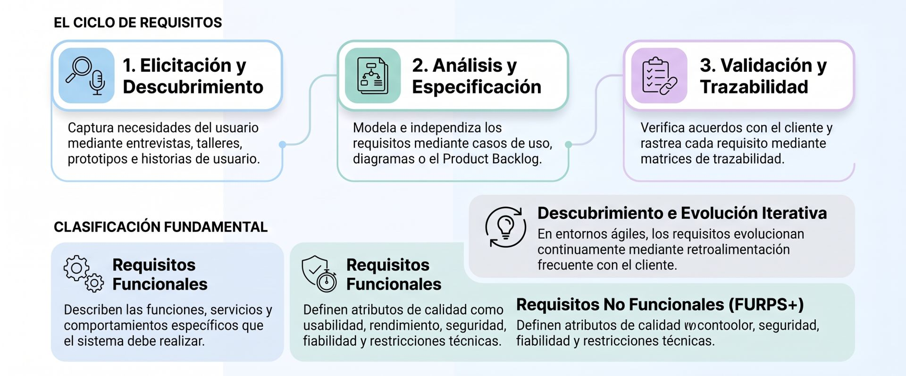

La **Ingeniería de Requisitos** es un proceso sistemático e interdisciplinario que consiste en descubrir, analizar, documentar, priorizar, comunicar, verificar y gestionar las necesidades y condiciones que debe cumplir un producto o sistema de software para responder a los objetivos estratégicos del negocio y de los interesados. 

Dentro del ciclo de vida del desarrollo, actúa como el puente fundamental entre el problema del cliente y la solución técnica. Su relación con los conceptos clave mencionados se estructura de la siguiente manera:

### 1. Requisitos Funcionales vs. No Funcionales
* **Requisitos Funcionales (RF):** Definen las capacidades, comportamientos o servicios específicos que el sistema debe ejecutar (el **qué** hace el sistema). *Ejemplo:* El sistema debe permitir autorizar cobros con tarjeta de crédito.
* **Requisitos No Funcionales (NFR) / Atributos de Calidad:** Especifican las cualidades, restricciones o condiciones bajo las cuales el sistema debe operar (el **cómo** lo hace). Frecuentemente se clasifican bajo el modelo **FURPS+**: Usabilidad (*Usability*), Fiabilidad (*Reliability*), Rendimiento (*Performance*), Mantenibilidad/Soporte (*Supportability*) y restricciones de implementación o legales. *Ejemplo:* El tiempo de respuesta del servidor no debe superar los 2 segundos ante 5,000 usuarios concurrentes.

### 2. Historias de Usuario (*User Stories*)
* Son descripciones breves y sencillas de una funcionalidad deseada, redactadas desde la perspectiva del usuario final para capturar el valor de negocio que se busca entregar.
* En metodologías ágiles y marcos como Scrum, sustituyen las listas tradicionales de especificaciones extensas por un **Product Backlog** dinámico y vivo, sirviendo como un compromiso de diálogo continuo entre el equipo de desarrollo y el dueño del producto (*Product Owner*).

### 3. Criterios de Aceptación (*Acceptance Criteria*)
* Son las condiciones, reglas o pruebas específicas que una historia de usuario o requisito debe cumplir para ser validado y considerado "terminado" (*Definition of Done*) por el cliente o el negocio.
* Guían el desarrollo guiado por pruebas de aceptación (ATDD / BDD) y garantizan que el software entregado satisfaga de forma verificable el comportamiento esperado.

### 4. Reglas de Negocio (*Business Rules*)
* Son las políticas, fórmulas, procedimientos o restricciones organizacionales y legales que rigen el funcionamiento de la empresa.
* No son requisitos de software en sí mismas, pero **condicionan y restringen** directamente los requisitos del sistema. *Ejemplo:* Una norma corporativa que exige un 20% de descuento a empleados condiciona la lógica del requisito de cálculo de ventas.

### 5. Priorización
* Es la actividad de evaluar y ordenar los requisitos o historias de usuario según su valor para el cliente, impacto en el negocio, urgencia o riesgo técnico.
* En ciclos de vida iterativos, permite al *Product Owner* seleccionar en cada iteración los elementos de mayor valor para construir incrementos funcionales tempranos. Se utilizan técnicas como la votación multicriterio, análisis costo-beneficio o dinámicas de grupo (*dot voting*).

### 6. Ambigüedad y Consistencia
* **Ambigüedad:** Ocurre cuando un requisito no está claramente expresado y permite múltiples interpretaciones, siendo una de las principales fuentes de errores, desviaciones presupuestarias y retrabajos en los proyectos.
* **Consistencia:** Exige que los requisitos no entren en conflicto entre sí ni con las restricciones arquitectónicas o legales del proyecto.
* La Ingeniería de Requisitos utiliza herramientas como la **matriz de trazabilidad**, glosarios de términos y especificaciones claras para asegurar que los requisitos sean unívocos, medibles, testeables y coherentes de extremo a extremo.

