import YouTubeVideo from '@site/src/components/YouTubeVideo';

## **DFD**

Un **Diagrama de Flujo de Datos (DFD)** es una herramienta gráfica de análisis estructurado que se utiliza para **representar de manera lógica el movimiento, la transformación y el almacenamiento de los datos** a través de los componentes de un sistema de información. Su gran ventaja es que ofrece una descripción visual clara que facilita la comunicación entre usuarios y analistas, permitiendo comprender detalladamente cómo interactúan los subsistemas antes de comprometerse con decisiones tecnológicas de desarrollo.

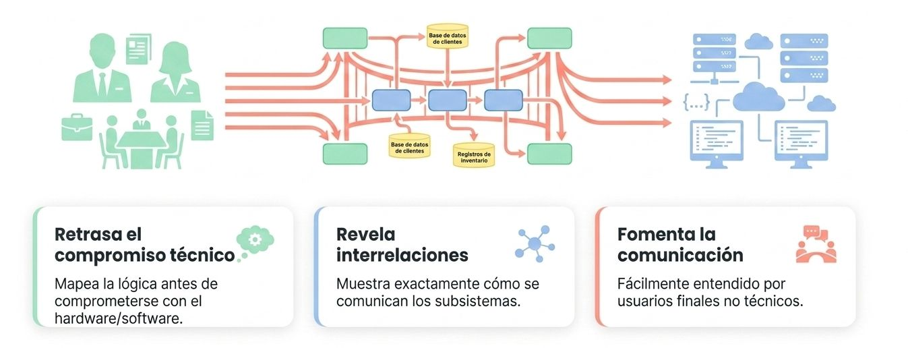

Sin jerga técnica, revelan qué pasa con la información antes de definir cómo se construye.

**Razones para el uso de DFD**

**Libertad Técnica:** Retrasa compromisos tanto como hardware o software en el diseño en una etapa temprana.

**Comunicación:** Es un lenguaje universal y no técnico para validar procesos con los usuarios.

**Interrelación:** Demuestra cómo lso distintos subsistemas y departamentos se conectan.

**Análisis diagnóstico:** Resalta datos faltantes, redundancia o callejones sin salida lógicos.

### Los Cuatro Símbolos Básicos del DFD
Para documentar visualmente el flujo de información, la metodología emplea combinaciones de únicamente **cuatro símbolos básicos**:

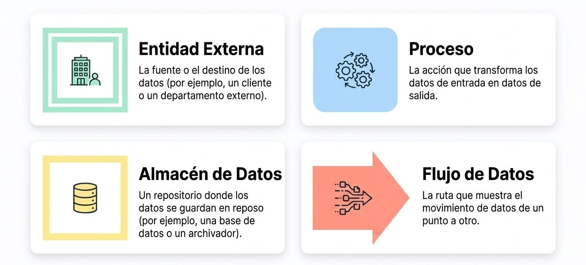

*   **Entidad Externa (Cuadrado doble o cuadrado con bordes sombreados):** Representa cualquier persona, departamento, organización u otro sistema que suministra o recibe información, pero que se encuentra **fuera del alcance y control del sistema** actual. Se denominan estrictamente con sustantivos (ej. *Cliente*, *Mainframe*).
    * Siempre son externas al sistema.
    * Deben nombrarse con sustantivo (ej. estudiante).
    * Establecen límites de lo que el sistema puede controlar.

*   **Proceso de Transformación (Rectángulo con esquinas redondeadas):** Representa el trabajo físico o lógico que realiza el sistema para transformar las entradas en salidas. Al implicar un cambio o acción en los datos, siempre debe etiquetarse usando el formato **verbo-sustantivo-adjetivo** (ej. *Calcular sueldo neto*) y asignársele un número de identificación único.
    * Son los motores de transformación.
    * Deben nombrarse con verbo-adjetivo-sustantivo (ej. Calcular Pago Neto).
    * Deben tener al menos una entrada y una salida única.

*   **Flujo de Datos (Flecha):** Describe el movimiento de información de un componente a otro, con la punta de la flecha indicando el destino de los datos. Se identifica mediante un sustantivo descriptivo (ej. *Solicitud de viaje*).
    * Datos en movimiento continuo.
    * Nombrados con un sustantivo que representa la información.
    * Los flujos simultáneos se representan con flechas paralelas.

*   **Almacén de Datos (Rectángulo con extremo derecho abierto):** Indica un depósito estático donde el sistema guarda o recupera información. Puede representar un archivo físico manual (como un archivador), una base de datos relacional o una tabla del sistema. Se numera de forma exclusiva (ej. *D1, D2*) y se etiqueta con un sustantivo.
    * Datos en reposo. No pueden mover datos por sí solos.
    * Nombrados con un sustantivo (ej. Archivo maestro).
    * No distinguen entre una base de datos o una carpeta física.

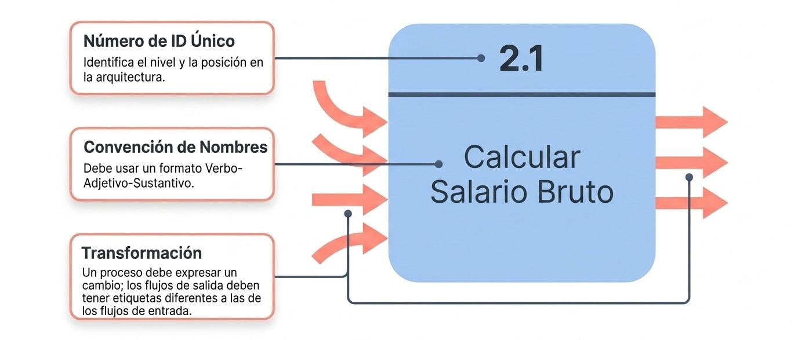

### Reglas de Oro para Construir un DFD
Para garantizar que el diagrama sea sintácticamente correcto, los analistas deben seguir reglas de diseño que impiden inconsistencias lógicas:

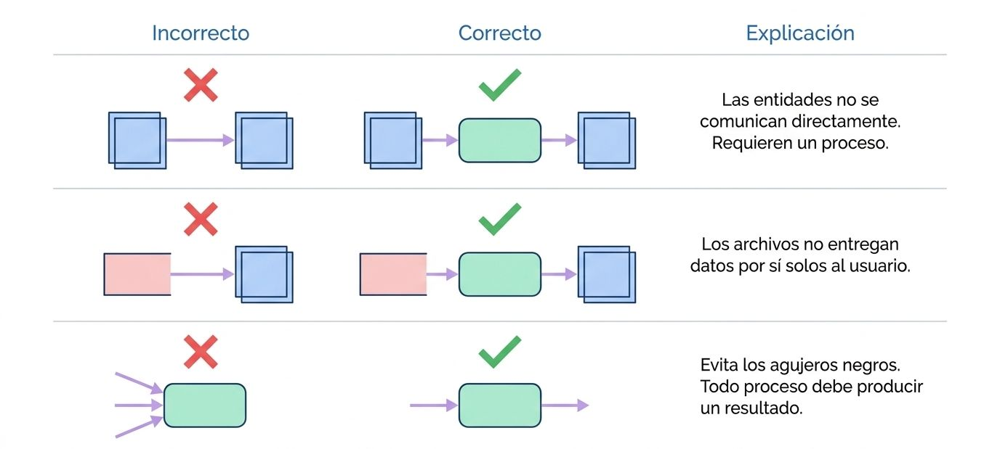

1.  **Debe haber al menos un proceso** en el diagrama; no pueden existir objetos flotantes o aislados.
2.  **Todo proceso debe cambiar los datos:** Por lo tanto, un proceso debe tener obligatoriamente por lo menos un flujo de datos entrante (entrada) y crear al menos un flujo de datos saliente (salida). Un proceso que solo recibe entradas o solo emite salidas es un error lógico grave.
3.  **Un almacén de datos no puede comunicarse directamente con otro almacén ni con una entidad externa;** siempre debe estar conectado de por medio a un proceso de transformación que interactúe con los datos.
4.  **Las entidades externas no se conectan directamente entre sí** dentro de los límites del sistema.

### Jerarquía 
**Niveles de Descomposición (Enfoque Arriba-Abajo)**

Los DFD se modelan mediante una metodología descendente (*top-down*) que avanza de lo general a lo específico, permitiendo agregar detalle sin abarrotar un único plano visual. Se construyen en capas. Comienza con una vista macroscópica de todo el sistema y progresivamente haces zoom en procesos individuales para revelar su lógica interna sin abrumar al lector del diagrama.

  

    

    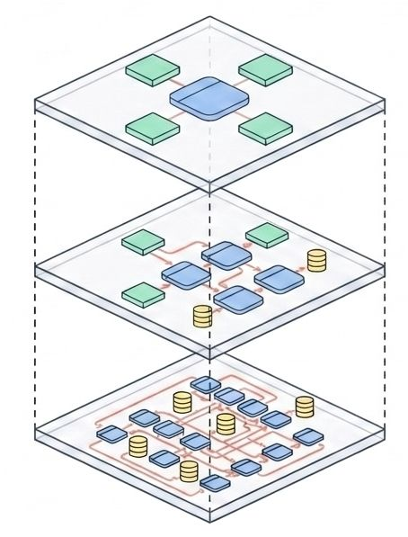

    

    

**Diagrama de Contexto (Nivel 0):** Es el plano de más alto nivel y representa la conceptualización más amplia del alcance. Contiene **un único proceso central** (marcado con el número 0) que representa a todo el sistema completo. Muestra exclusivamente las entidades externas y sus entradas y salidas principales, omitiendo almacenes de datos o subprocesos internos.

**Diagrama 0 (Siguiente nivel):** Es la expansión directa del proceso del diagrama de contexto. Puede contener de **tres a nueve procesos generales** que detallan el núcleo del sistema, e introduce por primera vez los almacenes de datos maestros principales y las interconexiones internas.

**Diagramas Hijos (Detalle profundo):** Cada proceso complejo del Diagrama 0 (llamado "proceso padre") se puede abrir de forma recursiva en un "diagrama hijo" que detalla su lógica interna en subprocesos (ej. subprocesos *1.1*, *1.2*).

    

  

    *   **Regla del Balanceo Vertical:** Establece que un diagrama hijo **debe mantener estrictamente las mismas entradas y salidas** que su proceso padre. Si el padre tiene un flujo de datos de interfaz entrante, el hijo debe reflejarlo exactamente para no romper la consistencia del diseño.

**Diagrama de contexto**

Acá se establecen las fronteras. En una vista de helicóptero. Contiene un solo proeso que representa el sistema entero. 
:::danger[Regla clave]
No se incluyen almacenes de datos en el nivel de contexto.
:::

<figure>
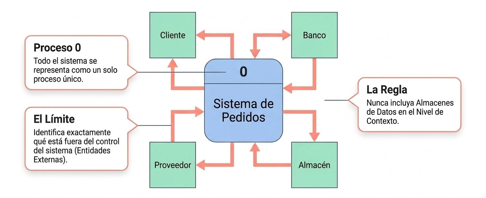
<figcaption>**Diagrama de contexto**. Vista general del proceso.</figcaption>
</figure>

**Diagrama vista 0**

Acá se abre la caja negra. Se explota el proceso 0 en sus subprocesos principales e introducimos los almacenes de datos mayores o principales.
:::danger[Regla clave]
Nunca exceder de 9 procesos en un solo diagrama para poder mantener la legibilidad.
:::

  

    

    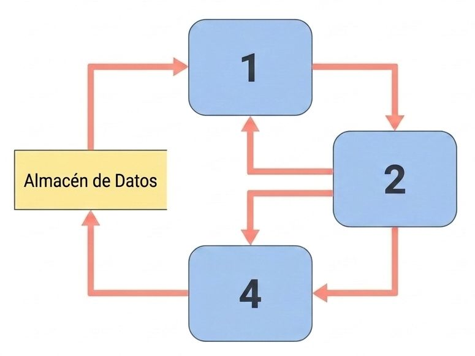
    

    

    **Subsistemas**

    Desgosa el proceso de contexto único en hasta 9 funciones pincipales.

    **Almacenamiento**

    Los almacenes de datos aparecen aquí por primera vez para mostrar cómo los sistemas principales comparten datos en reposo.

    **Límite de claridad**

    Nunca incluyas más de 9 procesos para evitar el desorden visual.
    

  

**Diagramas hijos**

Estos diagramas se expanden desde el diagrama padre (0) y se mantiene el balanceo vertical.

  

    

    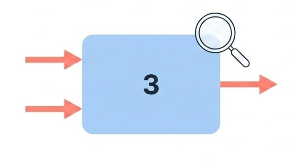
    

    

    **Equilibrio de interfaces**

    Los flujos de datos que entran y salen del diagrama hijo deben coincidir perfectamente con el proceso padre.

    

    

    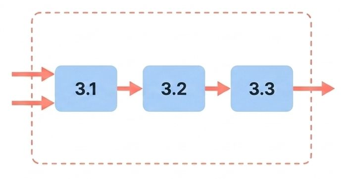
    

    

    **Primitivas funcionales**

    Los procesos se expanden hasta alcanzar su lógica más básica e indivisible (no se necesita una mayor expansión).

    

  

:::danger[Regla clave]
Un diagrama hijo no puede recibir entradas ni generar salidas que no estuvieran en su proceso padre.
:::

### DFD Lógicos vs. DFD Físicos
Los analistas de sistemas diferencian y combinan dos perspectivas de modelado a lo largo del ciclo de vida del software (SDLC):

*   **DFD Lógico:** Muestra **cómo opera el negocio** en su nivel conceptual esencial. Se centra en las actividades empresariales que deben ocurrir sin importar la tecnología utilizada. No distingue entre tareas manuales o automatizadas, ni especifica marcas de servidores o plataformas de bases de datos. Esto lo hace altamente estable frente a cambios tecnológicos.

*   **DFD Físico:** Representa **cómo se implementará físicamente el sistema** recomendado. Identifica qué procesos realizarán los humanos (manuales) y cuáles las computadoras, detalla los nombres reales de los archivos y tablas de base de datos, introduce almacenes de datos de transición temporales (como archivos de transacciones o el carrito de compras) y añade controles de validación y de seguridad.

| DFD Lógico | DFD Físico |
| :---- | :---- |
| Operaciones y eventos de negocio | Hardware, software y personas |
| Actividades puras del negocio | Programas de software o tareas manuales específicas |
| Colecciones lógicas de datos | bases de datos reales, archivos temporales y carpetas físicas |
| Transformación conceptual de los datos | Operaciones CRUD (Crear, leer, actualizar, borrar) |

**Modelado de eventos:**

**Paso 1: El disparador**

La entrada que inicia una actividad (ej. Cliente envía formulario web).

**Paso 2: La actividad**

La accón del sistema. Diferencia entre elementos base (datos introducidos manualmente) y elementos derivados (datos calculados por el sistema).

**Paso 3: La respuesta**

La salida enviada de vuelta a una entidad o almacén de datos.

#### Particionamiento en el Diseño Físico
Al finalizar el DFD físico, el analista realiza un proceso de **particionamiento**, dibujando líneas punteadas alrededor de ciertos procesos para indicar cómo se agruparán o dividirán en programas individuales de computadora, módulos o tareas manuales para facilitar la programación final y la seguridad de la red.

  

    

    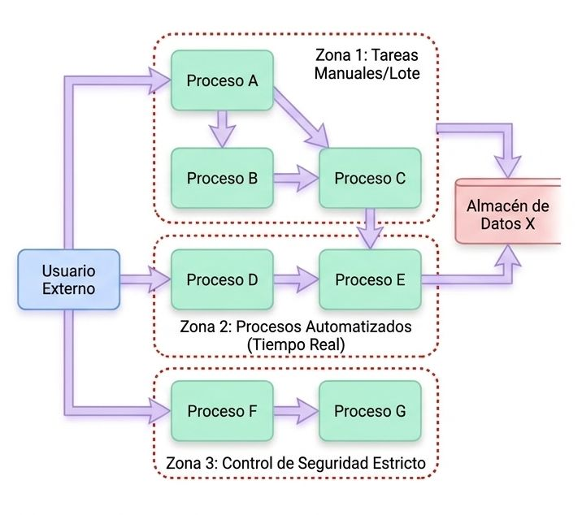
    

    

    Los analistas agrupan los procesos en el DFD físico para definir la arquitectura del software:

    * **Separar** tareas manuales de tareas automatizadas.
    * **Agrupar** procesos ejecutados por el mismo grupo de usuarios.
    * **Combinar** areas del mismo ciclo o lote de tiempo.
    * **Aislar** procesos para controles estrictos de seguridad.
    

  

## **Caso de uso vs UML**

La documentación de requisitos es un paso crítico del ciclo de vida del software (SDLC). Históricamente han coexistido dos grandes enfoques o paradigmas metodológicos para modelar el comportamiento y el flujo de los sistemas: el Análisis Estructurado (orientado a procesos y flujos de datos) y el Análisis Orientado a Objetos (orientado a actores, objetos y comportamiento). Este caso de estudio tiene como
objetivo comparar de forma práctica ambos paradigmas modelando el mismo requerimiento de negocio: la Gestión de Pedidos de la cadena 'Supermercados Alianza S.A.'.

#### Detalles del Caso 
**"Gestión de Pedidos en Supermercados Alianza"**

Para asegurar una comprensión homogénea, el caso describe el requerimiento de negocio de **Procesamiento de Pedidos con Despacho a Domicilio**, desglosándolo de forma paralela en los dos paradigmas:

#### 1. Perspectiva Lógica del Negocio (Análisis Estructurado - DFD)
*   **Enfoque:** Centrado en los procesos y la transformación de datos. Muestra cómo fluye y cambia la información a través del sistema sin importar la tecnología física de implementación.
*   **Elementos representados:** 
    *   **Entidades Externas:** *Cliente* y el departamento de *Bodega*.
    *   **Procesos de Transformación:** *1.0 Validar Cliente y Stock*, *2.0 Registrar Pedido* y *3.0 Preparar Despacho*.
    *   **Almacenes de Datos:** *D1 Clientes*, *D2 Inventario* y *D3 Pedidos*.
*   **Diagrama Incrustado (Figura 1):** Un limpio diagrama de flujo de datos lógicos Nivel 1 que ilustra las consultas y retornos lógicos de información entre los almacenes y procesos, respetando las reglas de oro de consistencia de flujos.

#### 2. Perspectiva Funcional del Usuario (Análisis Orientado a Objetos - UML)
*   **Enfoque:** Centrado en los actores y sus metas (comportamiento e interacciones). Delimita de forma rigurosa la frontera del software respecto a su entorno.
*   **Elementos representados:**
    *   **Límites del Sistema:** El contenedor gráfico del *Portal E-commerce*.
    *   **Actores:** El *Cliente* (actor principal), el *Sistema de Pago* (actor secundario/soporte) y el *Personal de Bodega* (actor secundario/soporte).
    *   **Casos de Uso Principales:** *Realizar Pedido* y *Preparar Despacho*.
    *   **Relaciones Especiales:** Uso de dependencias obligatorias mediante la etiqueta `<<include>>` para incluir las funcionalidades de *Validar Cliente y Stock* y *Procesar Pago Electrónico* dentro del flujo principal, además de modelar el disparador secuencial `<<triggers>>` hacia la bodega.
*   **Diagrama Incrustado (Figura 2):** Un diagrama de Casos de Uso estructurado bajo la notación estándar de UML que contrasta visualmente con el modelo funcional del DFD.

**Comparativa de Paradigmas: Análisis Estructurado vs. Orientado a Objetos**

**Escenario: Procesamiento de Pedidos**

Para materializar esta comparación, utilizaremos el requerimiento corporativo de **'Gestión de Pedidos'** para **Supermercados Alianza S.A**. El flujo de negocio opera de la siguiente manera: un Cliente ingresa su orden con sus datos personales y los ítems requeridos. El sistema debe validar el estado del cliente y la disponibilidad de stock. Si ambos son correctos, se genera el registro del pedido, se efectúa el pago electrónico a través de una pasarela externa, se envía una confirmación al cliente, y finalmente se emite una orden de picking para el personal de Bodega para la preparación del despacho físico.

### Diagramas de Flujo de Datos (DFD) Lógicos**

El DFD Lógico se enfoca en el aspecto funcional del sistema: describe qué hace el sistema en términos de
transformaciones lógicas de datos, sin hacer ninguna suposición tecnológica de cómo se ejecutará físicamente (manual o automatizado, base de datos local o en la nube). En este nivel, no se especifican pantallas ni interfaces, sino la procedencia y el destino final de la información.

**Elementos clave:**

* **Procesos (1.0, 2.0, 3.0)**: Son transformaciones activas de datos, nombrados bajo el estándar 'Verbo + Sustantivo' (ej. Validar Cliente y Stock).
* **Almacenes de Datos (D1, D2, D3)**: Depósitos pasivos de información necesarios para completar los flujos lógicos (Clientes, Inventario y Pedidos).
* **Entidades Externas (Cliente, Bodega)**: Actores fuera de los límites lógicos de procesamiento del software que entregan entradas o consumen salidas.

<figure>
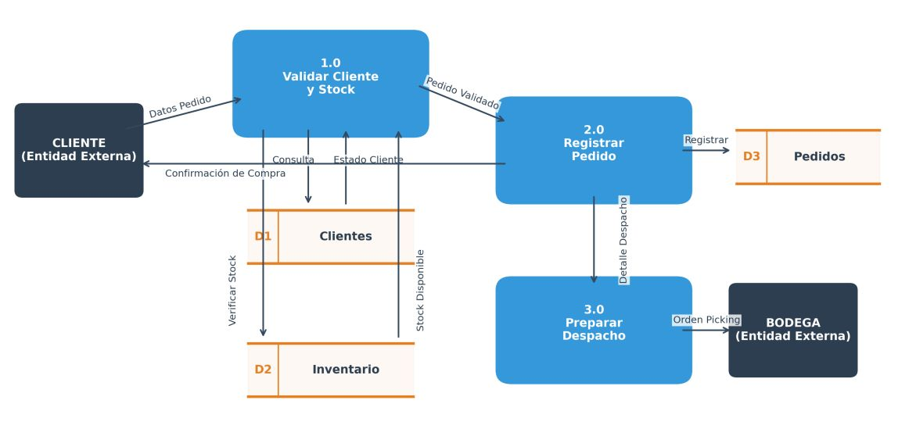
<figcaption>**Figura1 1**. Diagrama de flujo de datos lógico de nivel 1 para el procesamiento de pedidos.</figcaption>
</figure>

### Modelado de casos de uso (UML)

Frente al enfoque de flujos, el Diagrama de Casos de Uso de UML (Unified Modeling Language) se sitúa en la
órbita de la orientación a objetos y se enfoca en el comportamiento visible del sistema desde la perspectiva de los usuarios (actores). Representa un conjunto de metas y objetivos que los actores desean cumplir con la ayuda del sistema, estableciendo claramente las fronteras de software del portal digital.

**Elementos Clave Representados en el Diagrama UML:**

* **Límites del Sistema**: La caja gris representa el alcance del software (el Portal E-commerce). Todo lo que esté adentro es el sistema; los actores residen afuera.
* **Actores (Cliente, Personal Bodega, Sistema de Pago)**: Roles jugados por personas o sistemas externos que interactúan de forma directa con el software.
• **Relación `<<include>>`**: Representa dependencias funcionales obligatorias. Por ejemplo, Realizar Pedido incluye obligatoriamente Validar Cliente y Stock y Procesar Pago Electrónico.

<figure>
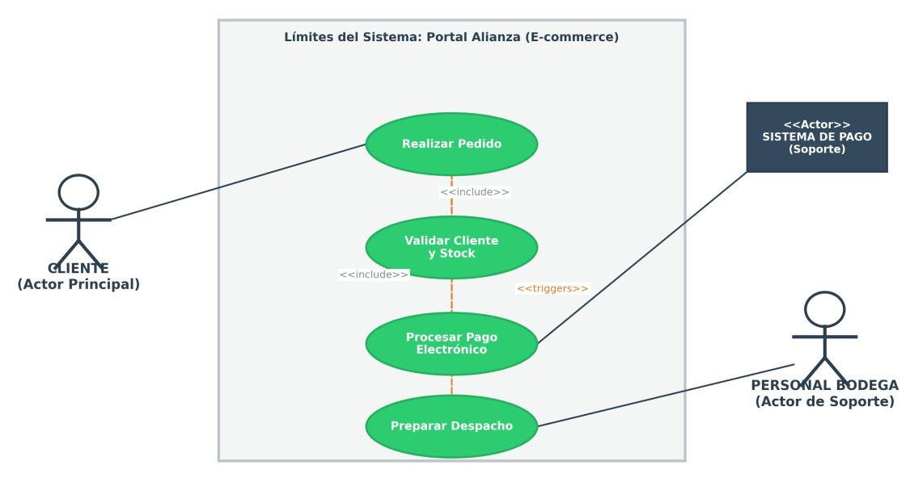
<figcaption>**Figura 2**. Diagrama de **Caso de Uso** UML para el procesamiento de pedidos.</figcaption>
</figure>

### Síntesis Comparativa

El PDF incorpora una **Tabla Comparativa de Paradigmas** que resume las diferencias de forma ejecutiva:

| Criterio | Análisis Estructurado (DFD) | Análisis Orientado a Objetos (UML) |
| :--- | :--- | :--- |
| **Enfoque Central** | Flujo y transformación cronológica de datos. Describe cómo los datos se transforman al moverse por el sistema.| Objetivos, interacciones de actores y clases. Describe quién interactua con el sistema y que metas u objetivos desea alcanzar. |
| **Tratamiento de Datos** | Los Datos y procesos conceptualmente **separados**. | Los datos (Atributos) y el comportamiento (métodos) están **encapsulados** juntos en objetos. |
| **Tipo de Descomposición** | Funcional, jerárquica y descendente (*Top-Down*). Se desglosa en niveles (Nivel 0, Nivel 1, Diagramas hijos). | Estructural y Casos de Uso.Basada en metas operacionales, se organizan según metas de los actores e interacciones de clases. |
| **Cuándo Utilizar** | Sistemas orientados al procesamiento por lotes. Integración de datos puros y tuberías (*pipelines*). | Portales interactivos complejos, prtales web e-commerce y microservicios modernos. |

### Sinergia de Paradigmas
**Estos enfoques no son rivales, sino herramientas complementarias**. Un ingeniero moderno utiliza los DFD lógicos para entender los grandes flujos de información de la Arquitectura Empresarial (visión macro y de procesos de negocio) y, posteriormente, recurre a UML y sus Casos de Uso para diseñar el software específico, definir las APIs de integración y estructurar las clases orientadas a objetos que serán codificadas.

