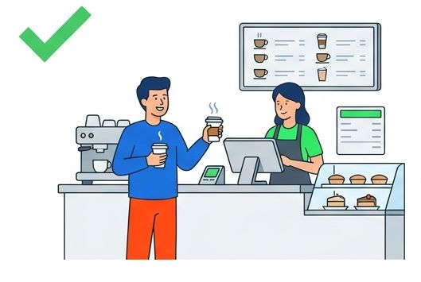
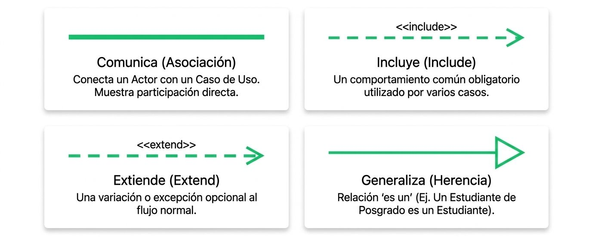

import YouTubeVideo from '@site/src/components/YouTubeVideo';

## **Caso de Uso**

Un **caso de uso** (*use case*) es un **documento de texto narrativo** que describe una secuencia de interacciones entre un **actor** (un usuario humano o un sistema externo) y el sistema en desarrollo para alcanzar un **objetivo de valor observable** para dicho actor. 

Sus características principales son las siguientes:
* **Perspectiva de "Caja Negra":** Describe *qué* hace el sistema en respuesta a un evento desencadenante sin detallar *cómo* lo implementa internamente o qué tecnologías utiliza.

* **Requisito Funcional en Contexto:** En lugar de ser una lista desarmada de funciones ("el sistema debe..."), sitúa los requisitos dentro del contexto real de una historia o flujo de trabajo de negocio.

* **Estructura Narrativa:** Documenta el flujo principal de éxito (el camino "feliz" donde todo sale bien) junto con todas sus extensiones y flujos alternativos (excepciones, errores de validación, tarjetas rechazadas, etc.).

* **Formatos de Redacción:** Se puede escribir en formato *breve* (un párrafo resumen), *informal* o *completo* (con precondiciones, postcondiciones/garantías de éxito, actores principales/de apoyo y pasos detallados).

### Plantilla

En la ingeniería de software y el análisis de requisitos orientados a objetos, los casos de uso se documentan principalmente en forma de **texto estructurado**. Siguiendo el estándar de *usecases.org* de Alistair Cockburn (promocionado por Craig Larman en *UML y Patrones* y Kendall & Kendall en *Análisis y Diseño de Sistemas*), el formato más riguroso y extendido es el **formato completo**.

A continuación se presenta la **plantilla general rellenable** y, posteriormente, un **ejemplo práctico de aplicación completa**.

:::info[Nota]
**Principio de Diseño (Craig Larman / Alistair Cockburn):** 

*"Trabajar con casos de uso significa escribir texto, no dibujar diagramas"*. El diagrama de casos de uso es útil como portada o mapa de contexto, pero **el verdadero caso de uso radica en el texto detallado que describe la interacción**.
:::

#### 1. Plantilla Estándar de Caso de Uso (Formato Completo)

```markdown
================================================================================
ESPECIFICACIÓN DE CASO DE USO: [ID] - [Nombre del Caso de Uso]
================================================================================

Caso de Uso:       [ID-00] [Verbo en infinitivo + Sustantivo/Objeto]
Alcance:           [Nombre del Sistema, Aplicación o Módulo]
Nivel:             [Objetivo de Usuario / Subfunción / Nivel de Empresa]
Actor Principal:   [Rol del usuario humano o sistema externo que inicia el flujo]

--------------------------------------------------------------------------------
1. PERSONAL INVOLUCRADO E INTERESES
--------------------------------------------------------------------------------
- [Actor Principal / Rol 1]: [Qué necesita o espera obtener de este proceso].
- [Interesado / Rol 2]: [Garantía, registro o interés de negocio que requiere].

--------------------------------------------------------------------------------
2. PRECONDICIONES
--------------------------------------------------------------------------------
- [Estado obligatorio que DEBE cumplirse en el sistema antes de iniciar].

--------------------------------------------------------------------------------
3. GARANTÍAS DE ÉXITO (POSTCONDICIONES)
--------------------------------------------------------------------------------
- [Estado final garantizado del sistema si el proceso concluye con éxito].

--------------------------------------------------------------------------------
4. ESCENARIO PRINCIPAL DE ÉXITO (FLUJO BÁSICO)
--------------------------------------------------------------------------------
1. [El actor inicia la acción desencadenante].
2. [El sistema valida o recupera información].
3. [El actor selecciona una opción o introduce datos].
4. [El sistema procesa la solicitud y actualiza el estado].
[El actor repite los pasos X a Y mientras sea necesario].
5. [El sistema presenta los resultados finales y emite confirmación].

--------------------------------------------------------------------------------
5. EXTENSIONES (FLUJOS ALTERNATIVOS Y EXCEPCIONES)
--------------------------------------------------------------------------------
[Paso_Básico][letra]. [Condición de excepción o variación detectada]:
    1. [Acción inmediata que ejecuta el sistema o el actor].
    2. [Siguiente paso, retorno al flujo principal o cancelación del proceso].

--------------------------------------------------------------------------------
6. REQUISITOS ESPECIALES (NO FUNCIONALES)
--------------------------------------------------------------------------------
- [Tiempos de respuesta, estándares de seguridad, encriptación, usabilidad].

--------------------------------------------------------------------------------
7. LISTA DE TECNOLOGÍA Y VARIACIONES DE DATOS
--------------------------------------------------------------------------------
- [Restricciones de hardware, lectores de código, interfaces I/O, formatos].

--------------------------------------------------------------------------------
8. FRECUENCIA DE OCURRENCIA
--------------------------------------------------------------------------------
- [Estimación de ejecuciones por unidad de tiempo: ej. continuo / 1000 veces/día].
```

---

#### 2. Ejemplo Práctico Rellenado: "UC-01 Procesar Venta"

A continuación se muestra la plantilla aplicada al dominio de un **Sistema de Punto de Venta (POS)**:

```markdown
================================================================================
ESPECIFICACIÓN DE CASO DE USO: UC-01 Procesar Venta
================================================================================

Caso de Uso:       UC-01 Procesar Venta
Alcance:           Sistema de Punto de Venta (POS)
Nivel:             Objetivo de Usuario
Actor Principal:   Cajero

--------------------------------------------------------------------------------
1. PERSONAL INVOLUCRADO E INTERESES
--------------------------------------------------------------------------------
- Cajero: Quiere registrar las ventas con rapidez y sin errores de cobro, ya que
  los desfases de caja se deducen de su salario.
- Cliente: Quiere un proceso de compra ágil, comprobantes claros y un cálculo
  preciso de precios y descuentos.
- Compañía / Comercio: Quiere asegurar el registro exacto de cada transacción,
  actualizar el inventario en tiempo real y registrar las comisiones de venta.

--------------------------------------------------------------------------------
2. PRECONDICIONES
--------------------------------------------------------------------------------
- El Cajero se ha identificado y autenticado exitosamente en el sistema.
- La caja registradora está abierta y en estado operativo.

--------------------------------------------------------------------------------
3. GARANTÍAS DE ÉXITO (POSTCONDICIONES)
--------------------------------------------------------------------------------
- Se registra la venta de forma permanente en la base de datos.
- Se calcula e imprime el impuesto de forma correcta.
- Se actualizan los saldos de inventario y la contabilidad general.
- Se genera e imprime el recibo de compra para el cliente.

--------------------------------------------------------------------------------
4. ESCENARIO PRINCIPAL DE ÉXITO (FLUJO BÁSICO)
--------------------------------------------------------------------------------
1. El Cliente llega a la caja registradora con los productos que desea comprar.
2. El Cajero inicia una nueva venta en el sistema.
3. El Cajero introduce el identificador del producto (código de barras).
4. El Sistema registra la línea de venta, busca la descripción y el precio del
   producto, y muestra la suma parcial acumulada.
   [El Cajero repite los pasos 3 y 4 para cada producto].
5. El Sistema calcula el monto total a pagar incluyendo impuestos.
6. El Cajero comunica el total al Cliente y le solicita el pago.
7. El Cliente realiza el pago (efectivo, tarjeta o cheque).
8. El Sistema valida y registra el pago recibido.
9. El Sistema actualiza el inventario, registra la transacción contable y
   emite el comprobante impreso (recibo).
10. El Cliente se retira con los productos y su comprobante.

--------------------------------------------------------------------------------
5. EXTENSIONES (FLUJOS ALTERNATIVOS Y EXCEPCIONES)
--------------------------------------------------------------------------------
3a. Código de producto no válido o no encontrado:
    1. El Sistema emite una alerta auditiva/visual y rechaza la entrada.
    2. El Cajero puede reintentar la lectura o ingresar el código manualmente.

3-6a. El Cliente solicita eliminar un producto del carrito antes de pagar:
    1. El Cajero selecciona e ingresa el código del producto a remover.
    2. El Sistema elimina la línea de venta y recalcula el subtotal.

7a. Pago con Tarjeta de Crédito/Débito:
    1. El Cliente desliza o acerca la tarjeta al terminal de lectura.
    2. El Sistema envía la solicitud al Servicio de Autorización de Pagos.
    3. El Servicio externo aprueba la transacción y devuelve un código de autorización.
    4. El Sistema continúa en el paso 9.

    3a. Rechazo de la tarjeta por fondos insuficientes o error de red:
        1. El Sistema notifica el rechazo al Cajero.
        2. El Cajero solicita un método de pago alternativo al Cliente.

--------------------------------------------------------------------------------
6. REQUISITOS ESPECIALES (NO FUNCIONALES)
--------------------------------------------------------------------------------
- El tiempo de respuesta de la interfaz debe ser menor a 2 segundos por producto.
- La autorización de tarjetas con la pasarela externa debe resolverse en menos
  de 30 segundos en el 90% de los casos.

--------------------------------------------------------------------------------
7. LISTA DE TECNOLOGÍA Y VARIACIONES DE DATOS
--------------------------------------------------------------------------------
- Soporte para lectura de códigos de barras mediante escáner láser o teclado.
- Captura de tarjeta mediante lector de banda magnética, chip EMV o NFC.

--------------------------------------------------------------------------------
8. FRECUENCIA DE OCURRENCIA
--------------------------------------------------------------------------------
- Ocurrencia continua a lo largo de la jornada de atención al público.
```


### Componentes de la Plantilla

* **Personal Involucrado e Intereses:** Define qué debe satisfacer el caso de uso. Ayuda a descubrir responsabilidades implícitas del software (como calcular comisiones o impuestos) que no siempre surgen en un flujo directo.

* **Precondiciones vs. Postcondiciones:** Las precondiciones asumen estados que **ya se cumplieron** antes de empezar (como haber iniciado sesión); las postcondiciones establecen los **compromisos o garantias** que el sistema promete haber cumplido al finalizar (como actualizar inventario y base de datos).

* **Flujo Básico (*Camino Feliz*):** Describe el escenario de éxito estándar en el que no ocurren fallas ni imprevistos.

* **Extensiones (*Flujos Alternativos*):** Documentan todas las bifurcaciones, excepciones, errores de validación y variaciones de pago etiquetadas con respecto al número de paso del flujo básico (ej. `3a`, `7a`).


### Caso de Uso y Diagrama de Casos de Uso

Un error común es asumir que "hacer el caso de uso" consiste únicamente en dibujar el diagrama UML. Sin embargo, en el diseño orientado a objetos y metodologías como el Proceso Unificado (UP), existe una diferencia conceptual y práctica radical:

| Criterio | Caso de Uso (*Use Case*) | Diagrama de Casos de Uso (*Use Case Diagram*) |
| :--- | :--- | :--- |
| **Naturaleza / Medio** | Es un **documento de texto escrito** (narrativa). | Es un **dibujo o esquema gráfico** en notación UML. |
| **Nivel de Detalle** | **Profundo y exhaustivo:** Describe el paso a paso, precondiciones, postcondiciones, datos de entrada/salida y todas las excepciones. | **Superficial y de alto nivel:** Muestra únicamente títulos de funciones y nombres de actores sin explicar los pasos internos. |
| **Propósito Principal** | Definir el **contrato de comportamiento funcional** completo entre los interesados y el software. | Proporcionar una **vista visual rápida del contexto y el alcance** (*scope*) del sistema. |
| **Orientación a Objetos** | **No es orientado a objetos:** Es simplemente una historia estructurada sobre el uso del sistema libre de jerga técnica. | **Es un artefacot visual de UML:** Forma parte del estándar formal de diagramado para sistemas. |
| **Valor Metodológico** | **Es la herramienta clave de requisitos:** Es donde realmente reside la especificación funcional detallada. | **Es un mapa o índice secundario:** Facilita la comunicación visual rápida. |


---
## **Diagrama de Caso de Uso**


Un **diagrama de casos de uso** es una **representación gráfica en notación UML** que ilustra de forma simplificada y visual los nombres de los casos de uso, los actores externos y los límites del sistema. Es por tanto, una representación simplificada que captura el alcance y los requerimientos funcionales de un software desde la perspectiva de un observador externo (visión de "caja negra"), mostrando **qué hace el sistema sin detallar cómo lo hace**.

Sus componentes visuales principales son:
* **Actores (monigotes o cajas):** Representan los roles externos que interactúan con el software.

* **Casos de Uso (óvalos):** Representan las metas u objetivos funcionales principales.

* **Límite del Sistema (*System Boundary*):** Recuadro que encierra los óvalos para delimitar formalmente el alcance del proyecto.

* **Relaciones:** Líneas de comunicación entre actores y casos de uso, así como relaciones entre casos de uso mediante las palabras clave `<<include>>` (subfunciones obligatorias), `<<extend>>` (comportamientos opcionales o excepciones) y *generalización*.

Sirve principalmente como un **diagrama de contexto de alto nivel** para que los desarrolladores y los clientes acuerden rápidamente qué funcionalidades están dentro o fuera del alcance del software.


<div class="container">
  <div class="row">
    <div class="col col--7">
    
    </div>
    <div class="col col--5">
    El enfoque orientado desde la perspectiva del usuario

    Un modelo lógico describe secuencias de transacciones que producen valor observable para el usuario.

    No debe incluir detalles técnicos, interfaces gráficas, ni estructuras de bases de datos.
    </div>
  </div>
</div>

### Elementos Principales

<div class="container">
  <div class="row">
    <div class="col col--5">
    
    </div>
    <div class="col col--7">

**Actores (*Actors*):** Representados comúnmente con figuras humanas de palo (o cajas clasificadas), simbolizan los **roles** que desempeñan los usuarios humanos, dispositivos u otros sistemas informáticos externos que interactúan con el software.

**Casos de Uso (*Use Cases*):** Representados por óvalos etiquetados con una frase en formato *"Verbo + Sustantivo"* (por ejemplo, *Procesar Venta*), indican una secuencia de interacciones entre un actor y el sistema para alcanzar un **resultado de valor observable**. El sustantivo "**Procesar**" es el objetivo. Verbo en infinitivo "**Venta**" es la acción.

**Relación de Comunicación:** Líneas sólidas que conectan a un actor con los casos de uso en los que participa directamente.

**Límite del Sistema (*System Boundary*):** Un recuadro rectangular que encierra los casos de uso y delimita las fronteras del proyecto, dejando a los actores fuera del sistema.

    </div>
  </div>
</div>

Desde la perspectiva del actor, cada óvalo debe producir un resultado de valor observable. Si no hay valor, no es un Caso de Uso.

**Casos de Uso y diagramas de casos de uso**
<YouTubeVideo id="iFcDoP6jEeE" title="Casos de Uso y diagramas de casos de uso" />

**Casos de Uso**
<YouTubeVideo id="5ezWOj0k02k" title="Casos de Uso (UML)" />

#### Límite del sistema (el alcance)

La comunicación siempres cruza el límite del sistema.
```mermaid
---
config:
  theme: redux-color
  usecase:
    colorScheme: rotate
---
usecase-beta
direction LR
actor Customer("Cliente")
systemBoundary "PLATAFORMA E-COMMERCE"
  Checkout("UC-01: Procesar pago electrónico")
end
Pagos[Pasarela Pagos]
Checkout --> Pagos
Customer --> Checkout

```
### Relaciones entre Casos de Uso

Para organizar la lógica y evitar redundancias en el modelo, se utilizan tres relaciones de comportamiento:

* **Inclusión (`<<include>>`):** La Obligación. Indica que un caso de uso común (subfunción) se ejecuta de forma **obligatoria** dentro del flujo de otro caso de uso para evitar duplicar texto o lógica en la especificación.
    * Dirección de flecha: Apunta al caso común (subfunción).
    * Condicionalidad: Obligatorio. El caso base no está completo sin él.
    * Cuándo usarlo: Para evitar duplicar texto (ej. validar usuario, pagar cuotas).

* **Extensión (`<<extend>>`):** La excepción. Representa un comportamiento **opcional o de excepción** que solo se ejecuta en puntos específicos si se cumple una condición determinada.
    * Dirección de flecha: Apunta DESDE el caso extendido HACIA el caso base.
    * Condicionalidad: Opcional/Condicional. El caso base funciona perfectamente por sí solo.
    * Cuándo usarlo: Para manejar excepciones (ej. Tarjeta rechazada, seguro adicional).

* **Generalización:** Expresa una relación de **herencia** de un concepto general a uno especializado, pudiendo aplicarse tanto entre actores como entre casos de uso.



#### Aplicación de `<<include>>`

<div class="container">
  <div class="row">
    <div class="col col--6">

```mermaid
usecase-beta
Inscribir("Inscribir en el curso")
Hospedaje("Hacer arreglos de hospedaje")
Pagar("Pagar cuotas de estudiantes")

Inscribir ..> : include Pagar
Hospedaje ..> : include Pagar
```

    </div>
    <div class="col col--6">
    **Reutilización pura**. No importa si te inscribes o buscas hospedaje, el sistema siempre te obligará a pagar las cuotas. Se extrae para no repetir en proceso en el diagrama.
    </div>
  </div>
</div>

#### Aplicación de `<<extend>>`

<div class="container">
  <div class="row">
    <div class="col col--6">
```mermaid
usecase-beta
Seguro("Seguro médico de estudiantes")
Base("Pagar cuotas de estudiantes")

Seguro ..> : extend Base
```
    </div>
    <div class="col col--6">
    En caso base (Pagar cuotas) está completo por sí solo. El seguro es un comportamiento adicional que solo se activa bajo una condición específica.
    </div>
  </div>
</div>


#### Storyboard completo


```mermaid
---
config:
  theme: redux-color
  usecase:
    colorScheme: rotate
---
usecase-beta
actor Participante
actor Presidente

systemBoundary "GESTION DE CONFERENCIA"
  Registrar("Registrarse")
  Organizar("Organizar Traducción")
  Reservar("Reservar Cuarto")
end
Hotel[Reservaciones de Hotel]

Participante --> Registrar
Presidente --> Registrar

Organizar ..> : extend Registrar
Registrar ..> : include Reservar
Reservar --> Hotel
```


### Utilización en un Proyecto

* **Para delimitar el alcance:** Funciona como un **diagrama de contexto de alto nivel** que ayuda a acordar entre clientes e ingenieros qué funcionalidades están dentro y fuera del proyecto.

* **Como herramienta de comunicación:** Sirve de lenguaje neutral libre de jerga técnica para validar los objetivos del usuario con la alta gerencia y los interesados (*stakeholders*).

* **Como índice de la especificación escrita:** Aunque el diagrama ofrece el resumen visual, la especificación real se realiza escribiendo la **narrativa o escenario del caso de uso** (pasos detallados del flujo principal, flujos alternativos, precondiciones y postcondiciones).

* **Para guiar el desarrollo iterativo:** Sirve de base para planificar las iteraciones (*sprints*), diseñar los diagramas de interacción y clases (como los DSS y los DCD), y estructurar las pruebas de aceptación finales.

### Ejemplo Caso de Uso


<Tabs>
<TabItem value="mnp" label="Antecedentes" default>
<div class="alert alert--primary">
#### **Procesar Pago Electrónico**

La especificación completa en formato estructurado de un Caso de Uso (según el estándar de **Craig Larman** en *UML y Patrones*). Este modelo sirve de plantilla para documentar rigurosamente los requisitos funcionales de un software:

* **Nombre del Caso de Uso:** UC-01 Procesar Pago Electrónico
* **Alcance:** Sistema de Comercio Electrónico / Punto de Venta (POS)
* **Nivel:** Objetivo de Usuario (*User Goal*)
* **Actor Principal:** Cliente
* **Partes Interesadas e Intereses:**
  * **Cliente:** Desea realizar el pago de forma rápida, segura y obtener una confirmación válida de su compra.
  * **Comercio:** Desea asegurar el cobro correcto, actualizar el inventario y prevenir fraudes financieros.
  * **Pasarela de Pagos (Sistema Externo):** Requiere recibir datos estructurados y válidos para autorizar la transacción.

#### Precondiciones
1. El cliente tiene una sesión activa y un carrito de compras con al menos un producto disponible en stock.
2. La pasarela de pagos externa está en estado operacional.


#### Garantías de Éxito (Postcondiciones)
* La transacción financiera es autorizada y registrada en la base de datos.
* El estado del pedido cambia a *"Pagado / En Preparación"*.
* Se decrementa el stock correspondiente en el almacén de datos de inventario.
* Se genera y envía la factura/comprobante electrónico al cliente.


#### Escenario Principal de Éxito (Flujo Básico / *Happy Path*)

1. El Cliente selecciona la opción *"Proceder al Pago"* e ingresa su dirección de envío.
2. El Sistema calcula el monto subtotal, los impuestos correspondientes y el costo de envío, presentando el **Monto Total a Pagar**.
3. El Cliente selecciona *"Tarjeta de Crédito/Débito"* como método de pago e introduce los datos del plástico (número, fecha de expiración y código CVV).
4. El Cliente presiona el botón *"Confirmar y Pagar"*.
5. El Sistema valida el formato sintáctico de los datos ingresados y envía la solicitud de autorización a la **Pasarela de Pagos Externa**.
6. La Pasarela de Pagos procesa la transacción y devuelve un **Código de Aprobación**.
7. El Sistema registra la venta en la base de datos, descuenta el stock de los productos comprados y genera un número de orden.
8. El Sistema muestra en pantalla el resumen de la compra exitosa y envía una copia del comprobante al correo electrónico del cliente.
9. El caso de uso finaliza con éxito.


#### Flujos Alternativos y Excepciones (*Extensions*)

* **3a. Datos de la tarjeta con formato inválido:**
  1. El Sistema detecta un número de tarjeta o fecha de vencimiento incorrecta antes de enviarla a la pasarela.
  2. El Sistema muestra un mensaje de advertencia resaltando el campo erróneo y solicita la corrección.
  3. El Cliente corrige los datos y el flujo regresa al **paso 4**.

* **5a. Rechazo por Fondos Insuficientes o Bloqueo Bancario:**
  1. La Pasarela de Pagos responde con un código de rechazo (ej. *"Fondos insuficientes"* o *"Transacción no autorizada"*).
  2. El Sistema registra el intento fallido en el log de auditoría.
  3. El Sistema notifica al Cliente el motivo del rechazo y le ofrece seleccionar un método de pago alternativo o reintentar.
  4. El flujo regresa al **paso 3**.

* **5b. Tiempo de espera agotado (*Time-out*) con la Pasarela de Pagos:**
  1. El Sistema no recibe respuesta de la pasarela dentro del límite de tiempo configurado (ej. 15 segundos).
  2. El Sistema cancela la solicitud de cobro para evitar cobros dobles y muestra el mensaje: *"Servicio de pago no disponible temporalmente. Intente nuevamente en unos minutos"*.
  3. El pedido permanece en estado *"Pendiente de Pago"*.


#### Requisitos Especiales (No Funcionales)
* **Seguridad:** Los datos de la tarjeta deben encriptarse bajo el estándar **PCI-DSS** durante el tránsito y nunca deben almacenarse en texto plano en las bases de datos de la empresa.
* **Rendimiento:** La validación con la pasarela externa debe resolverse en **menos de 3 segundos** en el 95% de los casos.

</div>
</TabItem>
<TabItem value="mnp-python" label="📐 Diagrama">

#### Diagrama Caso de Uso
**Procesamienro de pago electrónico**
```mermaid
---
config:
  theme: redux-color
  usecase:
    colorScheme: rotate
---
usecase-beta
direction LR
actor Customer("Cliente")
systemBoundary "PLATAFORMA E-COMMERCE -POS"
  Checkout("UC-01: Procesar pago electrónico")
  Rechazo("Notificar Rechazo de Pago")
  Codigo("Aplicar Código Descuento")
  Validar("Validar Cliente y Carrito")
  Autorizar("Autorizar Transacción")
  Registrar("Registrar Venta y Stock")
end
Pagos[Pasarela Pagos]
Inventario[Sistema Inventario]

Customer --> Checkout
Rechazo ..> : extend Checkout
Codigo ..> : extend Checkout
Checkout ..> : include Validar
Checkout ..> : include Autorizar
Checkout ..> : include Registrar

Autorizar --> Pagos
Registrar --> Inventario
```
</TabItem>
</Tabs><br/>


