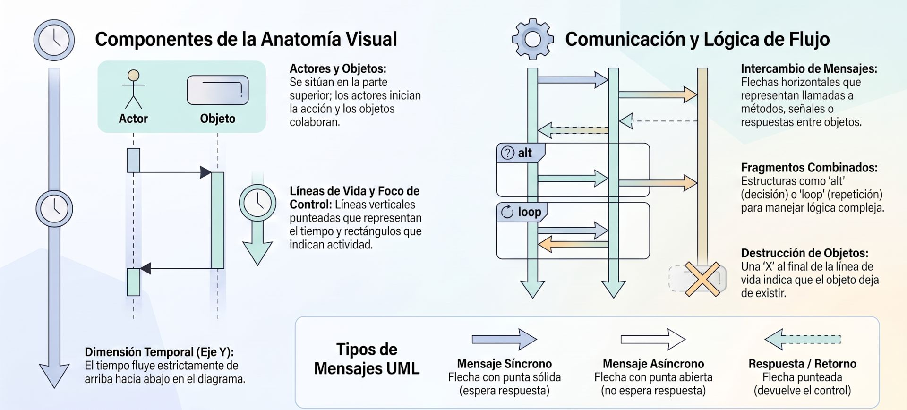
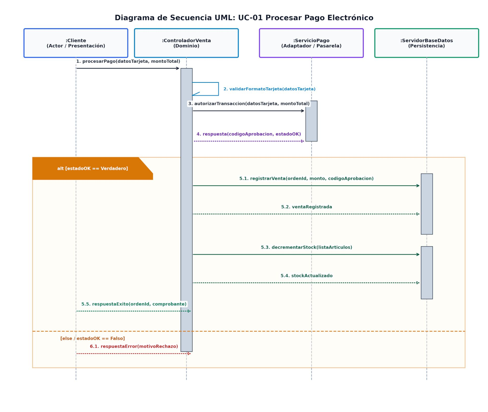

---
## **Diagrama de Secuencia**

Un **Diagrama de Secuencia** es un diagrama de comportamiento e interacción en el Lenguaje Unificado de Modelado (**UML**) que ilustra la sucesión de interacciones y el intercambio de mensajes entre objetos o componentes del sistema a lo largo del tiempo. 

A diferencia de los diagramas de clases (que muestran la estructura estática) o de los casos de uso (que muestran metas desde una caja negra), el diagrama de secuencia adopta una visión dinámica de "caja transparente". Su eje vertical representa el **paso del tiempo** (avanzando de arriba hacia abajo) y su eje horizontal representa los **participantes u objetos** involucrados.

### Elementos Principales

* **Líneas de Vida y Objetos (*Lifelines*):** Representadas en la parte superior por rectángulos etiquetados con la sintaxis `nombreObjeto:Clase` o `:Clase` (subrayado para denotar instancia) y una línea punteada vertical descendente que indica la duración de la existencia del objeto durante el escenario.
* **Mensajes (*Messages*):** Flechas horizontales dibujadas entre las líneas de vida que representan invocaciones de métodos u operaciones:
  * **Mensaje Sincrónico (flecha con punta sólida):** El emisor se bloquea a la espera de que el receptor complete la ejecución.
  * **Mensaje Asincrónico (flecha con punta abierta):** El emisor envía la señal y continúa su ejecución sin esperar respuesta.
  * **Respuesta / Retorno (flecha discontinua):** Devuelve el control o un valor de retorno al objeto origen al finalizar la operación.
* **Foco de Control / Cajas de Activación (*Activation Bars*):** Rectángulos verticales delgados situados sobre la línea de vida que indican el intervalo de tiempo exacto durante el cual el objeto está ejecutando una operación activa o se encuentra en la pila de llamadas.
* **Creación y Destrucción de Objetos:** La instanciación de un nuevo objeto se representa enviando un mensaje `create` que apunta directamente al encabezado del nuevo objeto. La destrucción explícita de un objeto se marca con un símbolo de cruz (`X` o `<<destroy>>`) al final de su línea de vida.
* **Fragmentos Combinados (*Interaction Fragments*):** Recuadros con etiquetas que agrupan flujos condicionales o iterativos:
  * **`alt` / `else`:** Muestra caminos alternativos mutuamente exclusivos según condiciones de guarda.
  * **`loop`:** Indica la repetición o iteración sobre un conjunto de mensajes.

### Principales Usos

1. **Realización de Casos de Uso:** Traduce los escenarios de texto plano y eventos de los casos de uso en una solución técnica de objetos que colaboran.
2. **Descubrimiento de Métodos y Firma de Clases:** Cada mensaje enviado a un objeto receptor en el diagrama de secuencia se convierte posteriormente en un **método público** dentro del Diagrama de Clases de Diseño (DCD) y en el código fuente.
3. **Estructuración en Arquitectura por Capas:** Permite organizar visualmente los componentes respetando las tres capas fundamentales del software:
   * **Capa de Presentación / Límite (*Boundary*):** Formularios, vistas o interfaces de usuario.
   * **Capa de Dominio / Negocio (*Control*):** Controladores de caso de uso que aplican las reglas del negocio.
   * **Capa de Persistencia / Entidad (*Entity*):** Tablas de base de datos o repositorios que almacenan el estado del sistema.
4. **Validación y Refinamiento del Diseño:** Permite a los arquitectos y desarrolladores verificar la lógica de integración y detectar problemas de acoplamiento o datos faltantes antes de escribir código.

### Ejemplo

Tomando el escenario de pago con tarjeta de crédito/débito, la secuencia de mensajes entre las capas del sistema funciona de la siguiente manera:

1. **Invocación de Pago:** El actor `:Cliente` envía el mensaje `procesarPago(datosTarjeta, montoTotal)` hacia el objeto de presentación/dominio `:ControladorVenta`.
2. **Validación Local:** El `:ControladorVenta` se envía un mensaje a sí mismo (`validarFormatoTarjeta()`) para comprobar la sintaxis antes de llamar a servicios externos.
3. **Autorización Financiera:** El `:ControladorVenta` invoca el mensaje `autorizarTransaccion(datosTarjeta, montoTotal)` en el objeto adaptador `:ServicioPago`, el cual retorna el `codigoAprobacion` y el estado de la operación.
4. **Evaluación de la Transacción (`alt / else`):**
   * **Camino de Éxito (`alt`):** Si la transacción es aprobada, el `:ControladorVenta` envía los mensajes `registrarVenta(ordenId, montoTotal)` y `decrementarStock(listaArticulos)` al `:ServidorBaseDatos`. Finalmente, retorna una respuesta de éxito con el comprobante al `:Cliente`.
   * **Camino de Excepción (`else`):** Si el pago es rechazado, el `:ControladorVenta` devuelve un mensaje de error notificando la causa del rechazo al `:Cliente`.

