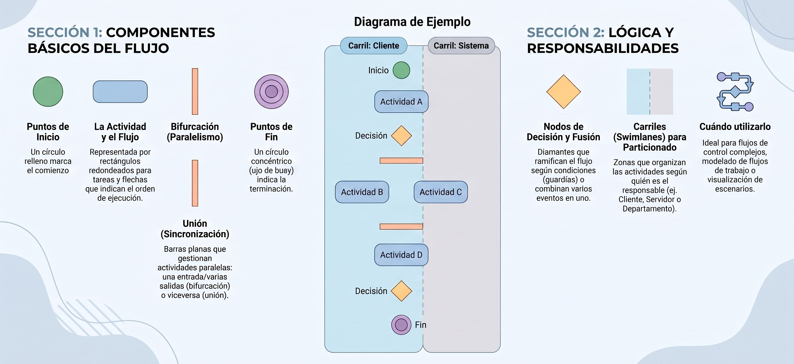
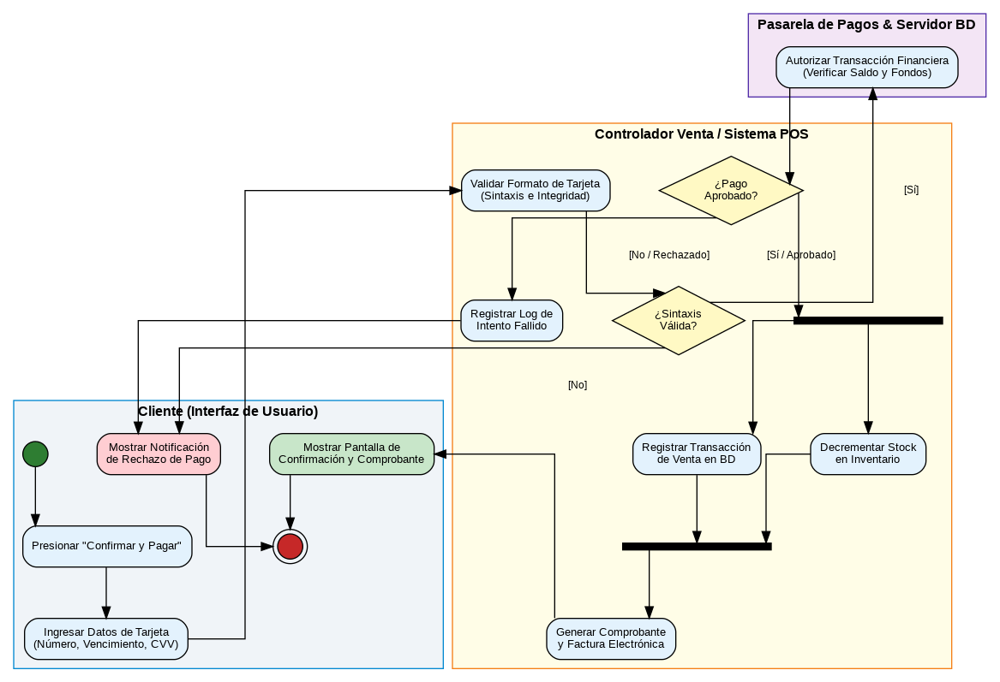

---
## **Diagrama de Actividad**

Un **diagrama de actividad** en el Lenguaje Unificado de Modelado (UML) es un diagrama de comportamiento dinámico que ilustra el flujo de trabajo (*workflow*) o la secuencia paso a paso de las actividades que se ejecutan dentro de un proceso, caso de uso, algoritmo o método de software. 

A diferencia de los diagramas de secuencia (que se enfocan en los mensajes intercambiados entre objetos a lo largo del tiempo), los diagramas de actividad muestran **cómo se transforma y avanza el flujo de control y de datos** a través de actividades secuenciales, decisiones lógicas y tareas que se ejecutan en paralelo.

### Elementos Principales

* **Estado Inicial:** Representado por un **círculo negro relleno**, señala el punto exacto de partida donde comienza el flujo del proceso.
* **Actividad / Acción:** Representada por un **rectángulo con esquinas redondeadas**, simboliza un paso, tarea o método específico que puede ser manual (como firmar un documento) o automatizado (como un programa o consulta a base de datos).
* **Transición / Flecha de Flujo:** Flechas dirigidas que conectan los símbolos para representar el evento o paso del control de una actividad a la siguiente.
* **Nodo de Decisión (Ramificación / *Branch*):** Representado por un **diamante**, evalúa una condición lógica. Cuenta con una flecha de entrada y dos o más flechas de salida etiquetadas con **condiciones de guardia** (ej. `[Aprobado]` o `[Rechazado]`) para dirigir el flujo por caminos alternativos.
* **Nodo de Fusión (*Merge*):** Un diamante que recibe múltiples flujos alternativos (previamente divididos por una decisión) y los unifica de nuevo en un solo flujo común.
* **Barra de Sincronización:** Un **rectángulo largo y plano (o línea gruesa)** utilizado para gestionar la concurrencia:
  * **Bifurcación (*Fork*):** Una entrada que se divide en múltiples salidas paralelas ejecutadas simultáneamente.
  * **Unión (*Join*):** Múltiples entradas paralelas que convergen y deben completarse todas antes de continuar.
* **Carriles (*Swimlanes*):** Filas o columnas verticales/horizontales que dividen el diagrama para asignar la responsabilidad de cada actividad a un rol, actor, clase o plataforma técnica específica (ej. *Cliente*, *Servidor Web*, *Base de Datos*).
* **Estado Final:** Representado por un **círculo negro dentro de un anillo exterior blanco** (diana), indica la conclusión exitosa del proceso.

### Principales Usos

1. **Modelado de Flujos de Trabajo (*Workflows*):** Permite describir procesos organizacionales y reglas de negocio sin entrar en detalles de implementación técnica.

2. **Complemento para Casos de Uso:** Mapea la secuencia de pasos y todas las rutas alternativas o excepciones de un caso de uso complejo.

3. **Modelado de Algoritmos Complejos:** Representa visualmente la lógica detallada de métodos de bajo nivel con múltiples condicionales y bucles.

4. **Diseño de Casos de Prueba (*Test Cases*):** Ayuda a los analistas a verificar que cada decisión y ruta posible del software sea evaluada durante las pruebas.

### Ejemplo Práctico 
<Tabs>
<TabItem value="mnp" label="Antecedentes" default>

**Caso "Procesar Pago Electrónico"**

Tomando el escenario de pago que hemos trabajado previamente, las actividades se organizan visualmente a través de **tres carriles de responsabilidad (*Swimlanes*)**:

**🔹 Carril 1: Cliente (Interfaz de Usuario)**
1. **[Estado Inicial]** -> El cliente presiona *"Confirmar y Pagar"*.
2. **Ingresar Datos de la Tarjeta:** Introduce número de tarjeta, fecha de expiración y CVV.
3. *[Recepción de Respuesta]* -> Muestra pantalla de confirmación exitosa o notificación de rechazo.

**🔹 Carril 2: Controlador / Sistema POS (Dominio)**

4. **Validar Formato de Tarjeta:** Revisa sintaxis e integridad local de los datos.
5. **[Decisión: ¿Sintaxis Válida?]**
   * *[No]* -> Retorna mensaje de error de formato al Cliente.
   * *[Sí]* -> Envió de solicitud de cobro a la pasarela.
6. **[Decisión: ¿Transacción Aprobada por Pasarela?]**
   * *[No]* -> Genera log de pago fallido y notifica al Cliente.
   * *[Sí]* -> Llega a una **Barra de Sincronización (*Fork*)** para iniciar dos tareas paralelas simultáneas:
     * Tarea A: **Registrar Transacción de Venta** en la base de datos.
     * Tarea B: **Decrementar Stock de Inventario**.
7. **Barra de Sincronización (*Join*):** Espera a que ambas operaciones paralelas concluyan.
8. **Generar Comprobante Electrónico:** Emite el número de orden y factura. -> **[Estado Final]**.

**🔹 Carril 3: Pasarela de Pagos (Servicio Externo)**

9. **Autorizar Transacción Financiera:** Verifica saldo, fondos y valida prevención de fraudes con la entidad bancaria emitiente.

</TabItem>
<TabItem value="mnp-python" label="📐 Diagrama">
Diagrama de actividad para pasarela de pago.

</TabItem>
</Tabs> 

