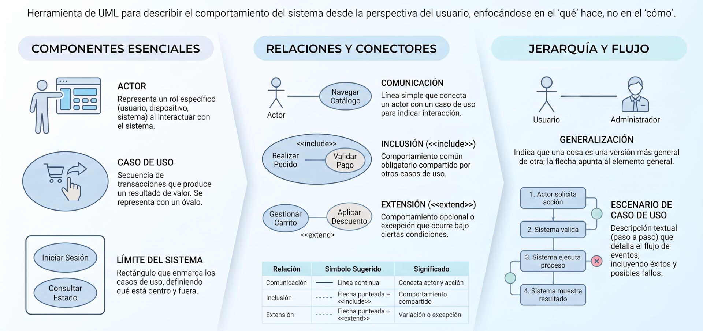
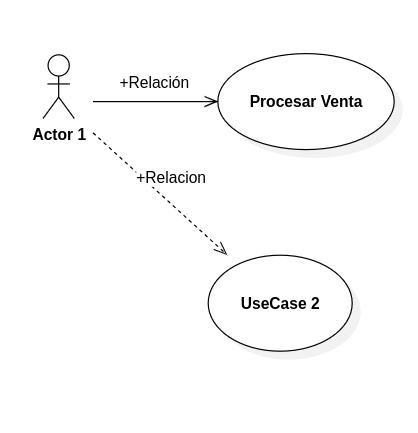

import YouTubeVideo from '@site/src/components/YouTubeVideo';


- UML Tutorial. Diagrama de Clases
<YouTubeVideo id="Z0yLerU0g-Q" title="Etica y regulación en la IA" />

**UML** responde a las siglas de **Unified Modeling Language** (Lenguaje Unificado de Modelado). Es el **estándar visual de facto y de iure** en la industria del software, respaldado y mantenido por el **Object Management Group (OMG)**, utilizado para especificar, visualizar, construir y documentar los artefactos de sistemas de software, así como para el modelado de negocios y otros sistemas no relacionados con el software.


### El Origen: Unificación de Lenguajes
Antes de la creación de UML a mediados de la década de 1990, los ingenieros de software se enfrentaban a una "guerra de metodologías" con cientos de notaciones de modelado orientado a objetos que eran incompatibles entre sí (como OMT de James Rumbaugh, Booch de Grady Booch y Objectory de Ivar Jacobson). Esta fragmentación dificultaba que las herramientas de diseño y la experiencia de los desarrolladores se transfirieran fácilmente de un proyecto a otro.

En 1994, Booch y Rumbaugh unificaron sus notaciones (a los que luego se unió Jacobson, siendo conocidos colectivamente como **"los tres amigos"**), dando origen a la primera versión de UML, la cual fue adoptada como estándar internacional por el OMG en **1997**.


### UML no es una Metodología
En tu bibliografía de estudio, el autor Craig Larman hace una advertencia crucial para la formación de ingenieros de software: **UML es simplemente una notación visual, no es un método de diseño ni un proceso de desarrollo**. 
*   Aprender la sintaxis de UML y saber dibujar diagramas visuales en una herramienta CASE no convierte a alguien en un diseñador competente, del mismo modo que el proverbio indica que **"tener un martillo no te hace un arquitecto"**.
*   La habilidad verdaderamente crítica y difícil de dominar es el **Análisis y Diseño Orientado a Objetos (A/DOO)**, que consiste en saber cómo "pensar en objetos", estructurar colaboraciones lógicas y asignar responsabilidades de forma hábil (por ejemplo, aplicando los principios de patrones de diseño GRASP o GoF). UML es simplemente el lenguaje de planos que empleamos para plasmar y comunicar estas decisiones.


### Las Tres Perspectivas de Modelado en UML
UML es sumamente flexible. Un mismo elemento gráfico (como una caja rectangular que representa una clase) se puede interpretar bajo **tres perspectivas conceptuales distintas** según la etapa del ciclo de vida en la que te encuentres:

1.  **Perspectiva Conceptual o Esencial:** Los diagramas describen cosas, conceptos o eventos del mundo real del dominio de interés. Un ejemplo es el *Modelo del Dominio*, donde las clases representan entidades reales de la empresa y no contienen código, métodos de programación ni especificaciones técnicas.

2.  **Perspectiva de Especificación:** Los diagramas describen abstracciones de software, componentes e interfaces (lo que la clase conoce y sabe hacer), pero **sin comprometerse con una tecnología o lenguaje de programación específico**.

3.  **Perspectiva de Implementación:** Los diagramas describen detalladamente clases reales de software listas para ser programadas en un lenguaje particular (como Java, C# o C++), definiendo tipos de variables, visibilidad (pública o privada) y el código de implementación de sus métodos.


### Los Componentes del Lenguaje
La ontología interna de UML se organiza de forma estricta en tres grandes bloques de construcción:
*   **Cosas (Things):** Los elementos primarios del modelo, divididos en estructurales (ej. clases, casos de uso, interfaces), de comportamiento (ej. interacciones, estados), de agrupación (paquetes) y de anotación (notas aclaratorias).

*   **Relaciones:** El pegamento semántico que une los elementos. Incluye dependencias, asociaciones, generalizaciones (herencia) y agregaciones/composiciones (relaciones todo-parte).

*   **Diagramas:** Las vistas que describen aspectos específicos del sistema. UML 2.0 clasifica sus diagramas principales en dos ramas fundamentales:

#### A. Diagramas Estructurales
Modelan los objetos y las entidades físicas o lógicas que componen el sistema en un instante de tiempo, sin enfocarse en su comportamiento dinámico:
*   **Diagrama de Clases:** El más importante y utilizado. Muestra los tipos de objetos, sus atributos, métodos públicos o privados y sus relaciones estáticas.

*   **Diagrama de Objetos:** Muestra instancias concretas de clases y sus enlaces de datos en un momento del tiempo.

*   **Diagramas de Componentes y de Despliegue:** Ilustran la arquitectura física de los entregables (ejecutables, archivos) y cómo se distribuyen en los servidores de hardware y topología de red.

#### B. Diagramas de Comportamiento
Modelan el funcionamiento interno del software, las interacciones en el tiempo y las reacciones ante eventos:
*   **Diagrama de Casos de Uso:** Como el que acabamos de diseñar en tu reporte comparativo, define los límites del sistema, sus actores externos y los flujos de servicio de valor que interactúan.

*   **Diagramas de Secuencia y de Comunicación (Interacción):** Muestran paso a paso cómo colaboran los objetos enviándose mensajes a través del tiempo para completar una operación del negocio.

*   **Diagrama de Actividad:** Muestra la secuencia de actividades del proceso de negocio, permitiendo modelar flujos de trabajo paralelos, bifurcaciones y decisiones.

*   **Diagrama de Estados:** Mapea las transiciones y los distintos estados internos por los que pasa un objeto reactivo complejo ante eventos a lo largo de su ciclo de vida.


**La ventaja sistémica de UML:**
Al utilizar UML de forma iterativa, garantizas una **trazabilidad de principio a fin** en el ciclo de vida del desarrollo de software. Te permite conectar sin fisuras una historia o caso de uso del usuario (Requisitos) con los diagramas de interacción (Diseño), estructurar las clases estáticas (DCD) y transformarlos finalmente en código ejecutable con calidad de producción en tu lenguaje preferido.


---
## **Casos de Uso**



Un **diagrama de casos de uso** es una representación gráfica simplificada que captura el alcance y los requerimientos funcionales de un software desde la perspectiva de un observador externo (visión de "caja negra"), mostrando **qué hace el sistema sin detallar cómo lo hace**.

<div class="container">
  <div class="row">
    <div class="col col--7">
    
    </div>
    <div class="col col--5">
    El enfoque orientado desde la perspectiva del usuario

    Un modelo lógico describe secuencias de transacciones que producen valor observable para el usuario.

    No debe incluir detalles técnicos, interfaces gráficas, ni estructuras de bases de datos.
    </div>
  </div>
</div>

### Elementos Principales

<div class="container">
  <div class="row">
    <div class="col col--5">
    
    </div>
    <div class="col col--7">

**Actores (*Actors*):** Representados comúnmente con figuras humanas de palo (o cajas clasificadas), simbolizan los **roles** que desempeñan los usuarios humanos, dispositivos u otros sistemas informáticos externos que interactúan con el software.

**Casos de Uso (*Use Cases*):** Representados por óvalos etiquetados con una frase en formato *"Verbo + Sustantivo"* (por ejemplo, *Procesar Venta*), indican una secuencia de interacciones entre un actor y el sistema para alcanzar un **resultado de valor observable**. El sustantivo "**Procesar**" es el objetivo. Verbo en infinitivo "**Venta**" es la acción.

**Relación de Comunicación:** Líneas sólidas que conectan a un actor con los casos de uso en los que participa directamente.

**Límite del Sistema (*System Boundary*):** Un recuadro rectangular que encierra los casos de uso y delimita las fronteras del proyecto, dejando a los actores fuera del sistema.

    </div>
  </div>
</div>

Desde la perspectiva del actor, cada óvalo debe producir un resultado de valor observable. Si no hay valor, no es un Caso de Uso.

**Casos de Uso y diagramas de casos de uso**
<YouTubeVideo id="iFcDoP6jEeE" title="Casos de Uso y diagramas de casos de uso" />

**Casos de Uso**
<YouTubeVideo id="5ezWOj0k02k" title="Casos de Uso (UML)" />

### Relaciones entre Casos de Uso

Para organizar la lógica y evitar redundancias en el modelo, se utilizan tres relaciones de comportamiento:

* **Inclusión (`<<include>>`):** Indica que un caso de uso común (subfunción) se ejecuta de forma **obligatoria** dentro del flujo de otro caso de uso para evitar duplicar texto o lógica en la especificación.

* **Extensión (`<<extend>>`):** Representa un comportamiento **opcional o de excepción** que solo se ejecuta en puntos específicos si se cumple una condición determinada.

* **Generalización:** Expresa una relación de **herencia** de un concepto general a uno especializado, pudiendo aplicarse tanto entre actores como entre casos de uso.


### Utilización en un Proyecto

* **Para delimitar el alcance:** Funciona como un **diagrama de contexto de alto nivel** que ayuda a acordar entre clientes e ingenieros qué funcionalidades están dentro y fuera del proyecto.

* **Como herramienta de comunicación:** Sirve de lenguaje neutral libre de jerga técnica para validar los objetivos del usuario con la alta gerencia y los interesados (*stakeholders*).

* **Como índice de la especificación escrita:** Aunque el diagrama ofrece el resumen visual, la especificación real se realiza escribiendo la **narrativa o escenario del caso de uso** (pasos detallados del flujo principal, flujos alternativos, precondiciones y postcondiciones).

* **Para guiar el desarrollo iterativo:** Sirve de base para planificar las iteraciones (*sprints*), diseñar los diagramas de interacción y clases (como los DSS y los DCD), y estructurar las pruebas de aceptación finales.

### Ejemplo Caso de Uso


<Tabs>
<TabItem value="mnp" label="Antecedentes" default>
<div class="alert alert--primary">
#### **Procesar Pago Electrónico**

La especificación completa en formato estructurado de un Caso de Uso (según el estándar de **Craig Larman** en *UML y Patrones*). Este modelo sirve de plantilla para documentar rigurosamente los requisitos funcionales de un software:

* **Nombre del Caso de Uso:** UC-01 Procesar Pago Electrónico
* **Alcance:** Sistema de Comercio Electrónico / Punto de Venta (POS)
* **Nivel:** Objetivo de Usuario (*User Goal*)
* **Actor Principal:** Cliente
* **Partes Interesadas e Intereses:**
  * **Cliente:** Desea realizar el pago de forma rápida, segura y obtener una confirmación válida de su compra.
  * **Comercio:** Desea asegurar el cobro correcto, actualizar el inventario y prevenir fraudes financieros.
  * **Pasarela de Pagos (Sistema Externo):** Requiere recibir datos estructurados y válidos para autorizar la transacción.

#### Precondiciones
1. El cliente tiene una sesión activa y un carrito de compras con al menos un producto disponible en stock.
2. La pasarela de pagos externa está en estado operacional.


#### Garantías de Éxito (Postcondiciones)
* La transacción financiera es autorizada y registrada en la base de datos.
* El estado del pedido cambia a *"Pagado / En Preparación"*.
* Se decrementa el stock correspondiente en el almacén de datos de inventario.
* Se genera y envía la factura/comprobante electrónico al cliente.


#### Escenario Principal de Éxito (Flujo Básico / *Happy Path*)

1. El Cliente selecciona la opción *"Proceder al Pago"* e ingresa su dirección de envío.
2. El Sistema calcula el monto subtotal, los impuestos correspondientes y el costo de envío, presentando el **Monto Total a Pagar**.
3. El Cliente selecciona *"Tarjeta de Crédito/Débito"* como método de pago e introduce los datos del plástico (número, fecha de expiración y código CVV).
4. El Cliente presiona el botón *"Confirmar y Pagar"*.
5. El Sistema valida el formato sintáctico de los datos ingresados y envía la solicitud de autorización a la **Pasarela de Pagos Externa**.
6. La Pasarela de Pagos procesa la transacción y devuelve un **Código de Aprobación**.
7. El Sistema registra la venta en la base de datos, descuenta el stock de los productos comprados y genera un número de orden.
8. El Sistema muestra en pantalla el resumen de la compra exitosa y envía una copia del comprobante al correo electrónico del cliente.
9. El caso de uso finaliza con éxito.


#### Flujos Alternativos y Excepciones (*Extensions*)

* **3a. Datos de la tarjeta con formato inválido:**
  1. El Sistema detecta un número de tarjeta o fecha de vencimiento incorrecta antes de enviarla a la pasarela.
  2. El Sistema muestra un mensaje de advertencia resaltando el campo erróneo y solicita la corrección.
  3. El Cliente corrige los datos y el flujo regresa al **paso 4**.

* **5a. Rechazo por Fondos Insuficientes o Bloqueo Bancario:**
  1. La Pasarela de Pagos responde con un código de rechazo (ej. *"Fondos insuficientes"* o *"Transacción no autorizada"*).
  2. El Sistema registra el intento fallido en el log de auditoría.
  3. El Sistema notifica al Cliente el motivo del rechazo y le ofrece seleccionar un método de pago alternativo o reintentar.
  4. El flujo regresa al **paso 3**.

* **5b. Tiempo de espera agotado (*Time-out*) con la Pasarela de Pagos:**
  1. El Sistema no recibe respuesta de la pasarela dentro del límite de tiempo configurado (ej. 15 segundos).
  2. El Sistema cancela la solicitud de cobro para evitar cobros dobles y muestra el mensaje: *"Servicio de pago no disponible temporalmente. Intente nuevamente en unos minutos"*.
  3. El pedido permanece en estado *"Pendiente de Pago"*.


#### Requisitos Especiales (No Funcionales)
* **Seguridad:** Los datos de la tarjeta deben encriptarse bajo el estándar **PCI-DSS** durante el tránsito y nunca deben almacenarse en texto plano en las bases de datos de la empresa.
* **Rendimiento:** La validación con la pasarela externa debe resolverse en **menos de 3 segundos** en el 95% de los casos.

</div>
</TabItem>
<TabItem value="mnp-python" label="📐 Diagrama">

#### Diagrama Caso de Uso
**Procesamienro de pago electrónico**
```mermaid
---
config:
  theme: redux-color
  usecase:
    colorScheme: rotate
---
usecase-beta
direction LR
actor Customer("Cliente")
systemBoundary "PLATAFORMA E-COMMERCE -POS"
  Checkout("UC-01: Procesar pago electrónico")
  Rechazo("Notificar Rechazo de Pago")
  Codigo("Aplicar Código Descuento")
  Validar("Validar Cliente y Carrito")
  Autorizar("Autorizar Transacción")
  Registrar("Registrar Venta y Stock")
end
Pagos[Pasarela Pagos]
Inventario[Sistema Inventario]

Customer --> Checkout
Rechazo ..> : extend Checkout
Codigo ..> : extend Checkout
Checkout ..> : include Validar
Checkout ..> : include Autorizar
Checkout ..> : include Registrar

Autorizar --> Pagos
Registrar --> Inventario
```
</TabItem>
</Tabs><br/>


---
## **Diagrama de Secuencia**

Un **Diagrama de Secuencia** es un diagrama de comportamiento e interacción en el Lenguaje Unificado de Modelado (**UML**) que ilustra la sucesión de interacciones y el intercambio de mensajes entre objetos o componentes del sistema a lo largo del tiempo. 

A diferencia de los diagramas de clases (que muestran la estructura estática) o de los casos de uso (que muestran metas desde una caja negra), el diagrama de secuencia adopta una visión dinámica de "caja transparente". Su eje vertical representa el **paso del tiempo** (avanzando de arriba hacia abajo) y su eje horizontal representa los **participantes u objetos** involucrados.


### Elementos Principales

* **Líneas de Vida y Objetos (*Lifelines*):** Representadas en la parte superior por rectángulos etiquetados con la sintaxis `nombreObjeto:Clase` o `:Clase` (subrayado para denotar instancia) y una línea punteada vertical descendente que indica la duración de la existencia del objeto durante el escenario.
* **Mensajes (*Messages*):** Flechas horizontales dibujadas entre las líneas de vida que representan invocaciones de métodos u operaciones:
  * **Mensaje Sincrónico (flecha con punta sólida):** El emisor se bloquea a la espera de que el receptor complete la ejecución.
  * **Mensaje Asincrónico (flecha con punta abierta):** El emisor envía la señal y continúa su ejecución sin esperar respuesta.
  * **Respuesta / Retorno (flecha discontinua):** Devuelve el control o un valor de retorno al objeto origen al finalizar la operación.
* **Foco de Control / Cajas de Activación (*Activation Bars*):** Rectángulos verticales delgados situados sobre la línea de vida que indican el intervalo de tiempo exacto durante el cual el objeto está ejecutando una operación activa o se encuentra en la pila de llamadas.
* **Creación y Destrucción de Objetos:** La instanciación de un nuevo objeto se representa enviando un mensaje `create` que apunta directamente al encabezado del nuevo objeto. La destrucción explícita de un objeto se marca con un símbolo de cruz (`X` o `<<destroy>>`) al final de su línea de vida.
* **Fragmentos Combinados (*Interaction Fragments*):** Recuadros con etiquetas que agrupan flujos condicionales o iterativos:
  * **`alt` / `else`:** Muestra caminos alternativos mutuamente exclusivos según condiciones de guarda.
  * **`loop`:** Indica la repetición o iteración sobre un conjunto de mensajes.


### Principales Usos

1. **Realización de Casos de Uso:** Traduce los escenarios de texto plano y eventos de los casos de uso en una solución técnica de objetos que colaboran.
2. **Descubrimiento de Métodos y Firma de Clases:** Cada mensaje enviado a un objeto receptor en el diagrama de secuencia se convierte posteriormente en un **método público** dentro del Diagrama de Clases de Diseño (DCD) y en el código fuente.
3. **Estructuración en Arquitectura por Capas:** Permite organizar visualmente los componentes respetando las tres capas fundamentales del software:
   * **Capa de Presentación / Límite (*Boundary*):** Formularios, vistas o interfaces de usuario.
   * **Capa de Dominio / Negocio (*Control*):** Controladores de caso de uso que aplican las reglas del negocio.
   * **Capa de Persistencia / Entidad (*Entity*):** Tablas de base de datos o repositorios que almacenan el estado del sistema.
4. **Validación y Refinamiento del Diseño:** Permite a los arquitectos y desarrolladores verificar la lógica de integración y detectar problemas de acoplamiento o datos faltantes antes de escribir código.


### Ejemplo

Tomando el escenario de pago con tarjeta de crédito/débito, la secuencia de mensajes entre las capas del sistema funciona de la siguiente manera:

1. **Invocación de Pago:** El actor `:Cliente` envía el mensaje `procesarPago(datosTarjeta, montoTotal)` hacia el objeto de presentación/dominio `:ControladorVenta`.
2. **Validación Local:** El `:ControladorVenta` se envía un mensaje a sí mismo (`validarFormatoTarjeta()`) para comprobar la sintaxis antes de llamar a servicios externos.
3. **Autorización Financiera:** El `:ControladorVenta` invoca el mensaje `autorizarTransaccion(datosTarjeta, montoTotal)` en el objeto adaptador `:ServicioPago`, el cual retorna el `codigoAprobacion` y el estado de la operación.
4. **Evaluación de la Transacción (`alt / else`):**
   * **Camino de Éxito (`alt`):** Si la transacción es aprobada, el `:ControladorVenta` envía los mensajes `registrarVenta(ordenId, montoTotal)` y `decrementarStock(listaArticulos)` al `:ServidorBaseDatos`. Finalmente, retorna una respuesta de éxito con el comprobante al `:Cliente`.
   * **Camino de Excepción (`else`):** Si el pago es rechazado, el `:ControladorVenta` devuelve un mensaje de error notificando la causa del rechazo al `:Cliente`.


---
## **Diagrama de Actividad**

---
## **Diagrama de Clases**
