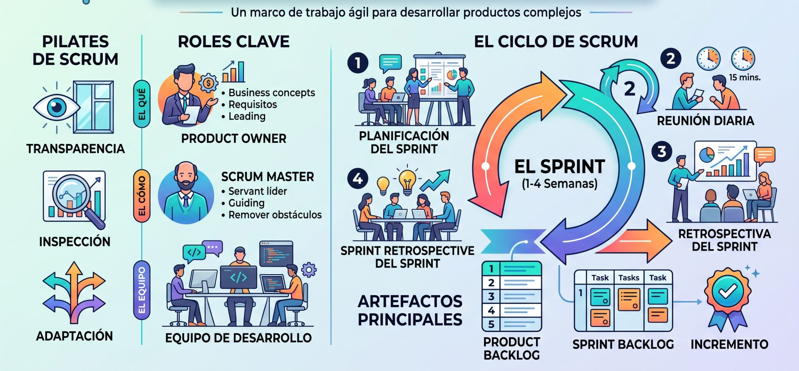
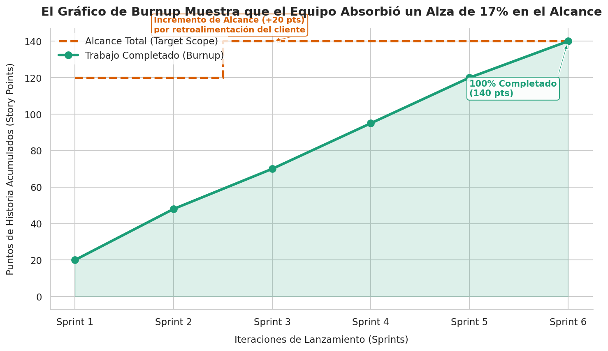
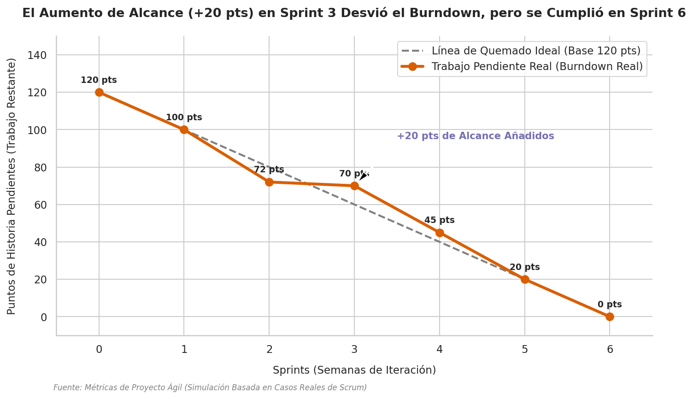

## **Scrum**

**Scrum** (cuyo nombre proviene de una formación inicial del rugby donde el equipo se agrupa para pelear por la posesión de la pelota) es un marco de trabajo (*framework*) iterativo e incremental diseñado para gestionar el desarrollo de productos y aplicaciones complejas. Fue formalizado originalmente en 1995 por Ken Schwaber y el Dr. Jeff Sutherland, inspirándose en un análisis de las mejores prácticas de manufactura ligera en Japón y, en particular, en el célebre estudio de Hirotaka Takeuchi e Ikujiro Nonaka de 1986 sobre equipos autoorganizados altamente eficientes.

A diferencia de las metodologías tradicionales que asumen que el desarrollo es un proceso completamente predecible, **Scrum asume que el proceso es inherentemente complejo e impredecible** (operando cerca del "borde del caos"), por lo que propone un control empírico basado en ciclos continuos de **inspección y adaptación**. Sus bases teóricas de experimentación científica son tan antiguas que se asemejan al método experimental de Alhazen, donde se formula una hipótesis, se ejecuta un experimento y se aprende de los resultados para ajustar el siguiente paso.

A continuación se detallan los roles, artefactos y eventos de Scrum.

### Los 3 Roles (El Equipo de Scrum)
Scrum equilibra el control del caos mediante una estricta división de responsabilidades entre tres roles clave, evitando la figura de un director de proyecto tradicional:

*   **El Dueño del Producto (*Product Owner*):** Es el responsable final de maximizar el valor del producto y el retorno de la inversión (ROI). Es la **única persona** con autoridad para definir y priorizar los requisitos dentro de la lista de trabajo pendiente del producto (*Product Backlog*).

*   **El Equipo de Desarrollo (*Scrum Delivery Team*):** Es un grupo multidisciplinario (usualmente de 5 a 9 personas) que cuenta con todas las capacidades técnicas necesarias para construir el producto de forma autónoma y autoorganizada. Ellos deciden de manera exclusiva cómo realizar el trabajo técnico y qué volumen de tareas se comprometen a entregar.

*   **El Scrum Master:** Es un líder de servicio y el guardián del proceso Scrum. Se encarga de eliminar los impedimentos que bloquean al equipo, facilitar las reuniones de manera productiva y proteger a los desarrolladores de interrupciones externas para mantener su enfoque.

### Los 3 Artefactos
Los artefactos representan el trabajo o el valor en diferentes etapas del ciclo, diseñados para garantizar una transparencia absoluta:

*   **Pila del Producto (*Product Backlog*):** Una lista ordenada por prioridad que contiene todas las características, mejoras, correcciones y requisitos tecnológicos que el producto podría necesitar a lo largo de su vida útil. Es un documento "vivo" en constante evolución.

*   **Pila del Sprint (*Sprint Backlog*):** El conjunto de elementos seleccionados del Product Backlog para el Sprint en curso, desglosados en tareas técnicas detalladas. El equipo actualiza diariamente el esfuerzo estimado restante para finalizar cada tarea.

*   **Incremento de Producto:** Es la parte de software o producto funcional, completamente probada e integrada, que se entrega al final de cada ciclo y que cumple rigurosamente con la **Definición de Terminado** (*Definition of Done* - DoD) acordada.

### Los 5 Eventos (Las Ceremonias)
Scrum estructura el trabajo en bloques de tiempo preestablecidos (*timeboxes*) que nunca se pueden exceder:

*   **El Sprint:** Es el corazón de Scrum. Una iteración de duración fija (un mes o menos, típicamente de 2 a 4 semanas) en la que se produce un incremento potencialmente entregable. La duración de un sprint es rígida y nunca se extiende.

*   **Planificación del Sprint (*Sprint Planning*):** Reunión colaborativa que inicia el Sprint. En la primera parte, el Product Owner explica qué valor necesita y por qué; en la segunda parte, el equipo analiza cómo lo va a construir y se compromete con un alcance realista.

*   **Scrum Diario (*Daily Scrum*):** Reunión de pie de máximo 15 minutos donde el equipo de desarrollo se sincroniza. Cada miembro responde a tres preguntas básicas para organizar las siguientes 24 horas y alertar sobre obstáculos: ¿Qué hice ayer?, ¿Qué haré hoy?, y ¿Qué impedimentos tengo?.

*   **Revisión del Sprint (*Sprint Review*):** Evento informal al final del Sprint (prohibido usar diapositivas o PowerPoints) donde el equipo demuestra el incremento real funcionando a los interesados y al Product Owner para obtener retroalimentación directa.

*   **Retrospectiva del Sprint (*Sprint Retrospective*):** El espacio donde el equipo inspecciona su propio proceso de trabajo, relaciones y herramientas con el fin de acordar e implementar una o dos mejoras de calidad concretas en el próximo Sprint.

### Ejemplos de Implementación

Casos de estudio y ejemplos que ilustran cómo operan estos conceptos en la práctica:

#### Ejemplo A: Diálogo en un Scrum Diario (Maduro vs. Rutinario)
El Scrum Diario no es una reunión de reporte de estado a un jefe, sino una conversación de autoorganización. Se contrastan dos escenarios:
*   *El caso rutinario:* Bob le reporta mecánicamente al Scrum Master: "Subí el código de inicio de sesión. No estoy bloqueado". El Scrum Master le pregunta si actualizó el tablero y pasa al siguiente desarrollador. No hay interacción real.

*   *El caso maduro y proactivo:* Bob se dirige **al equipo** y dice: "Muchachos, subí el código de inicio de sesión. Al hablar con el cliente, descubrí que la cuenta debe suspenderse tras tres intentos fallidos. No estaba en los criterios de aceptación originales, pero lo agregué porque tenía tiempo". Inmediatamente, José (encargado de pruebas) reacciona: "Excelente, entonces hoy escribiré pruebas funcionales para cubrir ese escenario de los tres intentos". El equipo se autoorganiza en tiempo real sobre la marcha.

#### Ejemplo B: El Sprint Review estilo "Feria de Ciencias"
En un programa de desarrollo a gran escala con múltiples equipos, las demostraciones tradicionales pueden volverse aburridas y unilaterales. 
*   **La solución implementada:** Una organización dividió a sus 30 partes interesadas (*stakeholders*) en pequeños grupos y organizó el Sprint Review como una feria de ciencias. Cada uno de los 10 equipos de Scrum tenía su propia estación de trabajo. Al sonar una bocina cada 15 minutos, los interesados rotaban de estación para experimentar de forma práctica (*hands-on*) con el software desarrollado por cada equipo y dar retroalimentación directa con planillas. Al finalizar, comieron pizza juntos y consolidaron las ideas en el Product Backlog.

#### Ejemplo C: Equipos distribuidos "Siguiendo al Sol" (*Follow the sun*)
Una institución financiera estadounidense implementó Scrum con un equipo disperso geográficamente entre la costa este de EE. UU. e India.
*   **La solución implementada:** Para evitar problemas de comunicación, estructuraron una superposición de horarios de trabajo. Los roles clave en EE. UU. (diseñadores de experiencia de usuario, analistas de negocio y dueños de producto) entraban muy temprano por la mañana para realizar las reuniones diarias por cámara web de manera conjunta, responder de inmediato a las dudas técnicas del equipo de desarrollo en India y resolver impedimentos antes de que el equipo en India terminara su jornada laboral.

#### Ejemplo D: El rol del CEO en la priorización del Backlog
En una compañía donde múltiples partes interesadas tenían intereses conflictivos, existía una constante lucha interna que impedía a los Product Owners priorizar de manera limpia, provocando caos en el equipo de desarrollo.
*   **La solución implementada:** El CEO de la compañía (quien era una personalidad de la televisión estadounidense) asistió personalmente a una sesión de planificación. Expuso de manera contundente la visión estratégica de la empresa, lo que hizo que la prioridad del Product Backlog quedara inmediatamente clara. Al alinearse con el mensaje del CEO, las partes interesadas aceptaron que sus requerimientos menos críticos bajaran de posición en la pila, permitiendo al equipo trabajar sin desorden.

#### Ejemplo E: Organicidad en un equipo de Startup de 5 personas
El marco se puede simplificar en organizaciones muy pequeñas si se mantienen los principios fundamentales.
*   **La solución implementada:** En una startup de juegos móviles de Silicon Valley compuesta por solo 5 personas, un miembro (Darren) asumió simultáneamente el rol de Scrum Master y Product Owner (e incluso programaba ocasionalmente). Debido a que trabajaban codo a codo en una oficina pequeña, eliminaron el Scrum Diario por redundante. Sin embargo, mantuvieron la disciplina de trabajar con un Product Backlog priorizado y la entrega estricta de un incremento de valor cada dos semanas para sus inversores, demostrando la agilidad del modelo.

## **Herramientas de control**

El **Gráfico de Quemado** o **Diagrama de Quemado** (*Burndown Chart*) es uno de los radiadores de información y herramientas de control visual más importantes en los proyectos ágiles. Su función principal es **comparar de manera diaria el estado del trabajo restante en una iteración (o lanzamiento) frente a lo que se había planificado originalmente**, permitiendo al equipo y a los interesados tomar decisiones oportunas basadas en datos empíricos de progreso real.

A continuación, se detalla su diseño, funcionamiento, tipos y ejemplos prácticos.

### El Concepto Clave: Trabajo Restante vs. Tiempo Transcurrido
A diferencia de los informes de avance de la gestión tradicional de proyectos, que suelen medir el "porcentaje de avance" o las horas consumidas en el pasado (datos que el creador de Scrum considera poco útiles para predecir sorpresas en la integración física final), el gráfico de quemado tiene una filosofía radicalmente distinta: **mide exclusivamente el esfuerzo que queda hacia el futuro para alcanzar el objetivo**. 

Su diseño ideal es un gráfico cartesiano donde:
*   El **eje horizontal (X)** representa la variable temporal (días laborables del sprint o sprints de un lanzamiento).
*   El **eje vertical (Y)** representa la cantidad de esfuerzo estimado que queda por completar (medido en horas de tareas o puntos de historia).
*   La **línea de guía ideal (línea punteada)** traza una diagonal que parte desde el total del esfuerzo planificado el día 1 y disminuye linealmente hasta tocar el valor **cero** en el último día de la iteración.
*   La **línea real (línea continua o dentada)** representa la suma acumulada del trabajo real pendiente de culminar al final de cada jornada.

### Los Dos Tipos de Gráficos de Quemado

El "microscopio de Scrum" aplica este gráfico en distintas escalas de magnificación para audiencias y objetivos específicos:

#### A. Sprint Burndown Chart (Lente de 16x/32x - Para el Equipo de Desarrollo)
Sirve para que el equipo gestione el día a día del Sprint y detecte desviaciones tempranas.
*   **Métrica:** Se calcula sumando las **horas restantes de trabajo de cada tarea** dentro del *Sprint Backlog*. 
*   **Actualización:** Diariamente en el *Daily Scrum*, cada desarrollador evalúa sus tareas en progreso y actualiza no las horas que trabajó, sino el **estimado de horas teóricas que aún le hacen falta** para terminar la tarea.
*   **Enfoque de bajo costo técnico (Low-Tech/High-Touch):** Aunque existen aplicaciones digitales, se señala que muchos equipos prefieren dibujar el gráfico a mano en una pizarra o papel en la pared. En estos casos, en lugar de sumar horas, es sumamente efectivo y rápido simplemente **contar el número de tareas físicas pendientes** (siempre y cuando cada tarea se descomponga en tamaños pequeños de 8 horas o menos).

#### B. Release / Product Burndown Chart (Lente de 4x - Para el Product Owner y Gestión)
Muestra de forma macro el progreso hacia el lanzamiento de una versión del producto que abarca múltiples sprints.
*   **Métrica:** Utiliza **puntos de historia** (*story points*) de los requisitos del *Product Backlog* en lugar de horas detalladas.
*   **Utilidad:** Al final de cada Sprint, el Product Owner actualiza el gráfico restando los puntos de las historias efectivamente terminadas (basado estrictamente en la *Definición de Terminado* y la aceptación del cliente). Al proyectar la tendencia de la línea real hacia el eje X, el Product Owner obtiene visibilidad temprana de si la versión se completará a tiempo o si debe negociar el alcance o la fecha con el negocio.

### Ejemplo Práctico de Diseño y Proyección 
**(Sprint de 15 días / 300 horas)**

Un caso muy concreto que ilustra cómo se utiliza esta herramienta para predecir el progreso en el control de un cronograma:

#### El Escenario de Planificación:
*   **Alcance:** Se seleccionan **4 funcionalidades** (historias de usuario) para una iteración de **15 días**.
*   **Esfuerzo Inicial:** El equipo desglosa estas funcionalidades en tareas y estima que se requerirán **300 horas totales** de trabajo (un promedio de 75 horas por funcionalidad).
*   **Plan Base:** En el gráfico, el Día 1 se marca un punto en el valor de 300 horas. Se dibuja una diagonal punteada de guía que decrece paulatinamente (Día 5 = 220 hrs, Día 10 = 120 hrs, Día 15 = 20 hrs, Día 16 = 0 hrs).

#### El Registro Diario Real:
Al concluir cada reunión diaria, se suman las estimaciones de horas restantes reportadas por el equipo y se grafican:
*   **Día 1:** Quedan **300 horas** (Inicio).
*   **Día 3:** El plan ideal preveía 260 horas, pero el equipo registra **240 horas** reales pendientes (el equipo va un poco adelantado).
*   **Día 7:** El plan preveía 180 horas, pero el avance real muestra **200 horas** restantes (comienzan a presentarse retrasos).
*   **Día 11:** El plan marcaba 100 horas restantes, pero el equipo registra **150 horas** reales de trabajo pendiente.

#### La Conclusión de la Proyección:
Al trazar una línea de tendencia basada en la información histórica acumulada hasta el Día 11, se hace evidente que el equipo **no completará todas las actividades planificadas al llegar al Día 15**. 

**¿Qué se hace ante esta alerta?** En lugar de forzar al equipo a trabajar jornadas extenuantes que degraden la calidad del código, el equipo se reúne inmediatamente con el Product Owner para analizar las lecciones aprendidas, re-priorizar las tareas y **retirar una de las funcionalidades de menor prioridad** (la cual volverá al *Product Backlog* para ser priorizada en futuros sprints). De esta forma, el equipo asegura entregar un incremento 100% terminado y libre de defectos para las otras 3 historias restantes.

### Cómo "Leer" las Curvas del Gráfico de Quemado

La forma que adquiere la línea real diaria revela síntomas muy claros sobre la salud del equipo y el proyecto:

*   **Línea por encima de la diagonal (Atrasados):** Es un indicador claro de impedimentos o de que el equipo subestimó la complejidad del trabajo. Advierte el riesgo inminente de no cumplir con la entrega de valor.
*   **Línea por debajo de la diagonal (Adelantados):** Indica que las tareas fueron sobreestimadas (el equipo fue demasiado conservador). Si la tendencia muestra que terminarán mucho antes de lo previsto (por ejemplo, en el Día 10 de un Sprint de 24 días), es una invitación a celebrar una mini-planificación con el Product Owner para arrastrar (*pull*) nuevas historias al Sprint.
*   **Zonas planas u horizontales (Mesetas):** Muestran que los días transcurren pero el trabajo pendiente no disminuye. Esto suele ocurrir cuando los miembros del equipo están realizando demasiadas tareas simultáneas (multitarea), cuando las historias seleccionadas son demasiado grandes para cerrarse de manera ágil, o cuando hay impedimentos críticos no resueltos bloqueando el flujo.

### Alternativa Visual: El Gráfico de Trabajo Realizado (*Burnup Chart*)
Algunos equipos prefieren utilizar un **gráfico de trabajo realizado (*Burnup Chart*)**, el cual muestra la cantidad acumulada de trabajo completado en lugar del trabajo pendiente. 

La gran ventaja del *Burnup* frente al *Burndown* es que **permite visualizar de manera transparente los cambios en el alcance**. Mientras que un aumento de alcance en un *Burndown* hace que la línea suba (lo que a veces confunde o desmotiva al equipo), el *Burnup* maneja **dos líneas independientes**: una línea para el trabajo completado y otra en la parte superior para el "alcance total de la iteración". Si el cliente añade historias a mitad del sprint, la línea de alcance total sube, dejando claro que el equipo sigue avanzando de manera constante aunque la distancia hacia la meta se haya ampliado.

### Ejemplos

El **Gráfico de Burnup** generado ilustra cómo el equipo de desarrollo logró absorber exitosamente **un incremento del 17% en el alcance del proyecto** (de 120 a 140 puntos de historia) en el Sprint 3 debido a la retroalimentación del cliente, alcanzando aun así el 100% de la entrega hacia el final de la iteración en el Sprint 6.

📊 **Análisis del Gráfico de Burnup:**

1. **La Línea de Alcance Total (Naranja - Trazo Discontinuo):** 
   A diferencia del gráfico de *Burndown*, aquí puedes ver con total claridad cuándo cambia la meta. El proyecto se planificó originalmente para completar **120 puntos de historia**. En el **Sprint 3**, el cliente solicitó nuevos requisitos de alta prioridad, lo que elevó la línea del alcance hasta **140 puntos**. Esto permite que el aumento de alcance (*scope creep*) quede registrado de forma transparente para los interesados de negocio.

2. **La Línea de Trabajo Completado (Verde - Trazo Continuo):** 
   Esta línea representa el progreso acumulativo del equipo. Aunque el alcance subió en el Sprint 3, la línea verde muestra que el equipo no perdió el ritmo y continuó entregando valor constantemente en cada ciclo (Sprint 1: 20 pts, Sprint 2: 48 pts, Sprint 3: 70 pts, Sprint 4: 95 pts, Sprint 5: 120 pts, hasta cerrar con **140 puntos terminados en el Sprint 6**).

3. **El Área Sombreada:** 
   Representa visualmente el esfuerzo acumulado y la velocidad de entrega del equipo de desarrollo, la cual se mantuvo constante y estable a lo largo de las iteraciones.

📊 **Gráfico de Burndown** 

Este gráfico utiliza exactamente los mismos datos del escenario (partiendo de una base de 120 puntos de historia y un incremento de alcance de +20 puntos en el Sprint 3), ilustrando de forma muy clara cómo se comporta y se interpreta una curva de trabajo restante ante los cambios en el proyecto.

#### ¿Cómo interpretar el Gráfico de Burndown generado?

1. **La Curva Plana en el Sprint 3 (El Efecto del Alcance):**
   Si observas la línea del **Trabajo Pendiente Real (línea naranja)**, entre el Sprint 2 y el Sprint 3 el valor pendiente pasa de **72 puntos a 70 puntos**. A simple vista, para un observador externo o un cliente, parecería que el equipo de desarrollo estuvo "casi inactivo" o tuvo una productividad extremadamente baja en ese ciclo, ya que el trabajo pendiente solo disminuyó en 2 puntos.

   * **La Realidad detrás de los Datos:** El equipo de desarrollo en realidad completó **22 puntos de historia** durante el Sprint 3. Sin embargo, debido a que el cliente añadió **20 puntos de nuevo alcance** de forma simultánea, el gráfico de burndown absorbió este incremento "jalando" la curva hacia arriba. 

   * **El Desafío Visual:** Esto demuestra el mayor reto del Gráfico de Burndown: **tiende a enmascarar los cambios de alcance**. Sin una anotación clara (como la que hemos colocado en color morado), un retraso por alcance añadido se confunde fácilmente con baja productividad o deuda técnica del equipo.

2. **La Desviación frente al Quemado Ideal:**
   La **Línea de Quemado Ideal (línea gris discontinua)** asume un ritmo lineal constante para quemar los 120 puntos iniciales en 6 sprints. Al sufrir el aumento de alcance en el Sprint 3, la línea real naranja se sitúa y se mantiene por encima de la línea ideal durante el resto del proyecto, reflejando que el equipo está "atrasado" respecto al plan original de 120 puntos, aunque en realidad están trabajando a un excelente ritmo y asumiendo mayor responsabilidad.

3. **La Convergencia en el Sprint 6:**
   Finalmente, en el Sprint 6 el equipo logra "quemar" las últimas 20 horas de esfuerzo restante, tocando el valor **cero** y completando de manera exitosa la totalidad de los **140 puntos de historia** acumulados.

#### Burndown vs. Burnup en la toma de decisiones

* **Usa el Gráfico de Burndown (como este) para el día a día del equipo:** Es excelente para que los desarrolladores vean la meta final (llegar a cero) y autogestionen su esfuerzo diario durante la iteración.

* **Usa el Gráfico de Burnup para reportar a los Stakeholders:** Al separar el progreso real (línea de entrega) del alcance total (línea de alcance), el Burnup evita malentendidos y demuestra de manera transparente que el equipo avanza de forma constante, incluso cuando el cliente no deja de añadir nuevos requisitos.

