**¿Qué es un programa?** básicamente es un archivo con ciertas instrucciones que hace que un computador realice acciones que de lo contrario lo convierten en un conjunto de fierros y circuitos, como un buen pisapapeles. Nada hace.

Las computadoras solo ejecutan operaciones simples. Solo evalúan el resultados de las operaciones fundamentales, como sumar, dividir, restar y multiplicar, pero sin embargo lo hacen a velocidades muy rápidas y con una alta tasa de frecuencia.

Las operaciones ue realiza, las efectúa sin comprensión de su significado.

### Componentes Internos del Computador y sus Funciones
Los componentes electrónicos de un computador (CPU, Disco, memoria ram)

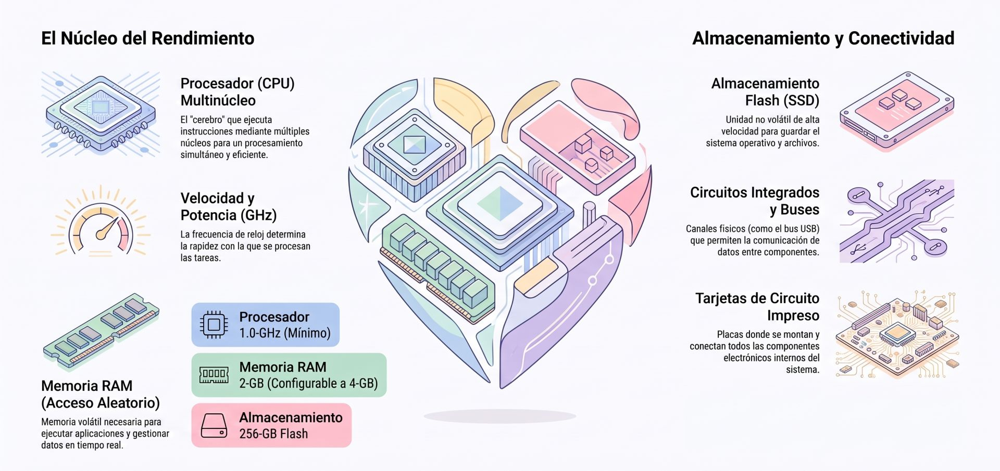

El procesador

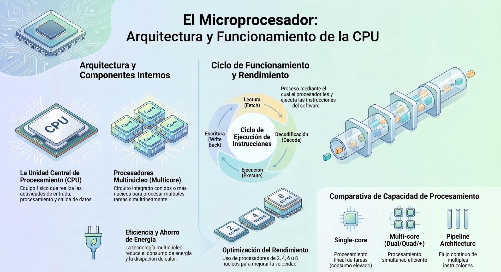


<div class="container">
  <div class="row">
    <div class="col col--6">
    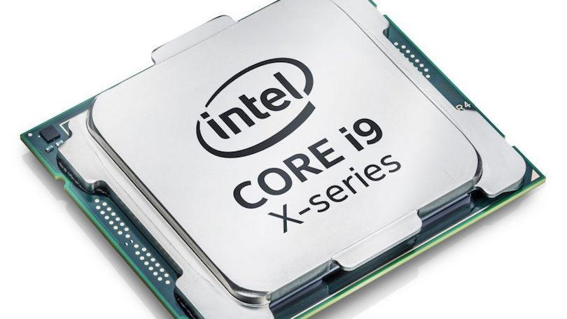
    </div>
    <div class="col col--6">
    **Unidad Central de Procesamiento (CPU / Procesador):** Es el motor de cómputo responsable de leer, interpretar y ejecutar las instrucciones programadas en el software. Realiza las operaciones aritméticas, lógicas y el control del flujo del programa. Los procesadores contemporáneos incorporan **múltiples núcleos (*multicore*)** en un solo chip para ejecutar tareas simultáneas con mayor rendimiento y menor consumo de energía.
    </div>
    <div class="col col--6">
    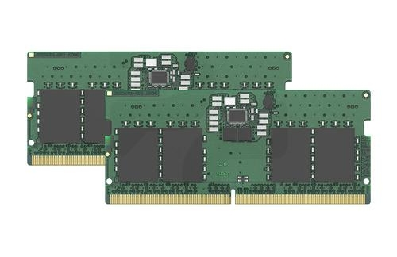
    </div>
    <div class="col col--6">
    **Memoria Principal (RAM):** Es el espacio de almacenamiento volátil y de alta velocidad donde se mantienen temporalmente los datos, las variables, las instrucciones de la aplicación y los objetos activos que la CPU requiere procesar en tiempo real. Un mayor tamaño de memoria evita cuellos de botella y permite ejecutar tareas complejas en memoria (*in-memory computing*).
    </div>
    <div class="col col--6">
    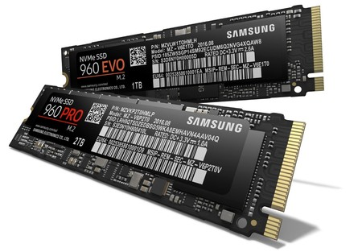
    </div>
    <div class="col col--6">
    **Dispositivos de Almacenamiento Secundario (Discos HDD/SSD/NVM):** Proporcionan **persistencia de datos** de carácter permanente o semipermanente. Almacenan el sistema operativo, los archivos maestros, las bases de datos y los programas fuente de manera que la información sobreviva al apagado del equipo o al cierre de las sesiones de software.
    </div>
  </div>
</div>


* **Sistema de Entradas/Salidas (E/S) y Controladores (*Drivers*):** Los controladores de dispositivos (*device drivers*) y buses de comunicación sirven como interfaz entre el hardware físico (teclados, lectores de código de barras, pantallas, tarjetas de red) y el sistema operativo, gestionando el intercambio de señales de entrada y salida.

:::info[Actividad:]
Investiga acerca de los siguientes aspectos:
1. ¿Cómo funciona el **CPU** a nivel de microcircuitos?
2. El sistema binario y conversión numérica y textual
:::

### Relación entre el Hardware y los Lenguajes de Programación

<center>
<figure>
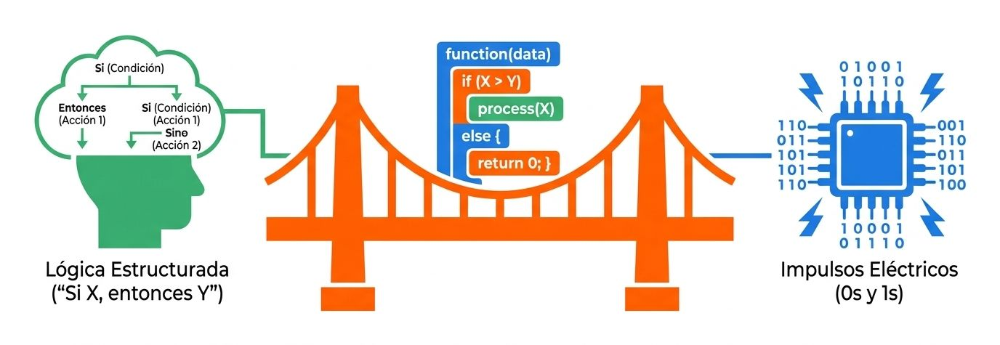
<figcaption>Un **lenguaje de programación** es el puente que convierte las abstracciones lógicas de alto nivel (humanas) en secuencias de instrucciones binarias que controlan el hardware físisco.</figcaption>
</figure>
</center>

Una computadora puede calcular fácilmente la velocidad de un viaje conocidos distancia y tiempo. Pero desconoce los conceptos mencionados, por ello se instruye a la computadora con lo siguiente:
* acepta un número que representa la distancia
* acepta un número que represente el tiempo
* divide el primer valor por el segundo valor y guarda ese resultado en la memoria de trabajo
* muestra el resultado (que representa velocidad) en un formato legible

Estas acciones constituyen un programa. Que traduce estas instruccione a un lenguaje que la computadora entiende.


La conexión entre los componentes físicos y el código de software se organiza a través de distintos **niveles de abstracción y mecanismos de traducción**:

1. **Lenguaje Máquina y Código Binario:** En el nivel más bajo, la CPU solo es capaz de entender e interpretar instrucciones en código binario (secuencias de unos y ceros).

2. **Lenguajes de Bajo Nivel / Ensamblador:** Interactúan de forma directa con los registros del procesador y las rutinas físicas de entrada/salida (*low-level I/O*), estando íntimamente ligados a la arquitectura del hardware específico.

3. **Lenguajes de Alto Nivel (Python, Java, C++, C#, etc.):** Permiten escribir instrucciones utilizando abstracciones lógicas del dominio del problema, liberando al programador de gestionar manualmente los detalles físicos de la arquitectura de la computadora.

4. **Mecanismos de Traducción (Compiladores e Intérpretes):** 
   * **Compiladores:** Traducen el código fuente escrito en lenguajes de alto nivel a código máquina ejecutable nativo para el procesador.
   * **Máquinas Virtuales e Intérpretes:** Lenguajes como Java o C# utilizan un entorno de ejecución abstracto (**Virtual Machine**) que actúa como una capa intermedia entre la aplicación y el hardware. La máquina virtual interpreta o compila en tiempo de ejecución las instrucciones intermedias (*bytecodes*) para la CPU específica, garantizando la portabilidad del software en diferentes plataformas.

5. **Mapeo de Memoria:** Las variables, estructuras de datos y objetos declarados en el código de un programa se asignan y traducen a **direcciones físicas en la memoria RAM** durante la ejecución.

6. **Comunicación con Periféricos:** Para que un programa de alto nivel controle componentes físicos (como una caja registradora, una pantalla táctil o una impresora), utiliza bibliotecas o interfaces nativas (por ejemplo, **JNI - Java Native Interface**) que invocan los controladores (*drivers*) de bajo nivel del sistema operativo.


---
## **El programar**

**Programar** es el proceso de diseñar, construir e instruir a una computadora para que ejecute tareas específicas o resuelva un problema determinado utilizando un lenguaje que la máquina pueda entender. 

<center>
<figure>
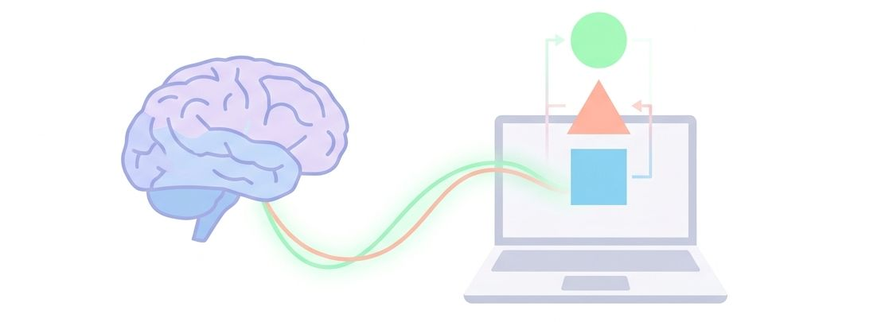
<figcaption>**El arte de programar**. Diseñar, construir y dar vida a las ideas para solucionar problemas o crear innovación.</figcaption>
</figure>
</center>

Dado que las computadoras no poseen pensamiento propio, necesitan ser instruidas paso a paso sobre cómo realizar una acción, evaluar condiciones, procesar datos y reaccionar ante situaciones imprevistas.


#### ¿Qué implica realmente la programación?

* **Es una técnica de resolución de problemas:** Más que simplemente escribir código, aprender a programar consiste en aprender a **pensar de forma lógica y estructurada** para descomponer un problema complejo en una secuencia organizada de pasos.
* **Consta de un ciclo completo:** El proceso de programación abarca la comprensión del problema, la elaboración del **algoritmo** (la receta o secuencia lógica), la traducción a la sintaxis del lenguaje de programación, la ejecución, la **verificación** de los resultados y la **depuración** (*debugging*) para corregir errores.
* **Exige máxima precisión:** A diferencia de la comunicación humana, la comunicación con una computadora requiere una exactitud absoluta, ya que el intérprete o compilador no asume intenciones y ejecuta estrictamente las instrucciones escritas sin tolerar ambigüedades o errores sintácticos.

<div class="container">
  <div class="row">
    <div class="col col--7">
    <center>
    <figure>
    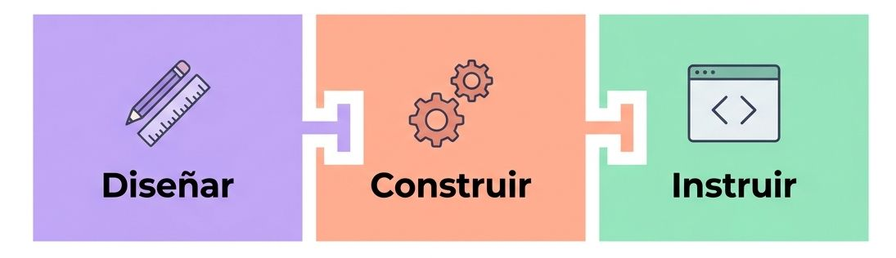
    </figure>
    </center>
    </div>
    <div class="col col--5">
    **¿Qué es programar?**

    Es el proceso de diseñar, construir e instruir a una computadora para que ejecute tareas específicas o resuelva un problema determinado utilizando un lenguaje que la máquina pueda entender.
    </div>
  </div>
</div>

<br/>

<div class="container">
  <div class="row">
    <div class="col col--7">
    <center>
    <figure>
    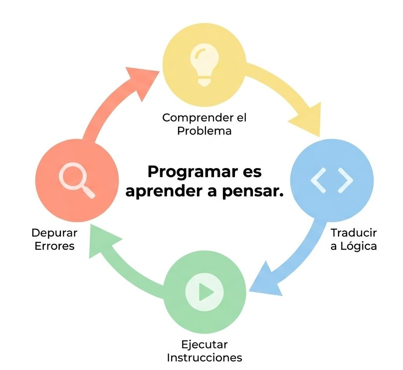
    </figure>
    </center>
    </div>
    <div class="col col--5">
    **Pensar lógico**

    En forma muy resumida el aprendizaje de programación, visto en forma simple, es aprender a pensar en términos acotados, ajustarse al problema. Como primera meta es abordar un problema con un punto de vista amplio, para luego "traducir" en términos lógicos una serie de instrucciones (algoritmos) que se ejecutarán en un computador. Si hay errores o mejoras se analizan y entran al ciclo nuevamente.
    </div>
  </div>
</div>

---
## **El ciclo**

El **ciclo de vida del software** (conocido comúnmente como **SDLC** o *Software Development Life Cycle*) es el marco metodológico de fases y actividades que guía la construcción, evolución y mantenimiento de un sistema de información o aplicación desde su concepción inicial hasta su retiro. Su objetivo principal es estructurar el trabajo para garantizar que el producto final cumpla con los requisitos del usuario, mantenga un alto nivel de calidad y respete las restricciones de tiempo y presupuesto.

<center>
<figure>
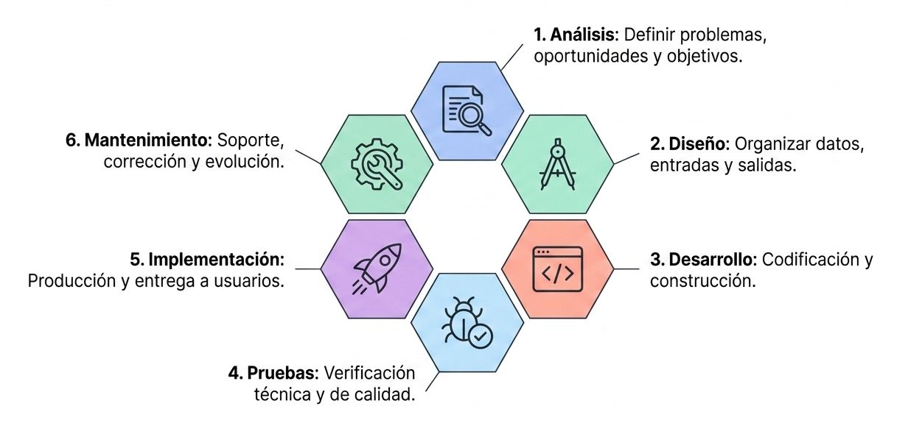
<figcaption></figcaption>
</figure>
</center>


### Fases Fundamentales

Aunque la cantidad de fases y su denominación específica puede variar según la metodología elegida, el ciclo clásico abarca las siguientes etapas:

1. **Análisis y Definición de Requisitos:** Se identifica la necesidad o problema de negocio, se evalúa la viabilidad del proyecto y se recopila de forma detallada qué debe hacer el nuevo sistema.

2. **Diseño del Sistema:** Se traducen los requisitos en especificaciones técnicas de arquitectura, modelos de datos (como DFD o diagramas UML) y flujos de interfaz de usuario.

3. **Desarrollo y Programación (Codificación):** Los desarrolladores traducen las especificaciones del diseño en código fuente ejecutable utilizando lenguajes de programación.

4. **Pruebas (Testing / Verificación y Validación):** Se somete el software a pruebas lógicas, unitarias, de integración y de aceptación para detectar y corregir errores (*bugs*) antes de entregarlo.

5. **Implementación y Conversión:** Se despliega el sistema en el entorno real de producción, se capacita a los usuarios finales y se migran los datos del sistema antiguo.

6. **Producción y Mantenimiento:** Una vez instalado, el sistema entra en operación continua; en esta fase se corrigen errores no detectados, se actualiza la infraestructura y se agregan nuevas mejoras (*enhancements*) solicitadas por el cliente.


### Enfoques y Modelos Principales

Las metodologías se distribuyen en un continuo que abarca desde modelos completamente predictivos hasta modelos altamente adaptativos:

[Ir a los marcos de trabajo ➡️​](/docs/modelamiento/metodologias)


***
## **Lenguaje de máquina**

A nivel de **hardware y arquitectura de procesadores**, una **lista o secuencia de instrucciones (IL)** es la serie ordenada de comandos en código máquina (binario) almacenada en memoria que la Unidad Central de Procesamiento (CPU) lee, interpreta y ejecuta para realizar el cómputo de un programa.

Este IL es de hecho el alfabeto de un lenguaje de máquina. Este es el conjunto de símbolos más simple que se puede utilizar para dar comandos a una computadora. 


#### Componentes del Hardware que Procesan la Lista
Para procesar la lista de instrucciones, la arquitectura de la CPU utiliza varios registros y componentes clave:

* **Program Counter (PC / Contador de Programa):** Registro que contiene la dirección de memoria de la siguiente instrucción en la lista que debe ser capturada.

* **Instruction Register (IR / Registro de Instrucción):** Almacena el código binario de la instrucción que se acaba de leer de la memoria o de la caché de instrucciones (L1i).

* **Unidad de Control (CU):** Analiza el código de operación (*opcode*) dentro de la instrucción y emite las señales eléctricas requeridas para activar los buses, registros y la Unidad Aritmético-Lógica (ALU).


#### Ejecución mediante Segmentación (*Pipelining*)
En las arquitecturas modernas de procesadores, la lista de instrucciones no se procesa de forma aislada (esperando a que una instrucción termine del todo para empezar la siguiente). 

En su lugar, se utiliza la técnica de **segmentación (*pipelining*)**, donde **múltiples instrucciones de la lista se ejecutan simultáneamente en el hardware**, estando cada una en una fase o filtro distinto del proceso (Captura -> Decodificación -> Ejecución -> Acceso a Memoria -> Escritura).


#### Relación con la Arquitectura del Conjunto de Instrucciones (ISA)
La estructura de las instrucciones en la lista depende de la especificación **ISA (*Instruction Set Architecture*)** del chip:

* **Arquitecturas RISC (ej. ARM, RISC-V):** Las instrucciones de la lista son simples, homogéneas y de tamaño fijo, diseñadas para ejecutarse idealmente en un solo ciclo de reloj.

* **Arquitecturas CISC (ej. x86_64):** La lista puede contener instrucciones complejas de tamaño variable. La Unidad de Control las traduce internamente a una secuencia más fina de **microoperaciones** de bajo nivel.


***
## **Lenguaje de programación**

Un **lenguaje de programación** es un sistema formal constituido por un conjunto de reglas, símbolos y algoritmos que permite a un desarrollador escribir código fuente con instrucciones precisas para ser procesadas y ejecutadas por una computadora. Funciona como el puente de comunicación entre la lógica humana del problema y el hardware de procesamiento. Permite entonces a un especialista escribir instrucciones estructuradas para que una computadora ejecute tareas específicas, procese información o controle algoritmos.

<center>
<figure>
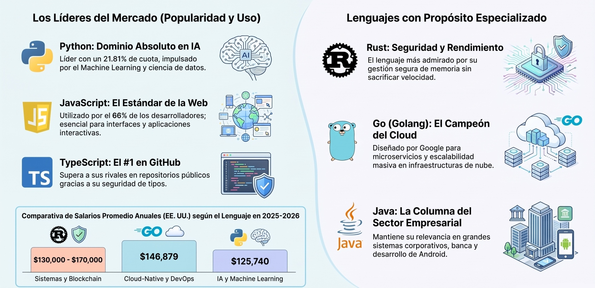
<figcaption>Lenguajes de programación y su impacto en la industria.</figcaption>
</figure>
</center>

Para estructurar y analizar cualquier lenguaje de programación (al igual que cualquier lenguaje formal o de modelado), se distinguen cuatro componentes y conceptos normativos clave:


### Conceptos Fundamentales

#### Alfabeto (Conjunto de Símbolos / Caracteres)
* **Definición:** Es el **conjunto finito y bien definido de símbolos elementales o caracteres gráficos** aceptados por el lenguaje como entradas válidas.
* **Detalle:** Incluye las letras (mayúsculas y minúsculas), dígitos numéricos, signos de puntuación y operadores matemáticos o lógicos (por ejemplo, `A-Z`, `a-z`, `0-9`, `+`, `-`, `=`, `;`, `{`, `}`).
* **Función:** Representa el nivel básico de entrada que lee el entorno antes de formar términos con significado.

#### Léxico (Vocabulario / *Tokens*)
* **Definición:** Es el **conjunto de palabras válidas, identificadores y componentes léxicos (*tokens*)** que se pueden construir combinando los caracteres permitidos en el alfabeto.
* **Detalle:** Incluye:
  * **Palabras reservadas o claves:** Términos con un significado prefijado por el lenguaje (ej. `if`, `while`, `class`, `return`, `maximize`).
  * **Identificadores:** Nombres creados por el desarrollador para definir variables, funciones o clases.
  * **Literales y Operadores:** Valores numéricos, cadenas de texto encerradas entre comillas y símbolos operativos.
* **En el compilador:** El *analizador léxico* escanea el código texto para verificar que todos los términos formados sean vocablos válidos del lenguaje.

#### Sintaxis (Estructura / Gramática)
* **Definición:** Es el conjunto de **reglas formales y gramaticales que gobiernan la combinación estructurada de las unidades léxicas** para construir oraciones, expresiones y bloques de código válidos.
* **Detalle:** Determina la forma y la estructura correcta que debe tener el programa (por ejemplo, exigir paréntesis al definir una condición o terminar las sentencias con un punto y coma `;`).
* **Error Sintáctico:** Ocurre cuando el programador viola una regla de la gramática del lenguaje (por ejemplo, un paréntesis sin cerrar o una palabra clave mal colocada). El compilador detiene el proceso e informa del error antes de la ejecución.

#### Semántica (Significado e Interpretación)
* **Definición:** Es la **interpretación del significado de las construcciones sintácticamente correctas**; es decir, qué comportamiento o valor ejecuta realmente el software al correr el código.
* **Detalle:** La semántica relaciona los elementos de la sintaxis abstracta con un dominio de ejecución o modelo de cómputo.
* **Error Semántico:** Una instrucción puede ser sintácticamente impecable (respetar toda la gramática), pero carecer de sentido lógico o fallar en ejecución (por ejemplo, intentar dividir un número entre cero, declarar una variable e intentar sumar tipos de datos incompatibles, o generar un bucle infinito que no termina).


#### Resumen Analógico

| Nivel | En el Idioma Español | En un Lenguaje de Programación |
| :--- | :--- | :--- |
| **Alfabeto** | Las letras de la `A` a la `Z` y signos de puntuación. | Caracteres ASCII/Unicode (`a-z`, `0-9`, `{`, `}`, `;`). |
| **Léxico** | Palabras válidas del diccionario ("el", "perro", "corre"). | *Tokens*, palabras reservadas (`if`, `while`) y nombres de variables. |
| **Sintaxis** | Reglas gramaticales: *Sujeto + Verbo + Predicado* ("El perro corre"). | Estructura correcta de sentencias: `if (x > 0) { return true; }`. |
| **Semántica** | El sentido real de la frase (distinguir algo lógico de un absurdo). | El comportamiento en memoria y CPU durante la ejecución del programa. |


Respecto a **cuáles son los más populares actualmente**, los datos de fuentes de la industria como el **[TIOBE Index](https://www.tiobe.com/tiobe-index/)**, la encuesta anual de **[Stack Overflow 2025](https://survey.stackoverflow.co/2025/technology)** y el informe de **[Charisma University](https://charisma.edu.eu/insight/top-coding-languages/)** muestran que la popularidad varía según la métrica evaluada (búsquedas, uso en proyectos reales, actividad de código o satisfacción del desarrollador).


### Lenguaje populares

**Los lenguajes de programación más populares actualmente**:

A continuación se presenta el resumen de los **10 lenguajes de programación más populares y relevantes**, detallando sus características, paradigmas y usos principales:


#### 1. Python
<div class="container">
  <div class="row">
    <div class="col col--3">
    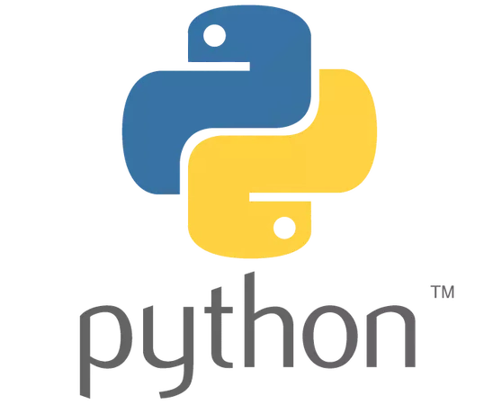
    </div>
    <div class="col col--9">

**Resumen:** Lidera los índices globales de búsqueda e interés general (como TIOBE y PYPL). Ha experimentado el mayor crecimiento interanual impulsado por el auge masivo de la Inteligencia Artificial y la Ciencia de Datos.

**Usos Principales:** Inteligencia Artificial (IA), Aprendizaje Automático (TensorFlow, PyTorch), Ciencia de Datos, desarrollo backend (Django, FastAPI), automatización y scripts.

**Paradigma Principal:** **Multiparadigma** (Orientado a Objetos, Imperativo y Funcional).
    </div>
  </div>
</div>

#### 2. JavaScript
<div class="container">
  <div class="row">
    <div class="col col--3">
    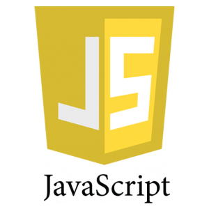
    </div>
    <div class="col col--9">
**Resumen:** Es el pilar fundamental del desarrollo web, presente en más del 98% de los sitios web del mundo. Ocupa la primera posición de adopción laboral entre los desarrolladores con un 66% de uso profesional según Stack Overflow.

**Usos Principales:** Desarrollo web frontend interactivo, aplicaciones web full-stack (mediante Node.js), aplicaciones móviles híbridas (React Native) y aplicaciones de escritorio (Electron).

**Paradigma Principal:** **Multiparadigma** (Basado en Prototipos, Funcional e Imperativo).
    </div>
  </div>
</div>


#### 3. TypeScript
<div class="container">
  <div class="row">
    <div class="col col--3">
    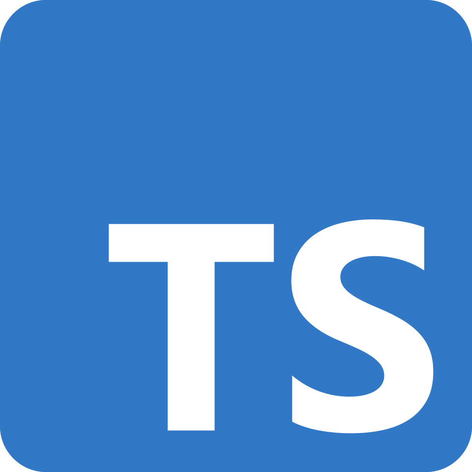
    </div>
    <div class="col col--9">
    **Resumen:** Desarrollado por Microsoft como un superconjunto tipado de JavaScript. Se convirtió en el lenguaje número 1 en GitHub por cantidad de contribuidores mensuales gracias a que el tipado estático mejora la fiabilidad del código asistido por IA.

**Usos Principales:** Aplicaciones web empresariales a gran escala, desarrollo con frameworks modernos (Next.js, Angular, SvelteKit) y APIs backend de alto rendimiento.

**Paradigma Principal:** **Multiparadigma** (Orientado a Objetos, Funcional e Imperativo con Tipado Estático).
    </div>
  </div>
</div>


#### 4. Java
<div class="container">
  <div class="row">
    <div class="col col--3">
    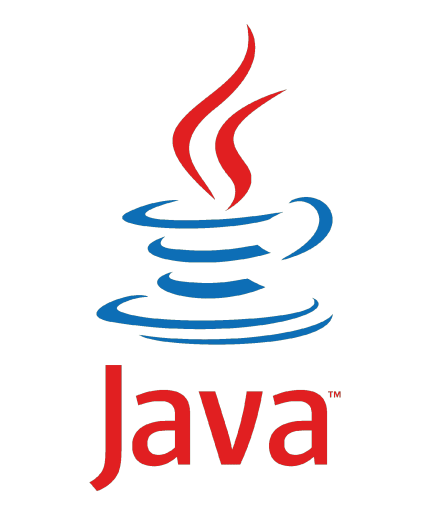
    </div>
    <div class="col col--9">
    **Resumen:** Basado en la filosofía *"Escribe una vez, ejecútalo en cualquier lugar"* a través de la Máquina Virtual de Java (JVM). Es la columna vertebral histórica de los sistemas corporativos y la infraestructura bancaria.

**Usos Principales:** Sistemas informáticos empresariales (ERP, CRM), aplicaciones bancarias y financieras, desarrollo móvil nativo en Android y procesamiento de Big Data (Hadoop, Spark).

**Paradigma Principal:** **Orientado a Objetos** (Estructurado en Clases).
    </div>
  </div>
</div>


#### 5. C# (C-Sharp)
<div class="container">
  <div class="row">
    <div class="col col--3">
    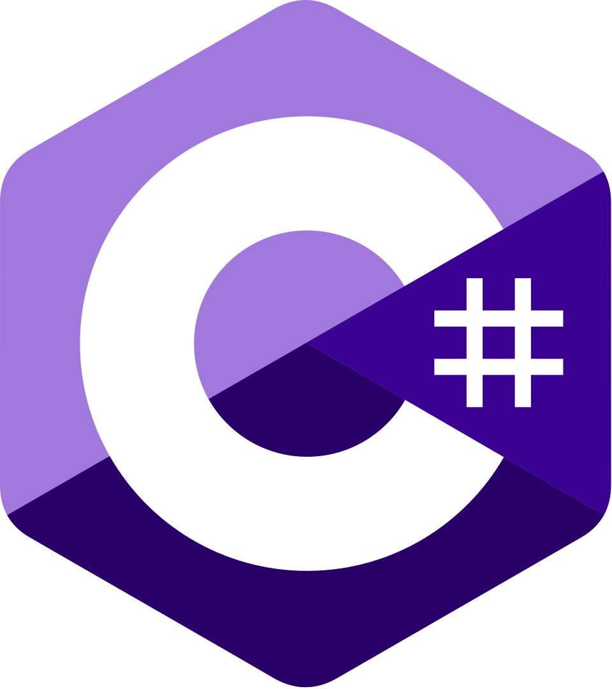
    </div>
    <div class="col col--9">

**Resumen:** Lenguaje desarrollado por Microsoft dentro del ecosistema .NET. Fue galardonado como "Lenguaje del Año" por TIOBE tras registrar el mayor incremento interanual de adopción.

**Usos Principales:** Desarrollo de videojuegos (motor gráfico Unity), desarrollo empresarial .NET, servicios web API, software de escritorio Windows e infraestructura en la nube.

**Paradigma Principal:** **Multiparadigma** (fuertemente Orientado a Objetos, Orientado a Componentes y Funcional).
    </div>
  </div>
</div>


#### 6. C++
<div class="container">
  <div class="row">
    <div class="col col--3">
    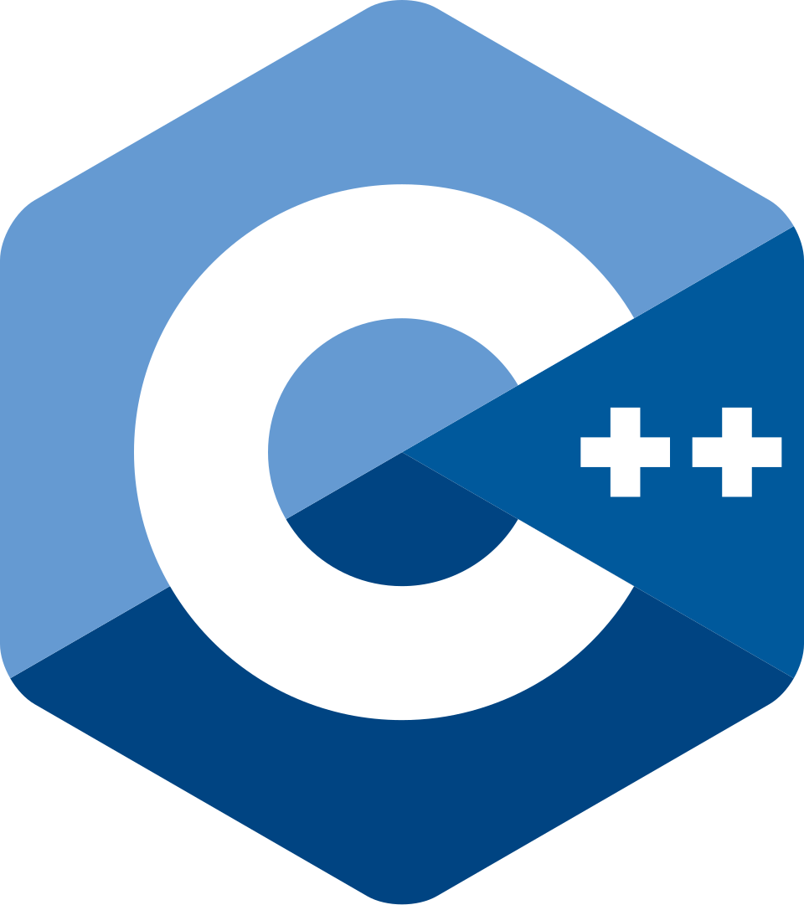
    </div>
    <div class="col col--9">

    **Resumen:** Extensión directa de C que incorpora orientación a objetos y abstracción sin renunciar al control directo de la memoria física y al rendimiento extremo a nivel de hardware.

**Usos Principales:** Motores de videojuegos de alta fidelidad (Unreal Engine), sistemas de tiempo real, trading financiero de alta frecuencia, sistemas embebidos y software de sistemas.

**Paradigma Principal:** **Multiparadigma** (Orientado a Objetos, Genérico y Procedimental).
    </div>
  </div>
</div>


#### 7. C
<div class="container">
  <div class="row">
    <div class="col col--3">
    
    </div>
    <div class="col col--9">

**Resumen:** Uno de los lenguajes más influyentes en la historia de la informática. Proporciona una ejecución de máxima velocidad y un acceso de bajo nivel a los recursos físicos del procesador y la memoria.

**Usos Principales:** Sistemas operativos (kernel de Linux, Windows y macOS), firmware, controladores de dispositivos (*drivers*), sistemas embebidos / IoT y herramientas de bajo nivel.

**Paradigma Principal:** **Imperativo / Procedimental**.
    </div>
  </div>
</div>


#### 8. Go (Golang)
<div class="container">
  <div class="row">
    <div class="col col--3">
    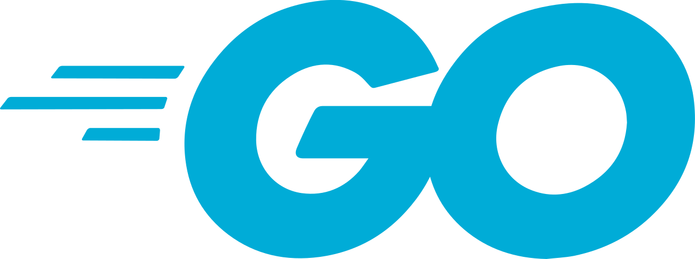
    </div>
    <div class="col col--9">

**Resumen:** Diseñado por Google para ofrecer simplicidad sintáctica, compilación ultrarrápida y soporte nativo para concurrencia masiva (*Goroutines*). Es el lenguaje estándar de la infraestructura en la nube.

**Usos Principales:** Aplicaciones *cloud-native*, arquitectura de microservicios, herramientas de DevOps e infraestructura (Docker, Kubernetes) y servicios backend concurrentes.

**Paradigma Principal:** **Concurrente e Imperativo** (Procedimental estructurado basado en interfaces).
    </div>
  </div>
</div>


#### 9. Rust
<div class="container">
  <div class="row">
    <div class="col col--3">
    
    </div>
    <div class="col col--9">

**Resumen:** Creado para ofrecer rendimiento al nivel de C/C++ y garantizar la seguridad de la memoria en tiempo de compilación sin utilizar un recolector de basura (*Garbage Collector*). Es el lenguaje más admirado por los desarrolladores por noveno año consecutivo en Stack Overflow.

**Usos Principales:** Programación de sistemas de alto rendimiento, infraestructura de servidores, tecnología blockchain, WebAssembly y componentes donde la seguridad de memoria es crítica.

**Paradigma Principal:** **Multiparadigma** (Funcional, Imperativo y Orientado a Objetos mediante *traits*).
    </div>
  </div>
</div>


#### 10. SQL (Structured Query Language)

<div class="container">
  <div class="row">
    <div class="col col--3">
    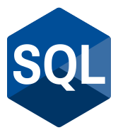
    </div>
    <div class="col col--9">

**Resumen:** Lenguaje de dominio específico estándar para la definición, gestión y consulta de datos almacenados en sistemas gestores de bases de datos relacionales.

**Usos Principales:** Consulta y gestión de bases de datos relacionales (PostgreSQL, MySQL, SQL Server, Oracle), análisis de inteligencia de negocios (BI) y reporte de datos.

**Paradigma Principal:** **Declarativo** (Consulta de datos).
    </div>
  </div>
</div>


#### Tabla Comparativa

| Lenguaje | Paradigma Principal | Usos Principales | Factor Destacado |
| :--- | :--- | :--- | :--- |
| **Python** | Multiparadigma (POO, Funcional) | IA, Aprendizaje Automático, Data Science, Web Backend | #1 en TIOBE y motor del auge de la IA. |
| **JavaScript** | Multiparadigma (Prototipos, Funcional) | Desarrollo Web Frontend, Node.js Full-stack, Móvil | #1 en adopción por desarrolladores (66%). |
| **TypeScript** | Multiparadigma (POO, Tipado Estático) | Web Empresarial, Next.js, Angular, APIs Backend | #1 en GitHub por contribuidores activos. |
| **Java** | Orientado a Objetos | Software Corporativo, Banca, Android, Big Data | Estándar en la industria empresarial y JVM. |
| **C#** | Multiparadigma (POO, Componentes) | Videojuegos (Unity), Ecosistema .NET, Servicios Web | Galardonado "Lenguaje del Año" por TIOBE. |
| **C++** | Multiparadigma (POO, Genérico) | Videojuegos (Unreal Engine), Sistemas, Trading | Máximo rendimiento con abstracción de objetos. |
| **C** | Imperativo / Procedimental | Sistemas Operativos (Kernel), Firmware, Drivers, IoT | Control absoluto del hardware y memoria física. |
| **Go (Golang)** | Concurrente e Imperativo | Cloud-Native, Microservicios, Docker, Kubernetes | Simplicidad y concurrencia nativa para la nube. |
| **Rust** | Multiparadigma (Funcional, Traits) | Sistemas, Blockchain, WebAssembly, Seguridad Crítica | El más admirado por 9 años consecutivos. |
| **SQL** | Declarativo | Gestión y Consulta de Bases de Datos Relacionales | Estándar universal para manipulación de datos. |


### ¿Porqué Python?

Python es un lenguaje de programación de muy alto nivel, multiparadigma y de propósito general, creado por Guido van Rossum a principios de los años 90. Se distingue por una sintaxis limpia, clara y sencilla que favorece la legibilidad, haciendo que sus programas a menudo parezcan "pseudocódigo ejecutable".

<div class="container">
  <div class="row">
    <div class="col col--8">
    <center>
<figure>
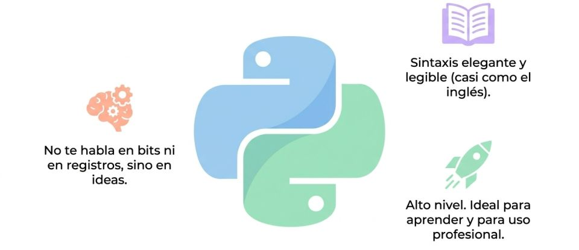
<figcaption></figcaption>
</figure>
</center>
    </div>
    <div class="col col--4">
    En síntesis, es un lenguaje fácil de aprender, de rápida lectura ya que es muy cercano a pseudocódigo. 

    Además es muy versátil, se utiliza casi para todo, desde páginas web hasta inteligencia artificial ( es su lenguaje por defecto en la mayoría de los casos).
    </div>
  </div>
</div>

---
## **Elementos de programación**

Todo lenguaje de programación manejará los siguientes elementos como parte sustancial de las actividades de programación. En forma simple estos son:

### Variables
Una variable es como una **caja etiquetada** en la memoria de la computadora donde guardas un dato que puedes usar, consultar o modificar más adelante en tu programa.
*   **Analogía:** Imagina una caja con una etiqueta que dice `edad`. Hoy guardas dentro el número `20`. El año que viene abres la caja, sacas el `20` y pones un `21`. La caja (la variable) sigue siendo la misma, pero su contenido (el valor) cambia.
<div class="container">
  <div class="row">
    <div class="col col--8">

<center>
<figure>
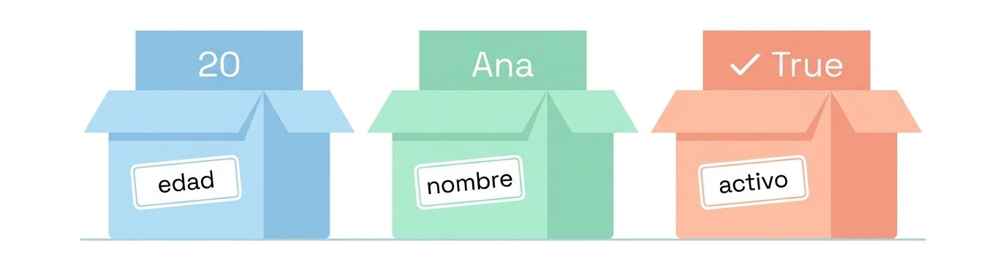
<figcaption></figcaption>
</figure>
</center>

    </div>
    <div class="col col--4">
    </div>
  </div>
</div>


### Tipos de datos (*Data Types*)

**Tipos de datos**: Es la clasificación que indica **qué tipo de contenido hay dentro de la variable** y qué cosas puede hacer la computadora con él (no sumas un texto con un número de la misma forma).
*   **Principales tipos de datos:**
    *   **Entero (*Integer*):** Números enteros sin decimales (ej. `5`, `0`, `-12`).
    *   **Decimal o Flotante (*Float / Double*):** Números con punto decimal (ej. `19.99`, `3.1416`).
    *   **Texto o Cadena (*String*):** Cadenas de caracteres encerradas entre comillas (ej. `"Hola Juan"`, `"1234"`).
    *   **Booleano (*Boolean*):** Solo puede tener dos valores: **Verdadero** (`true`) o **Falso** (`false`). Ideal para interruptores o verificar condiciones.

<div class="container">
  <div class="row">
    <div class="col col--8">

    <center>
    <figure>
    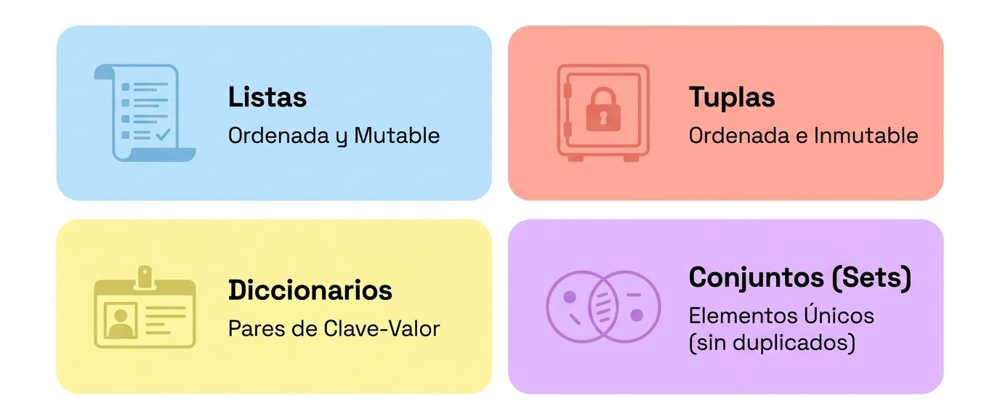
    <figcaption></figcaption>
    </figure>
    </center>

    </div>
    <div class="col col--4">

    </div>
  </div>
</div>


### Control de decisiones
**Control de decisiones (`IF` / `ELSE`)**: 
 Es la capacidad del programa para evaluar una condición y **elegir qué camino tomar** según el resultado.
*   **Analogía:** Piensa en el semáforo o en una regla diaria: 
    *   **SI (`IF`)** el semáforo está en *Verde*, **entonces** cruzas la calle.
    *   **SI NO (`ELSE`)**, te detienes a esperar.
*   **En código:** Permite que el programa ejecute unas instrucciones si la condición se cumple, o tome una ruta alternativa si no se cumple.
<center>
<figure>
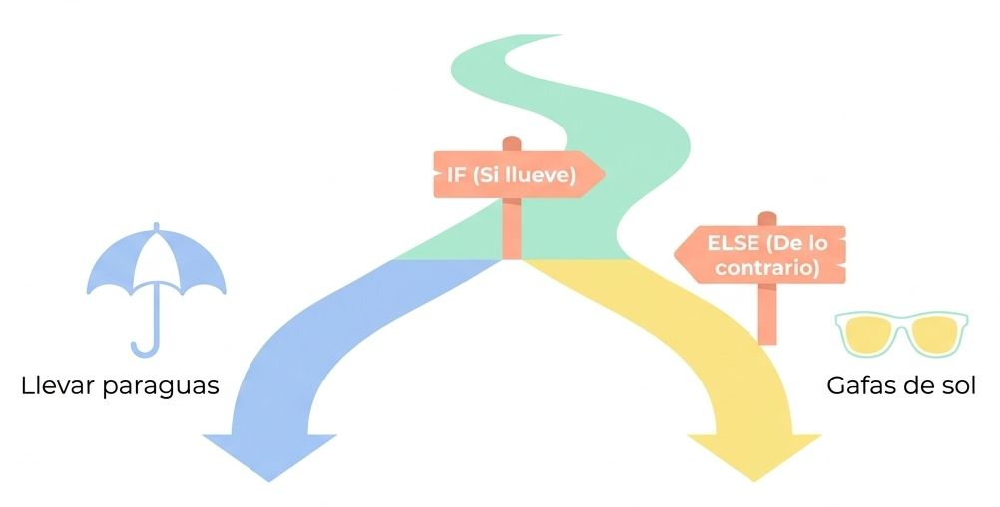
<figcaption></figcaption>
</figure>
</center>

### Bucles

Un bucle sirve para **repetir un conjunto de instrucciones varias veces** sin tener que escribir el mismo código una y otra vez.

**Bucle `FOR` (Repetición determinada):**
    

<div class="container">
  <div class="row">
    <div class="col col--6">
    <center>
<figure>

<figcaption></figcaption>
</figure>
</center>
    </div>
    <div class="col col--6">
    *   Se utiliza cuando **sabes de antemano cuántas veces** se debe repetir la tarea.

    *   *Ejemplo de la vida real:* "Da 5 vueltas a la cancha". Sabes exactamente cuándo empieza (vuelta 1) y cuándo termina (vuelta 5).
    </div>
  </div>
</div>

**Bucle `WHILE` (Repetición condicional):**
    

<div class="container">
  <div class="row">
    <div class="col col--6">
    <center>
<figure>
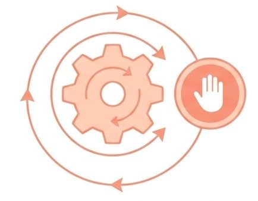
<figcaption></figcaption>
</figure>
</center>
    </div>
    <div class="col col--6">
    *   Se utiliza cuando **no sabes exactamente cuántas veces** se repetirá la tarea, pero sabes que debe continuar **MIENTRAS** una condición sea cierta.

    *   *Ejemplo de la vida real:* "Sigue lavando los platos **mientras** queden platos sucios en el lavaplatos". Se detendrá en el momento en que ya no quede ninguno.
    </div>
  </div>
</div>

### Funciones

**Funciones (*Functions* / Métodos)**: Una función es un **bloque de código con un nombre** que realiza una tarea específica y que puedes reutilizar todas las veces que quieras. 
*   **Cómo funciona:**
    1.  Recibe datos de entrada (llamados **parámetros**).
    2.  Hace un proceso o cálculo interno.
    3.  Devuelve un resultado (llamado **retorno**).
*   **Analogía:** Es como una **receta de cocina** o el botón de una licuadora. No necesitas volver a inventar cómo hacer un batido cada mañana: metes las frutas (parámetros), presionas el botón `prepararBatido()`, la licuadora procesa los ingredientes y te entrega el vaso lleno (resultado).

<center>
<figure>
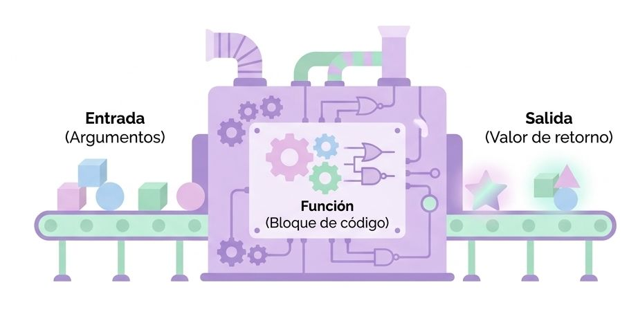
<figcaption></figcaption>
</figure>
</center>


## **Relevancia de la Programación**

En la sociedad moderna, la programación se ha consolidado como una competencia transversal y estratégica por las siguientes razones:

* **Automatización y Eficiencia:** Permite automatizar tareas repetitivas y procesar volúmenes masivos de información de forma rápida y confiable, liberando tiempo humano para tareas de mayor valor creativo y analítico.

* **Modelado del Mundo Real:** A través de conceptos como la Programación Orientada a Objetos, permite traducir entidades, reglas de negocio e interacciones del mundo real (personas, cuentas bancarias, experimentos físicos, vehículos) a entornos digitales modulares y escalables.

* **Motor de la Ciencia de Datos, Inteligencia Artificial y Machine Learning:** Es el pilar fundamental para transformar datos crudos en conocimiento, impulsando el desarrollo del aprendizaje automático, la analítica predictiva y la toma de decisiones informada en empresas e investigación científica.

* **Presencia Ubicua e Impacto Multidisciplinario:** Se aplica en prácticamente todas las industrias y campos del saber: desde el desarrollo de aplicaciones web y videojuegos, hasta la investigación genética, la simulación climática, el control de naves espaciales, la ingeniería financiera y la medicina.

* **Aumento de la Productividad y Creatividad:** Ofrece herramientas flexibles para crear prototipos rápidos, probar ideas y construir soluciones tecnológicas con equipos de desarrollo globales y colaborativos.

---
## 🖥️ **Ejemplo de programación**


<br/>
<Tabs>
<TabItem value="mnp" label="Antecedente" default>
<div class="alert alert--primary">
**Simulación de Carrito de Compras:**

Aquí tienes un script práctico en **Python** que integra los 5 conceptos fundamentales para simular el funcionamiento de un **carrito de compras interactivo**.

**Cómo se aplican los 5 conceptos en el script:**

1. **Variables y Tipos de datos:**
   * `nombre_cliente` guarda texto (**String**).
   * `presupuesto_disponible` guarda un valor numérico con decimales (**Float**).
   * `es_socio_club` guarda una condición lógica de verdadero/falso (**Boolean**).
   * `carrito_de_compras` es una **Lista** que almacena objetos.
2. **Funciones:** `calcular_subtotal()` y `aplicar_descuento()` encapsulan la lógica de cálculo para que el código sea limpio y reutilizable en cualquier punto del programa.
3. **Control de decisiones (`IF / ELIF / ELSE`):** Se usa para evaluar qué porcentaje de descuento otorgar según el código ingresado y para verificar al final si al cliente le alcanza el dinero.
4. **Bucle `FOR`:** Recorre uno por uno todos los productos guardados dentro de la lista del carrito para sumar sus precios.
5. **Bucle `WHILE`:** Ejecuta la acción de cargar productos repetidamente mientras la variable `indice` sea menor a la cantidad total de artículos disponibles.


</div>
</TabItem>
<TabItem value="mnp-python" label="🖥️ Código">


```python showLineNumbers
# ==============================================================================
# 1. FUNCIONES: Bloques de código reutilizables con parámetros y retornos
# ==============================================================================

def calcular_subtotal(lista_productos):
    """Suma los precios de todos los productos en el carrito."""
    total = 0.0  # Variable de tipo Float (Decimal)
    
    # 4. BUCLE FOR: Recorre una lista de elementos conocidos uno a uno
    for producto in lista_productos:
        total += producto["precio"]
        
    return total


def aplicar_descuento(monto_total, codigo_promocional):
    """Evalúa un código de descuento y devuelve el total ajustado."""
    # 3. CONTROL DE DECISIONES (IF / ELIF / ELSE)
    if codigo_promocional == "DESCUENTO10":
        print("   --> ¡Código 'DESCUENTO10' aceptado! (10% de rebaja)")
        return monto_total * 0.90
    elif codigo_promocional == "SUPERVIP":
        print("   --> ¡Código 'SUPERVIP' aceptado! (20% de rebaja)")
        return monto_total * 0.80
    else:
        print("   --> Código inválido o no ingresado. Se mantiene el precio regular.")
        return monto_total


# ==============================================================================
# 2. VARIABLES Y TIPOS DE DATOS
# ==============================================================================

nombre_cliente = "Camila"       # String (Texto)
presupuesto_disponible = 80.0   # Float (Número decimal)
es_socio_club = True            # Boolean (Verdadero / Falso)
carrito_de_compras = []         # Lista (Colección de datos)

print(f"--- Bienvenida al portal de compras, {nombre_cliente} ---")
print(f"Presupuesto inicial: ${presupuesto_disponible:.2f}\n")


# ==============================================================================
# 4. BUCLE WHILE: Se repite MIENTRAS la condición sea verdadera (True)
# ==============================================================================

# Simulación de productos disponibles en la tienda
catalogo = [
    {"nombre": "Café de Grano", "precio": 15.00},
    {"nombre": "Audífonos Bluetooth", "precio": 45.00},
    {"nombre": "Taza Térmica", "precio": 12.50}
]

indice = 0
# Repite mientras queden productos por agregar en el catálogo
while indice < len(catalogo):
    item = catalogo[indice]
    carrito_de_compras.append(item)
    print(f"🛒 Agregado al carrito: {item['nombre']} (${item['precio']:.2f})")
    indice += 1  # Incrementamos el contador para avanzar en el bucle


# ==============================================================================
# 5. EJECUCIÓN DEL FLUJO PRINCIPAL
# ==============================================================================

# Calculamos el subtotal usando la función
subtotal = calcular_subtotal(carrito_de_compras)
print(f"\nSubtotal de la compra: ${subtotal:.2f}")

# Aplicamos un código de descuento
codigo_ingresado = "DESCUENTO10"
total_final = aplicar_descuento(subtotal, codigo_ingresado)

print(f"Total final a pagar: ${total_final:.2f}")


# 3. CONTROL DE DECISIONES FINAL
if total_final <= presupuesto_disponible:
    saldo_restante = presupuesto_disponible - total_final
    print(f"\n✅ ¡Compra procesada exitosamente! Te quedan ${saldo_restante:.2f} en tu cuenta.")
else:
    faltante = total_final - presupuesto_disponible
    print(f"\n❌ Falla al procesar: Te faltan ${faltante:.2f} para completar esta compra.")
```
</TabItem>
</Tabs><br/>


