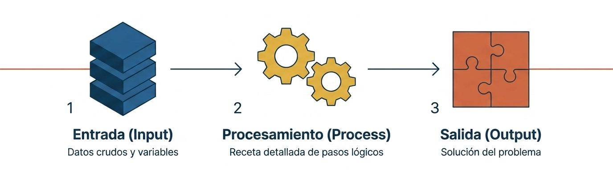
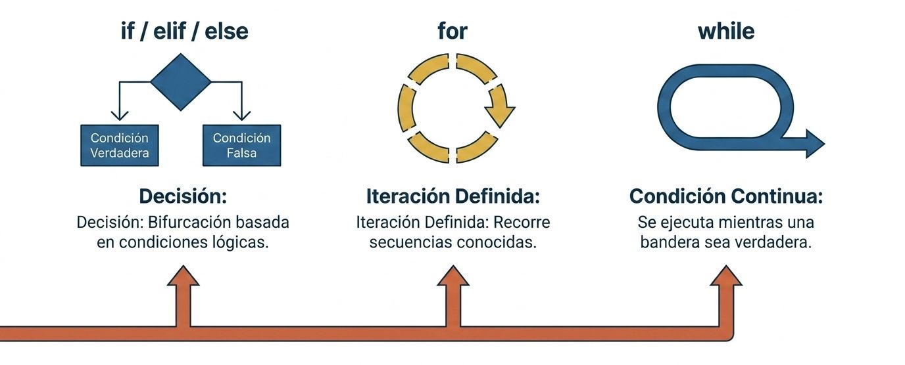
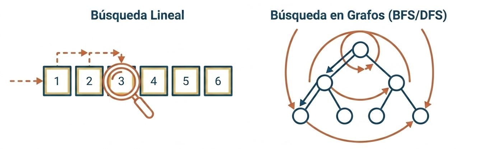

### ¿Qué es un algoritmo?

Un **algoritmo** es una **receta detallada o secuencia de instrucciones** que describe cómo resolver un problema específico o realizar una tarea computacional mediante la programación. 


<center>
<figure>

<figcaption>**Algoritmo**. No es solo código, es la estructura del pensamiento computacional.</figcaption>
</figure>
</center>

En las primeras etapas de aprendizaje, los algoritmos suelen ser tan sencillos que apenas se distinguen del propio texto del programa. Sin embargo, a medida que el software gana en complejidad, el diseño del algoritmo se vuelve una fase crítica e independiente del código de programación. El diseño y la optimización de un algoritmo también implican medir su **complejidad** (a menudo utilizando la **notación "Big O"** o de *O grande*), la cual clasifica objetivamente cómo se comporta y escala el rendimiento del código a medida que aumenta el tamaño de los datos de entrada.

#### Bloques de construcción

Todo lenguaje de programación contiene elementos o estructuras de control que permiten direccionar o controlar el flujo de la información o procesos.



### Cómo aprender a programar desde cero

Aprender a programar puede parecer un desafío, pero es un proceso estructurado que cualquier persona puede dominar si sigue la ruta adecuada:

1. **Elegir el lenguaje idóneo:** **Python** es ampliamente reconocido como uno de los mejores lenguajes para empezar. No requiere prerrequisitos estrictos para comenzar a aprenderlo. Su diseño hace hincapié en la **legibilidad, la simplicidad y la claridad**, hasta el punto de que los programadores suelen compararlo con un *"pseudocódigo ejecutable"*. Esto permite centrar el esfuerzo pedagógico en la lógica y los algoritmos, sin que la sintaxis del lenguaje se convierta en una barrera de entrada.

2. **Configurar un entorno básico:** Lo primero es asegurarse de tener Python en el sistema (por lo general, viene preinstalado en macOS y Linux, mientras que en Windows requiere instalación). Necesitarás un editor de texto profesional para escribir tus programas. El software **Visual Studio Code (VS Code)** es gratuito, muy potente y excelente para principiantes, aunque existen otras opciones populares como **PyCharm**. La recomendación para los principiantes es **no atascarse buscando la herramienta perfecta**; simplemente elige una rápido y empieza a escribir código.

3. **Ejecutar el "Hola Mundo":** Existe una larga tradición en la informática de escribir un programa que muestre el mensaje *"¡Hola mundo!"* como primera práctica con un lenguaje nuevo. En Python, es tan directo como escribir `print("¡Hola mundo!")`. Lograr que este mínimo ejemplo funcione garantiza que todo tu sistema de desarrollo está correctamente configurado para proyectos mayores.

4. **Entender las fases de la programación:** Programar no se limita a escribir instrucciones en un archivo. Consta de cuatro pasos esenciales:
   * **Comprender** cómo resolver el problema mediante una secuencia lógica de pasos.
   * **Expresar** esa secuencia correctamente en la sintaxis del lenguaje de programación.
   * **Ejecutar** el programa y verificar la validez de los resultados.
   * **Corregir errores** (proceso técnicamente conocido como *debugging* o depuración) cuando el programa no funcione como se espera.

5. **Aprender las construcciones básicas:** Antes de crear grandes sistemas, debes dominar las herramientas elementales del lenguaje: **variables** (que funcionan como etiquetas para almacenar datos), **tipos de datos simples** (números, cadenas de texto, booleanos), **estructuras de control condicional** (`if-else`, para tomar decisiones), **bucles** (`while`, `for`, para repetir tareas automáticas) y **funciones** (bloques de código reutilizables con un nombre asociado).

6. **Practicar de manera activa:** **Nadie aprende a programar únicamente leyendo**; es un conocimiento eminentemente práctico que requiere resolver una gran cantidad de ejercicios prácticos directamente frente al ordenador.

7. **Apoyarse en la comunidad:** Uno de los mayores activos al aprender a programar es integrarse en comunidades de usuarios (como la comunidad hispanohablante de Python, *PyAr*). Participar en foros, leer las preguntas de otros estudiantes y ver las respuestas que se ofrecen es una de las mejores formas de profundizar en tu aprendizaje.


### Aprendizaje de algoritmos: ¿Cómo dominarlos?

Para aprender a diseñar y pensar en términos de algoritmos, los expertos recomiendan las siguientes pautas:

* **Escribir el algoritmo en lenguaje natural primero:** Antes de tocar una sola línea de código, resulta de gran ayuda **escribir las tareas o pasos en tu propio idioma (español o inglés) en un papel** o mediante comentarios dentro del editor. Esto te permite estructurar la lógica sin preocuparte por la sintaxis estricta del ordenador.

* **Estudiar y adaptar ejemplos existentes:** El aprendizaje de algoritmos se acelera enormemente cuando analizas cómo otros programadores resolvieron problemas similares. Estudiar ejemplos te permite adaptar sus ideas y patrones de diseño a tus propios problemas.

* **Progresar de lo simple a lo complejo:** Comienza con algoritmos de repetición muy básicos (como generar tablas de multiplicar o de conversión matemática) y avanza de forma gradual hacia problemas clásicos como algoritmos de ordenación de datos o algoritmos recursivos.


### Ejemplos de uso de los algoritmos

Los algoritmos están presentes en todos los aspectos del desarrollo de software. Algunos ejemplos prácticos extraídos de la literatura técnica incluyen:

1. **Conversión y cálculo matemático sistemático:** Un algoritmo muy sencillo es la conversión de temperaturas (por ejemplo, de grados Fahrenheit a Celsius) utilizando una fórmula matemática repetida de forma constante dentro de un bucle `while` para generar una tabla comparativa.

2. **Algoritmos de búsqueda científica:** El **Criba de Eratóstenes** es un algoritmo clásico y muy eficiente diseñado para encontrar todos los números primos menores o iguales a un número determinado (N).

3. **Simulaciones físicas y biológicas (Caminatas Aleatorias):** El algoritmo de **caminata aleatoria** (*Random Walk*) se utiliza para modelar situaciones del mundo real basadas en decisiones al azar. Tiene aplicaciones prácticas en la física, biología y química (como simular el movimiento de un grano de polen empujado por moléculas de agua) y en la economía.

4. **Inteligencia Artificial aplicada a Videojuegos:** En el desarrollo de juegos, los algoritmos guían la toma de decisiones. Por ejemplo, en competiciones de programación se ha utilizado con gran éxito el **algoritmo de búsqueda** para guiar de forma inteligente a personajes como Mario a través de niveles de plataformas, decidiendo sus movimientos basándose en la longitud del camino recorrido y el costo estimado para llegar a la meta.

5. **Procesamiento de texto y ordenación:** Algoritmos diseñados para limpiar datos textuales o para **analizar textos masivos** (como buscar y listar las 10 palabras más frecuentes en la obra del *Don Quijote*), así como algoritmos para ordenar listas bajo criterios específicos (como priorizar palabras por su longitud o cercanía a una cantidad de caracteres).

---

## **Algoritmo de búsqueda**

La búsqueda lineal es el modelo más simple pero lento, es un modelo paso a paso. La búsqueda en grafos es una exploración estructurada. Ideal para redes y rutas.


### Búsqueda simple

Un **algoritmo de búsqueda lineal** (o secuencial) es un procedimiento fundamental que examina cada elemento de una lista de manera consecutiva de principio a fin, comparándolo con el valor buscado hasta encontrarlo o determinar que no existe en la colección.


**Pseudocódigo de Búsqueda Lineal**

```text showLineNumbers
ALGORITMO BusquedaLineal(lista, elemento_buscado)
    // Entradas:
    //   - lista: secuencia de elementos (ordenada o desordenada)
    //   - elemento_buscado: valor que se desea localizar
    // Salida:
    //   - Posición (índice) donde se ubica el valor, o -1 si no está presente

    N <- Longitud(lista)

    PARA i DESDE 0 HASTA N - 1 HACER
        SI lista[i] == elemento_buscado ENTONCES
            RETORNAR i  // Elemento localizado: se devuelve el índice actual
        FIN SI
    FIN PARA

    RETORNAR -1          // Recorrido completado sin hallar el elemento
FIN ALGORITMO
```


#### Traza de Ejecución Paso a Paso

Supongamos que se busca el número **`8`** en la lista **``**:

1. **Inicialización:** Se obtiene la longitud de la colección (\\(N = 4\\)).
2. **Iteración \\(i = 0\\):** Se compara `lista` (`15`) con `8`. Como no coinciden, la iteración avanza.
3. **Iteración \\(i = 1\\):** Se compara `lista` (`42`) con `8`. Tampoco coinciden.
4. **Iteración \\(i = 2\\):** Se compara `lista` (`8`) con `8`. La condición se cumple y el algoritmo retorna la posición **`2`**.

Si se buscara un valor que no se encuentra en la lista (por ejemplo, `99`), el bucle evaluaría todos los elementos de la secuencia y retornaría **`-1`** al finalizar el recorrido.


#### Propiedades Clave

* **Complejidad \\(O(n)\\):** En el peor caso (cuando el elemento se halla en el último extremo o no está en la colección), se requiere efectuar \\(n\\) comparaciones relativas a la cantidad total de datos.
* **Flexibilidad:** Funciona sobre secuencias no ordenadas, a diferencia de algoritmos más eficientes como la búsqueda binaria que exigen un orden previo.

#### Traducción en Python

Aquí tenemos la traducción directa del pseudocódigo a **Python**, manteniendo exactamente la misma estructura lógica paso a paso:

```python showLineNumbers
def busqueda_lineal(lista, elemento_buscado):
    """
    Busca un elemento en una lista de forma secuencial.
    
    Retorna el índice del elemento si lo encuentra, o -1 si no existe.
    """
    n = len(lista)  # Equivale a N <- Longitud(lista)
    
    for i in range(n):  # PARA i DESDE 0 HASTA N - 1
        if lista[i] == elemento_buscado:  # SI lista[i] == elemento_buscado
            return i  # RETORNAR i
            
    return -1  # RETORNAR -1 si no se encontró
```


#### Ejemplo de uso y prueba

```python showLineNumbers
# Lista de prueba
numeros = [15, 42, 8, 23, 4]

# Caso 1: El elemento existe
posicion = busqueda_lineal(numeros, 8)
print(f"El número 8 está en el índice: {posicion}")
# Salida: El número 8 está en el índice: 2

# Caso 2: El elemento no existe
posicion = busqueda_lineal(numeros, 99)
print(f"El número 99 está en el índice: {posicion}")
# Salida: El número 99 está en el índice: -1
```


#### Forma más *pythonica* (Elegante)

En Python es común e intuitivo usar **`enumerate()`** para obtener el índice y el valor simultáneamente en cada iteración, sin necesidad de calcular la longitud con `len()` ni acceder por posición manual:

```python showLineNumbers
def busqueda_lineal_pythonica(lista, elemento_buscado):
    for indice, valor in enumerate(lista):
        if valor == elemento_buscado:
            return indice
    return -1
```

### Búsqueda binaria

Aquí tienes la implementación de la **búsqueda binaria** en Python, junto con un análisis de por qué es infinitamente más rápida que la búsqueda lineal cuando trabajamos con colecciones grandes.


:::info[requisito]

A diferencia de la búsqueda lineal, **la búsqueda binaria exige estrictamente que la lista esté ordenada**. Funciona bajo la técnica de *divide y vencerás*: en cada paso examina el elemento central y descarta la mitad de los datos donde el valor buscado no puede estar.
:::

#### Código en Python: Búsqueda Binaria

```python showLineNumbers 
def busqueda_binaria(lista, elemento_buscado):
    """
    Busca un elemento en una lista ORDENADA dividiendo el rango a la mitad en cada paso.
    Retorna el índice del elemento si lo encuentra, o -1 si no existe.
    """
    izquierda = 0
    derecha = len(lista) - 1

    while izquierda <= derecha:
        medio = (izquierda + derecha) // 2  # Punto medio del rango actual
        valor_medio = lista[medio]

        if valor_medio == elemento_buscado:
            return medio  # ¡Encontrado! Retorna el índice
        elif valor_medio < elemento_buscado:
            izquierda = medio + 1  # Descartar la mitad izquierda
        else:
            derecha = medio - 1    # Descartar la mitad derecha

    return -1  # El elemento no se encuentra en la lista
```


**Ejemplo de Uso**

```python showLineNumbers
# La lista DEBE estar ordenada previamente
numeros_ordenados = [3, 8, 15, 24, 31, 42, 59, 73, 88, 91]

posicion = busqueda_binaria(numeros_ordenados, 73)
print(f"El número 73 se encuentra en el índice: {posicion}")
# Salida: El número 73 se encuentra en el índice: 7
```


#### Comparativa de Rendimiento: O(n) vs (O(log n))

Imagina que buscas un número dentro de una lista de **1,000,000 de elementos**:

* **Búsqueda Lineal (O(n)):**
  * **Peor caso:** Recorre los **1,000,000 de elementos** uno a uno antes de darse cuenta de que el valor está al final o no existe.
* **Búsqueda Binaria (O(log n)):**
  * **Peor caso:** Requiere como máximo **20 comparaciones**, ya que \\(2^{20} = 1,048,576\\). En cada paso reduce el problema a la mitad (\\(1,000,000 \to 500,000 \to 250,000 \dots \to 1\\)).

| Algoritmo | Requisito | Complejidad Temporal | Comparaciones para \\(N = 1,000,000\\) |
| :--- | :--- | :--- | :--- |
| **Búsqueda Lineal** | Ninguno (ordenada o desordenada) | \\(O(n)\\) | Hasta 1,000,000 |
| **Búsqueda Binaria** | **Lista ordenada** | \\(O(\log n)\\) | **Máximo 20** |

