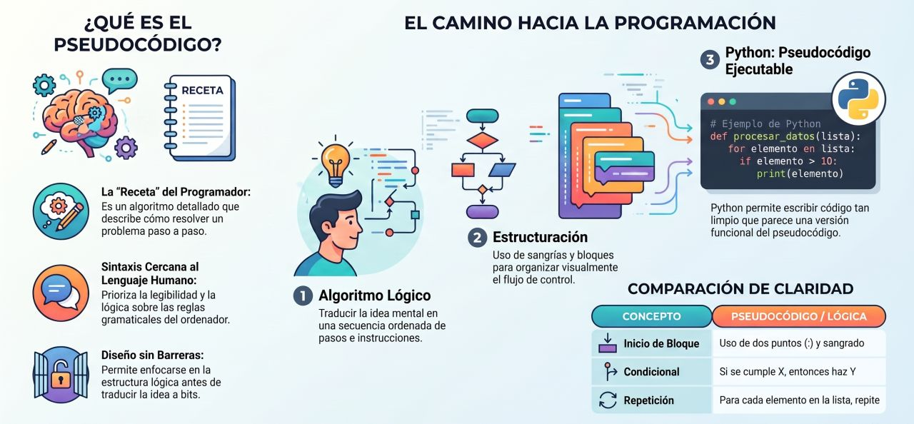

## **Pseudocódigo**

El **pseudocódigo** es una descripción informal y de alto nivel del algoritmo o de los pasos lógicos que seguirá un programa de ordenador. No está diseñado para ser ejecutado directamente por una máquina, sino para ser leído y comprendido por seres humanos. Combina el lenguaje natural (como el español o el inglés) con estructuras básicas y universales de la programación, omitiendo los detalles sintácticos más rígidos de los lenguajes formales (como los puntos y comas, las llaves o la declaración estricta de tipos de datos).

De hecho, la sintaxis de Python es tan limpia, legible y cercana al lenguaje natural que muchos programadores y autores se refieren a él como un **"pseudocódigo ejecutable"**.


### ¿Por qué aprender a programar?

El pseudocódigo juega un papel fundamental en la enseñanza de la informática por varias razones clave:

#### 1. Permite centrarse en la lógica y no en la sintaxis
La parte más difícil de aprender a programar no es memorizar las palabras clave de un lenguaje, sino **aprender a pensar como programador** y entender cómo resolver un problema mediante una secuencia ordenada de instrucciones. 
* Al utilizar pseudocódigo (o escribir los pasos en papel o comentarios de texto antes de codificar), el estudiante puede estructurar y validar la lógica de su solución sin frustrarse por errores de sintaxis, variables mal escritas o caracteres especiales omitidos.

#### 2. Evita la "doble barrera de complejidad"
Intentar diseñar la lógica de un algoritmo complejo y, al mismo tiempo, luchar por escribirlo con una sintaxis estrictamente perfecta en el ordenador suele abrumar a los principiantes. 
* El pseudocódigo permite dividir el proceso en dos fases manejables: **primero se resuelve el problema en papel o comentarios de forma lógica, y luego se traduce esa receta al lenguaje de programación elegido**.

#### 3. Facilita la creación del "modelo mental" y la depuración
Escribir un boceto del algoritmo ayuda a que el estudiante dibuje en su mente cómo fluirán los datos a través de las variables, bucles y condiciones. 
* Si la lógica del pseudocódigo es correcta, traducirla a código real es sumamente directo. Si ocurre un fallo en el programa final (un *bug*), el alumno puede contrastar el comportamiento del ordenador con su pseudocódigo inicial para identificar si el error es de sintaxis o es un fallo en el diseño lógico de la solución.

#### 4. Fomenta las buenas prácticas de diseño y documentación
Escribir los pasos estructurados de un algoritmo de forma clara y comentada acostumbra a los nuevos programadores a documentar su propio código. 
* El hábito de bocetar algoritmos antes de codificar se traduce de inmediato en la escritura de programas modulares, fáciles de leer, depurar y ampliar.


### Un Ejemplo Práctico de Transición

Un estudiante que necesite automatizar una tarea repetitiva, como mostrar una tabla de conversión matemática, puede estructurar su lógica primero en pseudocódigo de esta manera:

```text
// Pseudocódigo (La Receta Lógica)
Establecer temperatura Celsius en -20
Mientras la temperatura sea menor o igual a 40, repetir:
    Calcular Fahrenheit como (9 / 5) * Celsius + 32
    Mostrar Celsius y Fahrenheit en pantalla
    Incrementar Celsius en 5 unidades
```


Y una vez que tiene la certeza de que este flujo lógico es correcto, la traducción a un código Python limpio es prácticamente idéntica:

```python
# Código Python resultante (El "Pseudocódigo ejecutable")
C = -20
while C <= 40:
    F = (9.0 / 5) * C + 32
    print(C, F)
    C = C + 5
```

## **Estructuras**

#### *Palabras reservadas

Son términos con un significado predefinido que estructuran el algoritmo. Aunque no existe un estándar universal, las palabras reservadas más habituales en pseudocódigo en español son:

| Categoría | Palabras reservadas | Función |
| :---- | :---- | :---- |
| Inicio/Fin | INICIO, FIN | Delimitan el cuerpo principal del algoritmo. |
| Selección | SI, ENTONCES, SI NO, FIN SI | Estructuras condicionales (toma de decisiones). |
| Iteración | MIENTRAS, HACER, FIN MIENTRAS, PARA, FIN PARA | Estructuras repetitivas (bucles). |
| Entrada/Salida | LEER, ESCRIBIR | Interacción con el usuario (input/output). |
| Lógica | Y, O, NO | Operadores lógicos para combinar condiciones. |

#### Identificadores

Los identificadores son los nombres que el programador asigna a las variables, constantes y subprogramas. En pseudocódigo se recomienda usar nombres descriptivos que indiquen claramente su propósito. Por ejemplo, `edad_alumno` es preferible a `x`, y `suma_total` es más claro que `st`.

#### Comentarios

Los comentarios son anotaciones que el programador incluye para explicar partes del algoritmo. No forman parte de la lógica ejecutable y se escriben habitualmente precedidos de `//` o encerrados entre `/* */`. Su uso es fundamental para hacer el pseudocódigo comprensible a terceros.

#### Tipos de datos básicos

Aunque el pseudocódigo es flexible, los tipos de datos que se manejan habitualmente son los mismos que encontramos en la mayoría de lenguajes de programación:

| Tipo | Descripción | Ejemplos | Equivalente en Java |
| :---- | :---- | :---- | :---- |
| **ENTERO** | Números sin decimales | 0, \-5, 42, 1000 | int, long |
| **REAL** | Números con decimales | 3.14, \-0.5, 99.99 | float, double |
| **CADENA** | Secuencias de caracteres | "Hola", "Java", "123" | String |
| **CARÁCTER** | Un solo carácter | 'A', 'z', '9' | char |
| **LÓGICO** | Verdadero o falso | VERDADERO, FALSO | boolean |

#### Asignación de valores

La operación de asignación almacena un valor en una variable. En pseudocódigo se usa el símbolo `←` (flecha hacia la izquierda) para distinguir la asignación de la comparación de igualdad. Esto es una convención muy extendida que evita la confusión entre `=` (asignación) y `==` (comparación) que existe en lenguajes como Java o C:

### Operadores en pseudocódigo

Los operadores son símbolos que permiten realizar operaciones sobre los datos. En pseudocódigo se utilizan los mismos tipos de operadores que en los lenguajes de programación, con una notación que prioriza la legibilidad.

#### Operadores aritméticos

| Operador | Significado | Ejemplo | Resultado |
| :---- | :---- | :---- | :---- |
| \+ | Suma | 7 \+ 3 | 10 |
| \- | Resta | 7 \- 3 | 4 |
| \* | Multiplicación | 7 \* 3 | 21 |
| / | División | 7 / 2 | 3.5 |
| MOD | Módulo (resto) | 7 MOD 3 | 1 |
| ^ | Potencia | 2 ^ 3 | 8 |

#### Operadores relacionales (de comparación)

| Operador | Significado | Ejemplo | Resultado |
| :---- | :---- | :---- | :---- |
| \= | Igual a | 5 \= 5 | VERDADERO |
| ≠ o \<\> | Distinto de | 5 ≠ 3 | VERDADERO |
| \< | Menor que | 3 \< 5 | VERDADERO |
| \> | Mayor que | 5 \> 3 | VERDADERO |
| \<= | Menor o igual | 5 \<= 5 | VERDADERO |
| \>= | Mayor o igual | 6 \>= 5 | VERDADERO |

#### Operadores lógicos

| Operador | Significado | Ejemplo | Resultado |
| :---- | :---- | :---- | :---- |
| Y (AND) | Ambas condiciones verdaderas | (5 \> 3\) Y (2 \< 4\) | VERDADERO |
| O (OR) | Al menos una condición verdadera | (5 \> 3\) O (2 \> 4\) | VERDADERO |
| NO (NOT) | Invierte el valor lógico |  |  |


### Secuencias de Control


#### Secuencia
```text  
INICIO  
    LEER radio  
    area ← 3.14159 * radio ^ 2  
    ESCRIBIR "Área: ", area  
FIN
```

#### Selectiva simple
```text
SI edad >= 18 ENTONCES  
    ESCRIBIR "Es mayor de edad"  
FIN SI
```

#### Selectiva doble
```text
SI nota >= 5 ENTONCES  
  ESCRIBIR "Aprobado"  
SI NO  
  ESCRIBIR "Suspenso"  
FIN SI
```
##### Selección múltiple
```text  
SEGÚN dia_semana HACER  
    1: ESCRIBIR "Lunes"  
    2: ESCRIBIR "Martes"  
    3: ESCRIBIR "Miércoles"  
    6, 7: ESCRIBIR "Fin de semana"  
    DE OTRO MODO: ESCRIBIR "Día no válido"  
FIN SEGÚN
```
#### Bucle mientras
```text  
contador ← 1  
MIENTRAS contador <= 10 HACER  
  contador ← contador + 1  
FIN MIENTRAS
```
#### Bucle repetir-hasta
```text
REPETIR  
    ESCRIBIR "Introduce un número positivo: "  
    LEER numero  
HASTA QUE numero > 0
```
#### Bucle para
```text
PARA i ← 1 HASTA 10 HACER  
    resultado ← 7 * i  
    ESCRIBIR "7 x ", i, " = ", resultado  
FIN PARA
```

#### Sumar dos números (Estructura secuencial)


```python
Proceso SumarNumeros
    Definir num1, num2, suma Como Entero
    Escribir "Ingresa el primer número:"
    Leer num1
    Escribir "Ingresa el segundo número:"
    Leer num2
    suma <- num1 + num2
    Escribir "La suma es: ", suma
FinProceso
```

#### Determinar mayoria de edad


```python
Proceso VerificarEdad
    Definir edad Como Entero
    Escribir "Ingresa tu edad:"
    Leer edad
    Si edad >= 18 Entonces
        Escribir "Eres mayor de edad."
    Sino
        Escribir "Eres menor de edad."
    FinSi
FinProceso

```

## **Ejemplos con pseudocodigo**

Como se mencionó anteriormente, elegir el algoritmo de ordenación adecuado es un factor crítico en el rendimiento del software; de hecho, se hanregistrdo casos en el que un programador redujo el tiempo de procesamiento de ordenación de una base de datos **de 12 horas a tan solo 15 segundos** al cambiar de un algoritmo ineficiente a uno optimizado.

El **pseudocódigo** es la herramienta ideal para aprender a diseñar algoritmos. Al no estar atado a la sintaxis rígida de un lenguaje de programación específico, te permite concentrarte de manera exclusiva en la **lógica pura del problema**. 


A continuación, se presentan los tres algoritmos de ordenación más importantes explicados paso a paso mediante pseudocódigo estructurado y comprensible:


### 1. Selección (Selection Sort)

Este algoritmo representa un enfoque intuitivo y directo. Su lógica radica en "buscar el elemento más pequeño y colocarlo al principio" de forma reiterada.

#### Pseudocódigo:
```text
Algoritmo Ordenamiento_Seleccion(secuencia)
    N = longitud(secuencia)
    
    // Recorremos la secuencia posición por posición
    Para i Desde 0 Hasta N - 2 Hacer
        minIndex = i  // Asumimos que el elemento actual es el mínimo
        
        // Buscamos linealmente el verdadero mínimo en la sección restante
        Para j Desde i + 1 Hasta N - 1 Hacer
            Si secuencia[j] < secuencia[minIndex] Entonces
                minIndex = j  // Encontramos un valor menor, actualizamos el índice
            FinSi
        FinPara
        
        // Si encontramos un elemento menor, los intercambiamos de lugar
        Si minIndex != i Entonces
            Auxiliar = secuencia[i]
            secuencia[i] = secuencia[minIndex]
            secuencia[minIndex] = Auxiliar
        FinSi
    FinPara
    
FinAlgoritmo
```


### 2. Mezcla (Merge Sort)

Este algoritmo utiliza la estrategia **"Divide y Vencerás"**. Divide la secuencia en mitades cada vez más pequeñas de manera recursiva hasta llegar a elementos individuales (que ya están ordenados por definición), para luego **mezclarlos** en orden.

#### Pseudocódigo:
```text
Algoritmo Ordenamiento_Mezcla(secuencia)
    N = longitud(secuencia)
    
    // Caso Base: una lista con 1 o 0 elementos ya está ordenada
    Si N <= 1 Entonces
        Retornar secuencia
    FinSi
    
    // Dividimos la secuencia por la mitad (división entera)
    medio = N / 2
    
    izquierda = Copiar secuencia desde posición 0 hasta medio - 1
    derecha = Copiar secuencia desde posición medio hasta N - 1
    
    // Resolvemos recursivamente cada mitad
    izq_ordenada = Ordenamiento_Mezcla(izquierda)
    der_ordenada = Ordenamiento_Mezcla(derecha)
    
    // Mezclamos ambas mitades ya ordenadas y retornamos el resultado
    Retornar Mezclar(izq_ordenada, der_ordenada)
FinAlgoritmo


Funcion Mezclar(lista_A, lista_B)
    resultado = lista_vacia
    i = 0  // Puntero para lista_A
    j = 0  // Puntero para lista_B
    
    // Recorremos ambas listas comparando sus elementos
    Mientras i < longitud(lista_A) Y j < longitud(lista_B) Hacer
        Si lista_A[i] < lista_B[j] Entonces
            Agregar lista_A[i] al final de resultado
            i = i + 1
        Sino
            Agregar lista_B[j] al final de resultado
            j = j + 1
        FinSi
    FinMientras
    
    // Si quedaron elementos sobrantes en alguna lista, los añadimos directamente
    Mientras i < longitud(lista_A) Hacer
        Agregar lista_A[i] al final de resultado
        i = i + 1
    FinMientras
    
    Mientras j < longitud(lista_B) Hacer
        Agregar lista_B[j] al final de resultado
        j = j + 1
    FinMientras
    
    Retornar resultado
FinFuncion
```


### 3. Ordenamiento Rápido (Quicksort) 

Al igual que Merge Sort, utiliza "Divide y Vencerás". Sin embargo, en lugar de dividir ciegamente a la mitad, selecciona un elemento llamado **pivote** y reorganiza la lista de modo que todos los menores queden a la izquierda y los mayores a la derecha (proceso de **particionamiento**).

#### Pseudocódigo:
```text
Algoritmo Quicksort(secuencia, inicio, fin)
    Si inicio < fin Entonces
        // Particionamos la lista y colocamos el pivote en su posición final
        pivote_index = Particionar(secuencia, inicio, fin)
        
        // Ordenamos recursivamente la mitad izquierda (menores al pivote)
        Quicksort(secuencia, inicio, pivote_index - 1)
        
        // Ordenamos recursivamente la mitad derecha (mayores al pivote)
        Quicksort(secuencia, pivote_index + 1, fin)
    FinSi
FinAlgoritmo


Funcion Particionar(secuencia, inicio, fin)
    pivote = secuencia[inicio] // Tomamos el primer elemento como pivote
    i = inicio + 1
    j = fin
    
    Mientras i <= j Hacer
        // Avanzamos el puntero izquierdo mientras los valores sean menores o iguales al pivote
        Mientras i <= j Y secuencia[i] <= pivote Hacer
            i = i + 1
        FinMientras
        
        // Retrocedemos el puntero derecho mientras los valores sean mayores al pivote
        Mientras i <= j Y secuencia[j] > pivote Hacer
            j = j - 1
        FinMientras
        
        // Si los punteros no se han cruzado, intercambiamos los elementos desordenados
        Si i < j Entonces
            Auxiliar = secuencia[i]
            secuencia[i] = secuencia[j]
            secuencia[j] = Auxiliar
            i = i + 1
            j = j - 1
        FinSi
    FinMientras
    
    // Colocamos el pivote en su ubicación correcta (en el cruce representado por 'j')
    secuencia[inicio] = secuencia[j]
    secuencia[j] = pivote
    
    Retornar j  // Devolvemos la posición final del pivote
FinFuncion
```


### 💡 Traducir Pseudocódigo a Python
1.  **Variables:** En el pseudocódigo usamos asignaciones explícitas (como `i = 0`). En Python, esto se traduce directamente a `i = 0`.
2.  **Estructuras de Decisión:** Un bloque `Si ... Entonces ... Sino ... FinSi` equivale exactamente al bloque `if ...: ... else:` de Python.
3.  **Límites de Bucles:** Ten en cuenta que en pseudocódigo la instrucción `Desde 0 Hasta N - 1` suele incluir ambos extremos de forma inclusiva, mientras que la función `range(0, N)` de Python excluye el límite superior (ejecuta desde `0` hasta `N - 1`).

---
## **Ejercicios con Pseudocodigo**

 
<br/>
<Tabs>
<TabItem value="ps1" label="Ejercicio 1" default>
<div class="alert alert--primary">

**El Conversor de Temperatura (Estructura Secuencial)**

* **Objetivo:** Aprender el concepto de variables, entrada de datos, operaciones matemáticas básicas y salida de resultados.
* **Enunciado:** Diseña un algoritmo que reciba una temperatura expresada en grados Fahrenheit (°F) y calcule su equivalente en grados Celsius (°C) utilizando la fórmula matemática estándar:  
$$
  C = \frac{5}{9} \times (F - 32)
$$
</div>
</TabItem>
<TabItem value="ps1-python" label="💻 Pseudocodigo">

**Solución en Pseudocódigo:**
```text
Algoritmo Convertir_Fahrenheit_A_Celsius
    // Declaración de variables
    Definir fahrenheit, celsius Como Real

    // Entrada: Solicitar la temperatura en Fahrenheit
    Escribir "Introduce la temperatura en grados Fahrenheit:"
    Leer fahrenheit
    
    // Proceso: Aplicar la fórmula matemática de conversión
    celsius = (5 / 9) * (fahrenheit - 32)
    
    // Salida: Mostrar el resultado calculado al usuario
    Escribir "La temperatura equivalente en grados Celsius es:", celsius
FinAlgoritmo
```
</TabItem>
</Tabs><br />

<br/>
<Tabs>
<TabItem value="ps2" label="Ejercicio 2" default>
<div class="alert alert--primary">

**Evaluador de Calificaciones (Estructura Condicional)**

* **Objetivo:** Aprender a tomar decisiones lógicas en el código (`Si... Entonces... Sino`) y validar que las entradas de datos sean correctas.
* **Enunciado:** Crea un algoritmo para un docente que necesita ingresar la calificación final de un alumno (en una escala de 0 a 100) y determinar automáticamente si el estudiante está **"Aprobado"** (calificación de 60 o superior) o **"Reprobado"** (calificación inferior a 60).
</div>
</TabItem>
<TabItem value="ps2-python" label="💻 Pseudocódigo">

**Solución en Pseudocódigo:**
```text
Algoritmo Evaluar_Calificacion
    // Declaración de variables
    Definir calificacion Como Entero

    // Entrada: Solicitar la nota del estudiante
    Escribir "Ingresa la calificación final del alumno (0 - 100):"
    Leer calificacion
    
    // Proceso y Validación: Validar rango y determinar el estado académico
    Si calificacion < 0 O calificacion > 100 Entonces
        Escribir "Error: La calificación ingresada no está dentro del rango válido."
    Sino
        Si calificacion >= 60 Entonces
            Escribir "Estado del alumno: APROBADO"
        Sino
            Escribir "Estado del alumno: REPROBADO"
        FinSi
    FinSi
FinAlgoritmo
```
</TabItem>
</Tabs><br/>

<br/>
<Tabs>
<TabItem value="ps3" label="Ejercicio 3" default>
<div class="alert alert--primary">

**El Generador de Tablas Térmicas (Bucles e Iteración)**

* **Objetivo:** Comprender el uso de bucles de control (`Mientras... Hacer`) para automatizar tareas repetitivas basadas en un contador.
* **Enunciado:** Diseña un algoritmo que genere de manera automática una tabla comparativa de temperaturas de grados Celsius a Fahrenheit para el rango que va **desde los -20°C hasta los 40°C, avanzando en incrementos constantes de 5 en 5 grados**. Utiliza la fórmula:  
  $F = \frac{9}{5} \times C + 32$
</div>
</TabItem>
<TabItem value="ps3-python" label="💻 Pseudocódigo">


**Solución en Pseudocódigo:**
```text
Algoritmo Generar_Tabla_Temperaturas
    // Declaración de variables
    Definir celsius, fahrenheit Como Real
    
    // Proceso: Inicializar la variable de control en el límite inferior (-20°C)
    celsius = -20
    
    Escribir "Tabla de Conversión de Temperaturas:"
    Escribir "Celsius | Fahrenheit"
    Escribir "----------------------"
    
    // Bucle iterativo hasta el límite superior de 40°C
    Mientras celsius <= 40 Hacer
        fahrenheit = (9 / 5) * celsius + 32
        Escribir celsius, " °C  |  ", fahrenheit, " °F"
        
        // Incrementar la temperatura actual de 5 en 5 en cada paso
        celsius = celsius + 5
    FinMientras
FinAlgoritmo
```
</TabItem>
</Tabs><br/>


<br/>
<Tabs>
<TabItem value="ps4" label="Ejercicio 4" default>
<div class="alert alert--primary">

**Buscador de Temperaturas Extremas (Estructuras de Datos y Recorridos)**

* **Objetivo:** Introducir el concepto de arreglos/vectores para almacenar colecciones de datos y aprender a buscar elementos específicos dentro de ellos.
* **Enunciado:** Un sistema meteorológico registra las temperaturas máximas de cada día de la semana (7 días) en una lista. Escribe un algoritmo que permita ingresar estas 7 mediciones y determine **cuál fue la temperatura más alta** registrada en toda la semana.
</div>
</TabItem>
<TabItem value="ps4-python" label="💻 Pseudocódigo">

**Solución en Pseudocódigo:**
```text
Algoritmo Encontrar_Temperatura_Maxima
    // Declaración de variables y estructura de datos para 7 días
    Dimension temperaturas
    Definir temperaturas Como Real
    Definir maxima Como Real
    Definir i Como Entero
    
    // Entrada: Almacenar los 7 valores ingresados en la estructura
    Escribir "Ingresa las 7 temperaturas registradas en la semana:"
    Para i Desde 0 Hasta 6 Con Paso 1 Hacer
        Escribir "Temperatura del día ", (i + 1), ":"
        Leer temperaturas[i]
    FinPara
    
    // Proceso: Inicializar el valor máximo asumiendo la primera temperatura
    maxima = temperaturas
    
    // Recorrer el resto de la lista comparando secuencialmente
    Para i Desde 1 Hasta 6 Con Paso 1 Hacer
        Si temperaturas[i] > maxima Entonces
            maxima = temperaturas[i]  // Actualizamos el nuevo valor máximo encontrado
        FinSi
    FinPara
    
    // Salida: Informar el resultado del análisis
    Escribir "La temperatura máxima de la semana fue de:", maxima, " grados."
FinAlgoritmo
```
</TabItem>
</Tabs><br/>


<br/>
<Tabs>
<TabItem value="ps5" label="Ejercicio 5" default>
<div class="alert alert--primary">

**El Verificador de Números Primos (Estructuras de Control Anidadas)**

* **Objetivo:** Dominar el uso combinado de bucles de parada condicional y banderas (*flags* booleanos) para resolver problemas lógico-matemáticos complejos.
* **Enunciado:** Diseña un programa que solicite al usuario un número entero positivo mayor que 1 y evalúe si se trata de un **número primo** (es decir, aquel que únicamente posee dos divisores enteros exactos: el número 1 y el mismo número).
</div>
</TabItem>
<TabItem value="ps5-python" label="💻 Pseudocódigo">

**Solución en Pseudocódigo:**
```text
Algoritmo Verificar_Numero_Primo
    // Declaración de variables
    Definir numero, divisor Como Entero
    Definir es_primo Como Logico
    
    // Entrada: Solicitar número mayor que 1
    Escribir "Introduce un número entero mayor que 1 para evaluar:"
    Leer numero
    
    // Validación de entrada
    Si numero <= 1 Entonces
        Escribir "Error: El número debe ser estrictamente mayor que 1."
    Sino
        // Inicialización de la bandera de control (asumimos que es primo)
        es_primo = Verdadero
        divisor = 2
        
        // Proceso: Buscar algún divisor exacto que rompa la regla
        Mientras divisor < numero Y es_primo == Verdadero Hacer
            Si numero % divisor == 0 Entonces
                es_primo = Falso  // Encontramos un divisor exacto, se descarta como primo
            FinSi
            divisor = divisor + 1  // Avanzar al siguiente divisor potencial
        FinMientras
        
        // Salida: Evaluar la bandera lógica al finalizar las pruebas
        Si es_primo == Verdadero Entonces
            Escribir "El número ", numero, " es un NÚMERO PRIMO."
        Sino
            Escribir "El número ", numero, " NO es un número primo."
        FinSi
    FinSi
FinAlgoritmo
```
</TabItem>
</Tabs><br/>

## **Ejercicios para resolver**

### Lógica y Pseudocódigo

1. **Calculadora de Descuentos (Estructura Secuencial y Condicional Simple)**  
   Escribe un algoritmo en pseudocódigo que pida al usuario el precio original de un producto. Si el precio es mayor a **\$100**, aplica un descuento del **15%** y muestra el precio final a pagar. Si es menor o igual a **\$100**, muestra el precio original informando que no aplica descuento.

2. **Verificación de Número Par o Impar (Operador Módulo y Condicional)**  
   Diseña un programa en pseudocódigo que solicite un número entero al usuario e informe mediante un mensaje en pantalla si el número ingresado es **par** o **impar**.

3. **Promedio de Calificaciones (Secuencia y Condicional Doble)**  
   Crea un pseudocódigo que lea las notas de tres exámenes de un estudiante. Calcula el promedio aritmético y muestra el mensaje **"Aprobado"** si el promedio es igual o superior a **6.0**, o **"Reprobado"** en caso contrario.

4. **Clasificación de Temperatura (Condicionales Anidados / Múltiples)**  
   Diseña un pseudocódigo que reciba una temperatura en grados Celsius y muestre un mensaje según los siguientes rangos:
   * Menor a 10 °C: **"Frío"**
   * Entre 10 °C y 25 °C (inclusive): **"Templado"**
   * Mayor a 25 °C: **"Cálido"**

5. **Contador de Números Pares (Bucle Definido / `Para`)**  
   Escribe un algoritmo en pseudocódigo que genere e imprima en pantalla todos los números pares comprendidos entre el **2 y el 20** utilizando una estructura de repetición.

6. **Tabla de Multiplicar (Bucle e Interacción)**  
   Escribe un programa en pseudocódigo que pida al usuario un número entero del 1 al 10 y muestre su **tabla de multiplicar completa** (desde multiplicar por 1 hasta multiplicar por 10).

7. **Suma Acumulada hasta Cero (Bucle Indefinido / `Mientras`)**  
   Crea un algoritmo que pida números al usuario de forma continua y los vaya sumando. El programa debe detenerse y mostrar el resultado total de la suma acumulada únicamente cuando el usuario ingrese el número **`0`**.