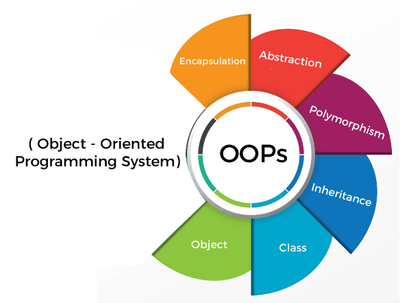

:::info
Acceda al curso completo de [Programación Orientada a Objetos](https://patricioaraneda.cl/python/docs/poo). Aprenderás a crear las funciones necesarias para tus procesos y soluciones. 
Fundamentos - Encapsulameinto - Herencia - Polimorfismo

[**Programación Orientada a Objetos en Python**](https://patricioaraneda.cl/python/docs/poo)
:::